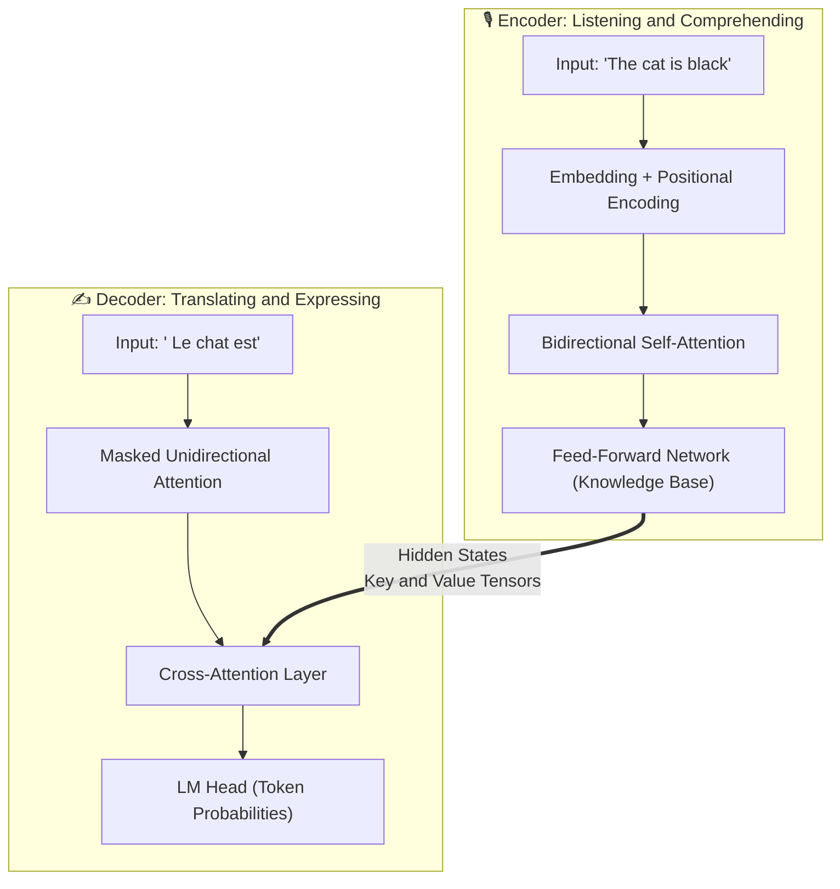
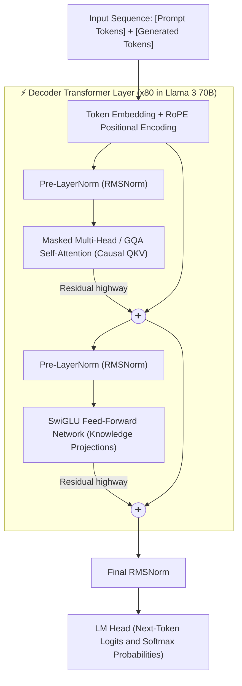
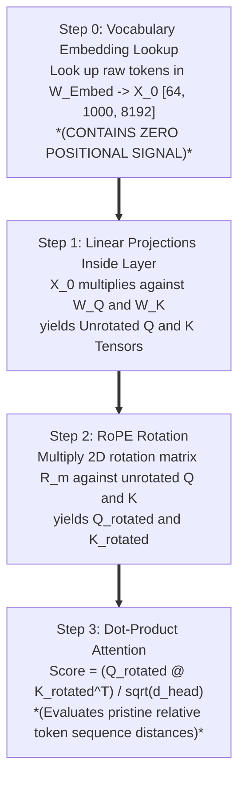
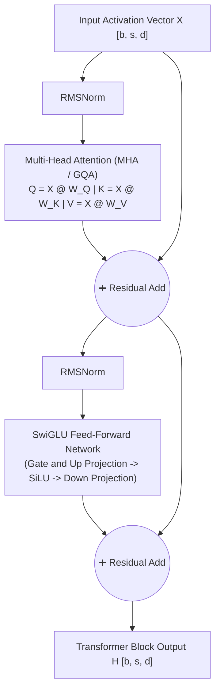
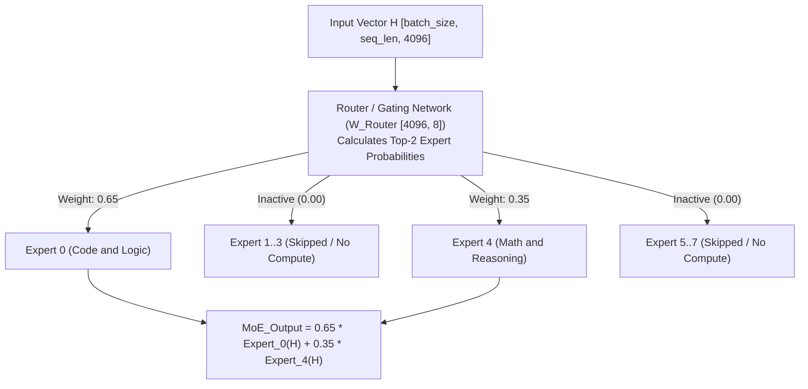
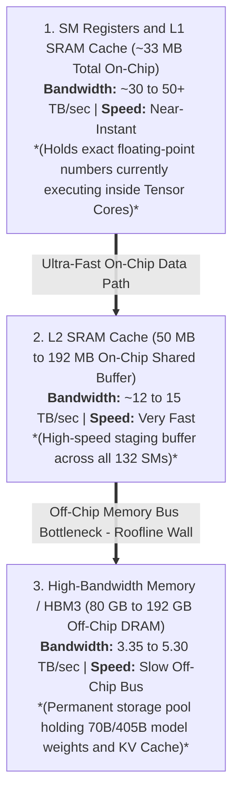
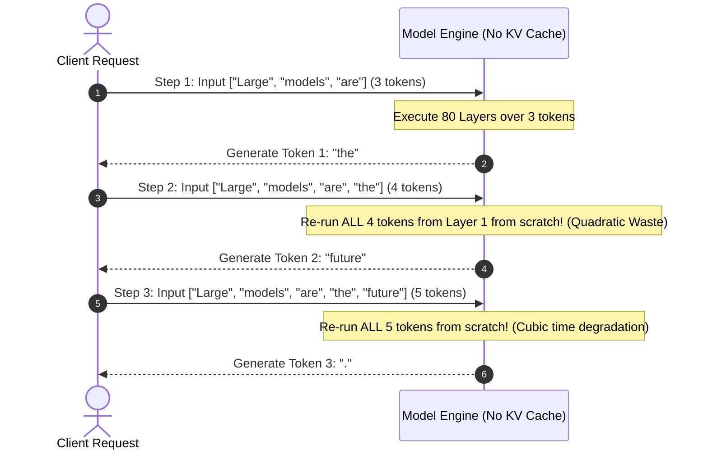
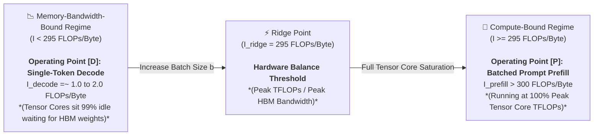
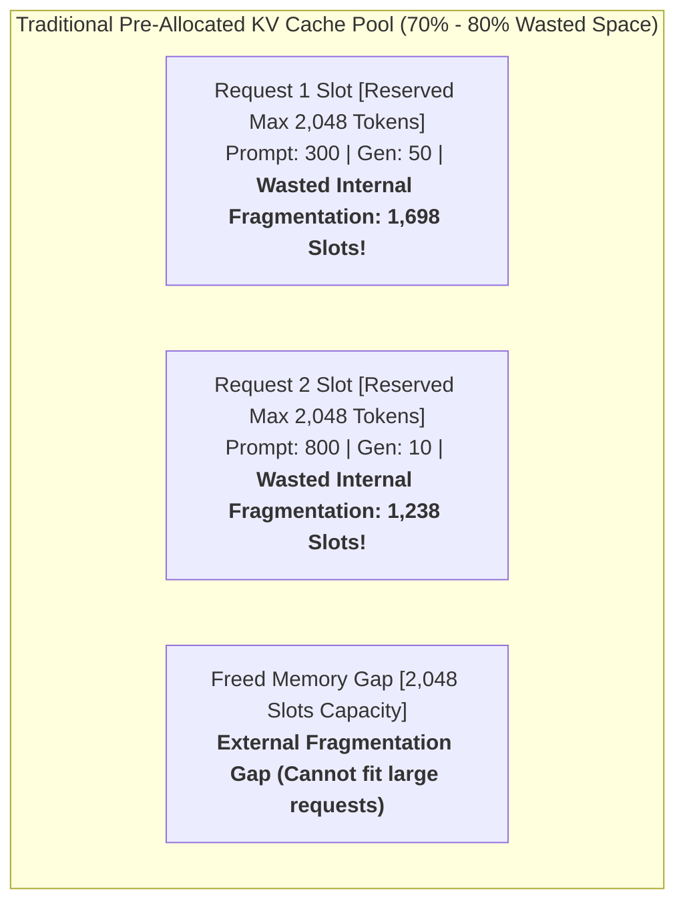

# Module 1: LLM Inference Fundamentals and The Bottlenecks

To understand why **vLLM** revolutionized Large Language Model (LLM) serving, we must build our mental model from first principles. This module systematically bridges the foundational architecture of Transformers, the exact mathematical data flows of self-attention, the performance metrics of production serving, and the physical memory/compute bottlenecks that trap traditional inference engines.

---

## Part 1: Transformer Architecture Analysis and Self-Attention Mechanics

In Large Language Models, the foundational engine is the **Transformer**, and its core heartbeat is the **Self-Attention mechanism**. To understand inference optimization, we must first analyze how data transforms through the layers and why the **Query (`Q`)**, **Key (`K`)**, and **Value (`V`)** vectors behave the way they do.

### 1.1 A Bird's-Eye View: Classic Encoder-Decoder vs. Modern Decoder-Only Architecture

The original Transformer (`Vaswani et al., 2017`) was designed as a dual-tower **Encoder-Decoder** architecture tailored for translation tasks (`e.g., English to French`).



We can compare this dual-tower design to **simultaneous interpretation**:

1. **Left Tower: The Encoder ("Listening and Comprehending")**
   - **Input**: The complete source text (`e.g., "The cat is black"`).
   - **Core Mechanism**: **Bidirectional Unmasked Self-Attention**. Every word can attend to every other word simultaneously (`past and future`). This bidirectional view extracts holistic context and semantic relationships.
   - **Output**: High-dimensional hidden state vectors rich in deep contextual understanding.
2. **Right Tower: The Decoder ("Translating and Expressing")**
   - **Input**: The previously generated words (`"<bos> Le chat est"`) combined with the Encoder's context.
   - **Core Mechanism**: 
     - **Masked Self-Attention**: Restricts the model to attend *only to preceding tokens*, preventing it from "peeking at the future." This maintains causality: during inference, future tokens do not exist yet.
     - **Cross-Attention**: Uses the Decoder's current query to search and extract matching facts from the Encoder's bidirectional hidden states.

#### Why Modern LLMs Evolved to Decoder-Only ("Single-Tower") Architectures
If the Encoder excels at bidirectional understanding, why do modern models (`GPT-4, Llama 3, DeepSeek-V3, Mistral`) discard the Encoder completely in favor of a **Decoder-Only** architecture?



This reflects a fundamental paradigm shift:

1. **Translation vs. Continuation**: Transformers originally served translation (`distinct source vs. target sequences`). Modern AI unified all natural language tasks (`reasoning, coding, QA, chat`) into a single "next-token completion" game.
2. **Structural Simplicity**: By concatenating the user Prompt and model Response into a single unified sequence, the separate Encoder and Cross-Attention modules are eliminated.
3. **Prefill vs. Decode Synergy in Decoder-Only Blocks**:
   - During the **Prefill Phase** (`when processing the user prompt`), all prompt tokens are available at once. Even though the attention mask is strictly causal (`lower-triangular`), processing all tokens in parallel allows every prompt token to attend across all its historical context—achieving the comprehensive understanding of an Encoder.
   - During the **Decode Phase** (`when emitting new tokens step-by-step`), the causal mask guarantees that new tokens seamlessly attend to the cached prompt history without structural discontinuity.

---

### 1.2 The Library Analogy: Intuitive Meaning of Query (`Q`), Key (`K`), and Value (`V`)

To conceptualize the operations of self-attention without immediate entanglement in dense linear algebra, consider an information retrieval analogy within an indexed document corpus:

1. **`Q` (Query)**: The search intention and keywords (`e.g., "noise-canceling Bluetooth headphones"`). It represents *what the current token is seeking from context*.
2. **`K` (Key)**: The metadata labels, index tags, or titles in the catalog (`e.g., Document A Key: "Wired Gaming Headset Review"`, `Document B Key: "Teardown of Sony Noise-Canceling Bluetooth Headphones"`).
3. **`V` (Value)**: The underlying semantic payload inside the document (`e.g., acoustic diagrams, chip specifications, and evaluation text within Document B`).

During the self-attention computation:

- Each **Query (`Q`)** is compared against every **Key (`K`)** via inner product to compute a **Similarity Score** (`relevance weight`).
- Based on these similarity weights, a weighted linear combination of the **Values (`V`)** is extracted to construct the updated contextual representation.

#### Concrete Word Example: The Semantic Shift of "Apple"
Consider how the lexical token `"Apple"` shifts semantic orientation depending on surrounding syntax:

- **Sentence A**: `"At today's new product launch, Apple introduced..."`
- **Sentence B**: `"At the supermarket, the box of apples I bought is very..."`

When the model processes the token `"Apple"`:

1. **Dynamic Query Generation (`Q`)**: `"Apple"` generates its query vector, effectively querying surrounding tokens to determine whether its semantic context relates to technology or agriculture.
2. **Dot-Product Matching (`Q @ K^T`)**:
   - In **Sentence A**, the query (`Q`) for `"Apple"` yields high similarity against the keys (`K`) of `"product launch"` and `"introduced"`.
   - In **Sentence B**, the query yields high similarity against `"supermarket"` and `"box"`.
3. **Value Extraction (`Weights @ V`)**:
   - In **Sentence A**, the high attention weights on `"product launch"` pull the resulting representation of `"Apple"` toward a technology corporation.
   - In **Sentence B**, the high attention weights on `"supermarket"` orient the representation toward fruit.

---

### 1.3 Mathematical Notation and Canonical Variable Nomenclature

To avoid ambiguity across our mathematical derivations and architectural deep dives, we adopt rigorous linear algebra operator conventions and canonical variable shorthand across all modules:

#### 1. Operator Conventions
- **`@` (Matrix Multiplication / Batched Dot-Product)**: Denotes standard linear algebra matrix-matrix or matrix-vector dot-product across the last two dimensions (`A @ B` or `torch.matmul(A, B)`). Examples: `Q = X @ W_Q`, `Score = Q @ K^T`.
- **`(*)` (Element-Wise / Hadamard Multiplication)**: Denotes cell-by-cell tensor multiplication where tensors of identical shape are multiplied precisely at matching coordinate indices (`A[i,j] * B[i,j]`). Example: $\text{Activated_Tensor} = \text{SiLU}(\text{Gate_Tensor}) \odot \text{Up_Tensor}$.
- **`*` and `/` (Scalar and Arithmetic Scaling)**: Denotes simple arithmetic scaling by a single number or integer (`Score / sqrt(head_dim)`, `2 * b * s * L * h_kv * d_head`).

#### 2. Canonical Variable Table
| Canonical Variable Name | Standard Shorthand | Meaning | Example Value (`Llama 3 70B`) |
| :--- | :--- | :--- | :--- |
| **`batch_size`** | **`b`** | Number of concurrent user sequences processed in parallel. | `64` |
| **`seq_len`** | **`s`** | Total sequence length in tokens (`prompt + generated tokens`). | `1,000` (or `4,096`) |
| **`hidden_dim`** | **`d`** | Base hidden representation dimension (`hidden_size`). | `8,192` |
| **`num_layers`** | **`L`** | Total number of Transformer blocks/layers (`num_hidden_layers`). | `80` |
| **`num_q_heads`** | **`h_q`** | Number of Query attention heads per layer (`num_attention_heads`). | `64` |
| **`num_kv_heads`** | **`h_kv`** | Number of Key-Value attention heads per layer (`num_key_value_heads`). | `8` (`GQA 8:1`) |
| **`head_dim`** | **`d_head`** | Dimension of each attention head (`d_head = hidden_dim / num_q_heads`). | `128` |
| **`intermediate_dim`** | **`d_ffn`** | Inner dimension of the Feed-Forward Network (`SwiGLU` expansion). | `28,672` |

---

### 1.4 Chronological Execution Lifecycle: Token Embeddings vs. Positional Encoding

To trace how raw text enters a Transformer and transforms into dynamic activation vectors, we must distinguish between initial vocabulary embedding (`Step 0`) and positional orientation (`Step 2`):



#### 1. What Does a 4,096-Dimensional Token Vector (`X`) Actually Look Like?
When `X_0` is looked up from `W_Embed`, it is not an array of discrete integer digits; it is a 1D tensor containing exactly `4,096` continuous floating-point numbers (`or 8,192 numbers on Llama 3 70B`):

```python
# Shape: [4096], Data Type: float16 (half-precision floating point)
token_embedding_X = torch.tensor([
     0.1426,  -1.2031,   0.0842,  -0.4453,   2.1133,   0.0031,  -0.9121,
     0.5518,   1.8848,  -0.1104,   0.7324,  -2.0195,   0.3120,   0.0098,
    ..., 
    -0.0192,   0.8877,  -0.3340,   1.4121,  -0.6611,   0.0412,   0.1992
])
# |---------------- Exactly 4,096 decimal numbers in total ----------------|
```

This array functions as a **geometric coordinate inside a 4,096-dimensional semantic vector space**. Each index correlates with an abstract feature domain (`e.g., Index 0 for biological animacy, Index 1 for hardware relevance`). Because `"Apple"` (`corporate entity`) and `"Microsoft"` share analogous coordinates across corporate/technological axes, their high-dimensional vectors point in nearly identical geometric directions (`high cosine similarity`).

#### 2. Physical Byte Footprint of Initial Activation Tensors
Because each element in `FP16` (`half-precision`) occupies **2 bytes** of physical memory (`sizeof(dtype) = 2`):
$$
\text{Memory per Token Embedding} = 4,096 \text{ parameters} \times 2 \text{ bytes/param} = \mathbf{8,192 \text{ bytes} \ (8 \text{ KB})}
$$
When a prompt of `1,000` tokens is processed by a 70B model (`hidden_dim = 8192`) at `batch_size = 64`, the initial embedding lookup produces a 3D activation tensor `[batch_size, seq_len, hidden_dim]`:
$$
\text{Input Tensor } X \text{ Shape} = [64, 1000, 8192] \implies 524,288,000 \text{ floating-point numbers} \approx \mathbf{1.048 \text{ GB (in FP16)}}
$$

#### 3. Why `RoPE` is Applied to `Q` and `K` Instead of `X_0`
Notice that at Step 0, `X_0` contains **zero positional information**. If positional rotations were applied directly to `X_0` (`analogous to legacy Absolute Position Embeddings in BERT`), the positional orientation would undergo complex linear distortion across `W_Q` and `W_K` projections across 80 sequential layers.
By applying `RoPE` directly onto `Q` and `K` immediately prior to dot-product evaluation (`Score = Q @ K^T`), orthogonal rotation algebra guarantees that the resulting inner product reflects exact, undistorted relative sequence distances (`m - n`).

#### 4. Exact Matrix Dimensions of $R_m$ and How `RoPE` Rotates Inside `head_dim = 128`
When evaluating $k_{m, \text{after}} = R_m @ k_{m, \text{before}}$ for a Key head, what are the exact dimensions of $R_m$?

- In `GQA`, there are `num_kv_heads = 8` Key heads per token (`[8, 128]`). `RoPE` does **not** rotate across different attention heads (`Axis h = 0..7`), because each head encodes an independent semantic domain (`e.g., Head 0 tracks syntax, Head 1 tracks entity relations`). Mixing across heads would corrupt domain independence.
- Instead, `RoPE` operates **strictly inside the `128` feature coordinates of each individual head (`Axis m = 0..127`)**. For a single head vector $k$ (`shape [128]`), `RoPE` groups the `128` feature coordinates into **`64` pairs of adjacent 2D planes**: $(k_0, k_1), (k_2, k_3), \dots, (k_{126}, k_{127})$.
- For a token at sequence index $m$, each 2D coordinate pair $i$ (`from 0 to 63`) is multiplied by a **`2x2` rotation block** with frequency angle $\theta_i$:
  $$
\begin{bmatrix} k_{2i, \text{after}} \\ k_{2i+1, \text{after}} \end{bmatrix} = \begin{bmatrix} \cos(m \cdot \theta_i) & -\sin(m \cdot \theta_i) \\ \sin(m \cdot \theta_i) & \cos(m \cdot \theta_i) \end{bmatrix} \begin{bmatrix} k_{2i, \text{before}} \\ k_{2i+1, \text{before}} \end{bmatrix}
$$
- Therefore, when written as a unified matrix acting on the full `128`-dimensional head vector, $R_m$ is a **`[128, 128]` block-diagonal matrix containing sixty-four `2x2` rotation blocks along its diagonal**:
  $$
R_m = \begin{bmatrix}
R(m, \theta_0) & 0 & \dots & 0 \\
0 & R(m, \theta_1) & \dots & 0 \\
\vdots & \vdots & \ddots & \vdots \\
0 & 0 & \dots & R(m, \theta_{63})
\end{bmatrix}, \quad \text{where } R(m, \theta_i) = \begin{bmatrix} \cos(m\theta_i) & -\sin(m\theta_i) \\ \sin(m\theta_i) & \cos(m\theta_i) \end{bmatrix}
$$
- Because all `64` Query heads and `8` Key heads undergo this exact `[128, 128]` rotation independently, the head dimensions (`64` or `8`) act purely as parallel batch indices across the `RoPE` CUDA kernel. Furthermore, during autoregressive decoding, historical keys $k_0, k_1, \dots, k_{n-1}$ are **not** re-rotated at step $n$; their rotated vectors ($R_m @ k_m$) were already permanently written to the `KV` cache when they were originally generated, enabling the engine to evaluate $\text{Score} = (R_n @ q_n) @ k_{m, \text{cached}}^T$ directly.

---

### 1.5 Tensor Dimensions and Physical Interpretation of Attention Projections

To understand how memory footprint scales inside every layer, let us trace the exact dimensions across both static model weights and dynamic activation vectors (`using Llama 3 70B specifications where hidden_dim = 8192, num_q_heads = 64, num_kv_heads = 8, and head_dim = 128`):

| Tensor / Projection | Base Dimensional Equation | Llama 3 70B Shape (GQA 8:1) | Physical Memory Impact |
| :--- | :--- | :--- | :--- |
| **Input Activation ($X$)** | $[\text{batch}, \text{seq}, d_{\text{hidden}}]$ | $[64, 1000, 8192]$ | $1.048 \text{ GB (FP16)}$ |
| **Query Weight ($W_Q$)** | $[d_{\text{hidden}}, N_q \cdot d_{\text{head}}]$ | $[8192, 8192]$ | $134.2 \text{ MB per layer}$ |
| **Key Weight ($W_K$)** | $[d_{\text{hidden}}, N_{kv} \cdot d_{\text{head}}]$ | $[8192, 1024]$ | **$16.8 \text{ MB per layer (8x smaller!)}$** |
| **Value Weight ($W_V$)** | $[d_{\text{hidden}}, N_{kv} \cdot d_{\text{head}}]$ | $[8192, 1024]$ | **$16.8 \text{ MB per layer (8x smaller!)}$** |
| **Output Weight ($W_O$)** | $[d_{\text{hidden}}, d_{\text{hidden}}]$ | $[8192, 8192]$ | $134.2 \text{ MB per layer}$ |

#### 1. Static Weights vs. Dynamic Vectors (`Crucial Conceptual Boundary`)
- `W_Q`, `W_K`, `W_V`, and `W_O` (`[8192, 8192]` and `[8192, 1024]`) are **static model parameters**. They remain fixed in GPU memory (`HBM`) after training and act as universal projection linear operators.
- `Q`, `K`, and `V` (`[64, 64, 1000, 128]` and `[64, 8, 1000, 128]`) are **dynamically generated activation vectors**. They are computed in real time for every specific token across all active input sequences.

#### 2. Why is `num_heads` Placed Before `seq_len` After Reshaping?
When `Q = X @ W_Q` is initially computed, its shape is `[batch_size, seq_len, hidden_dim]` (`[64, 1000, 8192]`). Rather than leaving the shape after splitting `hidden_dim` as `[batch_size, seq_len, num_q_heads, head_dim]`, modern architectures universally transpose the tensor to `[batch_size, num_q_heads, seq_len, head_dim]`.
This transposition stems from the execution mechanics of GPU **Batched Matrix Multiplication (`BMM`)** operations (`torch.matmul` or `A @ B`):

1. **The `BMM` Rule**: In high-performance linear algebra libraries (`cuBLAS, PyTorch`), a matrix multiplication `A @ B` across multi-dimensional tensors **only operates on the last two dimensions (`[-2, -1]`)**. All preceding leading dimensions (`[:-2]`) are treated as independent parallel batch indices.
2. **Required Dot-Product Pairing**: For every individual attention head `h`, Head `h`'s Query matrix (`[seq_len, head_dim]`) must multiply against Head `h`'s transposed Key matrix (`[head_dim, seq_len]`).
3. **Why Transposition is Mandatory**:
   - By transposing `seq_len` and `num_heads` to yield `[batch_size, num_heads, seq_len, head_dim]`, the last two dimensions become `[seq_len, head_dim]`. Consequently, `torch.matmul(Q, K^T)` treats `[batch_size, num_heads]` (`[64, 64]`) as independent parallel batch indices, enabling the GPU to execute `64 * 64 = 4,096` independent `[1000, 128] @ [128, 1000]` matrix multiplications concurrently across the Tensor Cores.

#### 3. Physical and Semantic Interpretation of Individual Cell Values Across `Q`, `K`, and `V`
To master the inner mechanics of attention, we must examine the exact mathematical meaning of **individual cell values (`floating-point numbers`)** across these tensors (omitting `axis = 0`, the independent `batch_size` index `b`):

##### A. Before Head Reshaping (`[seq_len, hidden_dim]` -> `[1000, 8192]`)
Consider a single cell `Q[s, d]`, `K[s, d]`, or `V[s, d]`, where `s` (`seq_len`) denotes the token position (`e.g., Token 5 = "Apple"`) and `d` denotes the hidden dimension coordinate (`from 0 to 8,191`):

- **`Q[s, d]` (`e.g., Q[5, 120] = 0.42`)**:
  - **Physical Meaning**: The floating-point activation intensity of the 120th coordinate of Token 5's **Query vector**.
  - **Semantic Meaning**: Quantifies **how strongly Token 5 (`"Apple"`) queries about feature concept #120 across the entire 8,192-dimensional space** (`e.g., if dimension #120 encodes "technological corporate context", a positive value 0.42 indicates active seeking of adjacent tokens discussing technology or corporations`).
- **`K[s, d]` (`e.g., K[2, 120] = 1.15`)**:
  - **Physical Meaning**: The floating-point activation intensity of the 120th coordinate of Token 2's **Key vector**.
  - **Semantic Meaning**: Quantifies **how strongly Token 2 (`e.g., "introduced"`) advertises itself as possessing feature concept #120** (`e.g., "I am a verb denoting a corporate product launch"`).
- **`V[s, d]` (`e.g., V[2, 120] = -0.31`)**:
  - **Physical Meaning**: The floating-point payload intensity of the 120th coordinate of Token 2's **Value vector**.
  - **Semantic Meaning**: Represents **the exact semantic delta that will be extracted and injected into Token 5's representation if Token 5 attends to Token 2** (`e.g., "if attended to, adjust coordinate #120 by -0.31 to orient toward a hardware technology entity"`).

##### B. After Head Reshaping (`[num_q_heads, seq_len, head_dim]` -> `[64, 1000, 128]`)
When transposing from `[1000, 8192]` into `[64, 1000, 128]`, rather than maintaining a single monolithic 8,192-dimensional vector attempting to track syntax, grammar, logic, and factual context simultaneously, the architecture decomposes the `8,192` features into **`64` orthogonal, specialized semantic subspaces of `128` dimensions each (`head_dim = 128`)**.

- **What Each Axis Represents**:
  - **Axis 1 (`h = 0..63`)**: The **Specialized Attention Head / Subspace Index**. Each head specializes in tracking a distinct linguistic or logical relationship (`e.g., Head 0 tracks subject-verb agreement, Head 1 tracks pronoun resolution, Head 12 tracks corporate entity relations`).
  - **Axis 2 (`s = 0..999`)**: The **Token Position (`seq_len`)**.
  - **Axis 3 (`m = 0..127`)**: The **Local Feature Coordinate inside Head `h`'s 128-dimensional subspace (`head_dim`)**.
- **Interpretation of `Q[h, s, m]` (`e.g., Q[12, 5, 14] = -0.88`)**: Represents the magnitude of the 14th coordinate of Token 5 (`"Apple"`) **strictly within Head 12's specialized subspace** (`e.g., within the "corporate entity relations" head #12, how strongly Token 5 queries coordinate #14`). Correspondingly, `K[12, 2, 14]` represents Token 2's key advertisement across that exact same 14th coordinate of Head 12's subspace.

---

### 1.6 Head-by-Head Attention Computation and Score Normalization

With `Q`, `K`, and `V` reshaped into distinct subspaces, the attention layer evaluates pairwise similarity and extracts contextual representations across three sequential steps:

#### Step 1: Calculating Similarity Scores (Raw Attention Logits Matrix)
To quantify the attention weight between query head `i` and historical keys, each Query vector computes an inner product against its assigned Key vector ($\text{Score} = \frac{Q K^T}{\sqrt{d_{\text{head}}}}$).

In **Grouped-Query Attention (`GQA 8:1`)**, each Key matrix is shared by a group of 8 Query heads:

- **Query Heads 0 through 7** compute inner products against **Key Head 0** (`[1000, 128] @ [128, 1000]`).
- **Query Heads 8 through 15** compute inner products against **Key Head 1**.
- ... up to **Query Heads 56 through 63** computing against **Key Head 7**.

Consequently, for every sequence request across `batch_size = 64`, exactly **64 distinct `Score` matrices** are generated, where each `Score` matrix has dimensions `[seq_len, seq_len]` (`[1000, 1000]`):

$$
\text{Score Matrix Shape} = [\text{batch_size}, \text{num_q_heads}, \text{seq_len}, \text{seq_len}] \implies [64, 64, 1000, 1000]
$$

##### Physical and Semantic Interpretation of Individual Cells Across the `Score` Matrix
When evaluating $\text{Score} = \frac{Q K^T}{\sqrt{d_{\text{head}}}}$, what does each cell `Score[h, i, j]` (`where h is head index, i is query token position, and j is key token position`) denote before and after normalization?

- **Before `Softmax` (`Raw Logit Score[h, i, j]`, e.g., `Score[12, 5, 2] = 14.2`)**:
  - **Physical Math**: The direct 128-element inner product between Query Token $i$ ($s_Q = 5$) and Key Token $j$ ($s_K = 2$) within Head $h$ ($12$), scaled by $\sqrt{128} \approx 11.31$:

$$
\text{Raw_Score}_{h, i, j} = \frac{\sum_{m=0}^{127} Q_{h, i, m} \cdot K_{h, j, m}}{\sqrt{128}}
$$

  - **Semantic Meaning**: Measures the **unbounded geometric alignment (cosine similarity magnitude)** between Token `i` (`"Apple"`)'s query and Token `j` (`"introduced"`)'s key inside Head `h`'s subspace. A high positive value (`14.2`) indicates strong semantic resonance; a negative value (`-3.1`) indicates semantic divergence or irrelevance.
- **After `Softmax` (`Attention Probability Weight[h, i, j]`, e.g., `Attention_Weight[12, 5, 2] = 0.65`)**:
  - **Physical Math**: The normalized probability after evaluating `Softmax` across the `seq_len_Key` axis (`axis = -1`):

$$
\text{Attention_Weight}_{h, i, j} = \text{Softmax}\left(\text{Raw_Score}_{h, i, :}\right)_j
$$

  - **Semantic Meaning**: Quantifies **the exact probability share (`65%`) of Token `i` (`Token 5 = "Apple"`)'s attention budget allocated to extracting information from Token `j` (`Token 2 = "introduced"`) within Head `12`'s subspace**. During the final weighted summation `Attention_Weight @ V`, Token 5 extracts precisely `65%` (`0.65`) of Token 2's Value vector (`V[12, 2, :]`) into its own representation across Head 12.

#### Step 2: Scale and Probability Normalization (`Softmax`)
Because raw inner products can assume arbitrary unbounded magnitudes (`e.g., -15.2, 0.4, 8.9, 24.1`), they do not sum to `1.0` (`100%`), and negative or extreme magnitudes distort weighted summation.
`Softmax` converts any raw vector of real numbers into a **probability distribution where every weight is strictly bounded between `0.0` and `1.0`, and their total sum is exactly `1.0` (`100%`)**:

$$
\text{Softmax}(z_i) = \frac{e^{z_i}}{\sum_{j} e^{z_j}}
$$

##### Why Do We Apply `Softmax` Across the Last `seq_len` Dimension (`axis = -1`) Only?
As `head_dim` (`128`) increases, inner products scale in magnitude, causing gradients to saturate or vanish within `Softmax`. To counteract this variance growth, every element is first scaled by $\sqrt{d_{\text{head}}} = \sqrt{128} \approx 11.31$, after which `Softmax` is applied along **`axis = -1`**.

- **Rows (`axis = -2`, the `seq_len_Query` axis)**: Represent the **Queries (`Q`)** of each token position (`Row 0` corresponds to Token 0's Query, `Row 1` to Token 1's Query, ..., `Row 999` to Token 999's Query).
- **Columns (`axis = -1`, the `seq_len_Key` axis)**: Represent the **Keys (`K`)** of all historical token positions (`Col 0` corresponds to Key 0, `Col 1` to Key 1, ..., `Col 999` to Key 999).

| Query Token Row ($i$) | Key Col 0 (`Token 0`) | Key Col 1 (`Token 1`) | Key Col 2 (`Token 2`) | $\dots$ | Key Col 999 (`Token 999`) | Softmax Axis ($=-1$) |
| :--- | :--- | :--- | :--- | :--- | :--- | :--- |
| **Row 0 (Query 0)** | `12.4` | `0.0 (masked)` | `0.0 (masked)` | $\dots$ | `0.0 (masked)` | Normalizes across active Row 0 |
| **Row 1 (Query 1)** | `8.2` | `15.1` | `0.0 (masked)` | $\dots$ | `0.0 (masked)` | Normalizes across active Row 1 |
| **Row 2 (Query 2)** | `-2.1` | `4.6` | `9.8` | $\dots$ | `0.0 (masked)` | Normalizes across active Row 2 |

$$
\text{Attention_Weights} = \text{Softmax}\left(\frac{Q K^T}{\sqrt{d_{\text{head}}}}, \ \text{axis}=-1\right) \quad (\text{Shape: } [64, 64, 1000, 1000])
$$

#### Step 3: Information Extraction and Output Projection (`W_O`)
Finally, we multiply the probability matrix by the historical Value vectors $V$ (`[seq_len, head_dim]`) to synthesize the contextualized representation for each head:

$$
\text{Head_Output} = \text{Attention_Weights} @ V \quad (\text{Shape: } [64, 64, 1000, 128])
$$

The 64 heads are then concatenated and flattened back into `[batch_size, seq_len, hidden_dim]` (`[64, 1000, 8192]`). To blend and synthesize these multi-head features into a unified semantic representation, the concatenated vector multiplies against the **Output Projection Matrix (`W_O`, shape `[8192, 8192]`)**:

$$
\text{Final Layer Output} = \text{Concatenated_Heads} @ W_O \quad (\text{Shape: } [64, 1000, 8192])
$$

---

### 1.7 Feed-Forward Networks (FFNs): SwiGLU Architecture and Multiplicative Gating

After self-attention finishes information exchange *between* words, the contextualized vector enters the **Feed-Forward Network (`FFN`)**. If self-attention is responsible for "finding relationships across the sentence," the `FFN` is responsible for each token's **"closed-door knowledge processing."**



#### 1. Static Nature and Associative Memory Role (`W_1` vs `W_2`)
While Self-Attention (`W_Q, W_K, W_V`) acts as the **"Information Broker"** routing contextual relationships across token positions, the `FFN` (`W_1, W_2`) acts as an **"Associative Factual Memory Bank."**

- `W_1` (`the up-projection table`) functions as a **Key-Detector** for abstract patterns and factual concepts (`e.g., "The capital of France"`, `"Python syntax for loops"`). When `H @ W_1` executes, rows in `W_1` whose patterns align with `H` activate strongly (`SiLU activation > 0`).
- `W_2` (`the down-projection table`) functions as the corresponding **Value-Generator**, mapping firing neurons from `W_1` into vocabulary adjustments (`e.g., injecting probability mass into the token representation for "Paris"`).

#### 2. Exact Tensor Dimensions and Why FFN Takes > 80% of Model Parameters (`SwiGLU` Anatomy)
In modern LLM architectures (`Llama 3 70B, Mistral`), standard `ReLU` FFNs are replaced by **`SwiGLU` (`Swish-Gated Linear Unit`)** activation, requiring three static weight matrices per layer: `W_Gate`, `W_Up` (`W_1`), and `W_Down` (`W_2`).

| Component / Matrix | Shape Dimensionality | Parameter Count per Layer | Percentage of Layer Math |
| :--- | :--- | :--- | :--- |
| **Gate Projection ($W_{\text{Gate}}$)** | $[8192, 28672]$ | $234.8 \text{ Million weights}$ | $\sim 26.7\%$ of layer FLOPs |
| **Up Projection ($W_{\text{Up}}$)** | $[8192, 28672]$ | $234.8 \text{ Million weights}$ | $\sim 26.7\%$ of layer FLOPs |
| **Down Projection ($W_{\text{Down}}$)** | $[28672, 8192]$ | $234.8 \text{ Million weights}$ | $\sim 26.7\%$ of layer FLOPs |
| **Total FFN vs Attention** | **FFN: 704.6M vs Attention: 150.9M** | **$704.6 \text{M parameters}$** | **$> 80\%$ of total model compute!** |

Because `W_Gate`, `W_Up`, and `W_Down` account for **over 80% of the entire 70B model's static `HBM` footprint (`~56.3 Billion` weights)**, reading these massive `[8192, 28672]` FFN tables across the memory bus on every token generation step constitutes the primary driver of the **memory-bandwidth bottleneck** during batch-1 decoding.

#### 3. Step-by-Step Data Flow Through `SwiGLU` and Residual Highway
- **Residual Connection (Element-Wise Cell Addition)**: In $H = \text{Attention}(X) + X$, both terms share dimensions `[batch_size, seq_len, hidden_dim]`. The addition operator executes element-wise summation across matching indices ($H_{b, s, d} = \text{Attention}(X)_{b, s, d} + X_{b, s, d}$). This establishes a **Residual Highway ($+$)** that prevents gradient vanishing across 80 layers while infusing contextual nuances ($\text{Attention}(X)$) into the base token identity ($X$).
- **Up and Gate Projections**: $H$ multiplies against $W_{\text{Gate}}$ and $W_{\text{Up}}$ in parallel, expanding dimensions from `8,192` up to `28,672`:

$$
\text{Gate_Tensor} = H @ W_{\text{Gate}}, \quad \text{Up_Tensor} = H @ W_{\text{Up}} \quad (\text{Shape: } [64, 1000, 28672])
$$

- **Non-Linear Gating (`SiLU`) and Multiplicative Synthesis ($\odot$)**: `Gate_Tensor` passes through $\text{SiLU}(x) = x \cdot \sigma(x) = \frac{x}{1 + e^{-x}}$ and is **element-wise multiplied ($\odot$)** against `Up_Tensor`:

$$
\text{Activated_Tensor} = \text{SiLU}(\text{Gate_Tensor}) \odot \text{Up_Tensor} \quad (\text{Shape: } [64, 1000, 28672])
$$

- **Down-Projection (Compression)**: The activated vector multiplies against $W_{\text{Down}}$ ($W_2$), compressing the `28,672` dimensions back down to `8,192`:

$$
\text{FFN_Output} = \text{Activated_Tensor} @ W_{\text{Down}} \quad (\text{Shape: } [64, 1000, 8192])
$$

#### 4. Architectural Rationale for `SwiGLU` Over Classic `ReLU`
Why did modern frontier architectures replace the classic `ReLU` feed-forward layer:

$$
\text{FFN_Output} = \text{ReLU}(X @ W_1) @ W_2
$$

with the decoupled three-matrix `SwiGLU` architecture ($W_{\text{Gate}}, W_{\text{Up}}, W_{\text{Down}}$)?

1. **Resolving `ReLU` Dead Neurons and Coupled Projections**:
   In classic architectures, $\text{ReLU}(x) = \max(0, x)$ enforces a sharp threshold. If a dot-product is even slightly negative (`-0.001`), `ReLU` truncates it completely to `0.0`. This eliminates gradient propagation across backpropagation, creating the **Dead Neuron Problem**.
   Furthermore, utilizing a single up-projection $W_1$ forces each row in $W_1$ to simultaneously regulate two coupled behaviors: feature activation (the gating decision) and feature magnitude (the content generation).

2. **Decoupling Gating from Content Generation**:
   `SwiGLU` resolves this bottleneck by decoupling these operations across two independent projection matrices:

   - $W_{\text{Gate}}$ functions as a feature-selective gating mechanism that regulates activation thresholds.
   - $W_{\text{Up}}$ functions as the primary feature generator that produces candidate content payloads.

3. **Precise Multiplicative Modulation ($\odot$)**:
   The activation expression $\text{SiLU}(\text{Gate_Tensor})$ acts as a continuous 28,672-channel gating modulation curve, ranging from `0.0` for suppressed features up to `> 1.0` for actively amplified features.
   Executing element-wise multiplication on a dedicated operational layer:

$$
\text{Modulation} \odot \text{Content}
$$

   enables precise, selective amplification and suppression across individual dimensions. For example, if Neuron 500 in the Gate evaluates to `0.0`, multiplying by `Up[500]` cleanly suppresses feature 500. Conversely, if Neuron 1200 evaluates to `1.2`, multiplying by `Up[1200]` actively amplifies feature 1200.


---

### 1.8 Attention Structural Variations: MHA, MQA, and Grouped-Query Attention (`GQA`)

To optimize memory and compute capacity during autoregressive decoding, modern attention architectures implement key structural evolutions:

| Architecture | Full Name | How KV Heads are Allocated | Memory Footprint and Purpose |
| :--- | :--- | :--- | :--- |
| **`MHA`** | Multi-Head Attention | Every Query head ($h_q$) has its own unique Key ($h_k$) and Value ($h_v$) head ($h_q = h_{kv}$). | Standard original design. Heavy memory consumption during long-context decoding due to massive KV cache. |
| **`MQA`** | Multi-Query Attention | All Query heads share **one single Key and Value head** ($h_{kv} = 1$). | Drastically compresses KV cache ($h_q : 1$ reduction), but can cause mild quality degradation on complex reasoning. |
| **`GQA`** | Grouped-Query Attention | Query heads are grouped (`e.g., 8 Query heads share 1 KV head, h_q : h_kv = 8 : 1`). | **The modern industry standard** (`Llama 3, Mistral`). Balances near-`MHA` model quality with an $8\times$ reduction in KV cache memory. |
| **`MoE`** | Mixture of Experts | Replaces dense `FFN` layers with multiple parallel expert `FFNs` governed by a **Router (Gating Network)**. | Activates only a sparse subset of experts per token (`e.g., 2 out of 8 experts in Mixtral 8x7B`), achieving 70B-level model capacity with only 14B active compute `FLOPs`. |

#### Architectural Rationale Behind Grouped-Query Attention (`GQA`) vs. `MHA`/`MQA`
Why does `GQA` (`8 Query heads sharing 1 Key/Value head`) preserve the reasoning capabilities and evaluation quality of full `MHA` (`64 Query heads paired with 64 Key/Value heads`), whereas `MQA` (`all 64 Query heads sharing 1 single Key/Value head`) suffers from quality degradation on complex reasoning tasks?

This architectural capability stems from four structural properties of attention matrices (`demonstrated by Ainslie et al., 2023, GQA: Training Generalized Multi-Query Transformer Models from Multi-Head Checkpoints`):

1. **Low-Rank Redundancy of Historical Key/Value Projections (`Why MHA is Overkill`)**:
   While a generating token's **Query (`Q`) heads** require high diversity (`64 distinct queries across syntax, entity tracking, logical coherence, and grammar`), historical token **Key (`K`) and Value (`V`) representations** exhibit strong inter-head correlation (`low-rank subspace structure`). Specifically, what Token 2 (`"introduced"`) advertises about its syntactic verb role (`Key Head 0`) and what it advertises about its semantic action (`Key Head 1`) overlap substantially. Allocating 64 independent 128-dimensional Key/Value heads (`8,192 numbers per token`) stores redundant representations, wasting `> 85%` of `KV` cache memory (`HBM`) without proportional informational gain.
   By grouping 8 diverse Query heads to share **1 unified Key/Value projection head**, the shared `KV` head acts as a comprehensive semantic reference domain. Each of the 8 specialized Query heads reads from that shared domain using its own distinct inner-product weights ($Q_0 @ K_{\text{shared}}^T, \ Q_1 @ K_{\text{shared}}^T$), extracting targeted facets without requiring 8 duplicate copies of the underlying Key/Value projection.

2. **Representation Collision in `MQA` (`Why h_kv = 1 Degrades Quality`)**:
   If Key/Value projections are redundant, why not implement **Multi-Query Attention (`MQA`)** where all 64 Query heads share **just 1 single Key/Value head ($h_{kv} = 1$)**?
   When all 64 Query heads share a single 128-dimensional vector per token, that single vector is forced to encode every syntactic, factual, and logical property of the word simultaneously. Forcing 64 orthogonal queries through a single 128-dimensional bottleneck induces **representation collision and capacity saturation**, degrading fidelity on complex multi-hop mathematical reasoning and dense code generation.

3. **The `GQA` Subspace Partition (`The Pareto Frontier of h_kv = 8`)**:
   By allocating `8` distinct Key/Value heads (`1,024 total KV dimensions per token`), `GQA` establishes 8 orthogonal semantic reference domains (`e.g., Domain 0: Syntactic/Grammar, Domain 1: Entity/Factual, Domain 2: Logical/Math`). Each domain is shared by 8 local specialized Query heads (`8 * 8 = 64 Q heads total`), completely avoiding representation collision while compressing the `KV` cache footprint by **`8x` (`100% -> 12.5%`)**.

4. **Mean-Pooling Initialization and Up-Training**:
   When converting an `MHA` checkpoint into `GQA` (`or initializing GQA pre-training`), each shared `KV` head is initialized via **Mean-Pooling across the 8 corresponding `MHA` Key/Value projection heads**:

$$
W_{K, \text{shared_group_0}} = \frac{W_{K, \text{head_0}} + W_{K, \text{head_1}} + \dots + W_{K, \text{head_7}}}{8}
$$

   Because grouped `MHA` heads naturally capture correlated principal components (`Low-Rank Approximation`), mean-pooling preserves the foundational semantic signal. Subsequent pre-training fine-tunes the 8 Query heads to co-adapt to the shared projection, achieving evaluation perplexity statistically indistinguishable from full `MHA`.

---

### 1.9 Sparse Architecture Evolution: Mixture of Experts (`MoE`) Routing Mechanics

In a traditional **Dense** Transformer (`e.g., Llama 3 70B`), every single token must pass through and activate 100% of the model's 70 Billion parameters on every generation step (`70B active compute FLOPs`). While scaling up dense parameters increases model intelligence, it inevitably causes inference latency and memory bandwidth requirements to explode.

**Mixture of Experts (`MoE`)** (`popularized by Mixtral 8x7B, DeepSeek-V3/R1, and GPT-4`) shatters this trade-off by decoupling **Total Parameter Capacity** (`model knowledge base`) from **Active Compute Parameters** (`inference latency cost`).



#### 1. How Sparse Routing Works (`Top-K Softmax` and `SwiGLU` Anatomy per Expert)
Instead of a single dense `FFN` block, an `MoE` layer contains $N$ independent, parallel expert `FFN` blocks (`e.g., 8 Experts in Mixtral`), governed by a lightweight linear **Router matrix ($W_{\text{Router}}$, shape `[hidden_dim, num_experts]`)**. Every single expert (`Expert 0` through `Expert 7`) is a completely independent `SwiGLU FFN` block possessing its own private set of three weight matrices ($W_{\text{Gate_i}}, W_{\text{Up_i}}, W_{\text{Down_i}}$). Inside one Mixtral 8x7B `MoE` layer, the GPU `HBM` stores **`1 Router Matrix + (8 experts * 3 matrices) = 25 distinct weight matrices` per layer!**

1. **Router Logit Calculation**:
   For each token vector $H$ (`[1, 4096]`), the Router computes similarity scores against each of the $N$ experts ($\text{Router_Logits} = H @ W_{\text{Router}}$).

2. **`Top-K` Selection and Normalization**:
   To preserve sparsity, the Router selects only the highest $K$ logits (`e.g., Top-2: Expert 4 at 14.8 and Expert 0 at 12.1`), zeroes out all other 6 experts (`-infinity`), and applies `Softmax` over just the selected $K$ logits so their gating weights sum to `1.0` (`100%`).

3. **Expert Dispatch and Weighted Synthesis**:
   The token vector $H$ is dispatched **only** to Expert 4 and Expert 0, where it runs through their private `SwiGLU` transformations ($H @ W_{\text{Gate_i}}$, etc.). Their outputs are scaled by the router weights and summed:

$$
\text{Expert_4_Output} = \left(\text{SiLU}(H @ W_{\text{Gate_4}}) \odot (H @ W_{\text{Up_4}})\right) @ W_{\text{Down_4}}
$$

$$
\text{Expert_0_Output} = \left(\text{SiLU}(H @ W_{\text{Gate_0}}) \odot (H @ W_{\text{Up_0}})\right) @ W_{\text{Down_0}}
$$

$$
\text{MoE_Output} = 0.65 \cdot \text{Expert_4_Output} + 0.35 \cdot \text{Expert_0_Output} \quad (\text{Shape: } [1, 4096])
$$

#### 2. Why Serving `MoE` Models is Challenging for Production Engines
While `MoE` delivers 70B-level intelligence at 13B-level compute latency (`FLOPs`), it introduces severe physical bottlenecks for production inference servers:

- **The Memory Footprint Paradox**: Even though each token only executes compute across `12.9B active weights`, **ALL 46.7 Billion parameters across all 8 experts MUST reside permanently inside GPU `HBM` memory!** Allocating the VRAM capacity of a ~50B dense model is required solely to run a 13B active compute load, exacerbating the memory-bandwidth wall during batch-1 decoding.
- **Expert Hotspotting and Load Imbalance (`Multi-GPU vs. Single-GPU Hardware Dynamics`)**:

  1. **Multi-GPU Regime (`Expert Parallelism - EP`) – Physical GPUs Get Fixed Experts Assigned**:
     When serving massive `MoE` models (`e.g., DeepSeek-V3 or Mixtral 8x22B`) across multi-GPU clusters, experts are partitioned across distinct physical GPUs (`e.g., GPU 0 stores Expert 0, GPU 7 stores Expert 7 in their respective HBM pools`).
     If 50 sequence tokens in a batch (`b = 64`) route to `Expert 0` ("Python/Code") while only 2 tokens route to `Expert 7` ("Poetry"), **`GPU 0` becomes a severe compute bottleneck (`Hotspotting`)**, executing 50 heavy `SwiGLU` operations while `GPU 7` sits completely idle waiting at the `All-to-All` network synchronization barrier.

  2. **Single-GPU Regime (`SM Execution and Batch Shattering`) – No Fixed SM Assignment, but Severe Cache Thrashing**:
     If an `MoE` model fits inside a single GPU (`e.g., Mixtral 8x7B on an H100 80GB`), SMs (`Streaming Multiprocessors`) do **not** have fixed experts permanently assigned; all 8 expert tables reside inside the same global `HBM` pool, and CUDA thread blocks dynamically schedule across all available SMs.
     However, dynamic expert routing shatters the batched matrix multiplication (`[64, 4096] @ [4096, 14336]`) into tiny, fragmented sub-batches (`e.g., 30 tokens for Expert 0, 1 token for Expert 2, 0 tokens for Expert 3`). Launching small matrix multiplication kernels degrades Tensor Core utilization, plunging execution deep into the memory-bandwidth-bound regime and causing severe **`L2` cache thrashing** as unpredictable expert tables are repeatedly fetched from `HBM` on the fly.

#### 3. GPU Memory Hierarchy (`L2 vs. HBM`) and Why Tiny Sub-Batches Destroy Compute Efficiency
To analyze why `MoE` batch shattering degrades performance on a single GPU, we examine two structural properties of modern AI accelerators (`e.g., NVIDIA H100 SXM5`):

##### A. What is the `L2` Cache vs. `HBM`? (The Physical Memory Pyramid)
**The `L2` cache is on-chip Static Random-Access Memory (`SRAM`) located directly on the GPU silicon die adjacent to the Streaming Multiprocessors (`SMs`). This architectural placement yields significantly higher bandwidth and lower latency compared to off-chip High-Bandwidth Memory (`HBM`).**



- **Why `MoE` Causes `L2` Cache Thrashing**: In a dense architecture (`e.g., Llama 3 70B`), all tokens in a batch read identical layer weights sequentially. Once `W_1` is transferred from `HBM` into `L2` cache, subsequent SM reads hit the high-speed `L2` cache (`~15 TB/sec`).
  In `MoE`, token routing splits across distinct experts (`Token 1 -> Expert 0`, `Token 2 -> Expert 5`). Because the `L2` cache is `50 MB` on an H100, and a single expert's `SwiGLU` tables (`[4096, 14336] * 3`) occupy over `350 MB`, the GPU cannot retain unpredictable expert tables in `L2`. Each new sub-batch evicts prior expert data (`Cache Thrashing`), forcing SMs to repeatedly load weight tables across the slower `HBM` memory bus (`3.35 TB/sec`).

##### B. Why Tiny Sub-Batches Destroy Compute Efficiency (Tile Starvation and Roofline Plunge)
The degradation in compute efficiency from near-peak throughput (`~1,000 TFLOPs/sec`) for large batches (`[64, 4096] @ [4096, 14336]`) down to below 5% for fragmented sub-batches (`[2, 4096] @ [4096, 14336]` for `Expert 2`) stems from two hardware constraints:

1. **Hardware Tile Under-Utilization (`SM Starvation`)**:
   An NVIDIA H100 features **132 Streaming Multiprocessors (`SMs`)**. To evaluate `A @ B`, CUDA partitions the output matrix into square **Thread Block Tiles** (`e.g., 128x128 tiles`), dispatching each tile to an independent `SM`.
   When batch size is large (`b = 64`), the output matrix yields hundreds of `128x128` tiles, keeping all 132 SMs operating at 100% occupancy (`Full Wave Saturation`). Conversely, when `Expert 2` receives only **2 tokens** (`b = 2`), the output matrix `[2, 14336]` yields only partial tiles (`2x128` rows). Launching this kernel leaves **most of the 132 SMs completely idle (`SM Starvation`)** due to insufficient tile parallelism, while active SMs waste `> 95%` of their Tensor Core math lanes.

2. **Plunging Arithmetic Intensity (`FLOPs / Byte`)**:
   According to the GPU Roofline formula ($I = \frac{\text{FLOPs Performed}}{\text{Bytes Read from HBM}}$), executing `[2, 4096] @ [4096, 14336]` for `Expert 2` requires $2 \text{ tokens} \times 2 \text{ FLOPs/weight} \times 4096 \times 14336 = \mathbf{234.8 \text{ MFLOPs}}$ while transferring $14336 \times 4096 \times 2 \text{ bytes} = \mathbf{117.4 \text{ Megabytes}}$ of `Expert 2`'s weight table from `HBM`:

$$
\text{Arithmetic Intensity} = \frac{234.8 \text{ MFLOPs}}{117.4 \text{ MB}} = \mathbf{2.0 \text{ FLOPs/Byte!}}
$$

   Because $2.0 \text{ FLOPs/Byte}$ lies far below the H100's Ridge Point ($I_{\text{ridge}} = 295 \text{ FLOPs/Byte}$), **tiny sub-batches collapse deep into the memory-bandwidth-bound regime**, where compute cores spend $> 99\%$ of their cycles waiting for weight tables to transfer across the `HBM` bus.

##### C. Industry Rule: Why `MoE` Serving is Strictly Multi-GPU / Multi-Node in Production (`EP + TP`)
In production serving across the AI industry (`e.g., DeepSeek-V3/R1, Mixtral 8x22B, Grok-1`), `MoE` models are almost exclusively deployed across multi-GPU or multi-node clusters using **Expert Parallelism (`EP`)** combined with **Tensor Parallelism (`TP`)** and **Pipeline Parallelism (`PP`)**:

1. **Why `EP` is Inherently Multi-GPU / Multi-Node**:
   By definition, **Expert Parallelism (`EP`)** assigns distinct expert tables to separate physical GPUs (`e.g., GPU 0 stores Expert 0, GPU 1 stores Expert 1`). Within a single GPU, `EP` does not exist because all tables share one physical `HBM` pool.

2. **The Physical `HBM` Capacity Wall (`Why Single-GPU Fails for Frontier MoE`)**:
   Evaluating frontier architectures such as **DeepSeek-V3 / DeepSeek-R1** (`671 Billion weights` -> `~1.34 Terabytes` in FP16 / BF16, or `~670 Gigabytes` in `FP8` quantization), a single NVIDIA H100 GPU provides `80 GB` of `HBM`. A single GPU cannot accommodate even `1/8th` of the parameter ensemble.
   Serving frontier `MoE` models mandates **8 to 16 physical H100/H200 GPUs across 1 or 2 server chassis (`Inter-Node / Intra-Node`)** solely to store static weights in `HBM` prior to reserving space for the `KV` cache.

3. **The Single-GPU Concurrency Mandate (`Compact MoE Deployments`)**:
   When serving a compact `MoE` model that fits within a single GPU (`e.g., Mixtral 8x7B in FP8`, `~47 GB` on an 80 GB H100), operating at low concurrency (`b = 16`) shatters the batch into `~2 tokens per expert`, triggering the exact $2.0 \text{ FLOPs/Byte}$ tile starvation derived above.
   Therefore, **achieving acceptable compute efficiency during Single-GPU `MoE` serving mandates high concurrency (`b >= 256 to 512`)** so that even after 8-way shattering, each individual expert sub-batch receives `32 to 64 tokens` (`256 / 8 = 32`), restoring square tile saturation across the 132 SMs.


---

## Part 2: The Key-Value (KV) Cache Solution and Memory Formalism

The architectural complexity of serving Large Language Models in production stems from physical memory and compute limits during autoregressive generation. To evaluate these limits, we examine core inference metrics and trace the bottlenecks of **Naive (`Unoptimized`) Inference** before introducing the `KV` cache formalism.

### 2.1 Core Performance Metrics of Production LLM Serving

In autoregressive token-by-token generation, system throughput and latency are evaluated across five distinct performance axes:

1. **`TTFT` (Time to First Token)**: The elapsed time from when a request enters the server to when the *very first generated token* is returned. Governs the **Prefill Phase** and dictates initial responsiveness (`high TTFT makes chatbots feel frozen`).
2. **`TBT` / `ITL` (Time Between Tokens / Inter-Token Latency)**: The average duration between consecutive output tokens after the first token is emitted. Governs the **Decode Phase** and dictates reading fluency (`humans read at ~5 to 8 tokens per second; an ITL above 100 ms/token feels sluggish`).
3. **`TPS` (Tokens Per Second per Request)**: The generation speed of a single sequence (`TPS = 1 / TBT`).
4. **`Latency` (Total Request Duration)**: Evaluated as `Total_Latency = TTFT + (Generated_Tokens - 1) * TBT`.
5. **`Throughput` (System-Wide Capacity)**: The total number of tokens generated across *all concurrent user requests* per second across the GPU server. This is **the primary metric governing Total Cost of Ownership (`TCO`)**. High throughput means serving more concurrent users on fewer GPUs.

---

### 2.2 Naive Unoptimized Inference: How Systems Operate Without Caching

To appreciate why vLLM and caching systems exist, let us trace how a naive engine generates text from scratch for the prompt: `["Large", "models", "are"]`.



Notice the fatal flaw in Naive Inference: **every time a new token is generated, the entire sequence (`prompt + all previously generated tokens`) is fed back into Layer 1 to re-compute all linear projections and attention relationships from scratch!**

---

### 2.3 Autoregressive Decoding with KV Caching: Trading HBM Space for Time

To break this computational deadlock, engineers realized: *Why re-compute the `K` and `V` vectors of historical tokens on every generation step when historical tokens never change?* This insight birthed the **Key-Value (`KV`) Cache**: trading high-bandwidth memory (`HBM`) storage space for exponential computational acceleration.

During the autoregressive decode phase at step $t$, the model only receives the single newest token vector $x_t$ ($\text{batch_size} = 1, \text{seq_len} = 1$).

- **Why `Q` is NOT cached**: We only project $q_t = x_t @ W_Q$ for the single newest token because we only need to query how token $t$ relates to the past. Historical queries ($q_1, \dots, q_{t-1}$) are never needed again.
- **Why `K` and `V` ARE cached**: To evaluate $\text{Score} = q_t @ K^T$, $q_t$ must dot-product against all historical keys ($k_1, \dots, k_{t-1}$). Then, $q_t$ extracts information by summing over all historical values ($v_1, \dots, v_{t-1}$). 

By caching all historical $k_i$ and $v_i$ vectors in `HBM`, step $t$ requires **zero recomputation of past layers**. The step complexity drops from quadratic $\mathcal{O}(N^2)$ down to linear $\mathcal{O}(N)$, and total generation time drops from cubic $\mathcal{O}(T^3)$ down to $\mathcal{O}(T^2)$.

---

### 2.4 Computational Complexity Anatomy: The Quadratic Explosion

Let $s$ (`seq_len`) be the sequence length, $d$ (`hidden_dim`) be the hidden dimension, $L$ (`num_layers`) be the number of layers, and $T$ be the total generated output length.

1. **Computational Complexity per Single Generation Step**:
   - **Linear Layer Projections (`QKV`, `FFN`)**: Requires $\mathcal{O}(s \cdot d^2)$ floating-point operations across $L$ layers ($\mathcal{O}(L \cdot s \cdot d^2)$ total).
   - **Self-Attention Dot Products**: Every token compares against all $s$ tokens ($s \times s$ interactions), demanding $\mathcal{O}(s^2 \cdot d)$ operations across $L$ layers ($\mathcal{O}(L \cdot s^2 \cdot d)$ total).
   - **Total Step Time**: $\mathcal{O}(L \cdot s \cdot d^2 + L \cdot s^2 \cdot d)$.
2. **Total End-to-End Generation Complexity ($T$ steps)**:
   Because step $i$ must re-compute from length $1$ up to $P+i$, generating $T$ tokens requires summing over each step:

$$
\text{Total_FLOPs} = \sum_{i=1}^{T} \mathcal{O}\left(L \cdot (P + i) \cdot d^2 + L \cdot (P + i)^2 \cdot d\right) = \mathcal{O}\left(T^2 \cdot d^2 + T^3 \cdot d\right)
$$

   Without caching, generating $T$ tokens scales **cubicly ($\mathcal{O}(T^3)$)** with sequence length $s$!

#### 1. Where Do the Constants `2` and `11` Come From?
To master inference modeling, let us derive exactly where the constants $2$ and $11$ originate from first principles of linear algebra:

- **Where does the $2$ come from? (The Universal `2 FLOPs per Weight` Rule)**: When multiplying a vector (`[1, K]`) against a weight matrix (`[K, M]`), computing each output number requires taking a dot-product across $K$ numbers ($K$ multiplications plus $K - 1$ additions $\approx 2K$ operations). Across all linear projections in neural networks, **every parameter weight participating in a matrix multiplication contributes exactly $2 \text{ FLOPs}$ (`1 multiply + 1 add`) per input token!**
- **Where does the $11$ come from? ($11 \cdot d^2$ Parameters per Layer in Standard Transformers)**: In a standard single Transformer layer (`MHA + classic FFN` where $\text{intermediate_dim} = 3.5 \cdot d$), Attention projections ($W_Q, W_K, W_V, W_O$) contribute $4 \cdot d^2$ weights, and FFN projections ($W_1, W_2$) contribute $3.5 \cdot d^2 + 3.5 \cdot d^2 = 7 \cdot d^2$ weights ($\text{Total} = 11 \cdot d^2 \text{ weights per layer}$). Multiplying by $2 \text{ FLOPs/weight}$ gives total $\text{FLOPs}$ per layer ($2 \cdot L \cdot 11 \cdot s \cdot d^2$).

#### 2. Exact Derivation for Llama 3 405B (`SwiGLU` + `GQA 8:1` Active Parameter Math)
In modern architectures like Llama 3 405B ($d = 16,384$, $L = 126$ layers, $\text{SwiGLU intermediate_dim} = 53,248 \approx 3.25 \cdot d$, `GQA 8:1`), the ratio evolves slightly:

- **Attention (`GQA 8:1`)**: $W_Q \ (d^2) + W_K \ (0.25 \cdot d^2) + W_V \ (0.25 \cdot d^2) + W_O \ (d^2) = 2.25 \cdot d^2$ ($\approx 604 \text{ Million weights/layer}$).
- **SwiGLU FFN ($W_{\text{Gate}}, W_{\text{Up}}, W_{\text{Down}}$)**: $3 \times (16,384 \times 53,248) = 3 \times 3.25 \cdot d^2 = 9.75 \cdot d^2$ ($\approx 2.617 \text{ Billion weights/layer}$).
- **Total Active Weights per Layer**: $2.25 \cdot d^2 + 9.75 \cdot d^2 = \mathbf{12.0 \cdot d^2 \approx 3.221 \text{ Billion active weights per layer!}}$
- **Total Active Weights Across All 126 Layers**: $126 \times 3.221 \text{ Billion} \approx \mathbf{405.8 \text{ Billion active weights}} \ (405\text{B})$.
- Applying the $2 \text{ FLOPs per Weight}$ rule for a prompt of $s = 1,000$ tokens:

$$
\text{Single_Round_FLOPs} = 2 \text{ FLOPs/weight} \times 405.8 \times 10^9 \text{ weights} \times 1,000 \text{ tokens} \approx \mathbf{811.6 \times 10^{12} \text{ FLOPs} \ (811.6 \text{ TFLOPs})}
$$

  On an NVIDIA H100 ($\approx 1,000 \text{ TFLOPs/sec}$), generating just **one single token** under naive recomputation at $s = 1,000$ requires $\approx 0.74 \text{ seconds}$ ($\approx 1.35 \text{ tokens/sec}$). At $128\text{K}$ context ($s = 128,000$), generating a single token requires over $95,000 \text{ TFLOPs}$ ($> 95 \text{ seconds per token}$), making caching mandatory.

---

## Part 3: Memory vs. Compute Paradigm and The GPU Roofline Model

While the `KV` cache solves the compute bottleneck by eliminating $\mathcal{O}(N^2)$ recomputation, it introduces a severe physical bottleneck: **a massive, rapidly expanding footprint in GPU High-Bandwidth Memory (`HBM`)**.

### 3.1 Exact KV Cache Memory Footprint Formalism and Llama 3 70B Case Study

The exact memory occupied in bytes across a model is defined by:

$$
\text{KV_Bytes} = 2 \cdot \text{batch_size} \cdot \text{seq_len} \cdot \text{num_layers} \cdot \text{num_kv_heads} \cdot \text{head_dim} \cdot \text{sizeof(dtype)}
$$

$$
\text{KV_Bytes} = 2 \cdot b \cdot s \cdot L \cdot h_{kv} \cdot d_{\text{head}} \cdot \text{sizeof(dtype)}
$$

Where:

- $2$: Two distinct tensors per token ($K$ and $V$).
- $b$ (`batch_size`): Number of concurrent user sequences processed in parallel.
- $s$ (`seq_len`): Sequence length ($\text{prompt length} + \text{generated tokens so far}$).
- $L$ (`num_layers`): Number of transformer blocks/layers (`num_hidden_layers`).
- $h_{kv}$ (`num_kv_heads`): Number of Key-Value attention heads per layer (`num_key_value_heads`).
- $d_{\text{head}}$ (`head_dim`): Dimension of each attention head ($d / h_q$).
- `sizeof(dtype)`: Bytes per element ($2$ for $\text{FP16/BF16}$, $1$ for $\text{FP8/INT8}$).

#### Case Study: Llama-3-70B (`GQA`, 8:1 ratio)
- **Model Parameters**: $L = 80$ layers, $h_{kv} = 8$ KV heads (`GQA`), $d_{\text{head}} = 128$, $\text{dtype} = \text{FP16}$ ($2 \text{ bytes}$).
- **KV Memory per Single Token per Sequence ($b = 1, s = 1$)**:

$$
\text{Bytes_per_Token} = 2 \times 1 \times 1 \times 80 \times 8 \times 128 \times 2 = \mathbf{327,680 \text{ bytes}} \ (\approx 320 \text{ KB per token})
$$

- **Total Footprint at Scale**:
  - **Single sequence at 4,096 tokens**: $320 \text{ KB} \times 4,096 \approx \mathbf{1.31 \text{ GB}}$.
  - **Single sequence at 128,000 tokens (max context)**: $320 \text{ KB} \times 128,000 \approx \mathbf{40.96 \text{ GB}}$.
  - **Batch of 64 sequences at 4,096 tokens each**: $64 \times 1.31 \text{ GB} \approx \mathbf{83.88 \text{ GB}}$.

> [!CRITICAL]
> For a batch of 64 requests at 4K context, **the KV cache alone requires ~84 GB of HBM**, completely exhausting an NVIDIA H100 80GB GPU before loading the 140 GB of model weights (`FP16`) or activation buffers!

---

### 3.2 Advanced Compression: DeepSeek Multi-Head Latent Attention (`MLA`) Case Study

To overcome this memory tsunami, DeepSeek models invented **Multi-Head Latent Attention (`MLA`)**. Instead of explicitly storing full $K$ and $V$ heads across layers in `HBM`, `MLA` compresses the $KV$ representations into a low-rank latent vector $c_{kv}$ of dimension $d_c = 512$, plus decoupled RoPE positional keys of dimension $d_{pe} = 64$.

- **Model Parameters**: $L = 61$ layers, latent vector payload $= 512 + 64 = 576$ dimensions per token.
- **KV Memory per Single Token per Sequence**:

$$
\text{Bytes_per_Token} = 61 \times 576 \times 2 \text{ bytes} = \mathbf{70,272 \text{ bytes}} \ (\approx 68.6 \text{ KB per token})
$$

- **Result**: DeepSeek's `MLA` compresses the per-token $KV$ footprint by **`4.6x` compared to Llama-3-70B**, enabling massive concurrent batch sizes even at `128K` context lengths.

#### 1. Joint Low-Rank Compression (c_kv) and On-the-Fly SRAM Restoration
In standard `MHA` or `GQA`, the model projects input vector $H$ directly into high-dimensional $K$ and $V$ matrices that must be written to `HBM`. In `MLA`, $H$ (`7,168 dimensions` in DeepSeek-V3) is down-projected into a **single compressed latent vector $c_{kv}$ (`512 dimensions`)**:

$$
c_{kv} = H @ W_{DKV} \quad (\text{Shape: } [\text{batch_size}, \text{seq_len}, 512])
$$

- **$c_{kv}$ (`512 numbers per token`) is the sole content/value payload written to the $KV$ cache!**
- When a generating token evaluates attention, the inference engine dynamically restores the full content Key ($K_{\text{content}}$) and Value ($V$) heads on the fly inside ultra-fast GPU `SRAM` (`L1/L2 cache`) by multiplying the cached $c_{kv}$ vector against static up-projection matrices ($W_{UK}$ and $W_{UV}$):

$$
K_{\text{content}} = c_{kv} @ W_{UK}, \quad V = c_{kv} @ W_{UV} \quad (\text{Restored on-the-fly in SRAM during attention})
$$

#### 2. The `RoPE` Dilemma and Decoupled Positional Keys (k_pe)
Why was joint low-rank $KV$ compression not implemented prior to DeepSeek? Because of **Rotary Position Embeddings (`RoPE`)**. If $K_{\text{content}}$ is rotated by `RoPE` matrix $R_s$ prior to compression, the rotation becomes non-linearly entangled inside the low-rank representation and **cannot be factored out or absorbed during dot-product evaluation** ($R_s @ (c_{kv} @ W_{UK}) \ne (R_s @ c_{kv}) @ W_{UK}$).
DeepSeek resolved this bottleneck by implementing **Decoupled RoPE ($k_{pe}$)**:

- The Key vector is split into two decoupled sub-vectors: a **Content Key ($K_{\text{content}}$ from $c_{kv}$)** that carries *no positional rotation*, plus a separate, ultra-compact **Positional Key ($k_{pe}$) of exactly `64` dimensions ($d_{pe} = 64$)** where `RoPE` rotation is applied directly.
- Consequently, for every sequence token across a layer, the inference engine caches exactly two compact vectors in `HBM`:

$$
\text{Total MLA Cached Vector per Token} = c_{kv} \ (512 \text{ dims}) + k_{pe} \ (64 \text{ dims}) = \mathbf{576 \text{ parameters!}}
$$

#### 3. Industry Status: Did `MLA` Become a New Industry Standard?
Yes, but with an important dual-track industry bifurcation between medium-scale dense models and ultra-large frontier architectures:

1. **The Gold Standard for Frontier Massive Models (`> 100B / MoE`)**: For ultra-large frontier models (`DeepSeek-V2/V3/R1` at `671B`, and emerging multi-hundred-billion-parameter open architectures), `KV` cache footprint at long contexts (`128K+`) represents the primary barrier to serving concurrency and token throughput. Within this tier, `MLA` is universally recognized across the AI serving industry (`vLLM, SGLang, TensorRT-LLM, FlashInfer`) as the premier `KV` compression architecture. Production serving engines implement dedicated **Matrix-Absorption kernels** (`absorbing W_UK into W_Q on the fly during attention evaluation`), allowing `MLA` inference to execute with near-zero runtime decompression overhead.
2. **Why `GQA` Still Dominates Compact and Dense Families (`<= 70B`)**: Models such as **Llama 3.1 (`8B, 70B, 405B`)**, **Mistral / Mixtral**, and **Gemma 2** retain **Grouped-Query Attention (`GQA`)**. For medium-scale models (`<= 70B`), `GQA` (`8:1 ratio`) already compresses the `KV` cache sufficiently to fit within standard multi-GPU deployments (`4 to 8 H100s`) without requiring low-rank latent decompression or specialized matrix-absorption kernels.
3. **The Industry Consensus**: `GQA` is the established, ubiquitous standard for dense architectures up to `70B`, whereas `MLA` is the breakthrough standard for ultra-large frontier models and sparse `MoE` ecosystems.

---

### 3.3 Arithmetic Intensity and The GPU Roofline Model

Why does `KV` caching transform decoding into a memory-bandwidth-bound problem? We must analyze the GPU **Roofline Model** using **Arithmetic Intensity ($I$)**:

$$
I = \frac{\text{Total FLOPs Performed}}{\text{Total Bytes Transferred from HBM}}
$$

Every GPU has a **Ridge Point ($I_{\text{ridge}}$)** dividing the compute-bound regime from the memory-bound regime:

$$
I_{\text{ridge}} = \frac{\text{Peak Compute Capacity } (\pi_{\text{peak}} \text{ in FLOPs/sec})}{\text{Peak HBM Bandwidth } (\beta_{\text{peak}} \text{ in Bytes/sec})}
$$



| GPU Architecture | Peak `FP16` Compute (`pi`) | Peak HBM Bandwidth (`beta`) | Ridge Point (`I_ridge`) |
| :--- | :--- | :--- | :--- |
| **NVIDIA A100 (80GB SXM4)** | 312 TFLOPs/sec | 2.039 TB/sec | **~153 FLOPs/Byte** |
| **NVIDIA H100 (80GB SXM5)** | 989 TFLOPs/sec | 3.350 TB/sec | **~295 FLOPs/Byte** |
| **AMD MI300X (192GB HBM3)** | 1,300 TFLOPs/sec | 5.300 TB/sec | **~245 FLOPs/Byte** |

---

### 3.4 Physical Mechanics of the Slanted Memory Slope vs. Flat Compute Ceiling

To master the physical laws governing GPU execution, we must examine what happens when an operation sits on the slanted left slope (`///`, Memory-Bound regime) versus the flat horizontal ceiling (`===`, Compute-Bound regime):

1. **The Left Slanted Slope (`Memory-Bound Regime, I < I_ridge`)**:
   - On the left slope (e.g., Single-Token Decode at Point `[D]`, $I_{\text{decode}} = 1.0 \text{ FLOPs/Byte}$), physical execution throughput (`Y-axis TFLOPs/sec`) is **strictly decided by the off-chip memory bus bandwidth ($\beta_{\text{peak}}$)**:

$$
\text{Achieved_Performance } (\text{TFLOPs/sec}) = \beta_{\text{peak}} \cdot I
$$

   - On an NVIDIA H100 ($\beta_{\text{peak}} = 3.35 \text{ TB/sec}$), an operation at $I = 1.0 \text{ FLOPs/Byte}$ hits an absolute physical ceiling of $3.35 \text{ TFLOPs/sec}$.
   - **Where are the SM Tensor Cores while this happens (`Idle Compute Capacity`)?** The H100's physical compute units (`SMs`) possess a maximum capacity ($\pi_{\text{peak}}$) of **`989 TFLOPs/sec`** ($295\times$ higher than $3.35 \text{ TFLOPs/sec}$). However, because the memory bus can only deliver data at $3.35 \text{ TB/sec}$, the silicon Tensor Cores sit completely starved and idle for $> 99.6\%$ of the execution time waiting for operands to arrive from `HBM`. The memory bus acts as a hard throttle, rendering the GPU's massive $989 \text{ TFLOPs}$ math capacity irrelevant.

2. **The Right Flat Ceiling (`Compute-Bound Regime, I >= I_ridge`)**:
   - Once Arithmetic Intensity crosses the Ridge Point ($I \ge 295 \text{ FLOPs/Byte on H100}$, such as Batched Prefill at Point `[P]`, $I > 300$), each byte fetched from `HBM` is reused for $> 295$ mathematical operations inside on-chip registers and `SRAM`.
   - At this threshold, the `HBM` bus easily keeps up with the data demand. The bottleneck shifts entirely to the physical clock frequency and thermal limits of the **SM Tensor Cores ($\pi_{\text{peak}}$)**, capping performance on the horizontal flat ceiling (`===` at $989 \text{ TFLOPs/sec}$).

---

### 3.5 Comparative GPU Evaluation: Why a Lower Ridge Point is Superior for Serving

When evaluating hardware architecture specifications (`NVIDIA A100 vs. H100 vs. AMD MI300X`), a common misconception is that a higher Ridge Point ($I_{\text{ridge}}$) indicates a superior GPU. **For LLM autoregressive decoding (`which is memory-bandwidth bound at I =~ 1.0 to 2.0`), a LOWER Ridge Point combined with higher `HBM` bandwidth is actually far superior.**

1. **What a Higher $I_{\text{ridge}}$ Indicates (`Compute Outpacing Memory`)**:
   Because $I_{\text{ridge}} = \frac{\pi_{\text{peak}}}{\beta_{\text{peak}}}$, a higher Ridge Point ($295 \text{ FLOPs/Byte on H100 vs. 153 on A100}$) signifies that the GPU's physical compute capacity ($\pi_{\text{peak}}$) scaled much faster across generational iterations than its off-chip `HBM` memory bandwidth ($\beta_{\text{peak}}$). Consequently, the GPU requires **more mathematical operations per byte transferred ($295 \text{ dot-products per byte}$)** just to escape the slanted memory slope and saturate the silicon Tensor Cores.

2. **Why High $I_{\text{ridge}}$ Wastes Compute During LLM Decoding**:
   Because single-token decoding ($\text{batch_size } b = 1$) operates at $I \approx 1.0 \text{ FLOPs/Byte}$, execution sits far to the left of the Ridge Point on *every* hardware platform. On the slanted left slope ($\text{Performance} = \beta_{\text{peak}} \cdot I$), throughput is decided **strictly by $\beta_{\text{peak}}$ (`Peak HBM Bandwidth`)**. Therefore, any extra compute TFLOPs ($\pi_{\text{peak}}$) on a high-ridge-point GPU remain $> 99\%$ idle and wasted during decoding.

3. **Comparative Case Study: NVIDIA H100 vs. AMD MI300X**:
   - **NVIDIA H100**: $\pi_{\text{peak}} = 989 \text{ TFLOPs/sec}$, $\beta_{\text{peak}} = 3.35 \text{ TB/sec} \implies I_{\text{ridge}} \approx 295 \text{ FLOPs/Byte}$.
   - **AMD MI300X**: $\pi_{\text{peak}} = 1,300 \text{ TFLOPs/sec}$, $\beta_{\text{peak}} = 5.30 \text{ TB/sec} \implies I_{\text{ridge}} \approx 245 \text{ FLOPs/Byte}$.
   Notice that while AMD MI300X has massive compute ($1,300 \text{ TFLOPs}$), it achieves a **lower** Ridge Point ($245 \text{ vs. } 295$) because AMD prioritized scaling off-chip `HBM` bandwidth ($5.30 \text{ TB/sec across 192 GB HBM3 vs. } 3.35 \text{ TB/sec on H100}$). For an LLM serving engine running autoregressive decoding at $I = 2.0$, MI300X's $5.30 \text{ TB/sec}$ bandwidth delivers **$1.58\times \text{ faster}$ memory-bound throughput than H100 ($3.35 \text{ TB/sec}$)**, while its lower $245$ ridge point enables workloads to transition into compute-bound efficiency much earlier across moderate batch sizes.

4. **The Golden Rule of GPU Evaluation for LLM Workloads**:
   - For **Training and Batched Prompt Prefill** (`Compute-Bound`): Prioritize maximum **$\pi_{\text{peak}}$ (`Peak Compute Capacity`)**.
   - For **Autoregressive Decoding and Serving** (`Memory-Bound`): Prioritize maximum **$\beta_{\text{peak}}$ (`Peak HBM Bandwidth`)** and highest `HBM` memory capacity. A lower Ridge Point ($I_{\text{ridge}}$) indicates a more balanced hardware architecture for memory-intensive decoding.

---

### 3.6 Single-Batch Decoding Utilization and The Canonical Intensity Range

Consider generating a single token ($\text{batch_size } b = 1$) on a 70B model (`FP16`, $140 \text{ GB}$ weight footprint, $N = 70,000,000,000$ parameters):

- **FLOPs Performed**: Across all 80 layers, the single-token activation vector ($\text{seq_len } s = 1$) multiplies against every linear projection matrix ($y = x @ W$). For any weight matrix $W$ of shape $[d_{\text{in}}, d_{\text{out}}]$, the matrix-vector multiplication (`GEMV`) requires $2 \cdot d_{\text{in}} \cdot d_{\text{out}}$ FLOPs ($1 \text{ multiply} + 1 \text{ add per matrix element}$). Because the total number of weight elements summed across all layers in the model is $N = 70,000,000,000$ ($70 \text{ Billion parameters}$), the total math performed across the entire forward pass is exactly:

$$
\text{Total_FLOPs} = 2 \cdot N = 2 \times 70 \times 10^9 = \mathbf{140 \times 10^9 \text{ FLOPs}} \ (140 \text{ GFLOPs})
$$

- **Bytes Transferred**: The GPU must read all $140 \text{ GB}$ of weights ($N \times 2 \text{ bytes for FP16}$) from `HBM` across the memory bus into SM registers.
- **Arithmetic Intensity**:

$$
I_{\text{decode}} = \frac{140 \text{ GFLOPs}}{140 \text{ GB}} = \mathbf{1.00 \text{ FLOP/Byte}}
$$

Because $1.00 \text{ FLOP/Byte}$ is vastly below the H100's ridge point of $295 \text{ FLOPs/Byte}$, **batch-1 decoding is trapped deep inside the memory-bandwidth-bound regime**.

- Reading $140 \text{ GB}$ of weights at H100's $3.35 \text{ TB/sec}$ bandwidth takes $140 \text{ GB} / 3.35 \text{ TB/sec} \approx \mathbf{41.8 \text{ milliseconds}}$.
- During those $41.8 \text{ ms}$, the Tensor Cores execute $140 \text{ GFLOPs}$. Because the H100 is capable of $989 \text{ TFLOPs/sec}$, the compute cores run at **$< 0.35\%$ capacity while sitting idle waiting for HBM data transfer!**

#### Why Batch-1 Decoding Ranged from `1.0` to `2.0 FLOPs/Byte` (`The Canonical Standard`)
In AI systems engineering and serving literature, the operational intensity of single-batch ($\text{batch_size } b = 1$) autoregressive decoding is frequently cited across a range from $1.0 \text{ FLOPs/Byte}$ to $2.0 \text{ FLOPs/Byte}$ (most commonly $\sim 1.8 \text{ to } 1.9 \text{ FLOPs/Byte}$). This range reflects exact physical assumptions about quantization and sequence length:

1. **Pure `FP16` Weight Projection ($1.0 \text{ FLOPs/Byte}$)**:
   When evaluating isolated linear projections (`GEMV`) in `FP16`, total FLOPs $= 2 \cdot N$ and weight memory $= 2 \cdot N \text{ bytes}$, yielding an exact baseline intensity of $1.0 \text{ FLOPs/Byte}$.

2. **Pure `FP8` / `INT8` Weight Projection ($2.0 \text{ FLOPs/Byte}$)**:
   When model weights are quantized to `FP8` ($1 \text{ byte per parameter}$), but mathematical execution (`GEMV`) remains at $2 \text{ FLOPs per weight}$, intensity doubles: $\frac{2 \cdot N \text{ FLOPs}}{1 \cdot N \text{ Bytes}} = \mathbf{2.0 \text{ FLOPs/Byte}}$.

3. **Real-World Autoregressive Decoding ($\approx 1.8 \text{ to } 1.9 \text{ FLOPs/Byte}$)**:
   During end-to-end production decoding ($\text{batch_size } b = 1$ at active sequence length $s$), the GPU reads both static model weights and dynamic `KV` cache blocks ($2 \cdot s \cdot L \cdot h_{kv} \cdot d_{\text{head}} \cdot 2 \text{ bytes}$), while executing both linear projections ($2 \cdot N \text{ FLOPs}$) and attention dot-products ($4 \cdot s \cdot L \cdot h_q \cdot d_{\text{head}}$ FLOPs).
   Because static weight transfers ($140 \text{ GB on Llama 3 70B}$) vastly dominate over single-sequence `KV` cache transfers ($\sim 1.3 \text{ GB}$ at $4\text{K}$ context), the combined end-to-end operational intensity across full `FP16` execution converges tightly between $\approx 1.8$ and $1.9 \text{ FLOPs/Byte}$.
   Consequently, $1.0 \text{ to } 2.0 \text{ FLOPs/Byte}$ (or specifically $\sim 1.9 \text{ FLOPs/Byte}$ on active `FP16` deployments) serves as the universal canonical standard benchmark for single-batch decoding across the industry.


---

### 3.7 Batched Matrix Multiplication (`BMM`) and Amortization Economics

Since model weights must be loaded from `HBM` on every step, how can we amortize that $140 \text{ GB}$ transfer time? By **increasing the batch size ($b$)**.

When serving $b = 64$ concurrent user requests simultaneously:

- The $140 \text{ GB}$ model weights are loaded from `HBM` **once** and reused across all 64 user tokens via Batched Matrix Multiplication (`BMM`).
- **FLOPs Performed**: $64 \times 140 \text{ GFLOPs} = \mathbf{8,960 \text{ GFLOPs}}$.
- **Arithmetic Intensity**:

$$
I_{\text{batched}} = \frac{8,960 \text{ GFLOPs}}{140 \text{ GB weights} + \text{KV Bytes}} \approx \mathbf{50 \text{ to } 60 \text{ FLOPs/Byte}}
$$

Increasing batch size pushes execution up the slanted Roofline slope toward peak TFLOPs, increasing system throughput (`TPS`). However, **traditional serving engines hit a concrete memory wall attempting to scale batch sizes**.

---

## Part 4: The Contiguous Memory Requirement and Fragmentation Economics

To understand why traditional engines hit a concrete memory wall attempting to scale batch sizes (`b >= 16`), we examine how legacy inference architectures manage physical memory allocation in `HBM`.

### 4.1 The Pre-Allocation Trap: Why Contiguous Memory is Required

In standard PyTorch and legacy inference servers, tensors must occupy **contiguous physical memory blocks in HBM**. When serving dynamic requests, this enforces three fatal patterns:

1. **Static Batching and The Padding Tax**: All requests in a batch must pad out to the longest prompt length (`max(prompt_lens)`). Compute units waste valuable TFLOPs processing useless `0.0` padding tokens.
2. **Pre-Allocation up to `max_seq_len`**: Because a sequence might generate up to `max_seq_len` (`e.g., 2,048 tokens`), and because contiguous tensors cannot grow in-place without copying memory across `HBM`, traditional engines **must pre-reserve contiguous HBM slots for `max_seq_len` tokens upon request arrival**.



---

### 4.2 Internal Fragmentation: Memory Waste Inside Allocated Boundaries

**Internal Fragmentation** is memory waste occurring **INSIDE the boundary of an allocated physical memory region**. It occurs when a fixed or pre-reserved allocation block size exceeds the actual data payload currently stored or ultimately generated within it. Because the unused memory resides within the allocated region's boundary, it remains locked by the owning process and cannot be re-assigned to any other request.

In traditional LLM serving engines:

- Upon request arrival, the memory allocator pre-reserves a single contiguous block of physical `HBM` sized for `max_seq_len` (`e.g., 2,048 tokens`).
- If the user prompt is `300` tokens and the model emits an Early-End-of-Sequence (`EOS`) token after generating `50` tokens (`total length = 350 tokens`), the remaining `1,698` token slots inside its allocated chunk sit empty and locked for the entire duration of the request.
- Furthermore, even while the request is actively generating token `51`, the reserved slots for tokens `52` through `2,048` remain locked *inside* the allocation boundary.
- Empirical profiling by the vLLM team (*Kwon et al., SOSP 2023*) showed that **`60% to 80%` of total allocated GPU memory was wasted due to internal fragmentation**.

---

### 4.3 External Fragmentation: Memory Waste Outside Allocated Boundaries

**External Fragmentation** is memory waste occurring **OUTSIDE of all allocated memory regions**. It occurs when total unallocated free memory exists across GPU `HBM`, but it is fragmented into non-contiguous, scattered gaps across physical address space. When a new request requires a single contiguous physical block, allocation fails with an Out-Of-Memory (`OOM`) error because no single unallocated hole is large enough, even if the total sum of all scattered free gaps vastly exceeds the requested allocation size.

In traditional LLM serving engines:

- As dynamic user requests of varying sequence lengths finish generating at different times, they release their contiguous `HBM` blocks back to the allocator, creating a checkerboard pattern of non-contiguous free memory holes (`e.g., a 512-token hole at address 0x1000, a 1,024-token hole at address 0x8000`).
- If a new request arrives requiring a contiguous block of `4,096` tokens, the allocator cannot satisfy the request and triggers an `OOM` failure, even if total free memory across all scattered gaps equals `16,384` tokens!
- Empirical profiling showed that **`5% to 10%` of total GPU memory was lost to external fragmentation**.

---

### 4.4 The Concurrency Ceiling Dilemma and Why We Need vLLM

Because `70%` of `KV` cache memory is lost to internal and external fragmentation, **traditional engines hit an artificial concurrency ceiling prematurely (`OOM`) at small batch sizes (`b = 16`)**. The GPU remains starved at low arithmetic intensity, keeping token throughput low and costs high.

To break through this concurrency ceiling and push autoregressive decoding toward the compute-bound regime, we must eliminate memory fragmentation entirely. This brings us directly to **Module 2: Core Architecture (`02_vllm_core_architecture.md`)**, where we explore how vLLM adapts the operating system's concept of **Virtual Memory Paging and PagedAttention** to decouple logical sequence order from physical `HBM` placement, reducing memory waste from `> 70%` down to `< 4%` on the exact same hardware!
