# Module 2: vLLM Core Architecture and PagedAttention Mechanics

While **Module 1** established that large language model (`LLM`) autoregressive decoding is fundamentally memory-bandwidth bound and crippled by `> 70%` Key-Value (`KV`) cache memory fragmentation under traditional contiguous allocation, this module explores the breakthrough architecture that solved it: **vLLM**.

By adapting the operating system's classical virtual memory paging paradigm to neural network attention execution, vLLM decouples logical sequence order from physical High-Bandwidth Memory (`HBM`) layout. This systematic exploration details the architectural mechanics of **PagedAttention**, the memory allocation strategies of the **Block Manager**, and the dynamic orchestration of **Continuous Batching**.

---

## Part 1: The Operating System Analogy: Virtual Memory Paging in LLMs

To understand how vLLM eliminates memory fragmentation, we first examine why contiguous memory allocation fails during variable-length token generation, and how classical operating system principles provide an elegant solution.

### 1.1 The Classical Memory Wall Recap: Why Contiguous Allocation Fails

In legacy inference engines (`e.g., standard PyTorch or early FasterTransformer`), tensors must occupy contiguous physical memory ranges in `HBM`. When serving dynamic user requests whose generation lengths cannot be known in advance, the memory allocator must pre-reserve contiguous blocks equal to the maximum sequence length (`max_seq_len`, such as `2,048` or `8,192` tokens).

As derived in **Module 1**, this static pre-allocation enforces two fatal forms of memory waste:

1. **Internal Fragmentation (`> 60% to 80%` waste)**: Memory waste occurring **inside the boundary of an allocated physical memory region**. If a request pre-allocates a contiguous block of `2,048` token slots upon arrival but terminates after generating `50` tokens (`total length = 350 tokens`), the remaining `1,698` reserved slots inside its allocation boundary sit empty and locked for the entire duration of the request.
2. **External Fragmentation (`> 5% to 10%` waste)**: Memory waste occurring **outside of all allocated memory regions**. As dynamic requests complete asynchronously and release their contiguous chunks, `HBM` becomes speckled with non-contiguous free memory gaps. A new request requiring a contiguous chunk of `4,096` tokens fails with an Out-Of-Memory (`OOM`) error even if total scattered free memory across all gaps exceeds `10,000` token slots!

Because `> 70%` of `KV` cache memory is lost to fragmentation, traditional engines exhaust their memory budgets prematurely, capping concurrent batch size (`batch_size = b`) at low thresholds (`e.g., b = 16`). At low batch sizes, the GPU's arithmetic intensity sits far below the Ridge Point (`I << I_ridge`), leaving silicon Tensor Cores starved and idle.

---

### 1.2 The Operating System Virtual Memory Paradigm

In the 1960s, computer scientists faced an identical memory gridlock when multiple programs ran concurrently on central processing units (`CPUs`). If every application required a single contiguous block of physical Dynamic Random-Access Memory (`DRAM`), memory space rapidly fragmented, limiting multi-tasking concurrency.

The operating system solved this by introducing **Virtual Memory Paging**:

1. **Paging**: Physical `DRAM` is partitioned into fixed-size chunks termed **Physical Frames** (`e.g., 4 KB pages`). Simultaneously, each program's memory space is partitioned into contiguous **Logical Pages** of identical size.
2. **Page Table Translation**: A hardware/software mapping table (`Page Table`) translates logical page addresses into physical frame addresses in $\mathcal{O}(1)$ time.
3. **Decoupling**: Because any logical page can map to any arbitrary physical frame, a program's logical address space appears contiguous to the application, while its actual data sits scattered across non-contiguous physical DRAM locations.

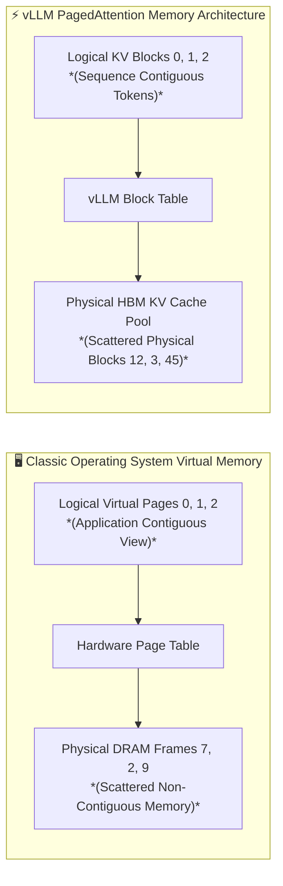

**vLLM** adapts this exact operating system concept directly to Transformer attention execution by creating a virtual memory manager specifically tailored for high-dimensional Key/Value tensors in GPU `HBM`.

---

### 1.3 Logical Blocks vs. Physical KV Blocks (`The Three-Layer Architecture`)

To master how vLLM decouples sequence order from hardware memory layout, we must analyze the exact relationship between the **Logical Token Sequence**, the **Logical KV Cache View**, and the **Physical KV Cache Pool**.

In a traditional contiguous memory engine, the sequence of input words/tokens and their corresponding Key/Value cache vectors are forced to share the exact same physical memory layout: if token coordinates `0 through 47` are contiguous in sequence order, their `KV` cache vectors must be stored sequentially across contiguous `HBM` memory addresses.

**vLLM breaks this coupling by separating the sequence's logical view of its `KV` cache from the GPU's physical storage of that `KV` cache across three distinct architectural layers:**

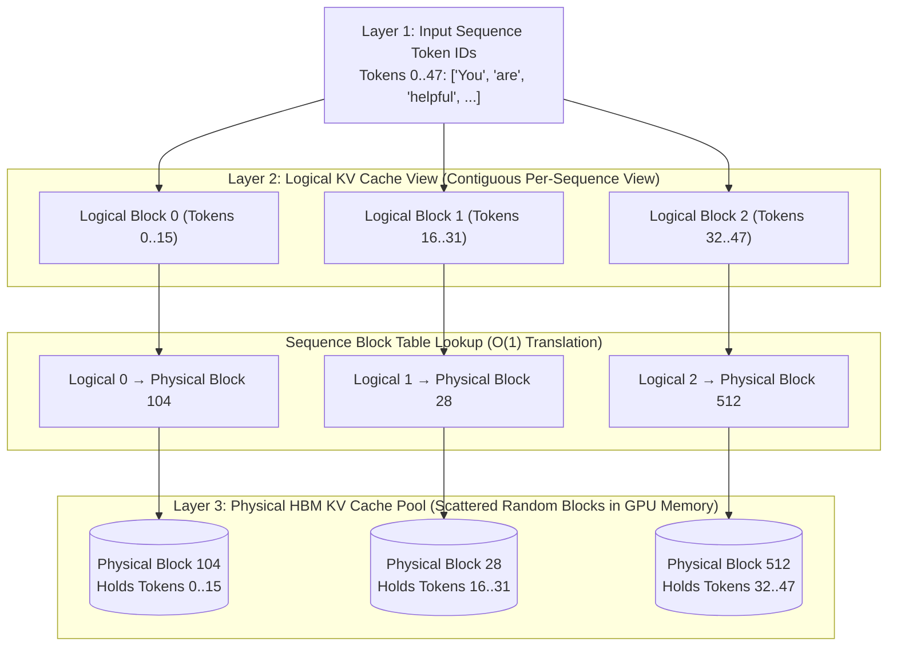

#### 1. Detailed Layer Definitions and Responsibilities
- **Layer 1: The Logical Token Sequence (`100% Contiguous`)**:
  This represents the actual sequence of integer token IDs (`e.g., Token 0 = "You"`, `Token 1 = "are"`). By definition, text is read and generated sequentially; therefore, the token sequence is strictly contiguous (`Token index 0, 1, 2, ..., N`).

- **Layer 2: The Logical KV Cache View (`100% Contiguous Virtual Address Space`)**:
  This is **how the sequence and the attention formula (`Q @ K^T`) view their Key and Value representations**.

    - Within the sequence's virtual view, its `KV` cache is partitioned into sequential, contiguous chunks of `block_size` tokens (`typically block_size = 16`), called **Logical Token/KV Blocks**.
    - `Logical Block 0` holds the logical `KV` vectors for tokens `0..15`.
    - `Logical Block 1` holds the logical `KV` vectors for tokens `16..31`.
    - `Logical Block 2` holds the logical `KV` vectors for tokens `32..47`.
    - From the perspective of the attention algorithm and the application, `Logical Block 0` is immediately adjacent to `Logical Block 1`, forming a seamless, continuous logical `KV` sequence across both input prompt tokens (`Logical Blocks 0 and 1`) and generated decode tokens (`Logical Block 2`).

- **Layer 3: The Physical KV Cache Pool (`Scattered Physical Blocks in GPU HBM`)**:
  This represents the physical reality inside GPU `HBM` memory. A **Physical KV Block** is a fixed-size chunk of physical GPU memory allocated from vLLM's pre-reserved memory pool (`e.g., 5.24 MB per physical block on Llama 3 70B`).

    - When the GPU calculates the `KV` vectors for `Logical Block 0` (`Tokens 0..15`), where do those numbers get stored in physical memory? They get written directly into an assigned physical slot from the free pool (`e.g., Physical Block 104`).
    - When `Logical Block 1` (`Tokens 16..31`) is processed, its `KV` vectors are written into another arbitrary physical slot (`e.g., Physical Block 28`).
    - Physical blocks `104` and `28` sit scattered across completely different, non-contiguous physical `HBM` memory addresses!

#### 2. Critical Clarification: Unified Mapping Across Prompt and Generated Tokens
A common conceptual pitfall is assuming that "logical blocks are for prompt tokens while physical blocks are for the KV cache," or that prompt tokens and generated tokens map differently across logical versus physical structures. **There is zero structural difference; both prompt tokens and generated tokens utilize both Logical Blocks and Physical KV Blocks identically!**

1. **Both Phases Use Both Primitives**:
   Every token in the entire sequence (`whether it is a prompt token or a newly generated token`) resides inside a **Logical Block** in the sequence's contiguous virtual address space (`e.g., Tokens 0..15 in Logical Block 0, Tokens 48..63 in Logical Block 3`). For every logical block (`prompt or generated`), vLLM assigns exactly one **Physical KV Block** in `HBM` to permanently store its calculated Key and Value vectors.

2. **The Only Difference is Allocation Timing (`Prefill vs. Decode Lifecycle`)**:
    - **For Prompt Tokens (`Prefill Phase`)**: Because all prompt tokens (`e.g., 48 tokens`) arrive simultaneously at request admission, the Block Manager partitions them across `3` logical blocks (`Logical Blocks 0, 1, and 2`), allocates `3` physical blocks (`e.g., Physical Blocks 104, 28, and 45`) from the free pool simultaneously, and populates all 48 `KV` vectors inside them during the single prefill forward pass.
    - **For Generated Tokens (`Decode Phase`)**: As new tokens are emitted one by one (`Token 48, Token 49...`), they enter new logical blocks (`e.g., Logical Block 3`). When `Token 48` (`the very first token of Logical Block 3`) is generated, the Block Manager allocates `1` new physical block (`e.g., Physical Block 512`) on the fly, and fills it slot by slot (`num_filled_tokens = 1, 2, ..., 16`) across the next 16 generation steps. Once completely filled at Token `63`, generating Token `64` (`the first token of Logical Block 4`) triggers the allocation of the next physical block.

---

### 1.4 The Block Table: O(1) Logical-to-Physical Address Translation

To track how logical blocks map to non-contiguous physical blocks, vLLM maintains a lightweight metadata structure per sequence called the **Block Table**.

For every active user request (`sequence i`), the Block Table stores:

1. **`physical_block_id` Array**: An ordered array where index `j` contains the physical block index assigned to logical block `j`.
2. **`num_filled_tokens`**: An integer indicating how many token slots (`0 to block_size`) are currently populated inside the very last allocated block (`the active generation block`).
3. **`ref_count`**: A reference tracking counter recording how many independent logical sequences currently point to that exact physical block (`crucial for Copy-on-Write sharing, explored in Part 3`).

| Logical Block Index | Active Token IDs | Assigned Physical Block ID | Tokens Populated (`num_filled_tokens`) | Reference Count (`ref_count`) | Block Status |
| :--- | :--- | :--- | :--- | :--- | :--- |
| **Logical Block 0** | `Tokens [0 .. 15]` | **Physical Block 104** | `16 / 16` | `1` (Private) | **Full / Read-Only** |
| **Logical Block 1** | `Tokens [16 .. 31]` | **Physical Block 28** | `16 / 16` | `1` (Private) | **Full / Read-Only** |
| **Logical Block 2** | `Tokens [32 .. 36]` | **Physical Block 512** | **`5 / 16`** | `1` (Private) | **Active Generation Tail** |

When the attention kernel needs to fetch the historical Key/Value vectors for token position `p` (`e.g., token index p = 25`), it calculates the logical indices using simple integer division and modulo arithmetic ($\mathcal{O}(1)$ complexity):

- $\text{logical_block_index} = \lfloor p / \text{block_size} \rfloor = \lfloor 25 / 16 \rfloor = \mathbf{1}$
- $\text{token_offset_in_block} = p \bmod \text{block_size} = 25 \bmod 16 = \mathbf{9}$
- $\text{physical_block_index} = \text{Block_Table}[\text{logical_block_index}] = \text{Block_Table}[1] = \mathbf{\text{Physical Block } 28}$
- $\text{exact_hbm_address} = \text{HBM_Base_Address} + (28 \times \text{Block_Byte_Size}) + (9 \times \text{Token_Byte_Size})$

---

### 1.5 Quantifying Memory Waste Elimination

By shifting from contiguous pre-allocation (`max_seq_len`) to on-demand physical block allocation (`block_size = 16`), vLLM fundamentally alters the mathematics of memory waste:

1. **Zero External Fragmentation (`0% waste`)**:
   Because PagedAttention evaluates attention across non-contiguous physical blocks via the Block Table, there is no requirement for physical contiguity between blocks in `HBM`. Furthermore, every physical block in the pool has an identical, fixed byte size (`block_size * bytes_per_token`, e.g., `5.24 MB`). Any free physical block anywhere in `HBM` can satisfy any request needing memory. Therefore, external fragmentation is reduced to **exactly 0%**.

2. **Strictly Bounded Internal Fragmentation (`< 4% waste`)**:
   Because physical blocks are allocated dynamically only when a sequence spills into a new logical block, internal fragmentation is eliminated for all full physical blocks and isolated strictly to the **very last physical block (the active tail block)** of each sequence.

    - For any active sequence, at most `block_size - 1` token slots (`16 - 1 = 15 slots`) can sit unfilled inside the active tail block.
    - Across a sequence of average length $s = 512$ tokens, wasting an average of $7.5$ token slots ($15 / 2$) yields an internal fragmentation rate of:

$$
\text{Average Internal Fragmentation} = \frac{7.5 \text{ wasted slots}}{512 \text{ total slots}} \approx \mathbf{1.46\%} \text{ waste!}
$$

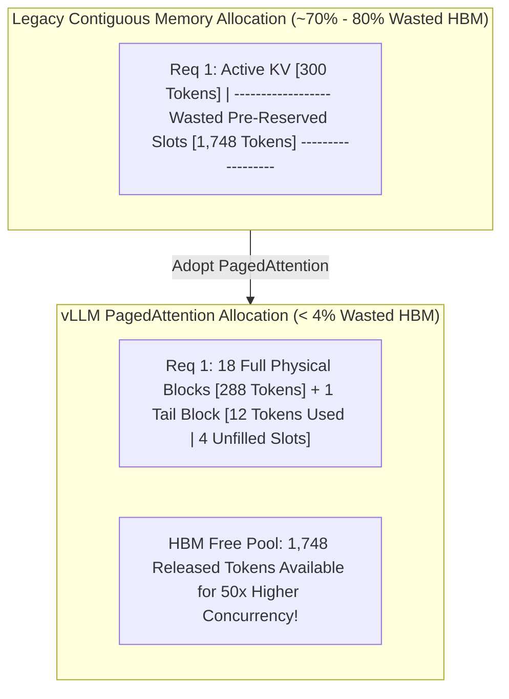

By liberating `> 70%` of previously stranded `HBM` capacity, vLLM enables inference servers to scale concurrent batch sizes (`batch_size = b`) from `b = 16` up to `b = 128+` on identical hardware, saturating silicon compute capacity (`TFLOPs`) and slashing per-token generation costs.

---

## Part 2: PagedAttention Kernel Architecture and Hardware Execution

While OS paging is well-understood on CPUs where memory lookups are handled transparently by hardware Memory Management Units (`MMUs`) and Translation Lookaside Buffers (`TLBs`), GPUs lack physical hardware page tables for high-dimensional tensor execution. Therefore, implementing virtual paging for LLMs required designing custom, fused CUDA/ROCm kernels capable of performing virtual-to-physical address translation on the fly during attention computation: **PagedAttention**.

### 2.1 Traditional FlashAttention vs. PagedAttention Execution Mechanics

To appreciate what makes PagedAttention unique, we must contrast its execution contracts against standard high-performance kernels like **FlashAttention (`Dao et al., 2022`)**:

1. **FlashAttention's Contiguity Contract**:
   Standard FlashAttention achieves optimal speed (`TFLOPs`) by tiling attention computations inside on-chip GPU Static Random-Access Memory (`SRAM / Shared Memory`). However, FlashAttention's memory pointers explicitly mandate that the Key (`K`) and Value (`V`) tensors across sequence length `s` sit in **strictly contiguous physical `HBM` memory**. The CUDA kernel advances pointers sequentially across address increments (`K_ptr + tile_offset`), failing completely if `KV` blocks sit scattered across memory.

2. **PagedAttention's Indirect Lookup Contract**:
   PagedAttention modifies the FlashAttention SRAM tiling algorithm to incorporate **indirect pointer translation via Block Tables**. Rather than advancing a single contiguous pointer across `s`, the PagedAttention CUDA thread block reads the sequence's Block Table into registers/SRAM, dynamically translates logical block indices into physical block pointers, and loads non-contiguous `HBM` chunks into on-chip `SRAM` tiles on the fly.

---

### 2.2 Step-by-Step PagedAttention CUDA Kernel Data Flow

Let us trace exactly how a CUDA thread block (`operating on 1 Query head h of 1 user sequence at step t`) executes PagedAttention across fragmented physical `KV` blocks:

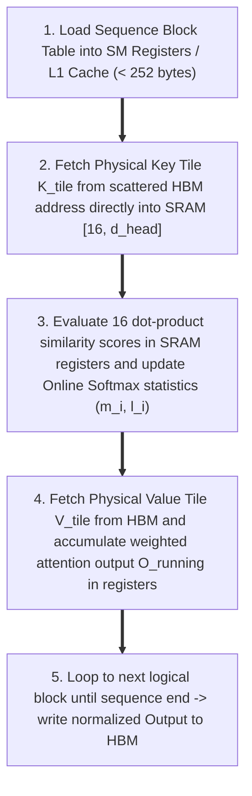

#### Detailed Execution Phases (Per Query Head $h$):

##### Step 1: Metadata Loading
When the CUDA thread block launches on a Streaming Multiprocessor (`SM`) to compute Query Head $h$ of Sequence $i$, threads load the sequence's `Block_Table` from global `HBM` into ultra-fast `SM` registers (`or L1 cache`). Because a sequence of `1,000` tokens with `block_size = 16` has a Block Table containing only `~63 integers` (`252 bytes`), this metadata lookup consumes negligible memory bandwidth (`< 0.01% of total data transfer`).

##### Step 2: Scattered Key Tile Loading (Head $h$)
The kernel iterates over logical blocks $j = 0, 1, \dots, \text{num_logical_blocks} - 1$. For logical block $j$, threads read physical block ID $P = \text{Block_Table}[j]$ (`e.g., P = 104`), compute the physical memory base address for Head $h$ ($\text{key_cache}[104, h]$), and cooperatively load all `block_size` (`16`) Key vectors for Head $h$ from `HBM` directly into on-chip `SRAM` tile $K_{\text{tile}, h}$ (`Shape:` $[16, d_{\text{head}}]$).

##### Step 3: In-Register Dot-Product Evaluation (Head $h$)
Inside `SRAM` registers, the single query vector $q_{t, h}$ (`Shape:` $[1, d_{\text{head}}]$) computes inner products against the $16$ cached Key vectors for Head $h$ ($K_{\text{tile}, h}$), generating $16$ raw similarity scores for Head $h$:

$$
S_{\text{tile}, h} = \frac{q_{t, h} @ K_{\text{tile}, h}^T}{\sqrt{d_{\text{head}}}}
$$

##### Step 4: Online Softmax Rescaling and Value Accumulation (Head $h$)
The kernel updates running Softmax statistics for Head $h$, specifically tracking the running maximum $m_{i, h}$ and exponent sum $l_{i, h}$ using the **Online Softmax** mathematical identity (see [Section 2.4](#24-mathematical-derivation-online-softmax-across-non-contiguous-blocks) for the complete derivation).
Threads fetch the corresponding $16$ Value vectors for Head $h$, where $V_{\text{tile}, h} = \text{value_cache}[104, h]$ (`Shape:` $[16, d_{\text{head}}]$) from `HBM` into `SRAM`, and accumulate the partial weighted sum inside `SM` registers:

$$
O_{\text{running}, h} \leftarrow O_{\text{running}, h} + P_{\text{tile}, h} @ V_{\text{tile}, h}
$$

##### Step 5: Loop and Finalize (Head $h$)
Once all logical blocks are consumed, the accumulated vector $O_{\text{running}, h}$ is divided by the final total Softmax normalization sum $l_{\text{final}, h}$ and written out to global memory (`HBM`) as the exact attention layer output for Head $h$ at token position $t$:

$$
\text{Output}_{t, h} = \frac{O_{\text{running}, h}}{l_{\text{final}, h}}
$$

> [!NOTE]
> **Cross-Reference**: For the complete mathematical proof, numerical stability analysis, and step-by-step two-state recurrence equations of Online Softmax, refer directly to [Section 2.4: Mathematical Derivation: Online Softmax Across Non-Contiguous Blocks](#24-mathematical-derivation-online-softmax-across-non-contiguous-blocks).

#### Architectural Deep Dive: Why Key (`K`) and Value (`V`) Vectors Always Share the Same Physical Block ID
A common question when examining Step 2 and Step 4 is: *Why are both the Key (`K`) tile and Value (`V`) tile for tokens 0..15 fetched from the exact same Physical Block ID (`Physical Block P = 104`)? Could K and V ever be stored in different physical blocks?*

In vLLM's memory architecture, **`K` and `V` vectors for token `m` are ALWAYS coupled under the exact same Physical Block ID (`Physical Block P`)**. This design choice reflects three fundamental systems principles:

1. **Identical Co-Lifecycle**:
   For any given token `m`, its Key vector `k_m` and Value vector `v_m` are generated together during the forward pass, cached together, shared together (via Copy-on-Write `CoW` or Automatic Prefix Caching `APC`), and freed/evicted together when the sequence completes. Because `k_m` and `v_m` share an identical lifecycle, separating their physical allocation into independent block IDs would double Block Table metadata size, double pointer translation overhead, and double reference counting complexity with zero engineering benefit.

2. **GPU HBM Tensor Indexing Layout (`key_cache_pool` and `value_cache_pool` Tensors)**:
   In GPU memory (`HBM`), vLLM allocates the KV cache pool as two large, pre-reserved global tensors (or one unified fused tensor):

    - **Key Cache Pool Tensor**: `key_cache_pool` shape is $[N_{\text{blocks}}, N_{\text{kv_heads}}, \text{block_size}, d_{\text{head}}]$.
    - **Value Cache Pool Tensor**: `value_cache_pool` shape is $[N_{\text{blocks}}, N_{\text{kv_heads}}, \text{block_size}, d_{\text{head}}]$.
    - When the Block Manager assigns `physical_block_id = P` (`e.g., Physical Block 104`) to `Logical Block j`, that single integer `P` acts as the **exact matching 0th-dimension index** into both GPU tensors:
        - `K_tile = key_cache_pool[104]` (holds the 16 Key vectors for tokens 0..15).
        - `V_tile = value_cache_pool[104]` (holds the 16 Value vectors for tokens 0..15).
3. **Single Pointer Translation Overhead**:
   During PagedAttention CUDA kernel execution, reading `Block_Table[j]` returns `P = 104`. The thread block uses `P = 104` to compute the physical base address for `K_tile` during Step 2, and reuses that exact same index `P = 104` to compute the physical base address for `V_tile` during Step 4. This ensures that address translation executes in $\mathcal{O}(1)$ time with minimal register pressure.

---

### 2.3 SRAM Tiling and Block-Level Parallelism

Why did the vLLM team select `block_size = 16` (`or 32`) as the universal default across modern architectures, rather than `block_size = 1` (`fine-grained single-token paging`) or `block_size = 256` (`coarse-grained paging`)?

This decision reflects exact alignment with GPU **hardware micro-architecture rules**:

1. **CUDA Warp Alignment (`32 Threads per Warp`)**:
   In NVIDIA GPUs, threads execute in synchronous groups of `32` called **Warps**. If `block_size = 16`, exactly two tokens map to each warp across parallel head computations, or `16` threads cooperatively load one token's `128`-dimensional vector (`128 / 16 = 8 elements per thread`). If `block_size` were set to `1` or `3`, warps would experience severe divergence and thread under-utilization.

2. **HBM Memory Coalescing Rules (`128-Byte Cache Lines`)**:
   When GPU threads request data from global `HBM`, the memory controller does not read individual bytes; it reads memory in contiguous **`128-byte` cache lines**.

    - By setting `block_size = 16`, every physical block contains `16 * 256 bytes = 4,096 bytes` (`4 KB`) per attention head. When a warp requests `4 KB` of contiguous data inside a physical block, the memory controller coalesces the reads into exactly `32` consecutive `128-byte` transactions, achieving **`100%` memory bus efficiency (`Peak Bandwidth Saturation`)** while keeping pointer lookup overhead near zero.

#### Deep Dive: What is "Pointer Overhead" and Why Does `block_size = 16` Eliminate It?
To understand what **Pointer Overhead** means, let us break down how a computer reads memory from first principles.

##### 1. What is a "Pointer"?
A **pointer** is simply a 64-bit memory address (`an integer, e.g., 0x7FFF00680000`) that tells the GPU *where* a piece of data lives in physical `HBM`.

- **Contiguous Allocation**: If all 1,000 tokens of a sequence sit in one continuous memory line, the GPU needs only **1 single pointer** (`the Base Address`). To find token `k`, it simply adds `k * token_bytes` to that single base address.
- **Paged Allocation**: Because vLLM breaks memory into blocks, the GPU cannot just add offsets to a single base address. Instead, it must look up a **Block Table** to find which physical block holds each chunk of tokens.

##### 2. What Happens if `block_size = 1` (Single-Token Paging)?
If every single token were given its own independent physical block (`block_size = 1 token`):

- **1. Metadata Memory Waste**: For a 1,000-token sequence, the Block Table must store **1,000 separate block pointers**. Across a batch of 128 concurrent requests, the inference engine must store and update `128,000` pointer integers in RAM/HBM!
- **2. CUDA Instruction and Latency Penalty**: Before reading *every single token*, the GPU CUDA cores must execute an extra instruction to fetch pointer `k` from global memory into registers, calculate the memory offset, and perform an indirect memory jump. Executing 1,000 separate pointer lookups for 1,000 tokens severely stalls the GPU pipeline with instruction latency overhead.
- **3. Memory Controller Bus Inefficiency**: Because 1-token blocks sit scattered at completely arbitrary memory addresses across HBM, reading 1 token (`256 bytes`) requires issuing multiple independent memory read commands. The memory controller cannot burst-read data efficiently.

##### 3. How `block_size = 16` Eliminates Pointer Overhead
By grouping 16 tokens into a single physical block:

- **Pointers Reduced by 16x**: A 1,000-token sequence needs only `ceil(1000 / 16) = 63 block pointers` instead of 1,000!
- **1 Pointer Lookup for 16 Tokens**: The GPU CUDA kernel looks up `Block_Table[j]` **once**, getting `Physical Block P = 104`. It then reads **all 16 tokens consecutively** inside Block 104 using simple, instant address addition (`Offset + 0, + 256, + 512...`), bypassing 15 out of 16 pointer lookups!
- **100% Coalesced Bus Access**: The 16 tokens form a contiguous `4 KB` block in HBM, allowing the GPU memory controller to issue a single contiguous burst read (`32 x 128-byte cache lines`) at maximum HBM bandwidth (`TB/s`).

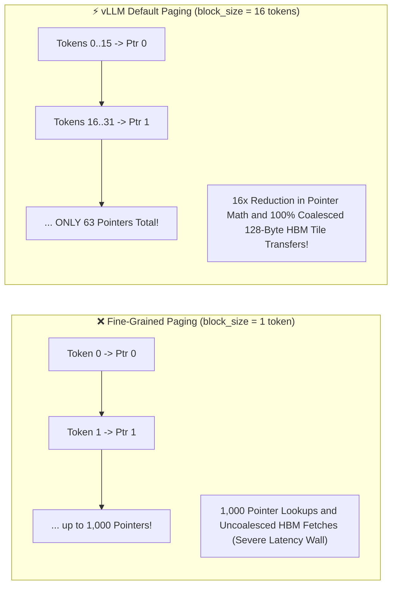

---

### 2.4 Mathematical Derivation: Online Softmax Across Non-Contiguous Blocks

Because PagedAttention fetches physical blocks one at a time into `SRAM` without loading the entire historical sequence into memory at once, how does the kernel compute exact `Softmax` probabilities when the true denominator ($\sum_{j=0}^{s-1} e^{z_j}$) requires knowing every score across the entire sequence (`including blocks that have not been fetched yet`)?

The kernel achieves exact mathematical equivalence to full-sequence `Softmax` by implementing **Online Softmax (`Milakov and Gimelshein, 2018`)**, maintaining a running maximum $m_i$ and running exponent sum $l_i$ across block iterations:

#### 1. The Numerical Stability Problem
Standard `Softmax` over a score vector $z$ is defined as:

$$
\text{Softmax}(z_j) = \frac{e^{z_j - m}}{\sum_k e^{z_k - m}} \quad \text{where } m = \max(z_1, z_2, \dots, z_s)
$$

To prevent numerical overflow when computing $e^{z_j}$ for large positive logits (e.g., $e^{85} > \text{FP16 max}$), standard algorithms subtract the global sequence maximum $m = \max(z)$ from every score before exponentiating. However, finding the global maximum $m$ requires a full pass across all tokens in advance, which is impossible when streaming non-contiguous physical blocks of $16$ tokens one at a time!

#### 2. The Two-State Running Recurrence Relations
Let block iteration step $i$ process logical block $i$, where $z^{(i)}$ denotes the vector of raw dot-product scores inside block $i$, and $O^{(i)}$ denotes the running weighted value accumulation inside `SRAM` registers up through block $i$.

When transitioning from processing block $i-1$ to block $i$, the kernel updates its three running statistics using exact recurrence equations:

##### 1. Running Maximum (m_i)

$$
m_i = \max\left(m_{i-1}, \ \max\left(z^{(i)}\right)\right)
$$

##### 2. Running Exponent Sum (l_i)

$$
l_i = l_{i-1} \cdot e^{m_{i-1} - m_i} + \sum_{j \in \text{block } i} e^{z_j^{(i)} - m_i}
$$

##### 3. Running Value Accumulation (O_i)

$$
O_i = O_{i-1} \cdot e^{m_{i-1} - m_i} + \sum_{j \in \text{block } i} \left( e^{z_j^{(i)} - m_i} \cdot V_j^{(i)} \right)
$$

##### 4. Final Normalized Attention Output (After all B logical blocks)

$$
\text{Final Output} = \frac{O_B}{l_B}
$$

#### Step-by-Step Mathematical Mechanics:
1. **Running Maximum ($m_i$)**: Tracks the maximum logit seen up through block $i$. If block $i$ contains a new global maximum ($\max(z^{(i)}) > m_{i-1}$), $m_i$ updates to this higher value.
2. **Running Exponent Sum ($l_i$)**: The previous sum $l_{i-1}$ was computed relative to $m_{i-1}$. To adjust it to the new max $m_i$, $l_{i-1}$ is rescaled by the correction factor $e^{m_{i-1} - m_i}$. The exponentiated scores of the new block are then added.
3. **Running Value Accumulation ($O_i$)**: The prior unnormalized weighted output $O_{i-1}$ is rescaled by that exact same correction factor $e^{m_{i-1} - m_i}$, preserving exact mathematical equality with full-sequence `Softmax`.

**Why This is a Breakthrough**: This recurrence proves that **PagedAttention requires zero intermediate writes to `HBM`**. The entire attention calculation (`scores, online Softmax rescaling, and Value summation`) executes entirely inside on-chip `SRAM` registers as physical blocks stream through, saving massive memory bandwidth (`GB/s`) and achieving near-theoretical hardware peak performance (`TFLOPs`).

---

## Part 3: The Block Manager and Memory Allocation Economics

Above the low-level CUDA kernels sits vLLM's control plane: the **Block Manager**. Acting as an AI-native virtual memory allocator, the Block Manager handles physical pool reservations, reference-counted sharing, and prefix caching across concurrent user requests.

### 3.1 Block Size Selection Economics (`block_size = 16 vs 32 vs 64`)

Selecting the logical/physical `block_size` requires balancing a fundamental trade-off between **Internal Fragmentation Waste** and **Metadata/Lookup Overhead**:

| Block Size (`tokens`) | Internal Fragmentation Waste | Block Table Metadata Size (`1,000 tokens`) | SRAM Coalescing and Hardware Alignment | Best Target Workload |
| :--- | :--- | :--- | :--- | :--- |
| **`block_size = 8`** | **Ultra-Low** (`avg 3.5 wasted slots/req`) | High (`125 block pointers per request`) | Sub-optimal (`2 KB per head, partial cache lines`) | Memory-constrained consumer GPUs (`24 GB VRAM`) |
| **`block_size = 16`** | **Very Low** (`avg 7.5 wasted slots/req`) | Low (`63 block pointers per request`) | **Optimal** (`4 KB per head, exactly 32-warp aligned`) | **Universal Default (`vLLM Standard`)** |
| **`block_size = 32`** | **Low** (`avg 15.5 wasted slots/req`) | Very Low (`32 block pointers per request`) | **Optimal** (`8 KB per head, high coalescing`) | High-concurrency production deployments (`H100/H200`) |
| **`block_size = 128`** | High (`avg 63.5 wasted slots/req`) | Minimal (`8 block pointers per request`) | Coarse (`32 KB per head`) | Extremely long-context batch prefill (`> 32K context`) |

#### Science Tip: What is the Actual Unit and Payload of `block_size`?
When we configure `block_size = 16` in vLLM:

1. **The Unit of `block_size`**: The unit is **`tokens`** (`specifically, a capacity of 16 sequence token slots`).
2. **The Physical Payload inside ONE Physical Block**: A single Physical Block (`e.g., Physical Block 104`) is allocated to store **BOTH the Key (`K`) vectors AND the Value (`V`) vectors** for those `16` tokens across all Transformer layers ($L$), all Key-Value attention heads ($h_{kv}$), and all head dimensions ($d_{\text{head}}$).
3. **Mathematical Equivalence**:

$$
\text{1 Physical Block (block_size} = 16\text{)} = [16 \text{ Key Vectors} + 16 \text{ Value Vectors}] \text{ per layer across all heads!}
$$

   That is why the total physical byte formula for 1 block contains the explicit multiplier of **`2`** (`1 for K, 1 for V`):

$$
\text{Physical_Block_Bytes} = 2 \cdot \text{block_size} \cdot L \cdot h_{kv} \cdot d_{\text{head}} \cdot \text{sizeof(dtype)}
$$

---

### 3.2 Exact Physical Byte Footprint of a Physical Block (`Llama 3 70B Case Study`)

To calculate exactly how many physical blocks can be allocated inside an H100 GPU's `HBM` pool, we must formalize the byte footprint of a single physical block across all layers:

$$
\text{Physical_Block_Bytes} = 2 \cdot \text{block_size} \cdot \text{num_layers} \cdot \text{num_kv_heads} \cdot \text{head_dim} \cdot \text{sizeof(dtype)}
$$

$$
\text{Physical_Block_Bytes} = 2 \cdot \text{block_size} \cdot L \cdot h_{kv} \cdot d_{\text{head}} \cdot \text{sizeof(dtype)}
$$

Where:

- $2$: Both $K$ and $V$ matrices.
- `block_size`: Number of tokens inside one physical block (`typically 16`).
- $L$ (`num_layers`): Number of Transformer layers (`80 on Llama 3 70B`).
- $h_{kv}$ (`num_kv_heads`): Number of Key-Value attention heads (`8 on Llama 3 70B GQA`).
- $d_{\text{head}}$ (`head_dim`): Dimension of each head (`128`).
- `sizeof(dtype)`: Bytes per element (`2 for FP16 / BF16`).

#### Calculation for Llama 3 70B (`block_size = 16, FP16`):

$$
\text{Physical_Block_Bytes} = 2 \times 16 \times 80 \times 8 \times 128 \times 2 = 5,242,880 \text{ bytes} \equiv \mathbf{5.00 \text{ MiB} \ (5.24 \text{ MB})}
$$

#### Total HBM Free Pool Sizing on an NVIDIA H100 (`80 GB`):
1. **Total GPU Memory**: `80.00 GB` (`81,920 MB`).
2. **Model Weight Allocation (`FP16`)**: `70 Billion weights * 2 bytes = 140 GB` (`Note: Llama 3 70B in FP16 requires two H100s via Tensor Parallelism TP=2, allocating 70 GB per GPU`).
3. **Execution and Activation Buffer Overhead**: `~2.00 GB` reserved for PyTorch runtime and dynamic activation buffers (`Q, Gate_Tensor, etc.`).
4. **Remaining Free Pool for KV Cache**: `80.00 GB - 70.00 GB - 2.00 GB = 8.00 GB (`8,192 MB`) free per GPU`.
5. **Total Physical Blocks in Free Pool**:

$$
\text{Total_Available_Blocks} = \frac{\text{Free KV Memory}}{\text{Physical_Block_Bytes}} = \frac{8,192 \text{ MB}}{5.24 \text{ MB}} \approx \mathbf{1,563 \text{ physical blocks per GPU!}}
$$

   With `1,563` physical blocks of `16` tokens each, the vLLM instance on this TP=2 cluster holds exactly **`25,008 tokens` of concurrent `KV` cache capacity**, available to be dynamically partitioned across any combination of short (`100 tokens`) or long (`8,192 tokens`) user sequences without memory waste!

#### Physical HBM Pointer Unfolding and Memory Address Mapping Example
To understand how multi-dimensional Key and Value tensors map to raw flat byte addresses in GPU `HBM`, let us trace a single physical block (`Physical Block 104`) at layer $l$ for Llama 3 70B ($h_{kv} = 8, \text{block_size} = 16, d_{\text{head}} = 128, \text{dtype} = \text{FP16 (2 bytes)}$).

##### 1. Per-Layer Physical Block Size

$$
\text{Block_Bytes_Per_Layer} = 2 \times 8 \times 16 \times 128 \times 2 = 65,536 \text{ bytes} \equiv \mathbf{64 \text{ KB per layer}}
$$

##### 2. Start and End Memory Addresses for Physical Block 104

Assuming the GPU `HBM` pool tensor has base byte address `Base_Addr = 0x7FFF00000000`:

- $\text{Block_Start_Addr}(P=104) = \text{Base_Addr} + (104 \times 65,536 \text{ bytes}) = \mathbf{0\text{x7FFF00680000}}$
- $\text{Block_End_Addr}(P=104) = \text{Block_Start_Addr} + 65,535 \text{ bytes} = \mathbf{0\text{x7FFF0068FFFF}}$

##### 3. Flat 1D Memory Unfolding Diagram (Inside 64 KB Block 104)

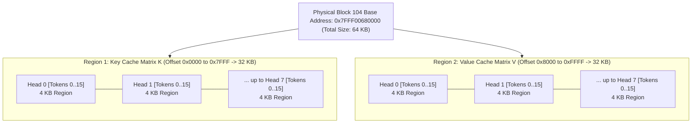

##### 4. Detailed Byte Offset Arithmetic for Token p = 25 (Logical Block 1, Token Offset t = 9)

Suppose the kernel needs to read Key element $d$ ($d \in [0, 127]$) of Token $p = 25$ for Head $h = 2$.

- `Block_Table[1] = 104` (`Physical Block ID`).
- Token offset inside block: `t = 25 % 16 = 9`.
- Stride dimensions:
    - `Stride_Block = 65,536 bytes` (`64 KB`).
    - `Stride_KV    = 32,768 bytes` (`Key region = 0, Value region = 1`).
    - `Stride_Head  = 4,096 bytes` (`16 tokens * 128 dim * 2 bytes`).
    - `Stride_Token = 256 bytes` (`128 dim * 2 bytes per token`).

The CUDA kernel evaluates the exact flat `HBM` byte pointer in $\mathcal{O}(1)$ time:

$$
\text{Flat_Byte_Addr} = \text{Base_Addr} + (104 \times 65,536) + (0 \times 32,768) + (2 \times 4,096) + (9 \times 256) + (d \times 2)
$$

$$
\text{Flat_Byte_Addr} = 0\text{x7FFF00680000} + 0\text{x2000} + 0\text{x0900} + (d \times 2) = \mathbf{0\text{x7FFF00682900} + (d \times 2)}
$$

This formula demonstrates how multi-dimensional tensor indexing seamlessly maps to flat physical `HBM` byte addresses during PagedAttention execution!

---

### 3.3 Copy-on-Write (`CoW`) Mechanics for Shared Prompts and Parallel Sampling

One of the most powerful capabilities enabled by vLLM's virtual memory block manager is **Copy-on-Write (`CoW`)** reference counting (`ref_count`).

In production AI workloads, multiple logical requests frequently share identical historical prefixes:

1. **Shared System Prompts**: Hundreds of concurrent users interacting with an enterprise chatbot share the exact same `1,024-token` system prompt (`"You are a helpful customer support agent for Company X..."`).
2. **Parallel Sampling (`best_of_n`)**: A reasoning application prompts the model once and asks it to generate `n = 5` independent candidate solutions (`beam search or parallel temperature sampling`) to select the best response.

Under traditional contiguous allocation, generating `5` parallel responses requires making `5` identical, physical copies of the prompt's `KV` cache in `HBM`, consuming `5x` memory bandwidth (`GB/s`) and `5x` storage capacity before generating a single new word!

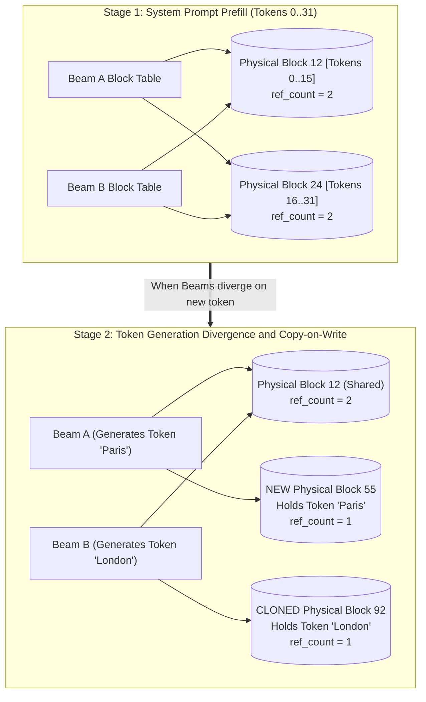

#### Step-by-Step `CoW` Execution Flow:
1. **Shared Pointer Assignment**: When `Beam A` and `Beam B` are spawned from a shared `32-token` prompt (`Logical Blocks 0 and 1`), vLLM does not copy memory. Instead, both sequences' Block Tables point to `Physical Block 12` and `Physical Block 45`. The Block Manager increments their reference counters to `ref_count = 2`.
2. **Shared Autoregressive Growth**: If both beams deterministically generate identical initial tokens (`e.g., Token 32 = "The"`), vLLM writes the token into a single shared `Physical Block 88` (`ref_count = 2`).
3. **Divergence and Duplication (`The CoW Trigger`)**: At step `33`, `Beam A` generates `"cat"` while `Beam B` generates `"dog"`. When the engine attempts to write `"dog"` into `Physical Block 88` for `Beam B`, the Block Manager checks the block's reference counter.
    - Because `ref_count == 2 > 1`, directly writing `"dog"` would corrupt `Beam A`'s sequence!
    - The Block Manager triggers **Copy-on-Write**: it allocates a fresh `Physical Block 99` from the free pool, copies existing shared tokens (`Token 32 = "The"`) from `Block 88` into `Block 99`, decrements `Block 88`'s `ref_count` to `1`, points `Beam B`'s Block Table to `Block 99`, and writes `"dog"` into `Block 99`.

By enabling zero-copy prompt sharing across arbitrary sequence groupings, `CoW` slashes `KV` cache memory consumption during `best_of_n` sampling by `> 75%`, boosting multi-branch reasoning capacity.

---

### 3.4 Automatic Prefix Caching (`APC`) and Radix Tree Block Management

While `CoW` shares memory *within* a single multi-branch request, **Automatic Prefix Caching (`APC`)** extends this sharing across *independent, asynchronous user requests* arriving at arbitrary times.

If User A submits an API request at 10:00 AM containing a `2,048-token` codebase prompt, and User B submits a completely separate request at 10:05 AM analyzing that exact same `2,048-token` codebase with a different question, traditional engines re-execute the entire `2,048-token` prefill forward pass for User B from scratch (`taking hundreds of milliseconds of compute time`).

vLLM eliminates redundant prefill compute by organizing physical `KV` blocks into a global **Radix Tree (Prefix Hash Tree)**:

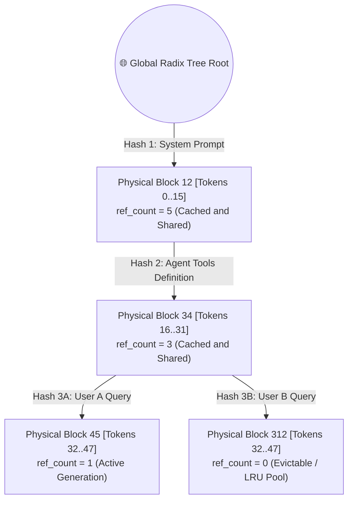

#### 1. Cryptographic Hash Calculation per Block
As a sequence completes prefill across logical blocks (`block_size = 16`), vLLM computes a cryptographic hash (`e.g., SHA-256 or xxHash`) for each logical block $j$ based on:

- The exact token IDs $[t_0, t_1, \dots, t_{15}]$ inside logical block $j$.
- The cumulative hash of all preceding parent blocks ($\text{Hash}_j = \text{hash}(\text{Hash}_{j-1} + \text{Token_IDs}_j)$). This guarantees strict causal alignment (`Block j's hash uniquely identifies the entire sequence history up to block j`).

#### 2. Radix Tree Insertion and LRU Eviction Policy
1. **Cache Hit ($\mathcal{O}(1)$ Reuse)**: When User B's request arrives, the Block Manager calculates the hash of their first logical block (`Tokens 0-15`). It queries the global Radix Tree. If `Hash_0` exists pointing to `Physical Block 12`, vLLM **skips prefill computation for those 16 tokens entirely**, increments `Physical Block 12`'s `ref_count`, and points User B's Block Table to `Block 12`! This lookup repeats sequentially down the Radix Tree until a hash mismatch (`cache miss`) occurs.
2. **LRU Eviction (`When Free Pool is Exhausted`)**: When a request finishes and releases its sequence (`ref_count decrements to 0`), `APC` does **not** immediately deallocate the physical blocks back to the free pool. Instead, blocks with `ref_count == 0` remain cached inside the Radix Tree marked as **Evictable**.
   If a new request requires physical blocks and the free pool is empty, the Block Manager evicts cached blocks from the Radix Tree using a **Least Recently Used (`LRU`)** policy (`evicting blocks whose ref_count == 0 that have gone unaccessed for the longest duration`).

Through `APC`, enterprise deployments serving repetitive system instructions, agentic tool definitions, or multi-turn chat histories experience `> 80% cache hit rates`, dropping prompt prefill latency (`TTFT`) from hundreds of milliseconds down to `< 10 milliseconds`!

---

## Part 4: Continuous Batching and The Iteration-Level Scheduler

Having optimized memory layout via PagedAttention (`Part 2`) and shared block allocations via the Block Manager (`Part 3`), we examine the third core pillar of vLLM: the **Iteration-Level Scheduler (`Continuous Batching`)**, which orchestrates dynamic request admission and preemption on every single token generation tick.

### 4.1 Static Request-Level Batching vs. Continuous Iteration-Level Batching

In legacy inference engines (`Static Request-Level Batching`), requests are grouped into a static batch (`e.g., b = 32`) that executes across the GPU until every single sequence in the batch has completely generated all of its output tokens (`or hit max_seq_len`).

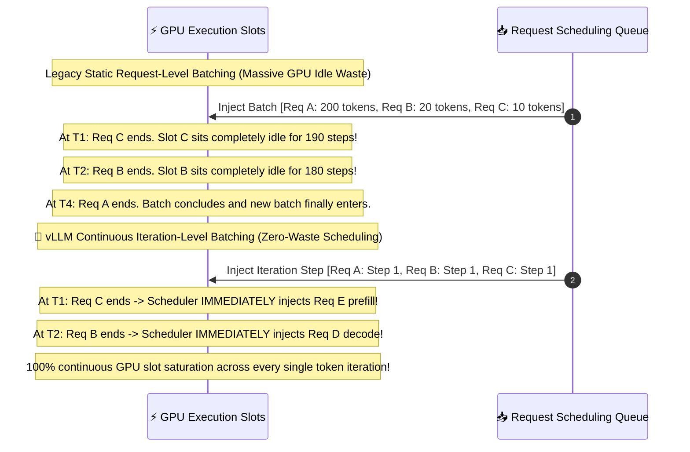

#### Why Static Batching Wastes Compute:
Because real-world user requests vary drastically in output length (`Request A generates 2 tokens, Request B generates 500 tokens`), early terminating sequences leave their GPU execution slots completely vacant while waiting for the longest sequence in the batch to complete. Empirical profiling proves that static batching wastes **`> 60% to 90%` of available GPU compute cycles (`TFLOPs`)**.

#### Continuous Batching (`Iteration-Level Scheduling`):
vLLM implements **Continuous Batching (`popularized by Orca, Yu et al., 2022`)**: rather than scheduling at the granularity of an entire *request*, vLLM schedules at the granularity of a **single token generation iteration (`step`)**.

- After every forward pass across the Transformer (`every single token step`), the scheduler pauses, inspects the request pool, ejects any sequence that just emitted an End-Of-Sequence (`EOS`) token, and immediately admits a newly arrived request from the waiting queue right into that vacated slot before launching the very next iteration!

---

### 4.2 The Three Request Lifecycle States (`Waiting, Running, Swapped`)

Inside vLLM's iteration scheduler, every user sequence transitions across three formal lifecycle states governed by a strict state machine:

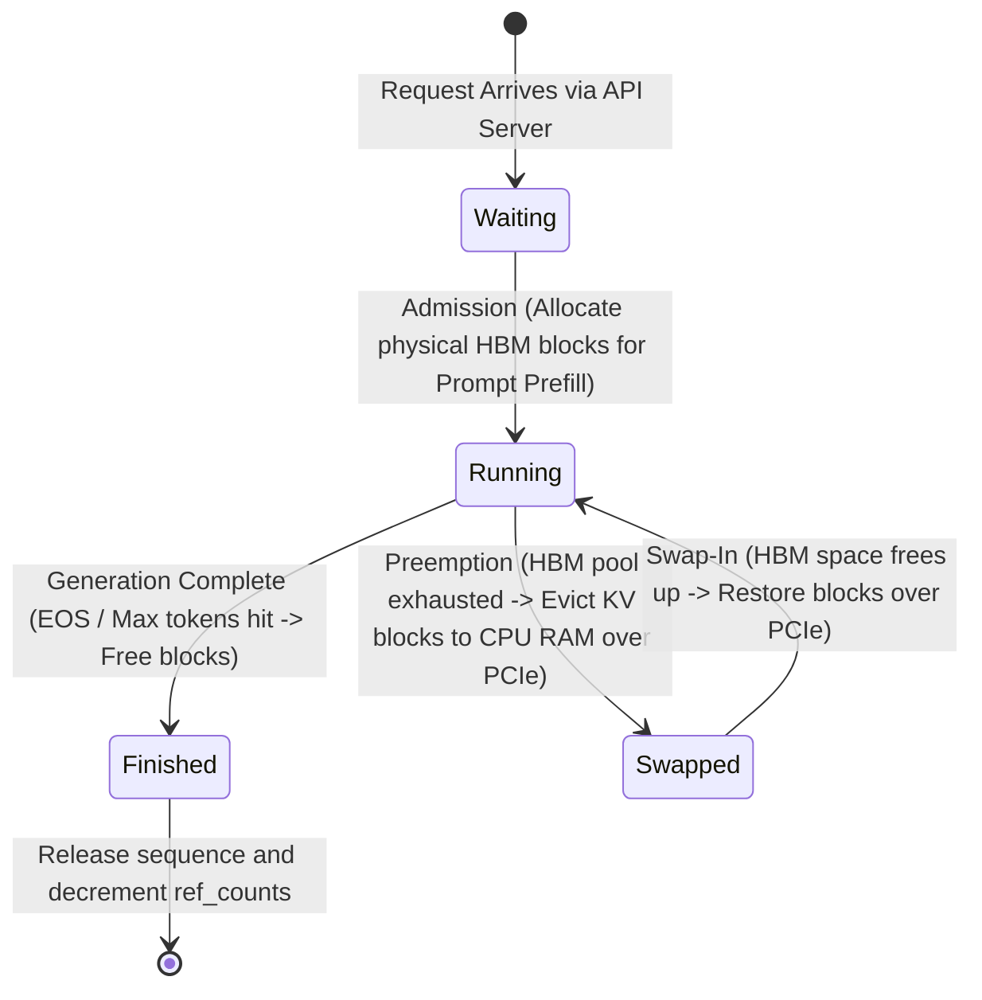

1. **`Waiting` State**: The request has arrived in memory from the API gateway, but has **zero physical `HBM` blocks assigned**. It sits in an ordered first-in, first-out (`FIFO`) queue waiting for admission.
2. **`Running` State**: The request has successfully allocated physical `HBM` blocks from the Block Manager. Its `KV` cache resides actively in GPU memory (`HBM`), and its tokens participate actively inside every iteration's forward pass (`either executing Prompt Prefill or Autoregressive Decoding`).
3. **`Swapped` State (`Preempted`)**: If the GPU `HBM` free pool runs out of physical blocks during autoregressive decoding (`because all active sequences requested a new physical tail block simultaneously`), the scheduler **preempts** one or more low-priority Running sequences. Their physical `KV` cache blocks are evicted (`swapped out`) from GPU `HBM` across the PCIe bus into host CPU `RAM` (`or marked for recomputation`), freeing physical `HBM` blocks so the remaining higher-priority Running sequences can continue generating without failing (`OOM`).

---

### 4.3 The Iteration Scheduler Loop (`Step-by-Step Execution Mechanics`)

Let us trace the exact algorithmic loop executed by vLLM's `Scheduler.schedule()` engine prior to launching each forward pass iteration (`Step t`):

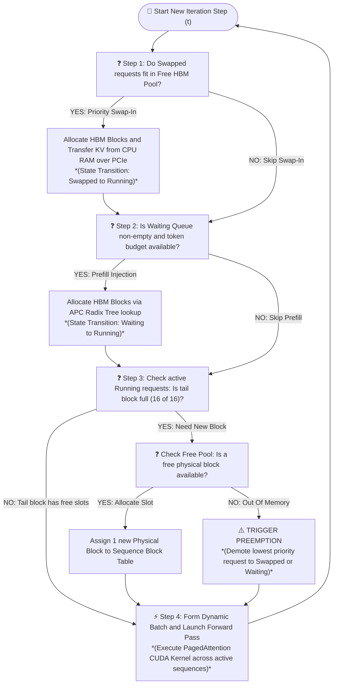

#### Why Dynamic Chunked Prefill and Co-Scheduling Works:
In modern vLLM (`v0.4+`), the scheduler combines both **Prompt Prefill** sequences (`from newly admitted Waiting requests`) and **Autoregressive Decode** sequences (`from ongoing Running requests`) inside the exact same forward pass (`Prefill-Decode Co-Scheduling / Chunked Prefill`).
If a newly admitted prompt is massive (`e.g., 4,096 tokens`), inserting all `4,096` tokens into the iteration step would cause a severe latency spike (`TBT / ITL`) for all concurrently generating decode requests. To prevent this, vLLM splits (`chunks`) the `4,096-token` prompt into smaller logical slices (`e.g., chunks of 512 tokens`). During iteration `t`, the scheduler co-schedules `512 prefill prompt tokens` alongside `64 single-token decode requests` (`Total batch tokens = 512 + 64 = 576 tokens`), perfectly balancing GPU compute saturation (`TFLOPs`) with strict inter-token latency (`TBT`) guarantees across all active users!

---

### 4.4 Preemption Mechanics: Swapping vs. Recomputation

When the `Running` sequences require new physical blocks (`e.g., step t pushes 20 active sequences across the 16-token block boundary simultaneously`) and the `HBM` free pool is `100%` exhausted (`0 free physical blocks`), the scheduler must **preempt** one or more running sequences (`typically selecting the latest-arrived or lowest-priority sequences via LIFO order`).

When preempting a sequence, vLLM evaluates two recovery strategies depending on hardware bandwidth and sequence length:

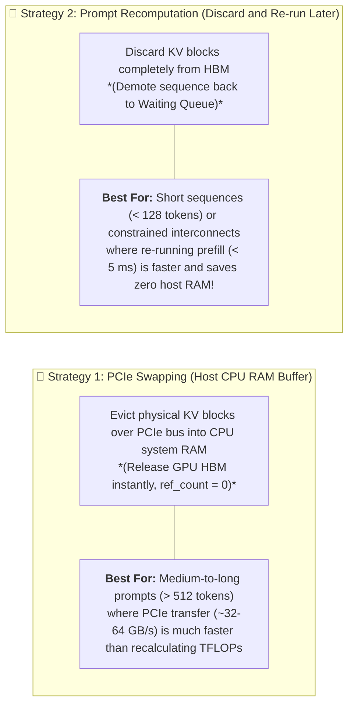

By systematically combining **PagedAttention** virtual memory lookups (`Part 2`), **Copy-on-Write / Automatic Prefix Caching** block sharing (`Part 3`), and **Continuous Iteration Scheduling** with dynamic preemption (`Part 4`), vLLM transforms LLM serving from an inefficient, fragmented, memory-locked bottleneck into an AI-native, high-throughput operating system.

Having mastered the core architecture and execution mechanics of vLLM, we transition directly to **Module 3: Performance, Quality and Engine Enhancements (`03_performance_and_quality.md`)**, where we explore how modern engine features—including **CUDA Graph capture, Speculative Decoding (`Medusa / EAGLE`), and Quantization (`AWQ / FP8`)**—layer on top of PagedAttention to push serving performance toward theoretical silicon limits!
