# Module 3: Performance, Quality and Engine Enhancements

To achieve high-throughput, low-latency Large Language Model (LLM) serving in production, modern inference engines must optimize beyond basic virtual memory management. While PagedAttention resolves Key-Value (KV) cache memory fragmentation, serving systems face three fundamental performance bottlenecks: **inter-token latency spikes caused by long prompt pre-fills**, **CPU host execution overhead during repetitive kernel launches**, and **memory bandwidth saturation during autoregressive decoding**.

This module explores the core performance mechanics and engine enhancements designed into vLLM to overcome these bottlenecks, covering **Inference Performance Metrics**, **Chunked Prefill**, **Systems Economics of Prefill vs. Decode**, **CUDA Graph Execution**, **Speculative Decoding**, and **Model/KV Cache Quantization**.

---

## Part 1: Inference Performance Metrics and Systems Trade-Offs

To evaluate and optimize serving performance, AI systems engineers distinguish between **responsiveness (latency)** and **capacity (throughput)**. In LLM serving, single-request latency is split into two distinct execution phases.

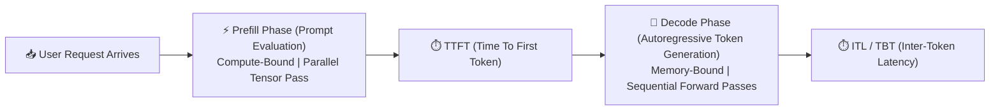

### 1.1 The Production Metric Hierarchy

#### 1. Time To First Token (TTFT)
**Time To First Token (TTFT)** measures the elapsed time from when a user submits a prompt to when the engine emits the very first generated token.

$$
\text{TTFT} = t_{\text{queue}} + t_{\text{prefill}}
$$

Where:

- $t_{\text{queue}}$: Time spent waiting in the engine's `Waiting` queue for free High-Bandwidth Memory (HBM) KV blocks and execution budget.
- $t_{\text{prefill}}$: Time required to execute the compute-bound prompt prefill pass across all $s_{\text{prompt}}$ input tokens.

TTFT is the primary metric for user-perceived engine responsiveness. Long prompt evaluations (e.g., 32,768 tokens) or heavy queue contention degrade TTFT.

#### 2. Inter-Token Latency (ITL / Time Between Tokens - TBT)
**Inter-Token Latency (ITL)**, also known as **Time Between Tokens (TBT)**, measures the time elapsed between generating consecutive output tokens during the autoregressive decoding phase.

$$
\text{ITL} = t_{\text{decode_step}} = \frac{\text{Total Bytes Transferred}}{\text{Memory Bandwidth}} + \frac{\text{FLOPs}}{\text{Peak Compute Capacity}}
$$

Because single-token decoding is memory-bandwidth bound ($I \approx 1.0 \text{ FLOPs/Byte}$), ITL is governed by how fast the GPU reads model weights and KV cache blocks from off-chip HBM into on-chip SRAM. Consistent ITL is required for smooth streaming user experiences (typically targeting $20 \text{ to } 50 \text{ ms/token}$).

#### 3. System Throughput (Tokens per Second)
**System Throughput** measures the total aggregate number of output tokens generated across all active requests per unit time.

$$
\text{Throughput} = \frac{\sum_{i=1}^{b} N_{\text{gen_tokens}, i}}{\Delta t} = \frac{b}{\text{Average ITL}}
$$

Where:

- $b$: Concurrent batch size (number of actively generating sequences).
- $N_{\text{gen_tokens}, i}$: Output tokens produced by sequence $i$.

---

### 1.2 The Latency-Throughput Pareto Frontier

In high-concurrency production serving, latency and throughput stand in direct conflict.

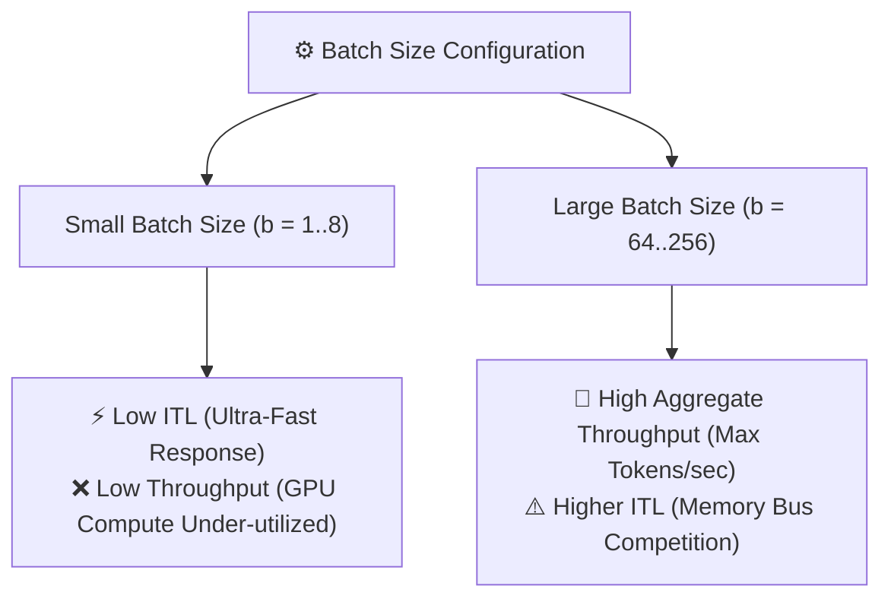

When batch size $b$ increases:

- **HBM Weight Reuse**: The engine reads model weights from HBM once and reuses them across $b$ sequences, increasing arithmetic intensity $I$ toward the GPU Ridge Point.
- **Aggregate Throughput Increases**: Total token generation capacity scales near-linearly with $b$.
- **Per-User ITL Increases**: The total KV cache bytes read from HBM increase ($2 \cdot b \cdot s \cdot L \cdot h_{\text{kv}} \cdot d_{\text{head}} \cdot \text{sizeof(dtype)}$), causing each decoding iteration step to take slightly longer.

Systems engineers select operating points on the **Latency-Throughput Pareto Frontier** based on application requirements: real-time conversational agents prioritize low ITL ($b = 4 \dots 16$), while offline batch processing prioritizes maximum throughput ($b = 64 \dots 256$).

---

## Part 2: Advanced Scheduling: Chunked Prefill and Co-Scheduling

In traditional LLM engines, prompt prefill passes and token decode steps are executed separately. This design creates a severe performance hazard known as **Head-of-Line (HoL) Blocking**.

### 2.1 The Head-of-Line (HoL) Blocking Problem

Suppose an engine is actively generating tokens for 64 concurrent user requests with a smooth ITL of $25 \text{ ms/token}$. Suddenly, a new request arrives containing a massive $32,768$-token document prompt.

If the engine schedules the entire $32,768$-token prompt prefill in a single un-chunked forward pass:

1. The prefill pass requires a large forward computation across all 32.7K tokens simultaneously.
2. On an NVIDIA H100, a 32.7K prefill forward pass on a 70B model requires $\sim 500 \text{ ms}$ of continuous GPU compute.
3. **The Consequence**: All 64 generating decode requests are blocked waiting for the prefill pass to conclude, causing an ITL spike from $25 \text{ ms}$ to $> 500 \text{ ms}$—creating a visible freeze in user-facing streaming output.

---

### 2.2 Chunked Prefill Architecture and Co-Scheduling

To eliminate HoL blocking, vLLM implements **Chunked Prefill** (`v0.4+`).

Rather than executing a long prompt prefill in a single forward pass, the scheduler breaks incoming prompts into smaller, budget-bounded logical segments called **Prefill Chunks** (controlled by `max_num_batched_tokens`, typically set to $512$ or $2,048$ tokens).

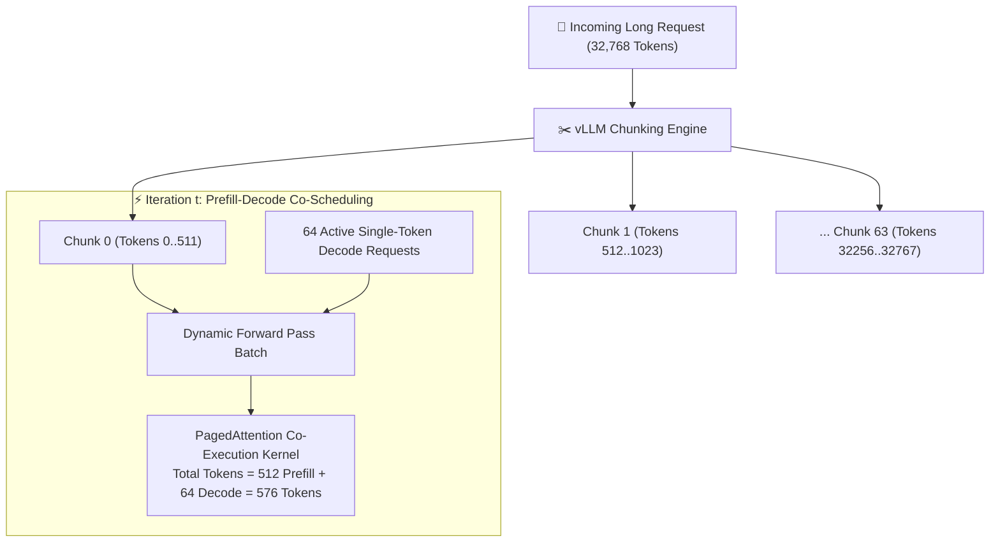

During each iteration step $t$, the scheduler co-schedules:

1. **Active Decode Tokens**: $b_{\text{decode}}$ single tokens from running requests.
2. **Partial Prefill Chunk**: $N_{\text{chunk}}$ tokens from an incoming prompt.

By bounding total tokens per iteration step ($\text{Tokens}_{\text{total}} = N_{\text{chunk}} + b_{\text{decode}} \le \text{max_num_batched_tokens}$), iteration step latency remains bounded, guaranteeing strict ITL SLAs while continuously advancing long prompt prefills in the background.

---

### 2.3 Mathematical Scheduling Constraints

During iteration step $t$, the vLLM iteration scheduler evaluates three quantitative budget constraints:

$$
\sum_{i \in \text{Prefills}} N_{\text{chunk}, i} + \sum_{j \in \text{Decodes}} 1 \le \text{max_num_batched_tokens}
$$

$$
|\text{Prefills}| + |\text{Decodes}| \le \text{max_num_seqs}
$$

$$
\text{Required_Blocks}(\text{Prefills}) + \text{Required_Blocks}(\text{Decodes}) \le \text{Free_HBM_Blocks}
$$

#### Quantitative Scheduling Example
Consider a vLLM configuration with:

- `max_num_batched_tokens = 512`
- `max_num_seqs = 256`
- Active Running Decode Requests: $b_{\text{decode}} = 64$ sequences (1 token each = $64$ tokens)
- Incoming Waiting Request Prompt Length: $s_{\text{prompt}} = 2,048$ tokens

The scheduler executes the following budget evaluation:

1. **Sequence Count Check (`max_num_seqs`)**:
    - Current active decode sequences: $|\text{Decodes}| = 64$.
    - Adding 1 new waiting prefill request: $|\text{Prefills}| = 1$.
    - Total concurrent sequences $= 64 + 1 = 65 \le 256$ (`max_num_seqs`). The sequence concurrency budget is satisfied!
2. **Token Budget Reservation (`max_num_batched_tokens`)**:
    - Reserve $64$ tokens for active decode requests ($512 - 64 = 448$ remaining token budget).
3. **Chunked Prefill Allocation**:
    - Takes $448$ tokens from the incoming $2,048$-token prompt (Chunk 0).
4. **Memory Block Check (`Free_HBM_Blocks`)**:
    - The Block Manager verifies that the free pool holds sufficient physical blocks for $448$ new prefill tokens ($448 / 16 = 28$ physical blocks) plus active decode tail block expansions.
5. **Execution Batch**:
    - Schedules $448$ prompt prefill tokens $+ \ 64$ decode tokens $= 512$ total tokens in the iteration step.
6. **State Tracking**:
    - The incoming request transitions to `Running` state. In iteration step $t+1$, Chunk 1 ($448$ tokens) is co-scheduled alongside active decodes until the full $2,048$ prompt tokens are evaluated.

---

### 2.4 Systems Analysis: Prefill vs. Decode FLOPs, Arithmetic Intensity, and Cost per Token

A fundamental question in LLM serving performance is: **Are FLOPs per token and execution costs identical between the Prefill phase and the Decode phase?**

#### 1. Why Prefill Tokens Execute Full Attention and FFN Passes Across All Layers
A common conceptual question is: *Why do intermediate prefill tokens compute Queries, Attention, and FFN passes at all if they are not predicting output tokens? Why isn't prefill just computing Key and Value vectors?*

There are three fundamental architectural reasons why prefill tokens must execute full Attention and FFN passes across every Transformer layer:

1. **Layer-by-Layer Contextual Representation Building**:
    In a multi-layer Transformer (e.g., 80 layers in Llama 3 70B), raw token embeddings ($X_0$) at Layer 0 contain only static dictionary meanings (e.g., the word `"Apple"`). As tokens pass through Layer 1, Layer 2, ..., Layer 80, attention allows token $i$ (`"Apple"`) to aggregate information from preceding tokens (`"introduced"`, `"new"`, `"iPhone"`), updating its hidden state representation $h_i^{(l)}$.
2. **KV Cache Vectors for Deeper Layers Depend on Hidden States ($h_i^{(l)}$)**:
    Key and Value vectors for token $i$ at Layer $l+1$ are computed directly from token $i$'s hidden state output from Layer $l$:

$$
K_i^{(l+1)} = h_i^{(l)} W_K^{(l+1)}, \quad V_i^{(l+1)} = h_i^{(l)} W_V^{(l+1)}
$$

$$
\text{where } h_i^{(l)} = h_i^{(l-1)} + \text{FFN}\left(\text{Attention}(h_i^{(l-1)})\right)
$$

To compute the KV cache vectors at Layer 40, token $i$ **must** execute full Attention and FFN passes at Layer 39. Without layer-by-layer attention and FFN passes, KV cache vectors at deeper layers would be un-contextualized and mathematically meaningless!
3. **Logit Generation for the Next Token**:
    The prompt's final token ($s_{\text{prompt}}$) uses the contextual representation $h_{s_{\text{prompt}}}^{(80)}$ at Layer 80 to compute the logit distribution for the first generated decode token ($s_{\text{prompt}}+1$). To produce $h_{s_{\text{prompt}}}^{(80)}$, token $s_{\text{prompt}}$ must attend to all previous tokens $1 \dots s_{\text{prompt}}-1$ across all 80 layers.

---

#### 2. Quantitative FLOP Breakdown: Why $2\times$ vs $4\times$ Attention FLOPs is Negligible ($S < 8,000$)
Why do systems engineers state that raw FLOPs per token are nearly identical between Prefill and Decode, even though Prefill Attention FLOPs per token use a $2\times$ factor while Decode Attention FLOPs use a $4\times$ factor?

Let's evaluate the exact FLOP breakdown for a **70B parameter model** ($N = 70 \times 10^9$, $L = 80$, $h_q = 64$, $d_{\text{head}} = 128$):

##### Step 1: Linear Weight Projection FLOPs (Identical for Both)
For every token passing through the model in both Prefill and Decode, multiplying against all linear weight matrices ($W_Q, W_K, W_V, W_O, W_{\text{Gate}}, W_{\text{Up}}, W_{\text{Down}}$) requires:

$$
\text{FLOPs}_{\text{weights}} = 2 \cdot N = 2 \times 70 \times 10^9 = \mathbf{140 \text{ GFLOPs / token}}
$$

##### Step 2: Attention FLOPs per Token at Context Length $S = 1,024$
- **Prefill Phase (Average Attention FLOPs per token)**:
  In prefill, token $i \in [1, S]$ attends to $i$ previous tokens. Averaged across the prompt:

$$
\text{FLOPs}_{\text{attn, prefill}} \approx 2 \cdot L \cdot h_q \cdot d_{\text{head}} \cdot S = 2 \times 80 \times 64 \times 128 \times 1,024 = \mathbf{1.34 \text{ GFLOPs / token}}
$$

- **Decode Phase (Single-Token Attention FLOPs)**:
  A single decode token at position $S = 1,024$ attends to all $S$ cached KV tokens ($Q @ K^T$ score calculation and $\text{Softmax} @ V$ weighted sum):

$$
\text{FLOPs}_{\text{attn, decode}} \approx 4 \cdot L \cdot h_q \cdot d_{\text{head}} \cdot S = 4 \times 80 \times 64 \times 128 \times 1,024 = \mathbf{2.68 \text{ GFLOPs / token}}
$$

##### Step 3: Total FLOPs per Token Comparison ($S = 1,024$)
- **Prefill Total FLOPs / token**: $140.0 + 1.34 = \mathbf{141.34 \text{ GFLOPs / token}}$ (Attention is $0.95\%$ of total math).
- **Decode Total FLOPs / token**: $140.0 + 2.68 = \mathbf{142.68 \text{ GFLOPs / token}}$ (Attention is $1.88\%$ of total math).

$$\text{Difference} = \frac{142.68 - 141.34}{141.34} = \mathbf{0.948\% \text{ difference!}}$$

Even though Decode Attention FLOPs ($2.68 \text{ GFLOPs}$) are $2\times$ Prefill Attention FLOPs ($1.34 \text{ GFLOPs}$), **Attention FLOPs as a whole are dwarfed by the massive $140 \text{ GFLOPs}$ of linear weight projections**. For typical context lengths ($S < 8,000$), total FLOPs per token differ by less than $3.6\%$.

#### 3. The True Bottleneck Difference: Arithmetic Intensity ($I = \text{FLOPs} / \text{Bytes}$)
While raw FLOP counts per token are nearly identical, **the execution time and hardware behavior per token are radically different due to Arithmetic Intensity ($I = \text{FLOPs} / \text{Memory Bytes Transferred}$)**:

- **Decode Sequences ($64$ active decodes, $b=64$, $1$ token each)**:
  For every single decode iteration step, the GPU must read the entire $140 \text{ GB}$ model weight matrix from HBM over the memory bus to process just $64$ tokens.
  
$$
I_{\text{decode}} = \frac{64 \text{ tokens} \times 140 \text{ GFLOPs / token}}{140 \text{ GB weights read}} = \mathbf{64 \text{ FLOPs / Byte}}
$$

  Because $64 \text{ FLOPs / Byte} \ll I_{\text{ridge}} (295 \text{ FLOPs / Byte on H100})$, **the decode phase is memory-bandwidth bound**. The HBM memory bus is $100\%$ saturated, while GPU Tensor Cores sit **$> 75\%$ IDLE** waiting for weight bytes to arrive!

- **Prefill Chunk ($N_{\text{chunk}} = 512$ prompt tokens processed together)**:
  All $512$ prompt tokens are packed into a single GEMM matrix multiplication ($y = X @ W$, where $X \in \mathbb{R}^{512 \times d}$). The $140 \text{ GB}$ model weight matrix is read from HBM **once** and multiplied against all $512$ tokens simultaneously.

$$
I_{\text{prefill}} = \frac{512 \text{ tokens} \times 140 \text{ GFLOPs / token}}{140 \text{ GB weights read}} = \mathbf{512 \text{ FLOPs / Byte}}
$$

  Because $512 \text{ FLOPs / Byte} > I_{\text{ridge}} (295)$, **the prefill phase is compute-bound**, driving GPU Tensor Cores to **100% Peak Utilization**!

| Execution Dimension | Prefill Phase (Prompt Evaluation) | Decode Phase (Token Generation) |
| :--- | :--- | :--- |
| **Operating Regime** | **Compute-Bound** ($I \gg I_{\text{ridge}}$) | **Memory-Bandwidth Bound** ($I \ll I_{\text{ridge}}$) |
| **Tokens Processed per Weight Read** | $N_{\text{chunk}}$ tokens simultaneously (e.g., $512$) | $1$ token per sequence (e.g., batch size $b = 64$) |
| **Arithmetic Intensity ($I$)** | $I_{\text{prefill}} \approx \frac{512 \cdot 2N}{2N} \approx \mathbf{512 \text{ FLOPs/Byte}}$ | $I_{\text{decode}} \approx \frac{64 \cdot 2N}{2N} \approx \mathbf{64 \text{ FLOPs/Byte}}$ |
| **GPU Hardware Bottleneck** | Tensor Core FLOP Compute Speed | HBM Memory Bandwidth Bus Speed |
| **Tensor Core Utilization** | **100% Peak TFLOPs Capacity** | **$< 25\%$ Utilization** (Tensor Cores sit 75%+ idle) |

#### 4. Concrete Tensor Shape Analysis Across Linear Layers
To make the Arithmetic Intensity difference intuitive, examine the exact input activation tensor shapes ($X$) multiplying against a representative linear layer weight matrix ($W$) in Llama 3 70B (e.g., $W_{\text{Gate}} \in \mathbb{R}^{8,192 \times 28,672}$, requiring $\mathbf{0.939 \text{ GB}}$ memory read from HBM):

1. **Decode Phase ($b = 64$ sequences, $1$ token each)**:
    - **Activation Tensor Shape**: $X_{\text{decode}} \in \mathbb{R}^{\mathbf{64 \times 8,192}}$ ($64$ token rows).
    - **Matrix Multiplication**: $Y_{\text{decode}} = X_{\text{decode}} @ W_{\text{Gate}} \quad ([64 \times 8,192] \times [8,192 \times 28,672] \to [64 \times 28,672])$.
    - **FLOPs Performed**: $2 \times 64 \times 8,192 \times 28,672 = \mathbf{30.06 \text{ GFLOPs}}$.
    - **Weight Bytes Transferred**: $8,192 \times 28,672 \times 2 \text{ bytes} = \mathbf{0.939 \text{ GB}}$.
    - **Single-Layer Intensity**: $I_{\text{decode_layer}} = \frac{30.06 \text{ GFLOPs}}{0.939 \text{ GB}} = \mathbf{32.0 \text{ FLOPs / Byte}}$ (Tall-and-skinny matrix multiplication!).
2. **Prefill Chunk Phase ($N_{\text{chunk}} = 448$ prompt tokens)**:
    - **Activation Tensor Shape**: $X_{\text{prefill}} \in \mathbb{R}^{\mathbf{448 \times 8,192}}$ ($448$ token rows).
    - **Matrix Multiplication**: $Y_{\text{prefill}} = X_{\text{prefill}} @ W_{\text{Gate}} \quad ([448 \times 8,192] \times [8,192 \times 28,672] \to [448 \times 28,672])$.
    - **FLOPs Performed**: $2 \times 448 \times 8,192 \times 28,672 = \mathbf{210.45 \text{ GFLOPs}}$.
    - **Weight Bytes Transferred**: $8,192 \times 28,672 \times 2 \text{ bytes} = \mathbf{0.939 \text{ GB}}$ (Identical weight load!).
    - **Single-Layer Intensity**: $I_{\text{prefill_layer}} = \frac{210.45 \text{ GFLOPs}}{0.939 \text{ GB}} = \mathbf{224.1 \text{ FLOPs / Byte}}$ (Reuses the exact same $0.939 \text{ GB}$ weight matrix across 7x more token rows!).
3. **Co-Scheduled Iteration Step ($448$ Prefill Chunk Tokens + $64$ Decode Tokens = $512$ Total Tokens)**:
    - **Combined Activation Tensor Shape**: $X_{\text{coscheduled}} \in \mathbb{R}^{\mathbf{512 \times 8,192}}$ ($512$ token rows).
    - **Matrix Multiplication**: $Y_{\text{coscheduled}} = X_{\text{coscheduled}} @ W_{\text{Gate}} \quad ([512 \times 8,192] \times [8,192 \times 28,672] \to [512 \times 28,672])$.
    - **Single-Layer Intensity**: $I_{\text{coscheduled_layer}} = \frac{240.51 \text{ GFLOPs}}{0.939 \text{ GB}} = \mathbf{256.0 \text{ FLOPs / Byte}}$ (Pushes execution directly onto the GPU Ridge Point!).

#### 5. Scaling to the Entire Model Pass (All Layers + KV Cache)
While $W_{\text{Gate}}$ serves as a clear single-layer GEMM micro-example, **what happens when we sum across ALL weight matrices ($W_Q, W_K, W_V, W_O, W_{\text{Gate}}, W_{\text{Up}}, W_{\text{Down}}$) and KV Cache memory transfers across all 80 layers?**

- **Total Weight Parameter Memory**: Across all 80 layers, total model parameters equal $N = 70 \text{ Billion}$ ($\mathbf{140 \text{ GB}}$ in FP16/BF16).
- **KV Cache Memory Transfer**: For $b = 64$ decode sequences at context length $S = 1,024$, reading the KV cache across all 80 layers transfers $\approx \mathbf{0.021 \text{ GB}}$. The KV cache memory transfer represents $< 0.02\%$ of the total $140 \text{ GB}$ model weight transfer!
- **Model-Wide Decode Intensity ($b = 64$ tokens)**:
  $$I_{\text{decode_total}} = \frac{64 \text{ tokens} \times 140 \text{ GFLOPs/token}}{140 \text{ GB weights} + 0.021 \text{ GB KV}} = \frac{8,960 \text{ GFLOPs}}{140.021 \text{ GB}} = \mathbf{63.99 \text{ FLOPs / Byte}}$$
- **Model-Wide Co-Scheduled Intensity ($512$ total tokens)**:
  $$I_{\text{coscheduled_total}} = \frac{512 \text{ tokens} \times 140 \text{ GFLOPs/token}}{140 \text{ GB weights} + \text{KV Bytes}} = \frac{71,680 \text{ GFLOPs}}{140.1 \text{ GB}} = \mathbf{511.6 \text{ FLOPs / Byte}}$$

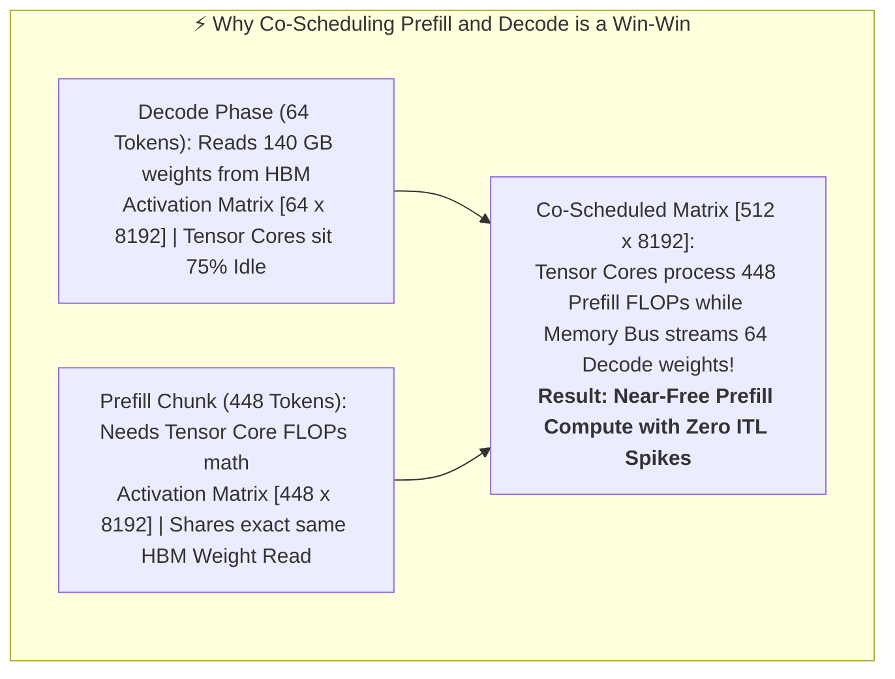

This core systems insight explains why Chunked Prefill and Co-Scheduling in vLLM is so powerful: **because single-token decode steps leave GPU Tensor Cores mostly idle waiting for memory bandwidth, co-scheduling a prefill chunk ($448$ tokens) alongside decode requests ($64$ tokens) utilizes those idle compute cycles during the exact same memory-streaming pass, evaluating prefill prompt tokens at near-zero incremental time cost**.

---

## Part 3: Execution Overhead Minimization: CUDA Graphs and Compiled Workflows

While memory bandwidth bounds GPU execution during single-token decoding, CPU-side execution overhead presents a distinct performance bottleneck at small batch sizes.

### 3.1 The CPU-GPU Host Overhead Bottleneck

Executing a single Transformer forward pass requires launching dozens of CUDA kernels per layer (RMSNorm, QKV projection, RoPE rotation, PagedAttention, SwiGLU Gate/Up/Down projections, Residual additions). For an 80-layer model like Llama 3 70B, a single forward pass executes **over 400 individual CUDA kernel launches**.

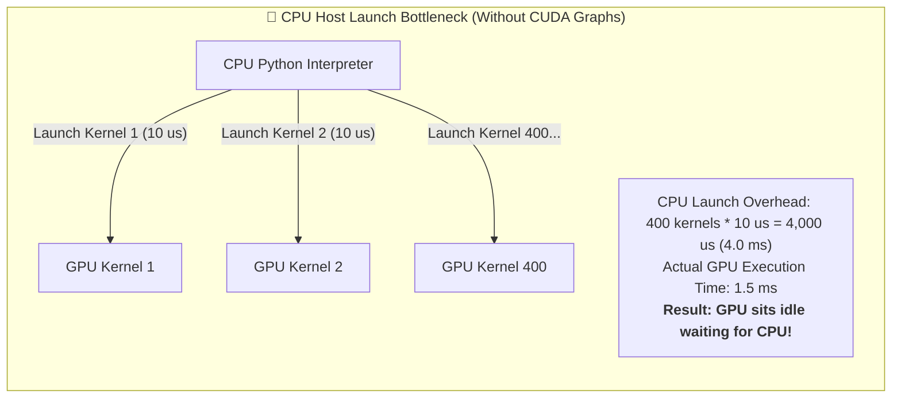

At small batch sizes ($b = 1 \dots 4$), GPU kernel execution time for a layer is extremely fast ($< 2 \ \mu\text{s}$). If CPU PyTorch launch overhead takes $10 \dots 15 \ \mu\text{s}$ per kernel, **the GPU spends over 70% of its time completely idle waiting for the CPU to issue the next launch command**.

---

### 3.2 CUDA Graph Capture and Replay Engine in vLLM

To eliminate CPU host launch overhead, vLLM integrates **CUDA Graphs** (`torch.cuda.graph`).

#### 1. How CUDA Graphs Work
During engine initialization, vLLM performs a warm-up phase that records the exact sequence of CUDA kernel launches, memory addresses, and execution dependencies into a static GPU execution graph.

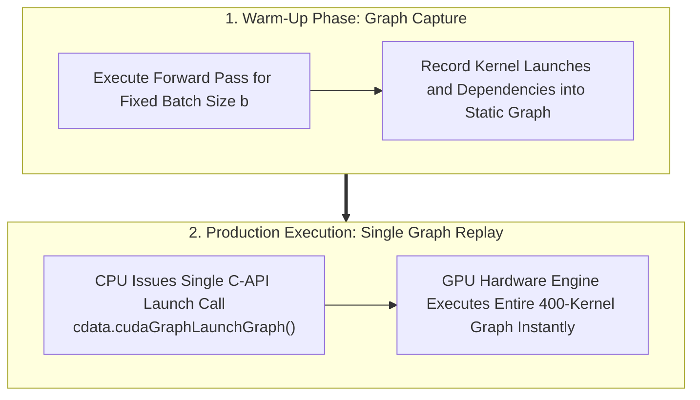

During production inference, the CPU does not execute Python code or launch individual PyTorch kernels. Instead, the CPU issues a **single `cudaGraphLaunch` C-API call ($\approx 3 \ \mu\text{s}$)**, handing full execution control over to the GPU's hardware engine.

#### 2. Fixed-Size Batch Bucketing and Static Input Buffers
CUDA Graphs require fixed memory addresses and fixed tensor shapes. Because active batch sizes fluctuate dynamically during continuous batching, vLLM maintains a pool of captured CUDA Graphs for discrete batch size buckets (e.g., $b \in \{1, 2, 4, 8, 16, 32, 64, 128\}$).

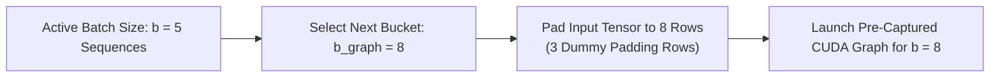

Before launching the CUDA Graph, vLLM copies input token IDs, block table pointers, and slot mapping indices into pre-allocated static GPU memory buffers using fast `in-place` memory operations (`copy_`), ensuring zero memory re-allocations during graph execution.

---

## Part 4: Speculative Decoding: Multi-Token Verification Pipelines

While CUDA Graphs eliminate CPU overhead, single-token decode passes remain memory-bandwidth bound. **Speculative Decoding** alters this trade-off by generating multiple candidate tokens per forward pass.

### 4.1 The Fundamental Principle of Speculative Decoding

Autoregressive decoding generates tokens one by one because each token depends on the previous token's hidden state. However, **verifying** a sequence of $K$ candidate tokens simultaneously requires only a single prefill-style forward pass across all $K$ tokens.

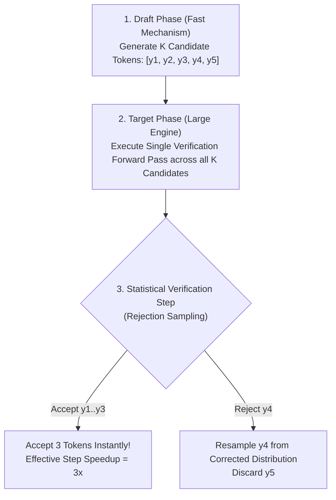

By leveraging the memory bandwidth efficiency of batched verification, Speculative Decoding generates $\gamma > 1$ accepted tokens per target model forward pass without altering the target model's output probability distribution.

#### Mathematical Distribution Preservation (Modified Rejection Sampling)
Let $q(x)$ be the draft model probability distribution and $p(x)$ be the target model probability distribution for token $x$.

For candidate token $x$:

1. Calculate acceptance probability:

$$
P(\text{accept } x) = \min\left(1, \frac{p(x)}{q(x)}\right)
$$

2. If $x$ is accepted, proceed to evaluate the next candidate token $x_{i+1}$.
3. If $x$ is rejected at index $i$, discard candidate tokens $x_i \dots x_K$, and sample a replacement token $x_i'$ from the adjusted distribution:

$$
p'(x) = \max\left(0, \frac{p(x) - q(x)}{1 - \sum_w \min(p(w), q(w))}\right)
$$

This sampling rule guarantees that the final output token distribution matches $p(x)$ exactly.

---

### 4.2 Speculative Architectures in vLLM

vLLM supports four primary speculative drafting mechanisms:

| Speculative Mechanism | Draft Generation Source | Parameter Overhead | Best Production Use Case |
| :--- | :--- | :--- | :--- |
| **Draft Model Speculation** | Separate small LLM (e.g., Llama-3-8B drafting for 70B) | Requires memory for draft model weights | High-concurrency servers with available GPU memory |
| **Medusa (Multi-Head)** | Extra linear prediction heads on top of Target model | $\sim 1\% \dots 2\%$ additional weights | Single-model setups wanting zero extra model loading |
| **EAGLE / EAGLE-2** | Lightweight Transformer layer processing hidden states | Low overhead ($\sim 2\% \dots 5\%$) | High token acceptance rates ($\gamma > 3.0$) across complex tasks |
| **Prompt Lookup (N-Gram)** | Heuristic string matching against input prompt | **Zero parameter overhead ($0 \text{ bytes}$)** | Summarization, document Q&A, and code editing |

---

### 4.3 Tree-Based Attention Verification Kernels

Rather than drafting a single linear candidate chain ($[y_1, y_2, y_3]$), advanced speculative algorithms (Medusa, EAGLE, Tree-Drafting) generate a **branching tree of candidate token paths**.

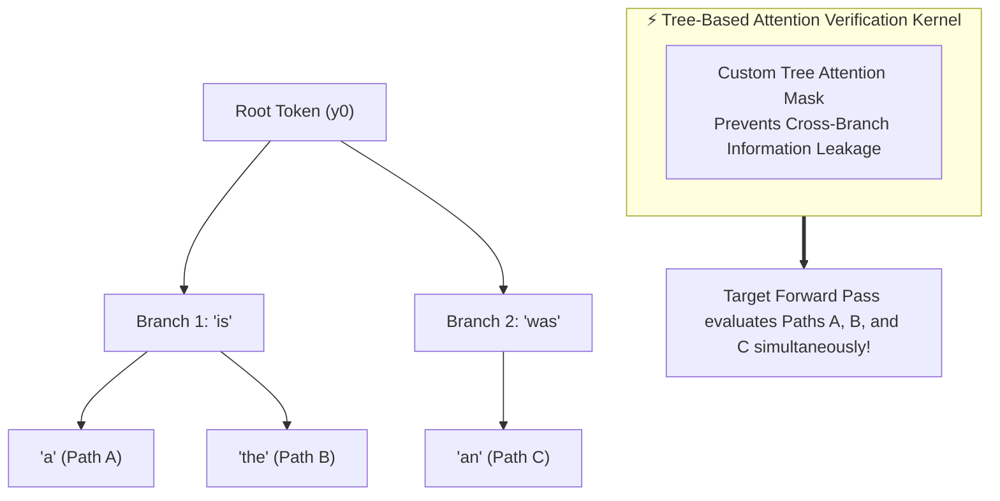

To verify candidate trees in a single forward pass without information leaking between non-ancestor branches, vLLM executes custom **Tree Attention Kernels**. The tree mask ensures that candidate token $y_{i, j}$ only attends to its exact causal ancestors in the candidate tree.

---

## Part 5: Quantization: Precision, Compression, and Kernel Engineering

Quantization compresses model weights and activation tensors from 16-bit floating point (`FP16` / `BF16`, 2 bytes per parameter) to 8-bit (`INT8` / `FP8`, 1 byte) or 4-bit (`INT4`, 0.5 bytes) representations.

### 5.1 Quantization Taxonomy in Production Inference

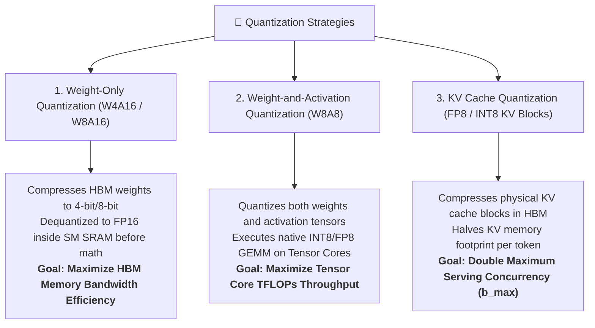

#### 1. Weight-Only Quantization (AWQ / GPTQ / Marlin)
In Weight-Only quantization (e.g., **AWQ - Activation-aware Weight Quantization**), weights are stored in HBM as 4-bit integers.

- **Storage Footprint**: Llama 3 70B compresses from $140 \text{ GB}$ (`FP16`) down to $\sim 35 \text{ GB}$ (`INT4`), enabling 70B model serving on a single GPU (e.g., NVIDIA H100 80GB or A100 80GB).
- **Execution Data Flow**: During matrix-vector multiplication ($y = x @ W$), weight tiles are transferred from HBM to SM SRAM at $4 \times$ higher bandwidth speed. Inside SRAM, fused CUDA kernels (e.g., **Marlin / AWQ kernels**) dequantize INT4 weights back to FP16 before executing multiplication on Tensor Cores.

#### 2. Weight-and-Activation Quantization (FP8 / W8A8)
Modern GPUs (NVIDIA Hopper H100/H200, Ada Lovelace) feature hardware **FP8 Tensor Cores**.

FP8 defines two 8-bit floating-point formats:

- **`E4M3` (1 sign bit, 4 exponent bits, 3 mantissa bits)**: Higher precision, used for weights and activation tensors.
- **`E5M2` (1 sign bit, 5 exponent bits, 2 mantissa bits)**: Broader dynamic range, used for gradients and long-range activation scaling.

Because both weights and activations reside in FP8, the GPU executes matrix multiplication natively using FP8 Tensor Core instructions, doubling peak compute capacity (up to **1,978 TFLOPs** on H100 SXM5).

---

### 5.2 KV Cache Quantization (FP8 / INT8 KV Blocks)

While weight quantization reduces model memory footprint, long-context serving remains bounded by KV cache memory capacity. vLLM supports **FP8 KV Cache Quantization** (`kv_cache_dtype="fp8"`).

#### 1. Physical Storage Transformation
In standard FP16 execution, each element of the Key and Value vectors requires 2 bytes. Under FP8 KV Caching, Key and Value vectors are quantized to 8-bit `E4M3` floats before being stored inside physical HBM blocks.

$$
\text{Physical_Block_Bytes}_{\text{FP8}} = \frac{\text{Physical_Block_Bytes}_{\text{FP16}}}{2}
$$

For Llama 3 70B with `block_size = 16`:

- **FP16 Block Size**: $5,242,880 \text{ bytes} \equiv \mathbf{5.00 \text{ MiB}}$
- **FP8 Block Size**: $2,621,440 \text{ bytes} \equiv \mathbf{2.50 \text{ MiB}}$

#### 2. Impact on Serving Concurrency
By halving the physical memory footprint of every block, the total number of available physical blocks in the free pool doubles:

$$
\text{Total_Available_Blocks}_{\text{FP8}} = 2 \times \text{Total_Available_Blocks}_{\text{FP16}}
$$

This doubles the maximum concurrent batch size ($b_{\text{max}}$) supported by the GPU without requiring additional hardware.

---

### 5.3 Quantitative Performance and Accuracy Trade-Off Matrix

| Quantization Method | Target Components | Precision | HBM Weight Size (70B Model) | Relative Inference Throughput | Perplexity Impact ($\Delta \text{PPL}$) | Hardware Requirement |
| :--- | :--- | :--- | :--- | :--- | :--- | :--- |
| **Unquantized (FP16/BF16)** | Weights, Activations, KV Cache | 16-bit Float | $140 \text{ GB}$ | $1.0\times$ (Baseline) | $0.00$ (Baseline) | Standard NVIDIA / AMD GPUs |
| **AWQ / Marlin (W4A16)** | Weights Only | 4-bit INT / 16-bit Act | **$35 \text{ GB (4x smaller)}$** | $2.2\times \dots 3.2\times$ | $< +0.10$ (Negligible) | Any Tensor Core GPU |
| **FP8 (W8A8 / E4M3)** | Weights and Activations | 8-bit Float | $70 \text{ GB}$ | **$2.5\times \dots 4.0\times$** | $< +0.05$ (Near-Zero) | NVIDIA Hopper / Ada Lovelace |
| **FP8 KV Cache** | KV Cache Blocks Only | 8-bit Float | $140 \text{ GB}$ (Weights) | **$2.0\times \text{ Max Concurrency}$** | $< +0.02$ (Imperceptible) | Ampere, Hopper, Ada Lovelace |

---

## Summary: The Integrated Performance Stack

Modern LLM serving performance relies on the synergistic co-design of software scheduling, host execution, vector verification, and memory quantization:

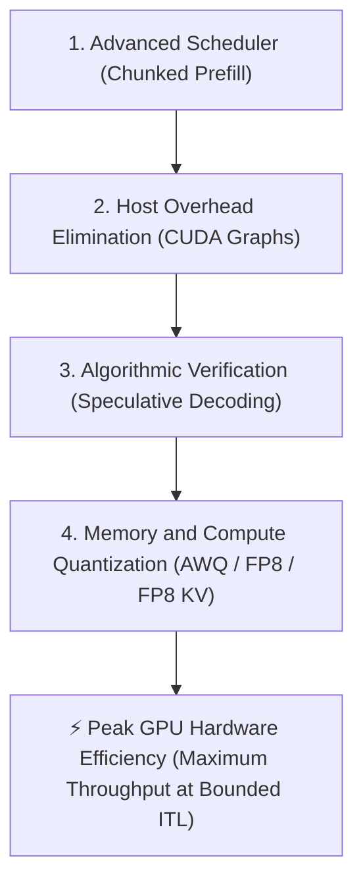

With **Module 3** complete, we transition to **Module 4: Hardware Interaction and Kernel Co-Design (`04_hardware_and_kernel_optimization.md`)**, where we examine GPU micro-architecture, SRAM tiling strategies, custom HIP/CUDA kernel implementation, and cross-hardware compilation backends.
