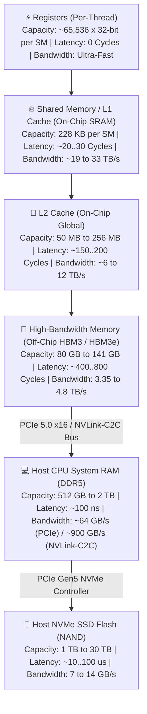
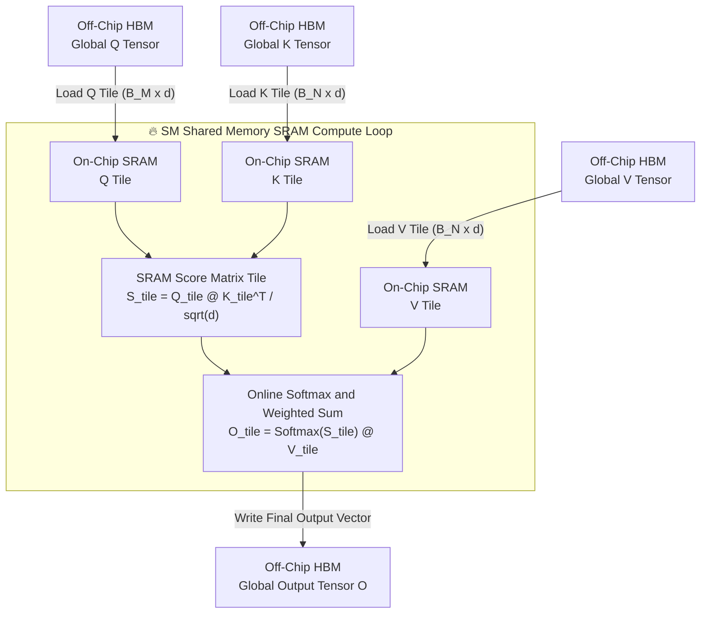
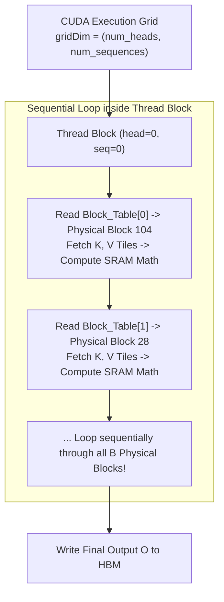
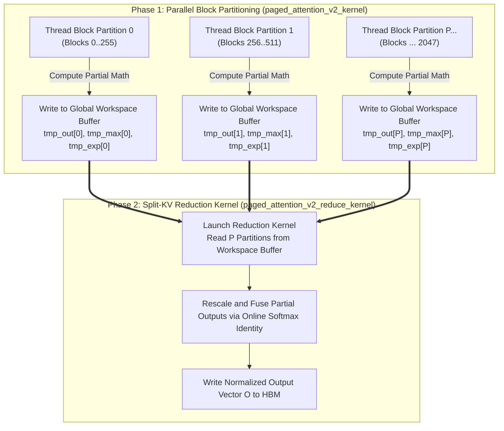
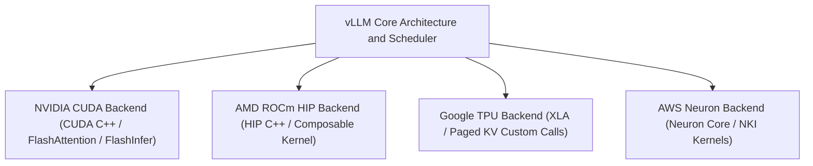

# Module 4: Hardware Interaction and Kernel Co-Design

High-performance LLM serving engines achieve peak efficiency through tight co-design between software algorithms and hardware micro-architecture. While high-level scheduling algorithms govern request lifecycles, execution speed ultimately depends on how efficiently CUDA/HIP kernels utilize **GPU Memory Hierarchy**, **SRAM Tiling**, **PagedAttention Kernel Mechanics (V1 vs. V2)**, and **Cross-Hardware Accelerator Backends**.

This module explores the hardware engineering principles underlying vLLM's custom kernel stack across NVIDIA GPUs, AMD ROCm accelerators, Google TPUs, and AWS Neuron hardware.

---

## Part 1: GPU Memory Hierarchy and Bandwidth Realities

To understand kernel optimization, hardware engineers model the full accelerator node as a multi-level storage pyramid. Memory locations differ drastically in **storage capacity**, **transfer bandwidth**, and **access latency**, extending from ultra-fast on-chip GPU registers all the way down to host CPU system RAM and NVMe SSD storage.

### 1.1 The Complete Accelerator Storage Pyramid

On a modern enterprise LLM node (e.g., NVIDIA H100 SXM5 server node):

| Memory Tier | Physical Location | Capacity (H100 Node) | Peak Bandwidth | Access Latency | Primary Serving Purpose |
| :--- | :--- | :--- | :--- | :--- | :--- |
| **Registers** | On-Chip (SM) | $256 \text{ KB}$ per SM | $> 100 \text{ TB/s}$ | $0 \text{ cycles}$ | Active thread scalar math & accumulators |
| **Shared Memory (SRAM)** | On-Chip (SM) | $228 \text{ KB}$ per SM | $\sim 33 \text{ TB/s}$ | $\sim 20 \dots 30 \text{ cycles}$ | SRAM tiling for $Q, K, V$ attention blocks |
| **L2 Cache** | On-Chip (Global) | $50 \text{ MB}$ | $\sim 12 \text{ TB/s}$ | $\sim 150 \dots 200 \text{ cycles}$ | Caching frequently accessed metadata & Block Tables |
| **HBM3 Memory** | Off-Chip (DRAM) | $80 \text{ GB}$ | $3.35 \text{ TB/s}$ | $\sim 400 \dots 800 \text{ cycles}$ | Active model weights & physical KV cache blocks |
| **CPU System RAM (DDR5)** | Host Motherboard | $512 \text{ GB} \dots 2 \text{ TB}$ | $\sim 64 \text{ GB/s}$ (PCIe 5.0) | $\sim 100 \text{ ns}$ | **vLLM CPU KV Cache Swapping** (`cpu_swap_space`) |
| **NVMe SSD Flash (NAND)** | PCIe NVMe Slot | $1 \text{ TB} \dots 30 \text{ TB}$ | $7 \dots 14 \text{ GB/s}$ | $10 \dots 100 \ \mu\text{s}$ | Cold-start weight loading & disk prefix cache |

---

### 1.2 The Memory Access Latency Penalty

When a CUDA thread block requests a data payload (e.g., a Key tile vector) that is not cached in SRAM or L2:

1. **Global HBM Request**: The Streaming Multiprocessor (SM) issues a global memory fetch command over the HBM memory bus.
2. **Stall Cycles**: The warp must wait $\sim 400 \dots 800 \text{ clock cycles}$ for data to travel from off-chip HBM into registers.
3. **Warp Scheduler Context Switching**: To prevent SM hardware idle time, the hardware warp scheduler context-switches to an alternate active warp. However, if all active warps are stalled waiting for HBM memory transfers, **the SM stalls completely**.

Kernel optimization minimizes HBM memory requests by staging matrix tiles inside **On-Chip Shared Memory (SRAM)** and maximizing tile reuse.

---

### 1.3 Beyond HBM: Host CPU RAM and NVMe SSD Storage Tiers

While high-speed computation takes place entirely inside GPU HBM and SRAM, vLLM utilizes the lower storage tiers (Host CPU System RAM and NVMe SSD Flash) for specialized memory management:

1. **Host CPU System RAM (DDR5) and KV Cache Swapping**:
   When GPU HBM is fully saturated under heavy preemption, vLLM's Block Manager does not discard active request KV blocks. Instead, it evacuates physical KV blocks from GPU HBM to Host CPU RAM via asynchronous CUDA transfers (`cudaMemcpyAsync`) over the PCIe 5.0 x16 bus ($\sim 64 \text{ GB/s}$). When GPU memory frees up, the blocks are swapped back to GPU HBM.
2. **Grace Hopper / Grace Blackwell (NVLink-C2C Integration)**:
   On unified architecture chips (e.g., NVIDIA GH200 / GB200), CPU System RAM and GPU HBM are connected via **NVLink-C2C** providing **$900 \text{ GB/s}$ bidirectional bandwidth**. This reduces CPU-GPU swapping latency by $> 14\times$ compared to standard PCIe Gen5.
3. **NVMe SSD Flash (NAND) and Disk Storage**:
   NAND Flash NVMe SSDs provide massive multi-terabyte capacity at $7 \dots 14 \text{ GB/s}$. vLLM uses NVMe Flash for **cold-start model weight loading** (streaming weights into HBM during startup via `safetensors`) and **persistent disk-level prefix caching** (storing static system prompt KV blocks across server restarts).

---

## Part 2: SRAM Tiling and Attention Kernel Mechanics

In standard Self-Attention ($A = \text{Softmax}(Q @ K^T / \sqrt{d}) @ V$), naive PyTorch implementations instantiate full $S \times S$ attention score matrices in global HBM memory.

For a sequence of length $S = 32,768$:

$$
\text{Memory}_{\text{naive_attn}} = S \times S \times \text{sizeof(float32)} = 32,768 \times 32,768 \times 4 \text{ bytes} \approx \mathbf{4.29 \text{ GB per head!}}
$$

Across 64 heads and 80 layers, naive attention requires terabytes of intermediate memory, causing memory overflow ($O(S^2)$ memory footprint).

### 2.1 FlashAttention Tiling Strategy

**FlashAttention** (Dao et al.) and **PagedAttention** overcome $O(S^2)$ memory explosion by tiling Query ($Q$), Key ($K$), and Value ($V$) tensors into small blocks that fit entirely inside **On-Chip SRAM ($228 \text{ KB}$)**.

#### Tiling Parameters
- $B_M$: Query tile block size along sequence dimension (typically $B_M = 64$ or $128$).
- $B_N$: Key/Value tile block size along sequence dimension (typically $B_N = 64$ or $128$).
- $d$: Head dimension ($d_{\text{head}} = 128$).

By executing matrix multiplication ($S_{\text{tile}} = Q_{\text{tile}} @ K_{\text{tile}}^T$) and weighted summation ($O_{\text{tile}} = P_{\text{tile}} @ V_{\text{tile}}$) entirely inside SRAM, **the $S \times S$ attention matrix is never materialized in global HBM memory**, reducing memory footprint from $O(S^2)$ to $O(S)$.

---

### 2.2 Numerical Stability: Online Softmax Recurrence

Standard Softmax requires two full passes over the input vector: Pass 1 to find global maximum $m = \max(x_i)$, and Pass 2 to compute normalization denominator $d = \sum e^{x_i - m}$.

To evaluate Softmax incrementally tile-by-tile inside SRAM without making multiple passes over HBM, attention kernels use **Online Softmax** (Rabe & Dong).

When transitioning from tile $j-1$ to tile $j$:

$$
m^{(j)} = \max\left(m^{(j-1)}, \tilde{m}^{(j)}\right)
$$

$$
l^{(j)} = l^{(j-1)} \cdot e^{m^{(j-1)} - m^{(j)}} + \tilde{l}^{(j)} \cdot e^{\tilde{m}^{(j)} - m^{(j)}}
$$

$$
O^{(j)} = O^{(j-1)} \cdot \left(\frac{l^{(j-1)} \cdot e^{m^{(j-1)} - m^{(j)}}}{l^{(j)}}\right) + \tilde{O}^{(j)} \cdot \left(\frac{e^{\tilde{m}^{(j)} - m^{(j)}}}{l^{(j)}}\right)
$$

Where:
- $m^{(j)}$: Running maximum logit score through tile $j$.
- $l^{(j)}$: Running sum of unnormalized exponentials through tile $j$.
- $O^{(j)}$: Running unnormalized attention output vector through tile $j$.

Online Softmax updates the running output vector $O^{(j)}$ in SRAM using a single forward pass over KV tiles!

---

## Part 3: PagedAttention CUDA Kernel Engineering (V1 vs. V2)

While FlashAttention assumes contiguous $K$ and $V$ tensors in HBM, **PagedAttention** accesses physical Key and Value blocks scattered across non-contiguous HBM addresses via `Block_Table` lookups.

### 3.1 PagedAttention V1 Kernel Architecture

In **PagedAttention V1** (`paged_attention_v1_kernel`), the CUDA kernel assigns **one thread block per query head per sequence**.

#### Limitations of PagedAttention V1
During autoregressive decoding at long context lengths (e.g., $S = 32,768$ tokens $\equiv 2,048$ physical blocks):

- Single-request decoding has batch size $b = 1$ or small batch sizes.
- A single thread block must loop sequentially through all $2,048$ physical blocks.
- **SM Wave Under-utilization**: The GPU grid contains very few thread blocks ($\text{gridDim} = h_q \times b = 64 \times 1 = 64 \text{ thread blocks}$). On an NVIDIA H100 SXM5 with 132 SMs, **over half of the GPU's hardware SMs sit completely idle** while a few active SMs loop sequentially through thousands of blocks!

---

### 3.2 PagedAttention V2 Architecture and Split-KV Reduction

To eliminate SM wave under-utilization during long-context decoding, vLLM engineered **PagedAttention V2 (`paged_attention_v2_kernel` + Split-KV Reduction)**.

PagedAttention V2 parallelizes attention evaluation *along the sequence length dimension* by partitioning physical blocks across multiple parallel thread blocks.

#### Step 1: Parallel Block Partitioning
The scheduler sets a partition size parameter `partition_size` (typically 256 or 512 tokens per partition).

$$
N_{\text{partitions}} = \left\lceil \frac{\text{seq_len}}{\text{partition_size}} \right\rceil
$$

The CUDA grid size expands along the partition dimension ($\text{gridDim} = h_q \times b \times N_{\text{partitions}}$). For a 32K context sequence, $N_{\text{partitions}} = 32,768 / 256 = 128$ parallel thread blocks.

Instead of 64 thread blocks, the grid launches $64 \times 128 = 8,192$ parallel thread blocks, **fully saturating all 132 SMs on the GPU**!

#### Step 2: Global Workspace Intermediate Staging
Each parallel partition thread block evaluates its assigned subset of physical blocks and writes three partial arrays to a temporary global HBM workspace buffer:

1. `tmp_output[partition_idx]`: Unnormalized partial attention output vector $O_{\text{part}}$.
2. `tmp_max_logits[partition_idx]`: Maximum logit score $m_{\text{part}}$ within partition.
3. `tmp_exp_sums[partition_idx]`: Unnormalized exponential sum $l_{\text{part}}$ within partition.

#### Step 3: Split-KV Reduction Kernel (`paged_attention_v2_reduce_kernel`)
Immediately following Phase 1, a lightweight reduction CUDA kernel launches.

For each sequence head, the reduction kernel reads the $N_{\text{partitions}}$ partial vectors from the global workspace buffer, finds the global maximum logit $m_{\text{global}} = \max(m_{\text{part}, p})$, rescales partial outputs using the Online Softmax identity:

$$
\text{Scale}_p = e^{m_{\text{part}, p} - m_{\text{global}}}
$$

$$
l_{\text{global}} = \sum_{p=1}^{N_{\text{partitions}}} l_{\text{part}, p} \cdot \text{Scale}_p
$$

$$
O_{\text{final}} = \frac{\sum_{p=1}^{N_{\text{partitions}}} O_{\text{part}, p} \cdot l_{\text{part}, p} \cdot \text{Scale}_p}{l_{\text{global}}}
$$

And writes the exact, normalized attention vector $O_{\text{final}}$ to global memory.

#### Performance Impact
PagedAttention V2 increases long-context decoding speed by **$2.0\times \dots 5.0\times$** by converting sequential block loops into massive parallel SM execution!

---

## Part 4: Advanced Accelerator Backends and Cross-Hardware Engines

While CUDA powers NVIDIA GPUs, vLLM features a modular backend architecture supporting **AMD ROCm (HIP)**, **Google TPUs**, and **AWS Neuron**.

---

### 4.1 AMD ROCm (HIP) Execution Engine

AMD Instinct GPUs (MI250, MI300X) execute code via the **AMD ROCm** open software stack and **HIP** programming language.

#### Micro-Architecture Differences: Wavefronts vs. Warps
- **NVIDIA CUDA**: Executes threads in groups of 32 called **Warps**.
- **AMD ROCm (CDNA Architecture)**: Executes threads in groups of 64 called **Wavefronts** (`wave64`).

#### Kernel Adaptations in vLLM ROCm (`vllm._C` / HIP)
1. **Wavefront Alignment**: Shared memory reduction trees and warp shuffle instructions (`__shfl_xor_sync`) inside PagedAttention are rewritten for 64-thread wavefront execution using HIP intrinsics (`__shfl_xor`).
2. **AMD Composable Kernel (CK)**: vLLM integrates AMD's Composable Kernel library to achieve optimized GEMM matrix multiplication on MI300X **Matrix Core Units**, matching FP16 and FP8 execution throughput.
3. **MI300X Memory Bandwidth Advantage**: With $192 \text{ GB}$ of HBM3 memory providing **$5.3 \text{ TB/s}$ memory bandwidth**, MI300X handles larger KV cache block pools directly in global memory.

---

### 4.2 Google TPU Acceleration Backend (XLA)

Google Tensor Processing Units (TPUs v4, v5e, v5p, Trillium) operate on a fundamentally different execution model governed by the **XLA (Accelerated Linear Algebra) compiler**.

#### Architecture Differences: Systolic Arrays vs. SIMT Cores
- **GPUs (SIMT)**: Compute matrix multiplication using thousands of independent thread cores.
- **TPUs (Systolic Array / MXU)**: Compute matrix multiplication using specialized **Matrix Execution Units (MXU)** that stream activations through static 2D grid ALU arrays.

#### PagedAttention Adaptation in XLA
Because XLA requires static tensor shapes at compile time:

1. **Paged KV Custom Calls**: vLLM integrates with Google's XLA PagedAttention custom calls (`vllm-tpu` backend).
2. **Static Block Table Padding**: Block tables and physical KV blocks are padded to fixed TPU memory strides (typically block size $16$ or $32$).
3. **XLA Graph Compilation**: Transformer layer execution is compiled into unified XLA HLO graphs, eliminating host overhead and maximizing MXU matrix multiplication throughput.

---

### 4.3 AWS Neuron Engine (Inferentia2 & Trainium)

AWS Inferentia2 (`inf2`) and Trainium (`trn1`) instances utilize custom **Neuron Cores** managed by the `aws-neuron-sdk`.

#### Neuron Kernel Integration (NKI)
1. **Neuron Core Architecture**: Each Neuron Core contains a Tensor Engine (matrix math), Vector Engine, and Scalar Engine linked to $32 \text{ GB}$ of high-bandwidth memory.
2. **Neuron Kernel Interface (NKI)**: vLLM leverages AWS NKI to write custom PagedAttention block lookup kernels that execute directly on Neuron Core Vector and Tensor engines.
3. **Collective Communication**: Inter-core communication for Tensor Parallelism is executed across dedicated **NeuronLink** ring interconnects.

---

## Summary: Hardware Backend Capabilities Matrix

| Hardware Platform | Primary Architecture | SIMD Unit | Peak Memory Bandwidth | Primary PagedAttention Implementation |
| :--- | :--- | :--- | :--- | :--- |
| **NVIDIA Hopper (H100/H200)** | GPU (Hopper / Ada) | Warp (32 Threads) | $3.35 \dots 4.8 \text{ TB/s}$ | PagedAttention V2 (CUDA C++) / FlashInfer |
| **AMD Instinct (MI300X)** | GPU (CDNA 3) | Wavefront (64 Threads) | **$5.3 \text{ TB/s}$** | PagedAttention (HIP C++) / Composable Kernel |
| **Google TPU (v5p / Trillium)** | Systolic Array (MXU) | Vector / MXU Tile | High HBM | XLA Paged KV Custom Calls |
| **AWS Trainium / Inferentia2** | Neuron Core | Tensor / Vector Engine | $820 \text{ GB/s}$ | AWS NKI Custom PagedAttention Kernels |

With **Module 4** complete, we transition to **Module 5: Distributed Parallelism (`05_distributed_parallelism.md`)**, where we explore how vLLM partitions massive frontier models across multiple GPUs and multi-node clusters using **Tensor Parallelism (Megatron-LM)**, **Pipeline Parallelism**, **Context Parallelism (Ring-Attention)**, and **Expert Parallelism (MoE Routing)**.
