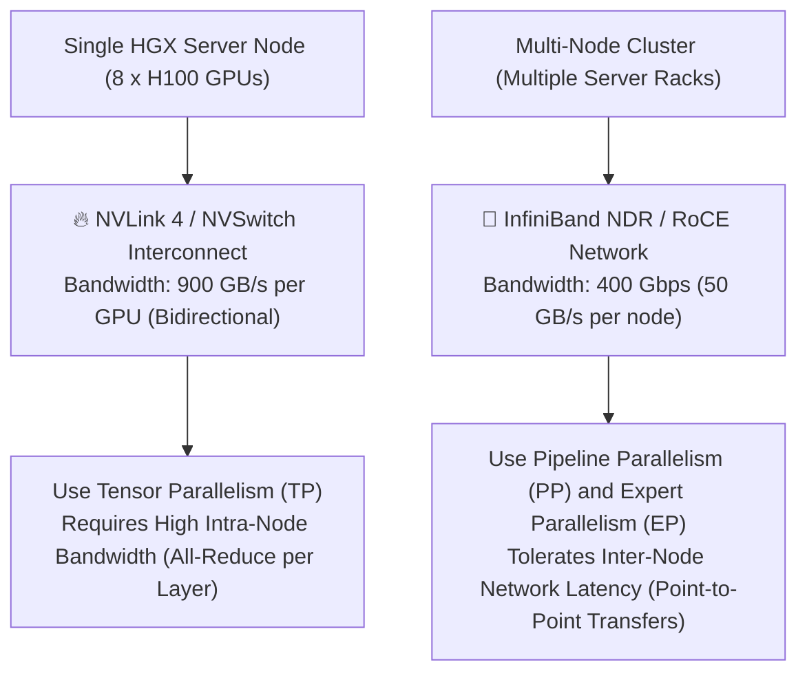
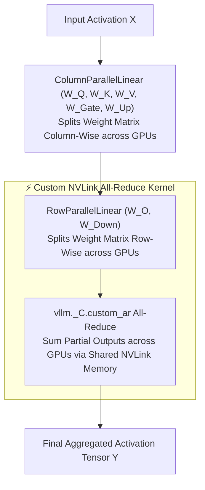
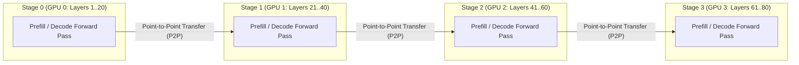
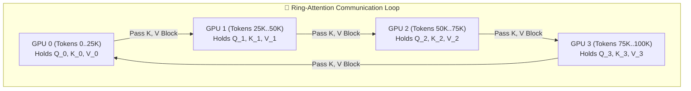
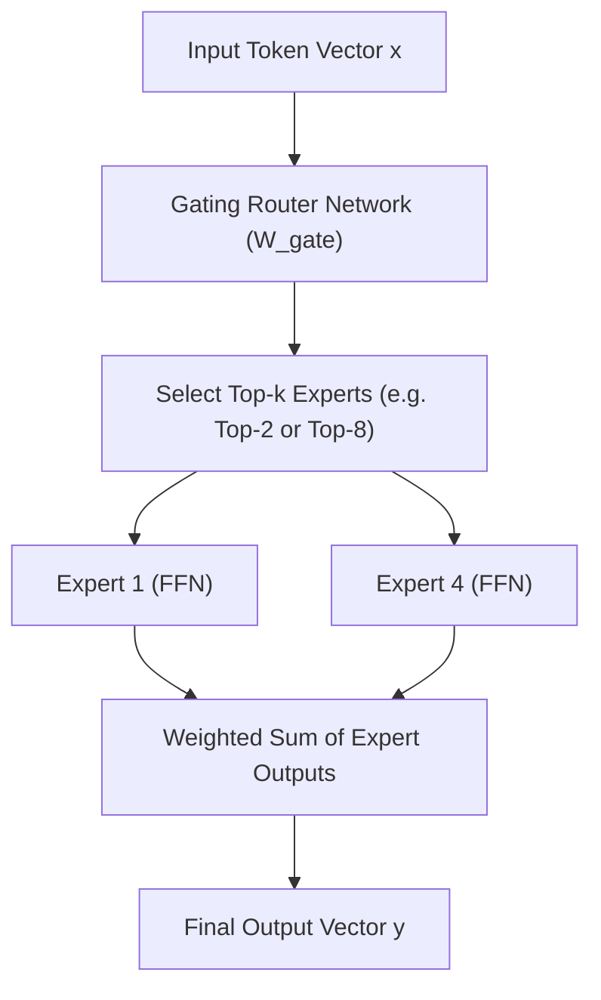
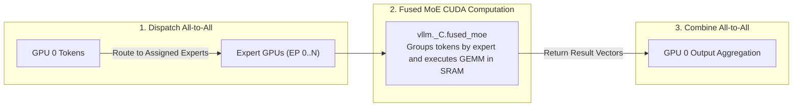

# Module 5: Distributed Parallelism and Multi-GPU Orchestration

As frontier LLMs scale to hundreds of billions of parameters (e.g., Llama 3 405B, DeepSeek-V3 671B), single-GPU memory and compute capacity are easily exceeded. High-throughput serving engines like vLLM partition model execution across multiple GPUs and multi-node clusters using **Distributed Parallelism**.

This module explores the four fundamental dimensions of distributed LLM serving: **Tensor Parallelism (TP)**, **Pipeline Parallelism (PP)**, **Context Parallelism (CP)**, and **Expert Parallelism (EP)** for Mixture-of-Experts (MoE) models.

---

## Part 1: Distributed Serving Taxonomy and Interconnect Constraints

To partition a model effectively, systems engineers match distributed parallelism strategies to the physical **hardware interconnect bandwidth** of the host cluster.

### 1.1 The Interconnect Bandwidth Gap

| Interconnect Level | Physical Technology | Bidirectional Bandwidth | Latency | Optimal Parallelism Strategy |
| :--- | :--- | :--- | :--- | :--- |
| **Intra-Node (SXM)** | NVIDIA NVLink 4 / NVSwitch | **$900 \text{ GB/s}$ per GPU** | $< 1 \ \mu\text{s}$ | **Tensor Parallelism (TP)** |
| **Intra-Node (PCIe)** | PCIe Gen5 x16 Bus | $64 \text{ GB/s}$ | $\sim 2 \dots 3 \ \mu\text{s}$ | Small Tensor Parallelism ($\text{TP} \le 4$) |
| **Inter-Node (RDMA)** | InfiniBand NDR / RoCE v2 | $50 \text{ GB/s}$ ($400 \text{ Gbps}$) | $\sim 5 \dots 10 \ \mu\text{s}$ | **Pipeline Parallelism (PP) & Expert Parallelism (EP)** |

---

### 1.2 Summary of Distributed Parallelism Dimensions

1. **Tensor Parallelism (TP)**: Splits individual weight matrices ($W_Q, W_K, W_V, W_O, W_{\text{Gate}}, W_{\text{Up}}, W_{\text{Down}}$) across GPUs inside a single node. Requires an **All-Reduce** communication step twice per Transformer layer.
2. **Pipeline Parallelism (PP)**: Partitions sequential Transformer layers across GPUs or server nodes (e.g., GPU 0 holds Layers 1-20, GPU 1 holds Layers 21-40). Communicates activation tensors via point-to-point transfers.
3. **Context Parallelism (CP)**: Partitions the sequence dimension (context length) across GPUs for massive $100K+$ context windows, using Ring-Attention or All-to-All communication.
4. **Expert Parallelism (EP)**: Distributes sparse Mixture-of-Experts (MoE) expert layers across GPUs, routing tokens dynamically via **All-to-All** communication primitives.

---

## Part 2: Tensor Parallelism (TP) Mechanics in vLLM

Tensor Parallelism in vLLM follows the **Shoeybi et al. (Megatron-LM)** matrix column/row splitting paradigm, enabling linear tensor operations to execute in parallel without intermediate communication overhead until output aggregation.

### 2.1 ColumnParallelLinear and RowParallelLinear

To understand how Tensor Parallelism works, consider a Transformer layer processing an input sequence of length $S$ tokens (where $S$ is the **Sequence Length**, e.g. $S = 512$). The input activation tensor $X$ has shape $[S, d]$ (e.g., $[512, 8192]$).

A Transformer block consists of two distinct sub-layers, each requiring **exactly ONE All-Reduce communication step** at its end:
1. **Self-Attention Sub-Layer**: Column-Parallel ($W_Q, W_K, W_V$) $\to$ Attention $\to$ Row-Parallel ($W_O$) $\to$ **All-Reduce #1**.
2. **MLP / SwiGLU Sub-Layer**: Column-Parallel ($W_{\text{Gate}}, W_{\text{Up}}$) $\to$ SwiGLU Activation $\to$ Row-Parallel ($W_{\text{Down}}$) $\to$ **All-Reduce #2**.

---

#### 1. Step 1: ColumnParallelLinear ($W_{\text{Gate}}, W_{\text{Up}}$)
In SwiGLU FFN, the un-split matrices $W_{\text{Gate}}$ and $W_{\text{Up}}$ have shape $[d, d_{\text{ffn}}]$ (e.g., $[8192, 28672]$). 

Under Column Parallelism across $N_{\text{TP}} = 4$ GPUs, each weight matrix is split along its **columns** (the output feature dimension $d_{\text{ffn}}$) into 4 vertical slices:

$$
W_{\text{Gate}} = \begin{bmatrix} W_{\text{Gate}, 0} & W_{\text{Gate}, 1} & W_{\text{Gate}, 2} & W_{\text{Gate}, 3} \end{bmatrix}, \quad \text{where } W_{\text{Gate}, i} \in \mathbb{R}^{d \times \frac{d_{\text{ffn}}}{N_{\text{TP}}}} \ \left[8192, 7168\right]
$$

On **GPU 0**, the local multiplication yields intermediate activation $H_0$:

$$
H_0 = \text{SiLU}(X @ W_{\text{Gate}, 0}) \odot (X @ W_{\text{Up}, 0}) \implies [512, 8192] \times [8192, 7168] = \mathbf{[512, 7168]}
$$

- **Shape of $H_0$ on GPU 0**: $[S, \frac{d_{\text{ffn}}}{N_{\text{TP}}}] = [512, 7168]$ (columns $0 \dots 7167$).
- **Shape of $H_1$ on GPU 1**: $[S, \frac{d_{\text{ffn}}}{N_{\text{TP}}}] = [512, 7168]$ (columns $7168 \dots 14335$).
- **Communication after Step 1**: **ZERO!** Each GPU computes its local column slice $H_i$ independently.

---

#### 2. Step 2: RowParallelLinear ($W_{\text{Down}}$)
The down-projection matrix $W_{\text{Down}}$ has un-split shape $[d_{\text{ffn}}, d]$ (e.g., $[28672, 8192]$).

Under Row Parallelism across $N_{\text{TP}} = 4$ GPUs, $W_{\text{Down}}$ is split along its **rows** (the input feature dimension $d_{\text{ffn}}$) into 4 horizontal slices:

$$
W_{\text{Down}} = \begin{bmatrix} W_{\text{Down}, 0} \\ W_{\text{Down}, 1} \\ W_{\text{Down}, 2} \\ W_{\text{Down}, 3} \end{bmatrix}, \quad \text{where } W_{\text{Down}, i} \in \mathbb{R}^{\frac{d_{\text{ffn}}}{N_{\text{TP}}} \times d} \ \left[7168, 8192\right]
$$

**Why does this pair perfectly with Step 1 without communication between Step 1 and Step 2?**
- Notice the number of rows of $W_{\text{Down}, 0}$ on GPU 0: **it has $7,168$ rows!**
- Notice the number of columns of $H_0$ produced by Step 1 on GPU 0: **it has $7,168$ columns!**
- $\text{Columns of } H_0 \ (7,168) \equiv \text{Rows of } W_{\text{Down}, 0} \ (7,168)$.
- Therefore, GPU 0 multiplies $H_0 @ W_{\text{Down}, 0}$ **directly in local GPU memory without fetching any data from GPU 1, 2, or 3**:

$$
Y_0 = H_0 @ W_{\text{Down}, 0} \implies [512, 7168] \times [7168, 8192] = \mathbf{[512, 8192]}
$$

---

#### 3. Mathematical Proof of Block Matrix Multiplication and All-Reduce
By standard linear algebra block matrix multiplication, multiplying full $H = [H_0 \mid H_1 \mid H_2 \mid H_3]$ against full $W_{\text{Down}} = \begin{bmatrix} W_{\text{Down}, 0} \\ W_{\text{Down}, 1} \\ W_{\text{Down}, 2} \\ W_{\text{Down}, 3} \end{bmatrix}$ equals:

$$
H @ W_{\text{Down}} = \begin{bmatrix} H_0 & H_1 & H_2 & H_3 \end{bmatrix} @ \begin{bmatrix} W_{\text{Down}, 0} \\ W_{\text{Down}, 1} \\ W_{\text{Down}, 2} \\ W_{\text{Down}, 3} \end{bmatrix} = \mathbf{H_0 @ W_{\text{Down}, 0} + H_1 @ W_{\text{Down}, 1} + H_2 @ W_{\text{Down}, 2} + H_3 @ W_{\text{Down}, 3}}
$$

Each GPU $i$ computes its partial matrix product $Y_i = H_i @ W_{\text{Down}, i} \in [S, d]$ locally.
Then, a single **All-Reduce (Sum)** aggregates $Y_0 + Y_1 + Y_2 + Y_3$ across the 4 GPUs to produce the final output tensor $Y \in [S, d]$.

#### Summary of Communication Per Transformer Layer:
- **Total All-Reduces per Layer**: **2 All-Reduces** (1 at the end of the Self-Attention sub-layer after $W_O$, and 1 at the end of the MLP sub-layer after $W_{\text{Down}}$).
- **Communication between Column-Parallel and Row-Parallel**: **ZERO** (because output columns of Step 1 match input rows of Step 2).

---

#### GPU Weight Partitioning Across All Layers
Suppose Tensor Parallelism size is $N_{\text{TP}} = 4$:
- **GPU 0** holds slice $W_0^{(l)}$ for **EVERY single layer** $l \in [1 \dots L]$ across the entire model.
- **GPU 1** holds slice $W_1^{(l)}$ for **EVERY single layer** $l \in [1 \dots L]$ across the entire model.
- **GPU 2** holds slice $W_2^{(l)}$ for **EVERY single layer** $l \in [1 \dots L]$ across the entire model.
- **GPU 3** holds slice $W_3^{(l)}$ for **EVERY single layer** $l \in [1 \dots L]$ across the entire model.

For example, on Llama 3 70B (80 layers, 64 Q heads, 8 KV heads, $d = 8192$, $d_{\text{ffn}} = 28,672$):
- For Layer $l$'s $W_Q$: GPU 1 holds 16 Query heads (heads $16 \dots 31$).
- For Layer $l$'s $W_O$: GPU 1 holds rows $2048 \dots 4095$ out of 8192 rows.
- For Layer $l$'s $W_{\text{Gate}}$: GPU 1 holds columns $7168 \dots 14335$ out of 28,672 columns.
- For Layer $l$'s $W_{\text{Down}}$: GPU 1 holds rows $7168 \dots 14335$ out of 28,672 rows.
- This exact slice assignment repeats systematically across **all 80 layers** of the network.

---

### 2.2 Custom NVLink All-Reduce Kernels (`vllm._C.custom_ar`)

In PyTorch, standard `torch.distributed.all_reduce` invokes NCCL, which incurs kernel launch overhead and IPC synchronization latency ($\sim 10 \dots 15 \ \mu\text{s}$).

To eliminate NCCL host overhead for intra-node NVLink transfers, vLLM implements custom CUDA All-Reduce kernels (`vllm._C.custom_ar`):

1. **Shared NVLink IPC Buffer**: During engine initialization, vLLM registers static POSIX shared memory pointers across all intra-node GPUs over NVLink.
2. **Single-Kernel All-Reduce**: When `RowParallelLinear` completes, a single custom CUDA kernel executes across all GPUs simultaneously, reading partial tensors directly from peer GPU HBM over NVLink and performing the summation in-place.
3. **Latency Reduction**: Reduces All-Reduce communication latency from $15 \ \mu\text{s}$ down to **$< 2.5 \ \mu\text{s}$**, maximizing Tensor Core compute efficiency!

---

## Part 3: Pipeline Parallelism (PP) and Context Parallelism (CP)

When a model's memory footprint exceeds a single node's NVLink capacity (e.g. Llama 3 405B requiring $810 \text{ GB}$ in FP16), **Pipeline Parallelism (PP)** partitions layers across multiple node boundaries.

### 3.1 Pipeline Parallelism Mechanics

Pipeline Parallelism partitions the $L$ Transformer layers into contiguous stage groups across $N_{\text{PP}}$ GPUs/nodes (e.g., $N_{\text{PP}} = 4$ for an 80-layer model $\implies 20$ layers per stage).

#### Communication Efficiency
Unlike Tensor Parallelism (which requires 2 All-Reduces per layer), Pipeline Parallelism requires only **1 Point-to-Point (P2P) activation transfer between stage boundaries**. This minimal network payload allows PP to run efficiently over inter-node InfiniBand / RoCE links ($50 \text{ GB/s}$).

---

### 3.2 Context Parallelism (CP) and Ring-Attention

For extreme long-context workloads ($S > 100,000$ tokens), a single GPU cannot store the physical KV cache blocks for the entire sequence even with PagedAttention.

**Context Parallelism (CP)** partitions the sequence length dimension $S$ across $N_{\text{CP}}$ GPUs using **Ring-Attention** (Liu et al.):

1. Each GPU $i$ holds a slice of Query tokens $Q_i$ and a slice of Key/Value tokens $K_i, V_i$.
2. While GPU $i$ computes partial SRAM attention between $Q_i$ and local $K_i, V_i$, it asynchronously streams its $K_i, V_i$ blocks to the next GPU in a ring topology.
3. Over $N_{\text{CP}}$ ring steps, every GPU evaluates full attention over all sequence tiles without any single GPU holding the complete KV cache in memory!

---

## Part 4: Expert Parallelism (EP) for Mixture-of-Experts (MoE)

Modern frontier models like **DeepSeek-V3 / DeepSeek-R1** (671 Billion total parameters, 37 Billion active parameters per token) and **Mixtral 8x22B** utilize **Mixture-of-Experts (MoE)** architectures.

In an MoE Transformer layer, dense Feed-Forward Networks (FFNs) are replaced by a **Router / Gating Network** and $N_{\text{experts}}$ parallel Expert networks.

### 4.1 MoE Top-k Routing Mechanics

For each token $x$, a router network computes softmax probabilities over all experts and selects the **Top-$k$** highest scoring experts (e.g. top-2 for Mixtral, top-8 for DeepSeek-V3):

$$
g(x) = \text{TopK}\left(\text{Softmax}(x @ W_{\text{gate}})\right)
$$

$$
y = \sum_{i \in \text{TopK}} g(x)_i \cdot \text{Expert}_i(x)
$$

---

### 4.2 Expert Parallelism (EP) and Fused MoE Kernels

In large MoE models with 64 or 256 total experts (e.g. DeepSeek-V3 with 256 routing experts across 8 nodes):

1. **Expert Distribution (EP)**: Experts are distributed evenly across GPUs ($N_{\text{experts}} / N_{\text{GPUs}}$ experts per GPU).
2. **All-to-All Communication (`all_to_all_single`)**:
   - **Dispatch Pass**: Tokens are routed to the specific GPUs holding their assigned Top-$k$ experts using an `All-to-All` network transfer.
   - **Combine Pass**: After expert GPUs compute FFN math, output vectors are transferred back to the origin GPUs via a second `All-to-All` network transfer.

#### Fused MoE CUDA Kernels (`vllm._C.fused_moe`)
Executing individual GEMMs for scattered token subsets causes massive CPU launch overhead and GPU fragmentation. vLLM implements custom **Fused MoE CUDA Kernels (`fused_moe`)**:

- **Token Sorting**: The kernel sorts and groups all tokens in SRAM by their target expert ID.
- **Batched GEMM Execution**: Executes a single grouped GEMM CUDA launch that processes all expert workloads simultaneously without returning to the CPU, maximizing Tensor Core compute efficiency!

---

## Summary: Parallelism Strategy Decision Matrix

| Model Architecture / Size | Recommended Parallelism Setup | Primary Communication Primitives | Target Hardware Topology |
| :--- | :--- | :--- | :--- |
| **Medium Models (7B - 70B)** | $\text{TP} = 2 \dots 8$, $\text{PP} = 1$ | All-Reduce (`vllm._C.custom_ar`) | Single HGX Node (NVLink) |
| **Large Dense Models (405B)** | $\text{TP} = 8$, $\text{PP} = 8 \dots 16$ | All-Reduce (Intra-Node) + P2P (Inter-Node) | Multi-Node NVLink + InfiniBand |
| **Extreme Long Context (100K+)** | $\text{TP} = 8$, $\text{CP} = 4 \dots 8$ | Ring-Attention (Async P2P / All-to-All) | Multi-Node High-Bandwidth Network |
| **Massive MoE (DeepSeek / Mixtral)** | $\text{TP} = 8$, $\text{EP} = 8 \dots 64$ | All-to-All (`all_to_all_single`) + Fused MoE | Multi-Node Cluster with InfiniBand RDMA |

With **Module 5** complete, we advance to **Module 6: Production Deployment and Cloud Orchestration (`06_deployment_and_orchestration.md`)**, where we explore OpenAI API server architecture, Ray Core actor clusters, Kubernetes deployments (NVIDIA GPU Operator, `/dev/shm` IPC sizing), and KEDA autoscaling.
