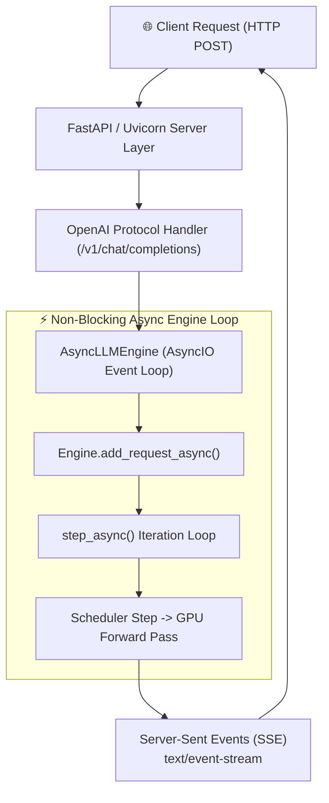
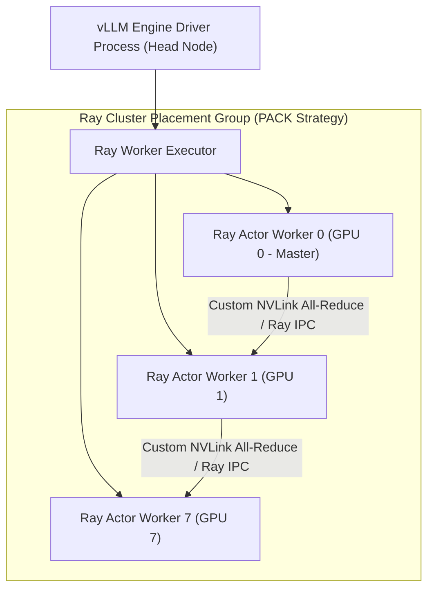
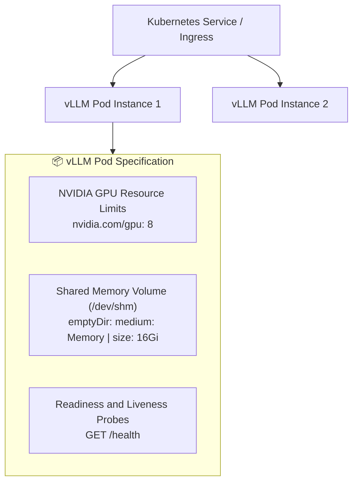
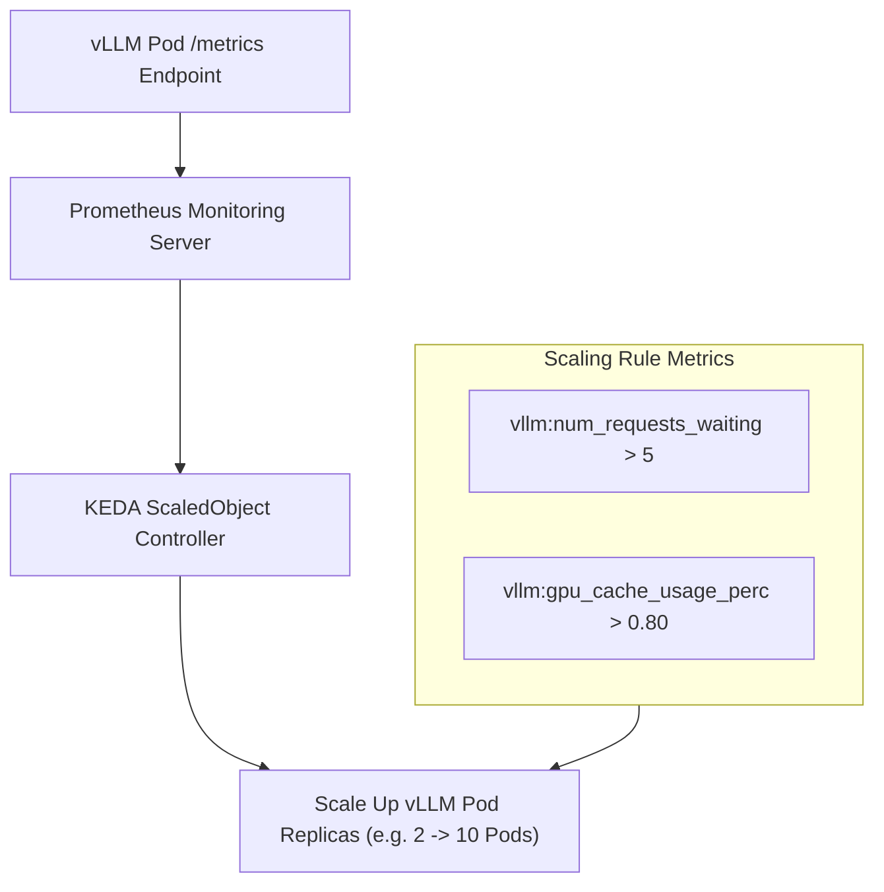
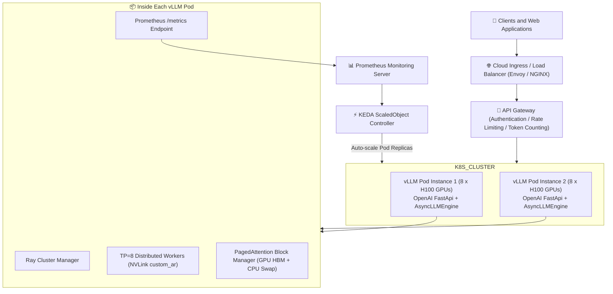

# Module 6: Production Deployment, Cloud Orchestration, and Observability

Moving a high-performance LLM engine from a single local GPU server to enterprise-grade production requires robust deployment, cloud orchestration, and real-time observability. Production LLM serving endpoints must deliver low-latency API response streaming, scale elastically under fluctuating traffic spikes, isolate hardware failures gracefully, and expose detailed operational metrics for autoscaling.

This module explores the production engineering architecture of vLLM, covering the **OpenAI API Server Architecture**, **Ray Distributed Clusters**, **Kubernetes Pod Deployment Best Practices**, **Prometheus Metrics and KEDA Autoscaling**, and a **Complete Production Reference Architecture**.

---

## Part 1: OpenAI API Server and Async Engine Architecture

vLLM provides an enterprise-ready HTTP server compatible with the **OpenAI API specification** (`vllm.entrypoints.openai.api_server`), supporting streaming endpoints for text completions (`/v1/completions`) and chat completions (`/v1/chat/completions`).



### 1.1 Non-Blocking `AsyncLLMEngine` Architecture

To serve thousands of concurrent HTTP clients simultaneously without blocking the CPU, vLLM decouples HTTP request handling from GPU inference using **`AsyncLLMEngine`**:

1. **AsyncIO Event Loop**: The HTTP server runs on Python's `asyncio` event loop. When a client sends a JSON payload, FastAPI parses the input and forwards it to `AsyncLLMEngine.add_request_async()`.
2. **Request Queueing**: Requests are pushed into an asynchronous queue (`AsyncStream`) and mapped to a unique request ID.
3. **Background Worker Loop (`step_async()`)**: A background task executes a continuous `while` loop calling `engine.step_async()`. In each iteration step, the scheduler selects active requests, launches the batched GPU forward pass, and streams generated token IDs back to individual client response generators.
4. **Server-Sent Events (SSE) Streaming**: As new tokens are generated in each GPU step, the API server formats them into `text/event-stream` chunks (`data: {"choices": [{"delta": {"content": "..."}}]}`) and streams them back to clients over HTTP instantly.

---

## Part 2: Multi-Node Distributed Cluster Orchestration with Ray Core

When running multi-GPU or multi-node distributed serving (e.g. Tensor Parallelism $\text{TP} = 8$ across 4 nodes), vLLM uses **Ray Core** (`vllm.engine.ray_utils`) to orchestrate worker processes.



### 2.1 Ray Actor Placement Groups

To ensure multi-GPU worker processes achieve physical locality and high NVLink bandwidth:

1. **Ray Actors**: vLLM wraps each GPU worker in a **Ray Actor** (`Worker` class). Each actor runs on a dedicated GPU.
2. **Placement Groups (`PACK` Strategy)**: vLLM requests Ray Placement Groups with the `PACK` bundles strategy, forcing Ray to pack GPU worker actors onto the same physical server node before spreading across nodes.
3. **PyTorch Distributed Initialization**: Once Ray actors are instantiated, Ray initializes `torch.distributed` process groups across the actors, enabling direct low-latency NVLink and InfiniBand transfers (`vllm._C.custom_ar`).

---

## Part 3: Kubernetes Production Deployment Best Practices

In enterprise cloud environments (GKE, EKS, AKS), vLLM instances are deployed as **Kubernetes Pods** managed by Deployment or StatefulSet controllers.



### 3.1 Critical Pod Configuration Requirements

#### 1. Shared Memory (`/dev/shm`) Volume Mounting
By default, Docker and Kubernetes restrict the container `/dev/shm` shared memory size to a tiny $64 \text{ MB}$. 

Because vLLM's custom NVLink All-Reduce CUDA kernels (`vllm._C.custom_ar`) and PyTorch Distributed IPC use POSIX shared memory buffers, **a $64 \text{ MB}$ `/dev/shm` will cause immediate kernel crashes (`SIGBUS` or CUDA Out of Memory)**.

**Kubernetes Fix**: Mount an `emptyDir` memory volume to `/dev/shm` with at least $16 \text{ GB}$ capacity:

```yaml
volumes:
  - name: dshm
    emptyDir:
      medium: Memory
      sizeLimit: 16Gi
volumeMounts:
  - mountPath: /dev/shm
    name: dshm
```

#### 2. GPU Resource Allocation and Drivers
Specify exact GPU resource requests and limits using the **NVIDIA GPU Operator**:

```yaml
resources:
  limits:
    nvidia.com/gpu: "8"
  requests:
    nvidia.com/gpu: "8"
```

#### 3. Health Checks and Graceful Termination
- **Readiness Probe**: Query `GET /health` to ensure the model has finished warm-up CUDA Graph capture before the Kubernetes Service routes live traffic.
- **Graceful Termination (`terminationGracePeriodSeconds: 120`)**: Allows active streaming requests to complete before the pod receives `SIGKILL`.

---

## Part 4: Production Observability, Metrics, and KEDA Autoscaling

vLLM exposes a built-in Prometheus metrics endpoint (`/metrics`) for real-time monitoring and event-driven autoscaling.

### 4.1 Key vLLM Prometheus Metrics

| Metric Name | Type | Description | Operational Significance |
| :--- | :--- | :--- | :--- |
| `vllm:num_requests_running` | Gauge | Count of active requests currently executing GPU forward passes | High value indicates heavy GPU load |
| `vllm:num_requests_waiting` | Gauge | Count of requests queued in the scheduler waiting queue | **Primary trigger for Horizontal Autoscaling** |
| `vllm:gpu_cache_usage_perc` | Gauge | Percentage of physical GPU KV cache blocks currently allocated | **$> 85\%$ indicates impending preemption/swapping** |
| `vllm:cpu_cache_usage_perc` | Gauge | Percentage of physical CPU swap KV cache blocks allocated | $> 0\%$ indicates GPU memory saturation |
| `vllm:time_to_first_token_seconds` | Histogram | Time To First Token (TTFT) latency distribution | Key SLA metric for prompt processing |
| `vllm:time_per_output_token_seconds` | Histogram | Inter-Token Latency (ITL) distribution | Key SLA metric for token generation speed |

---

### 4.2 KEDA Event-Driven Horizontal Pod Autoscaling

Standard Kubernetes Horizontal Pod Autoscalers (HPA) scale pods based on CPU or RAM usage, which is completely ineffective for GPU workloads.

Production deployments use **KEDA (Kubernetes Event-driven Autoscaling)** to scale vLLM pod replicas dynamically based on **KV Cache Usage** and **Waiting Queue Depth**.



#### Example KEDA `ScaledObject` Configuration
```yaml
apiVersion: keda.sh/v1alpha1
kind: ScaledObject
metadata:
  name: vllm-autoscaler
spec:
  scaleTargetRef:
    name: vllm-deployment
  minReplicaCount: 2
  maxReplicaCount: 20
  triggers:
    - type: prometheus
      metadata:
        serverAddress: http://prometheus-k8s.monitoring:9090
        metricName: vllm_num_requests_waiting
        query: sum(vllm:num_requests_waiting)
        threshold: '5'
```

---

## Part 5: Complete Production Reference Architecture

The complete end-to-end enterprise serving architecture combines API gateways, KEDA autoscaling, Ray distributed clusters, and multi-tier memory management into a unified deployment topology.



---

## Summary: Production Readiness Checklist

| Category | Best Practice Requirement | Verification Metric / Command |
| :--- | :--- | :--- |
| **Shared Memory** | Mount `emptyDir` memory volume to `/dev/shm` ($\ge 16 \text{ GB}$) | Prevents `SIGBUS` IPC crashes during NVLink All-Reduce |
| **CUDA Graphs** | Warm-up captured CUDA Graphs for fixed batch buckets | Verify `vllm:num_requests_running` latency drop at $b \in \{1 \dots 128\}$ |
| **Probes** | Set Readiness Probe to `GET /health` | Ensures traffic routes only after model loading & graph capture |
| **Autoscaling** | Scale on `vllm:num_requests_waiting` via KEDA | Prevents TTFT degradation during prompt traffic spikes |
| **Observability** | Scraping Prometheus `/metrics` every 5 seconds | Track TTFT (`vllm:time_to_first_token_seconds`) and GPU Cache usage |

Congratulations on completing the **vLLM Core Architecture and Performance Mechanics** textbook! You now possess an end-to-end mastery of LLM inference fundamentals, memory management, kernel optimization, distributed parallelism, and enterprise cloud deployment.
