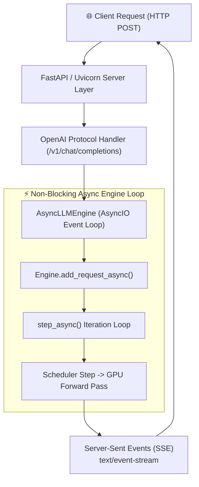
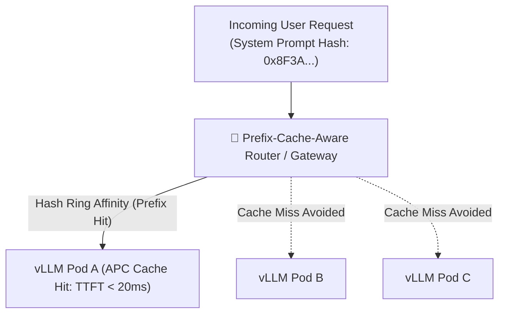
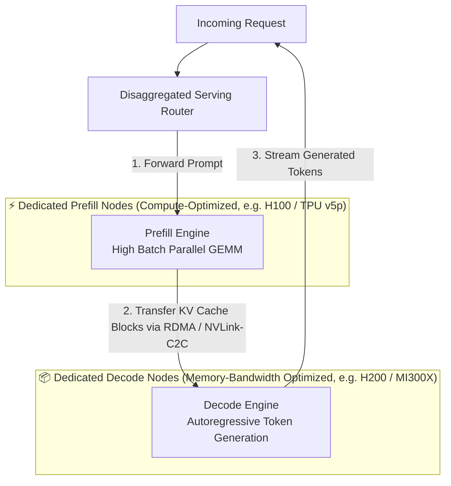
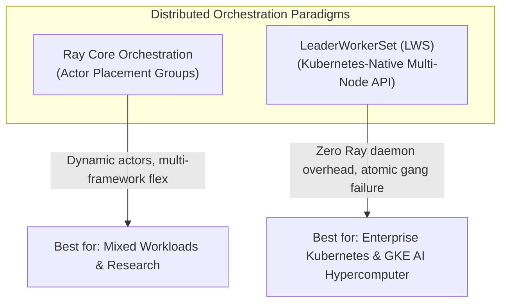
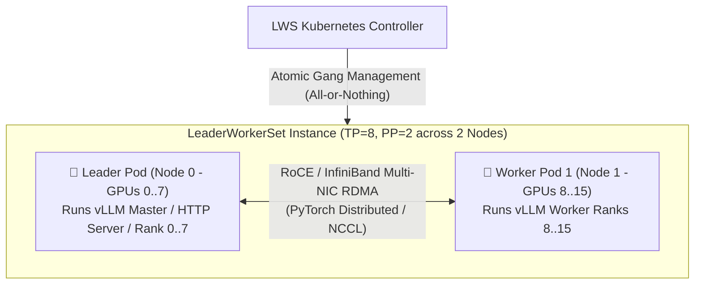
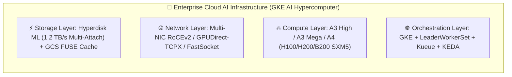
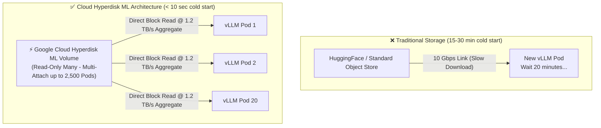
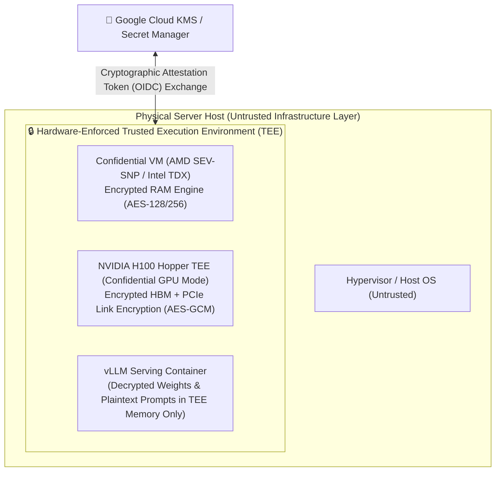
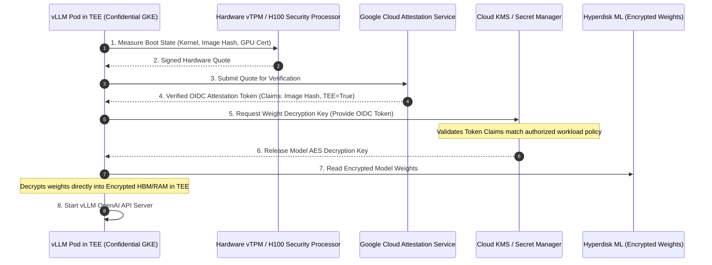
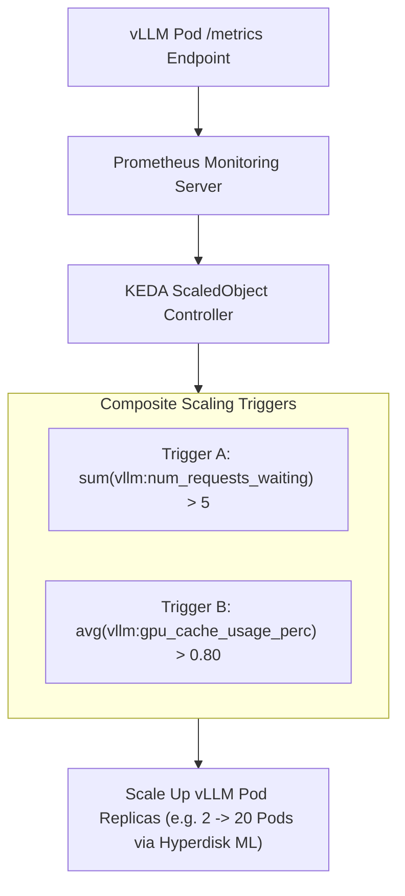

# Module 6: Production Deployment, Cloud Orchestration, and Observability

Moving a high-performance LLM engine from a single local GPU server to enterprise-grade production requires robust deployment architectures, cloud-native orchestration, ultra-fast cold-start storage pipelines, hardware-enforced confidential computing, and real-time observability. Production LLM serving endpoints must deliver low-latency API response streaming, scale elastically under fluctuating traffic spikes without multi-minute weight loading penalties, isolate hardware failures gracefully, protect sensitive model weights and customer data via hardware-enforced Trusted Execution Environments (TEEs), and expose detailed operational metrics for event-driven autoscaling.

This module explores the complete production engineering architecture of vLLM, covering:
1. **OpenAI API Server, Prefix-Cache-Aware Routing, and Disaggregated Serving**
2. **Multi-Node Cluster Orchestration: Ray vs. LeaderWorkerSet (LWS)**
3. **Enterprise Cloud Infrastructure and Cold-Start Acceleration (GKE AI Hypercomputer & Hyperdisk ML)**
4. **Confidential AI and Zero-Trust LLM Serving (Confidential Space & Confidential GKE with H100 TEE)**
5. **Production Observability, Prometheus Metrics, and KEDA Event-Driven Autoscaling**
6. **Complete Production Reference Architecture and Deployment Checklist**

---

## Part 1: OpenAI API Server, Prefix Routing, and Disaggregated Serving

vLLM provides an enterprise-ready HTTP server compatible with the **OpenAI API specification** (`vllm.entrypoints.openai.api_server`), supporting streaming endpoints for text completions (`/v1/completions`) and chat completions (`/v1/chat/completions`).



### 1.1 Non-Blocking `AsyncLLMEngine` Architecture

To serve thousands of concurrent HTTP clients simultaneously without blocking the CPU, vLLM decouples HTTP request handling from GPU inference using **`AsyncLLMEngine`**:

1. **AsyncIO Event Loop**: The HTTP server runs on Python's `asyncio` event loop. When a client sends a JSON payload, FastAPI parses the input and forwards it to `AsyncLLMEngine.add_request_async()`.
2. **Request Queueing**: Requests are pushed into an asynchronous queue (`AsyncStream`) and mapped to a unique request ID.
3. **Background Worker Loop (`step_async()`)**: A background task executes a continuous `while` loop calling `engine.step_async()`. In each iteration step, the scheduler selects active requests, launches the batched GPU forward pass, and streams generated token IDs back to individual client response generators.
4. **Server-Sent Events (SSE) Streaming**: As new tokens are generated in each GPU step, the API server formats them into `text/event-stream` chunks (`data: {"choices": [{"delta": {"content": "..."}}]}`) and streams them back to clients over HTTP instantly.

---

### 1.2 Prefix-Cache-Aware Intelligent Gateway Routing

When running a cluster of multiple vLLM replica instances, a standard Round-Robin or Random load balancer destroys **Automatic Prefix Caching (APC)** locality. If User A sends repeated queries sharing a 4,000-token system prompt (or a 32K RAG document context), routing request 1 to Pod A and request 2 to Pod B forces Pod B to recompute the entire prompt KV cache from scratch ($\text{TTFT} \approx 800\text{ ms}$ instead of $< 20\text{ ms}$).



**Production Routing Solution**:
- **Consistent Hashing Proxy**: Deploy an intelligent proxy (e.g. Envoy with custom Lua filter, or dedicated vLLM Router) that hashes the initial token prefix (or system prompt / document ID) into a consistent hash ring.
- **Cache Hit Affinity**: Requests sharing identical prefix hashes are directed to the same vLLM pod replica, driving global APC cache hit rates from $\sim 15\%$ up to $> 90\%$, slashing compute FLOPs and cutting cluster-wide TTFT by up to $10\times$.

---

### 1.3 Disaggregated Prefill and Decode (Split Serving Topology)

As analyzed in [Module 1](01_llm_inference_fundamentals.md) and [Module 3](03_performance_and_quality.md), LLM inference has two phases with conflicting hardware demands:
- **Prefill (Prompt Processing)**: Compute-bound, highly parallel GEMM, saturates Tensor Cores, benefits from high TFLOPs and lower memory capacity.
- **Decode (Token Generation)**: Memory-bandwidth bound GEMV, executes sequentially token-by-token, requires massive HBM capacity and memory bandwidth (TB/s).

When Prefill and Decode are colocated in the same engine instance, a sudden arrival of long prompts stalls the decoding of active streams, causing severe Inter-Token Latency (ITL / TBT) jitter and tail latency spikes.



1. **Dedicated Prefill Nodes**: Prompt tokens are processed in large batches on compute-heavy nodes. Once the initial KV cache is formed, the physical KV blocks are transferred to a Decode node via low-latency InfiniBand / RoCE RDMA.
2. **Dedicated Decode Nodes**: Focus exclusively on smooth, uninterrupted autoregressive token generation, guaranteeing strict ITL SLA guarantees (e.g. $< 15\text{ ms/token}$).

---

## Part 2: Multi-Node Cluster Orchestration: Ray vs. LeaderWorkerSet (LWS)

When models exceed single-node GPU memory (e.g., Llama 3 70B across multiple nodes, or Llama 3 405B requiring $\text{TP} = 8, \text{PP} = 8$ across 8 nodes of 8xH100), the orchestrator must manage multi-node process lifecycles and physical GPU locality.



---

### 2.1 Ray Core Distributed Orchestration

In standard setups, vLLM uses **Ray Core** (`vllm.engine.ray_utils`) to orchestrate worker processes across physical nodes:

1. **Ray Actors**: Each GPU worker is wrapped inside an actor (`Worker` class) pinned to a physical GPU device.
2. **Placement Groups (`PACK` Strategy)**: vLLM requests Ray Placement Groups with `PACK` bundles, forcing Ray to pack GPU worker actors onto the same physical server node before spreading across nodes to maximize NVLink bandwidth.
3. **PyTorch Distributed Process Group**: Ray initializes `torch.distributed` process groups across the actors, enabling direct low-latency NVLink and InfiniBand transfers (`vllm._C.custom_ar`).

---

### 2.2 Modern Kubernetes-Native Orchestration: `LeaderWorkerSet` (LWS)

While Ray is widely used, managing Ray clusters inside enterprise Kubernetes environments introduces extra components (Ray Head pod, Ray Autoscaler daemon, Ray GCS storage) that can complicate production SRE operations.

The Kubernetes community and Google Cloud introduced **`LeaderWorkerSet` (LWS)**—a Kubernetes-native API designed specifically for multi-node AI/LLM workloads:



#### Key Advantages of LeaderWorkerSet (LWS) over Ray in K8s:
1. **Zero Control-Plane Overhead**: Eliminates Ray Head nodes, Ray daemons, and Redis/GCS state backends; runs purely on standard Kubernetes Pod primitives.
2. **Atomic Gang Lifecycle**: In Tensor/Pipeline Parallelism, if a single GPU worker node crashes, the entire distributed serving group must restart together. LWS automatically enforces **gang failure and atomic restarts** for the group.
3. **Deterministic Network Topology**: Automatically establishes predictable pod DNS subdomains (`leader-0.lws-service`, `worker-0-1.lws-service`), allowing `torch.distributed` rendezvous to resolve instantly without external coordination services.

#### Production `LeaderWorkerSet` YAML Specification (2 Nodes x 8 H100 GPUs):
```yaml
apiVersion: leaderworkerset.x-k8s.io/v1
kind: LeaderWorkerSet
metadata:
  name: vllm-llama3-405b
  namespace: llm-serving
spec:
  replicas: 2 # 2 serving replicas, each spanning 2 nodes (4 nodes total)
  leaderWorkerTemplate:
    size: 2 # 1 Leader Pod + 1 Worker Pod per replica
    restartPolicy: RecreateGroupOnPodRestart # Gang failure recovery
    leaderTemplate:
      metadata:
        labels:
          role: leader
      spec:
        containers:
          - name: vllm-leader
            image: vllm/vllm-openai:latest
            command:
              - python3
              - -m
              - vllm.entrypoints.openai.api_server
            args:
              - --model=/models/llama-3-405b-instruct
              - --tensor-parallel-size=8
              - --pipeline-parallel-size=2
              - --gpu-memory-utilization=0.92
              - --enable-prefix-caching
            resources:
              limits:
                nvidia.com/gpu: "8"
              requests:
                nvidia.com/gpu: "8"
            volumeMounts:
              - mountPath: /dev/shm
                name: dshm
              - mountPath: /models
                name: model-storage
        volumes:
          - name: dshm
            emptyDir:
              medium: Memory
              sizeLimit: 64Gi
          - name: model-storage
            persistentVolumeClaim:
              claimName: hyperdisk-ml-pvc
    workerTemplate:
      spec:
        containers:
          - name: vllm-worker
            image: vllm/vllm-openai:latest
            resources:
              limits:
                nvidia.com/gpu: "8"
              requests:
                nvidia.com/gpu: "8"
            volumeMounts:
              - mountPath: /dev/shm
                name: dshm
              - mountPath: /models
                name: model-storage
        volumes:
          - name: dshm
            emptyDir:
              medium: Memory
              sizeLimit: 64Gi
          - name: model-storage
            persistentVolumeClaim:
              claimName: hyperdisk-ml-pvc
```

---

## Part 3: Enterprise Cloud Infrastructure & Cold-Start Acceleration

In enterprise cloud environments such as **Google Cloud AI Hypercomputer on GKE**, infrastructure must be co-designed across compute accelerators, high-speed storage, and multi-NIC networking.



### 3.1 Critical Pod Configurations for High-Performance Serving

#### 1. Shared Memory (`/dev/shm`) Capacity Sizing
By default, Docker and Kubernetes restrict the container `/dev/shm` shared memory size to a tiny $64 \text{ MB}$.

Because vLLM's custom NVLink All-Reduce CUDA kernels (`vllm._C.custom_ar`) and PyTorch Distributed IPC use POSIX shared memory buffers to exchange intermediate tensor pointers across 8 GPUs, **a $64 \text{ MB}$ `/dev/shm` will cause immediate kernel crashes (`SIGBUS` or CUDA Out of Memory)**.

**Production Sizing Rule**: Mount an `emptyDir` memory volume with capacity $\ge 16 \text{ GB}$ (or $\ge 64 \text{ GB}$ for multi-node/large-batch models):

```yaml
volumes:
  - name: dshm
    emptyDir:
      medium: Memory
      sizeLimit: 32Gi
volumeMounts:
  - mountPath: /dev/shm
    name: dshm
```

#### 2. NUMA Alignment and CPU Core Pinning
On dual-socket host servers (e.g. 2 x Intel Xeon / AMD EPYC CPUs hosting 8 x H100 GPUs), GPUs 0-3 are attached to NUMA Node 0 (PCIe Root Complex 0), while GPUs 4-7 are attached to NUMA Node 1.

If Kubernetes schedules vLLM CPU threads on NUMA Node 1 while interacting with GPUs 0-3, memory copies traverse the high-latency CPU UPI/QPI inter-socket bridge, incurring a $40\%$ throughput penalty. In GKE, configure the **Kubernetes CPU Manager Policy (`static`)** and **Topology Manager Policy (`single-numa-node`)** to lock vLLM container threads to the local NUMA domain.

---

### 3.2 Solving the Cold-Start Scaling Bottleneck: Hyperdisk ML & Fast Caching

When traffic spikes trigger KEDA autoscaling (e.g., scaling from 2 to 20 Pods), conventional container storage creates a catastrophic failure mode:
- A 70B parameter FP16/BF16 model is **$140 \text{ GB}$**.
- A 405B parameter model is **$810 \text{ GB}$**.
- Downloading weights sequentially from HuggingFace Hub or standard cloud object storage over 10 Gbps network takes **$15 \dots 30 \text{ minutes per pod}$**.
- **Autoscaling becomes useless** if pods take 20 minutes to become ready during a sudden user traffic surge.



#### High-Speed Storage Solutions:
1. **Google Cloud Hyperdisk ML**:
   - Designed specifically for AI inference scale-out. A single volume holding model weights can be attached in **Read-Only Many (`ROX`)** mode to up to **2,500 GKE Pods simultaneously**.
   - Delivers up to **$1.2 \text{ TB/s}$ aggregate cluster read throughput**, allowing 20 newly spawned vLLM pods to load $140 \text{ GB}$ weights concurrently in **under 10 seconds**.
2. **GCS FUSE CSI Driver with Local SSD File Cache**:
   - Mounts Cloud Storage buckets as local filesystems with streaming reads and local NVMe SSD caching (`file-cache: max-size-mb`).
3. **Container Image Streaming (Containerd Stargz / CRFS)**:
   - Allows GKE nodes to start the vLLM container immediately without waiting for the entire $20 \text{ GB}$ CUDA container image to download, pulling individual image layers lazily on-demand.

---

### 3.3 High-Performance Inter-Node Cloud Networking

For multi-node TP/PP distributed serving, inter-node communication must avoid host TCP/IP bottlenecks:
- **Multi-NIC Architecture**: Cloud AI instances (e.g. Google Cloud A3 Mega / A3 Ultra) equip each node with **8 dedicated $200\text{ Gbps}$ or $400\text{ Gbps}$ Network Interface Cards (NICs)** mapped 1:1 to each of the 8 GPUs.
- **GPUDirect-TCPX and RoCEv2 RDMA**: Bypasses the host CPU and system RAM, copying tensors directly from local GPU HBM over the network into remote GPU HBM.
- **NCCL Tuning Environment Flags**:
  ```bash
  export NCCL_DEBUG=INFO
  export NCCL_NET_GDR_LEVEL=5          # Full GPUDirect RDMA across PCIe/NVLink
  export NCCL_CROSS_NIC=1              # Balance All-Reduce traffic across all 8 NICs
  export NCCL_BUFFSIZE=8388608         # 8MB ring buffer for high-throughput all-reduce
  ```

---

## Part 4: Confidential AI and Zero-Trust LLM Serving

In high-security enterprise domains (Healthcare/HIPAA, FinTech, Defense, Proprietary IP), deploying frontier LLMs introduces major security vulnerabilities:
1. **Data in Memory Snooping**: Standard GPU memory (HBM) and host RAM store plaintext prompts, patient data, and model weights unencrypted during forward passes.
2. **Untrusted Cloud Operator / Host Admin**: A malicious host OS administrator, compromised hypervisor, or co-located tenant could dump memory pages and extract proprietary model weights or private user sessions.

To solve this, Google Cloud and NVIDIA introduced **Confidential Computing for AI** via **Confidential Space** and **Confidential GKE with NVIDIA H100 TEE**.



---

### 4.1 Hardware-Enforced Trusted Execution Environment (TEE)

Confidential LLM serving combines CPU and GPU cryptographic boundaries:
1. **CPU TEE (AMD SEV-SNP / Intel TDX)**: Memory encryption keys are generated by the hardware security processor inside the CPU silicon. The hypervisor cannot read or modify guest VM memory pages.
2. **GPU TEE (NVIDIA Hopper H100 Confidential Computing)**: 
   - When configured in **Attested Pass-Through Mode (APM)**, the H100 GPU's hardware security engine encrypts all data moving across the PCIe bus and inside the on-package HBM3 memory using line-rate **AES-GCM-256**.
   - Even physical hardware probes attached to the PCIe bus or memory buses read only encrypted cipher-text.

---

### 4.2 Cryptographic Remote Attestation & Key Release Pipeline

How does an enterprise securely load proprietary model weights into a cloud vLLM pod without ever releasing plaintext weights to disk or to the cloud platform?

The solution uses **Cryptographic Remote Attestation** orchestrated via **Confidential Space / Confidential GKE**:



1. **Measurement**: When the vLLM pod boots inside Confidential GKE, the hardware vTPM and NVIDIA H100 security processor compute cryptographic hashes of the BIOS, container image, kernel, and GPU microcode.
2. **Attestation Token**: The pod sends these measurements to the Cloud Attestation Service, which validates them against approved "golden hashes" and issues a signed OIDC attestation token.
3. **Conditioned Key Release**: Cloud KMS evaluates the token claims (e.g. *Image Hash == `vllm-prod-v2.4`*, *Confidential GPU == `H100-TEE`*). If verified, KMS releases the symmetric decryption key.
4. **Secure Execution**: Model weights are decrypted on-the-fly inside hardware-encrypted RAM/HBM. At no point in time do unencrypted weights exist on persistent disks or accessible host memory.

---

### 4.3 Architecture Synthesis: AI Hypercomputer vs. Confidential Space

Understanding the exact roles of Google Cloud AI Hypercomputer and Confidential Space eliminates architectural confusion:

| Architectural Dimension | **Google Cloud AI Hypercomputer** (GKE AI) | **Confidential Space / Confidential GKE** |
| :--- | :--- | :--- |
| **Primary Engineering Purpose** | **Scale, Throughput, and Latency Optimization** | **Zero-Trust Security, Privacy, and IP Protection** |
| **Key Hardware Technologies** | NVIDIA H100/H200/B200, TPU v5p/v6e, RoCEv2 Multi-NIC, Hyperdisk ML | AMD SEV-SNP, Intel TDX, NVIDIA H100 TEE (Confidential GPU mode) |
| **Key Software Abstractions** | LeaderWorkerSet (LWS), KubeRay, Kueue, NCCL FastSocket, KEDA | Hardware Attestation Service, Cloud KMS, Workload Identity OIDC |
| **Problem Solved** | High concurrency, multi-node TP/PP, sub-10-second cold-start scaling | Protection against rogue admins, hypervisor exploits, co-tenant snooping |
| **Target Workload** | Massive web-scale LLM serving (Llama 3 405B, DeepSeek) | Healthcare/HIPAA LLMs, Financial risk models, Proprietary weight hosting |
| **Unified Deployment Mode** | Deploy vLLM via **LeaderWorkerSet on Confidential A3 GPU instances with Hyperdisk ML** to achieve both ultra-scale throughput AND hardware-attested zero-trust guarantees. |

---

## Part 5: Production Observability, Metrics, and KEDA Autoscaling

vLLM exposes a built-in Prometheus metrics endpoint (`/metrics`) for real-time monitoring and event-driven autoscaling.

### 5.1 Key vLLM Prometheus Metrics

| Metric Name | Type | Description | Operational Significance & SRE Thresholds |
| :--- | :--- | :--- | :--- |
| `vllm:num_requests_running` | Gauge | Count of active requests currently executing GPU forward passes | High value indicates heavy GPU load |
| `vllm:num_requests_waiting` | Gauge | Count of requests queued in the scheduler waiting queue | **Primary trigger for Horizontal Autoscaling ($> 5 \dots 10$)** |
| `vllm:gpu_cache_usage_perc` | Gauge | Percentage of physical GPU KV cache blocks currently allocated | **$> 85\%$ indicates impending preemption, swapping, or TTFT degradation** |
| `vllm:cpu_cache_usage_perc` | Gauge | Percentage of physical CPU swap KV cache blocks allocated | $> 0\%$ indicates GPU memory saturation |
| `vllm:avg_prompt_throughput_tok_per_s` | Gauge | Aggregate prompt token prefill throughput across the engine | Tracks Prefill engine efficiency and TTFT capacity |
| `vllm:avg_generation_throughput_tok_per_s` | Gauge | Aggregate output token generation throughput across the engine | Measures decoding bandwidth saturation |
| `vllm:time_to_first_token_seconds` | Histogram | Time To First Token (TTFT) latency distribution | Key SLA metric for prompt processing ($P_{99} < 1.0\text{ s}$) |
| `vllm:time_per_output_token_seconds` | Histogram | Inter-Token Latency (ITL / TBT) distribution | Key SLA metric for token generation speed ($P_{99} < 25\text{ ms}$) |

---

### 5.2 KEDA Event-Driven Horizontal Pod Autoscaling

Standard Kubernetes Horizontal Pod Autoscalers (HPA) scale pods based on CPU or RAM usage, which is completely ineffective for GPU workloads.

Production deployments use **KEDA (Kubernetes Event-driven Autoscaling)** to scale vLLM pod replicas dynamically based on **KV Cache Usage** and **Waiting Queue Depth**.



#### Production KEDA `ScaledObject` Configuration
```yaml
apiVersion: keda.sh/v1alpha1
kind: ScaledObject
metadata:
  name: vllm-keda-autoscaler
  namespace: llm-serving
spec:
  scaleTargetRef:
    apiVersion: leaderworkerset.x-k8s.io/v1
    kind: LeaderWorkerSet
    name: vllm-llama3-405b
  minReplicaCount: 2
  maxReplicaCount: 20
  cooldownPeriod: 300 # Prevent flapping during bursty traffic
  pollingInterval: 5
  triggers:
    - type: prometheus
      metadata:
        serverAddress: http://prometheus-k8s.monitoring:9090
        metricName: vllm_num_requests_waiting
        query: sum(vllm:num_requests_waiting{namespace="llm-serving"})
        threshold: '5'
    - type: prometheus
      metadata:
        serverAddress: http://prometheus-k8s.monitoring:9090
        metricName: vllm_gpu_cache_usage_perc
        query: avg(vllm:gpu_cache_usage_perc{namespace="llm-serving"})
        threshold: '0.80'
```

---

## Part 6: Complete Production Reference Architecture

The complete end-to-end enterprise serving architecture combines intelligent API routing, LeaderWorkerSet multi-node scaling, Hyperdisk ML fast storage, hardware-attested Confidential Computing, and KEDA autoscaling into a unified production topology.

```mermaid
flowchart TD
    USERS["📱 Clients and Web Applications"] --> WAF["🛡️ Cloud Armor / WAF / SSL Termination"]
    WAF --> GATEWAY["🚪 Intelligent API Gateway (Auth / Rate Limiting / Prefix-Aware Hash Router)"]
    
    GATEWAY --> K8S_CLUSTER["☸️ GKE AI Hypercomputer Cluster"]

    subgraph K8S_CLUSTER ["☸️ GKE AI Hypercomputer Cluster (Confidential A3 Nodes)"]
        subgraph LWS_REPLICA_1 ["LeaderWorkerSet Replica 1 (TP=8, PP=2)"]
            LEADER_1["👑 Leader Pod (Node 0: 8x H100 TEE)<br>OpenAI FastAPI + Engine Master"]
            WORKER_1["👷 Worker Pod (Node 1: 8x H100 TEE)<br>Distributed Worker Ranks 8..15"]
            LEADER_1 <-->|"Multi-NIC RoCEv2 (400 Gbps RDMA)"| WORKER_1
        end

        subgraph LWS_REPLICA_2 ["LeaderWorkerSet Replica 2 (TP=8, PP=2)"]
            LEADER_2["👑 Leader Pod (Node 2: 8x H100 TEE)"]
            WORKER_2["👷 Worker Pod (Node 3: 8x H100 TEE)"]
            LEADER_2 <-->|"Multi-NIC RoCEv2 (400 Gbps RDMA)"| WORKER_2
        end
    end

    STORAGE["⚡ Google Cloud Hyperdisk ML Volume<br>(Read-Only Many, 1.2 TB/s Aggregate Throughput)"]
    STORAGE -->|"Sub-10s Model Loading"| LWS_REPLICA_1
    STORAGE -->|"Sub-10s Model Loading"| LWS_REPLICA_2

    ATTEST["🔐 Google Cloud KMS & Attestation Service"] <-->|"Hardware Attestation & Key Release"| K8S_CLUSTER

    METRICS["📊 Prometheus Monitoring"] <-- "Scrape /metrics" -- K8S_CLUSTER
    METRICS --> KEDA["⚡ KEDA ScaledObject Controller"]
    KEDA -->|"Auto-scale LWS Replicas (2 -> 20)"| K8S_CLUSTER
```

---

## Summary: Production Readiness Checklist

| Category | Production Best Practice Requirement | Verification Metric / Command | Failure Mode Mitigated |
| :--- | :--- | :--- | :--- |
| **Shared Memory** | Mount `emptyDir` memory volume to `/dev/shm` ($\ge 32 \text{ GB}$) | Verify `df -h /dev/shm` inside container | Prevents `SIGBUS` IPC crashes during NVLink All-Reduce |
| **Multi-Node Orchestration** | Deploy multi-node models via `LeaderWorkerSet` (LWS) | Verify `kubectl get lws` with `RecreateGroupOnPodRestart` | Prevents partial cluster deadlocks on single-node GPU fault |
| **Cold-Start Storage** | Attach model weights via **Hyperdisk ML** (`ROX` mode) or GCS FUSE Cache | Measure container start-to-ready time ($< 15\text{ s}$) | Prevents 20-minute autoscaling lag during traffic surges |
| **Intelligent Routing** | Enable Prefix-Cache-Aware Router in front of vLLM pods | Track `vllm:gpu_prefix_cache_hit_rate` ($> 80\%$) | Prevents redundant prompt prefill recomputation |
| **Confidential Security** | Enable Confidential GKE (AMD SEV-SNP + NVIDIA H100 TEE) | Check Attestation token exchange via Cloud KMS | Protects proprietary weights and user prompts from host snooping |
| **Autoscaling Triggers** | Scale on `vllm:num_requests_waiting` ($> 5$) and GPU Cache ($> 0.80$) via KEDA | Verify KEDA `ScaledObject` status in Prometheus | Prevents TTFT degradation and Out-of-Memory preemption |
| **Health Probes** | Point Kubernetes Readiness Probe to `GET /health` | Verify HTTP 200 returned strictly after CUDA graph warm-up | Prevents routing user traffic to un-warmed model replicas |

Congratulations on completing the **vLLM Core Architecture and Performance Mechanics** textbook! You now possess an end-to-end mastery of LLM inference fundamentals, memory management, kernel optimization, distributed parallelism, cloud infrastructure co-design, and enterprise zero-trust production deployment.
