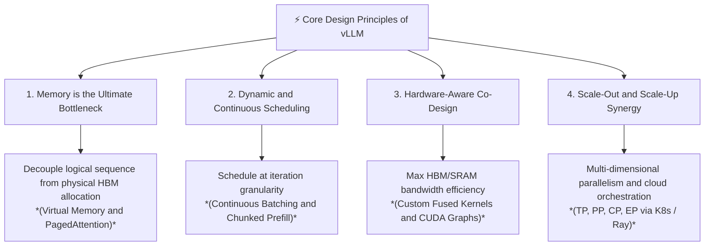

# vLLM Deep Dive: Leading Principles and Comprehensive Curriculum

Welcome to the **vLLM Deep Dive Textbook**. This series of learning modules is structured to take you from the fundamental physics and bottlenecks of Large Language Model (LLM) inference all the way to distributed multi-cluster orchestration, kernel optimizations, and hardware co-design.

---

## Part 1: Leading Principles of LLM Inference and vLLM Design

To truly master vLLM, we must anchor our understanding in four foundational design principles that drove its creation and evolution:

### Principle 1: Memory is the Ultimate Bottleneck in LLM Decoding
In traditional serving systems, the Key-Value (KV) cache is allocated contiguously in high-bandwidth memory (HBM) based on the *maximum potential length* of a request. Because request lengths are unpredictable, this causes:

- **Internal Fragmentation**: Reserved space that is never used (often 60–80% of allocated KV cache).
- **External Fragmentation**: Memory gaps between contiguous blocks that cannot be fulfilled for new requests.
- **Consequence**: GPU compute units sit idle waiting for memory or are starved because concurrency is artificially capped by wasted KV cache allocations.

**vLLM's Solution**: Borrow the operating system's concept of **Virtual Memory and Paging**. By breaking the KV cache into fixed-size **physical blocks** (e.g., 16 tokens) mapped via **block tables** to logical sequence positions, vLLM achieves near-zero memory waste (<4%), allowing significantly higher batch sizes and concurrency on the exact same hardware.

---

### Principle 2: Continuous and Iteration-Level Execution
Traditional deep learning frameworks operate on static batches where all sequences must finish together, or where new sequences wait until the slowest sequence in the batch concludes.
**vLLM's Solution**: **Continuous Batching (Iteration-level Scheduling)**. 

- At every single forward pass (iteration) of the model, the engine checks for completed sequences, evicts or frees their KV blocks immediately, and inserts newly arrived requests or scheduled chunks.
- Through techniques like **Chunked Prefill**, long incoming prompt evaluations are broken into manageable chunks and interleaved with the latency-sensitive decoding steps of active requests, preventing Time-to-First-Token (TTFT) spikes from degrading Inter-Token Latency (ITL).

---

### Principle 3: Hardware-Kernel-Algorithm Co-Design
Modern GPUs (NVIDIA Hopper/Blackwell, AMD CDNA3) possess immense compute capacity (TFLOPs/PFLOPs) but are fundamentally bounded by memory bandwidth (TB/s) during autoregressive decoding.
**vLLM's Solution**:

- **PagedAttention Kernels**: Custom fused CUDA/ROCm/XLA kernels that fetch non-contiguous KV blocks directly into fast on-chip SRAM (Shared Memory) during attention computation, eliminating extra HBM round-trips.
- **Graph Optimization**: Integration with **CUDA Graphs** and `torch.compile` to eliminate CPU overhead and Python interpreter latency during the fast, repetitive token generation loop.

---

### Principle 4: Composable Parallelism and Production-Grade Orchestration
As models grow beyond the HBM capacity of a single GPU (or require multi-node execution for ultra-low latency), the inference engine must natively orchestrate complex parallel topologies without adding overhead.
**vLLM's Solution**:

- Multi-dimensional parallelism: **Tensor Parallelism (TP)** for intra-node low latency, **Pipeline Parallelism (PP)** for inter-node scaling, **Context/Sequence Parallelism (CP)** for million-token contexts, and **Expert Parallelism (EP)** for Mixture-of-Experts (MoE).
- Clean separation between compute engines (managed via **Ray** or native multiprocessing) and serving gateways (OpenAI-compatible APIs, **Kubernetes** operators, and **Triton Inference Server** integration).

---

## Part 2: Curriculum Structure and Textbook Roadmap

This learning folder (`vLLM/`) is organized into 6 comprehensive, self-contained modules. Each module will be authored as a deep-dive Markdown document containing theoretical concepts, mathematical formulas, architecture diagrams, code patterns, and production trade-offs.

| Module | Filename | Key Topics Covered |
| :--- | :--- | :--- |
| **[Module 1: Fundamentals](01_llm_inference_fundamentals.md)** | [`01_llm_inference_fundamentals.md`](01_llm_inference_fundamentals.md) | Autoregressive decoding mechanics, Prefill vs. Decode phase, KV Cache math (`2 * b * s * l * h * d`), Arithmetic Intensity, and memory fragmentation economics. |
| **[Module 2: Core Architecture](02_vllm_core_architecture.md)** | [`02_vllm_core_architecture.md`](02_vllm_core_architecture.md) | OS Virtual Memory mapping, Block Manager anatomy, PagedAttention kernel workflow, Copy-on-Write (CoW) for beam search/shared prompts, and Automatic Prefix Caching (APC). |
| **[Module 3: Performance and Quality](03_performance_and_quality.md)** | [`03_performance_and_quality.md`](03_performance_and_quality.md) | Metrics (TTFT, ITL/TBT, Throughput), Chunked Prefill, CUDA Graphs, Speculative Decoding (Medusa/EAGLE/Draft models), and Quantization trade-offs (AWQ, GPTQ, FP8, W8A8). |
| **[Module 4: Hardware Interaction](04_hardware_and_kernel_optimization.md)** | [`04_hardware_and_kernel_optimization.md`](04_hardware_and_kernel_optimization.md) | GPU memory hierarchy (HBM/L2/SRAM), PagedAttention and FlashAttention SRAM tiling, V1 vs V2 engine async execution, and cross-hardware backends (CUDA, ROCm, TPU, Neuron). |
| **[Module 5: Distributed Parallelism](05_distributed_parallelism.md)** | [`05_distributed_parallelism.md`](05_distributed_parallelism.md) | Tensor Parallelism (Megatron-LM syncs over NVLink), Pipeline Parallelism (micro-batching and bubbles), Context Parallelism (Ring-Attention), and Expert Parallelism (MoE routing). |
| **[Module 6: K8s and Orchestration](06_deployment_and_orchestration.md)** | [`06_deployment_and_orchestration.md`](06_deployment_and_orchestration.md) | OpenAI API Server structure, Ray multi-host actors, Kubernetes deployment (GPU Operator, `/dev/shm` sizing, NUMA pinning), KEDA autoscaling on KV utilization, and Triton integration. |
| **[Appendix: Master Glossary](appendix_glossary_and_terminology.md)** | [`appendix_glossary_and_terminology.md`](appendix_glossary_and_terminology.md) | Comprehensive reference of all architectural, mathematical (`RoPE`, `SwiGLU`), physical hardware (`HBM`, `L2`, `SM`), and distributed systems (`EP`, `TP`, `PP`) terminology. |

---

## Part 3: Deep-Dive Module Breakdown

### [Module 1: LLM Inference Fundamentals and The Bottlenecks](01_llm_inference_fundamentals.md)
1. **The Anatomy of Transformer Generation**
    - **Prefill (Prompt Phase)**: Compute-bound, parallel processing of all input tokens simultaneously. Generates the initial KV cache and the first generated token.
    - **Decode (Generation Phase)**: Memory-bandwidth bound, sequential processing generating one token at a time while reading the entire historical KV cache from HBM for every step.
2. **The Key-Value (KV) Cache Mathematical Formalism**
    - Why caching `K` and `V` projections is mandatory to avoid $\mathcal{O}(N^2)$ recomputation.
    - Calculating the exact memory footprint:

$$
\text{KV_Bytes} = 2 \cdot \text{batch_size} \cdot \text{seq_len} \cdot \text{num_layers} \cdot \text{num_kv_heads} \cdot \text{head_dim} \cdot \text{sizeof(dtype)}
$$

    - Real-world example: Why a 70B model with 4K context instantly consumes tens of gigabytes just for KV memory before model weights are even considered.
3. **The Memory vs. Compute Bound Paradigm**
    - Roofline Model and **Operational Intensity (Arithmetic Intensity)**: `FLOPs / Byte`.
    - Why doubling GPU TFLOPs does not speed up single-batch decoding without increasing HBM bandwidth (`GB/s`).
4. **Traditional Serving Failures**
    - Static batching and the padding tax.
    - The contiguous memory requirement: Why pre-allocating `max_seq_len` causes **Internal Fragmentation** (wasted capacity) and **External Fragmentation** (checkerboard memory preventing new request admission).

---

### [Module 2: vLLM Core Architecture and PagedAttention](02_vllm_core_architecture.md)
1. **The Operating System Analogy: Paging in LLMs**
    - Logical Token Blocks vs. Physical KV Blocks.
    - The **Block Table**: Translating logical sequence offsets to physical block indices in HBM in $\mathcal{O}(1)$ time.
2. **PagedAttention Deep Dive**
    - Architectural difference between standard FlashAttention and PagedAttention.
    - How the attention kernel performs on-the-fly block table lookups inside registers/SRAM to compute attention scores across fragmented physical HBM locations without copying data.
3. **The Block Manager and Memory Allocator**
    - Block Size selection (e.g., 16 tokens): balancing internal fragmentation (at most `block_size - 1` tokens wasted per sequence) vs. lookup overhead.
    - **Copy-on-Write (CoW)** mechanism: How shared system prompts, parallel sampling (`best_of_n`), and beam search share physical blocks with reference counting (`ref_count > 1`) until a sequence diverges.
    - **Automatic Prefix Caching (APC)**: Hash-based identification and retention of reusable prefix blocks across independent API requests.
4. **Continuous Batching and The Iteration Scheduler**
    - The step-by-step lifecycle of a request in vLLM: `Waiting` -> `Running` -> `Swapped` / `Finished`.
    - Preemption mechanics: When HBM KV space runs out, how vLLM chooses whether to **Swap** blocks to CPU host RAM over PCIe or **Recompute** them later.

---

### [Module 3: Performance, Quality and Engine Enhancements](03_performance_and_quality.md)
1. **Inference Metrics and Trade-Offs**
    - **Time To First Token (TTFT)**: The responsiveness metric (governed by prefill speed and queue wait time).
    - **Inter-Token Latency (ITL / TBT)**: The smoothness metric (governed by decode step duration).
    - **Throughput vs. Latency Trade-off**: How larger batch sizes increase total tokens/second while modestly increasing single-request ITL.
2. **Systems Analysis: Prefill vs. Decode FLOPs, Arithmetic Intensity, and Cost per Token**
    - Architectural necessity: Why prefill tokens compute full attention and FFN passes across all layers.
    - Quantitative FLOP breakdown: Why $2\times$ vs. $4\times$ attention FLOPs is negligible ($< 3.6\%$) compared to $140 \text{ GFLOPs}$ weight projections for $S < 8,000$.
    - Arithmetic Intensity ($I = \text{FLOPs/Byte}$): Why single-token decode ($I = 64 \text{ FLOPs/Byte}$) is memory-bandwidth bound while prefill chunks ($I = 512 \text{ FLOPs/Byte}$) are compute-bound.
    - Concrete Tensor Shape Analysis: Matrix multiplication row dimensions ($[64 \times 8192]$ vs $[448 \times 8192]$) across linear layers ($W_{\text{Gate}}, W_{\text{Up}}, W_{\text{Down}}$).
3. **Advanced Scheduling: Chunked Prefill and Co-Scheduling**
    - Head-of-Line (HoL) blocking when massive prompts arrive during active decoding.
    - How Chunked Prefill bounds step latency (`max_num_batched_tokens = 512`) and co-schedules prefill chunks with decode steps to utilize idle Tensor Cores during memory streaming.
4. **Execution Overhead Minimization: CUDA Graphs**
    - Why Python interpreter and CUDA kernel launch overhead ($4.0 \text{ ms}$ for 400 kernels) dominate latency at small batch sizes.
    - How vLLM pre-records CUDA kernel launch addresses and static memory buffer pointers into batch size buckets ($b \in \{1 \dots 128\}$) to execute single $3 \ \mu\text{s}$ graph launches.
5. **Speculative Decoding inside vLLM**
    - Modified rejection sampling algorithm preserving target distribution ($P(\text{accept } x) = \min(1, p(x)/q(x))$).
    - The 4 speculative mechanisms: Draft Models, Medusa, EAGLE, and N-Gram Prompt Lookup.
    - Acceptance rate ($\alpha$) and concurrency boundaries: When speculative decoding provides $3.5\times$ speedups vs. when it degrades performance.
6. **Quantization and Precision Impact**
    - Weight-Only Quantization (AWQ, GPTQ, Marlin) vs. Weight-and-Activation Quantization (FP8 `e4m3fn`, W8A8 INT8).

---

### [Module 4: Hardware Interaction and Kernel Co-Design](04_hardware_and_kernel_optimization.md)
1. **The Complete Accelerator Storage Pyramid**
    - Memory hierarchy spectrum: Registers ($0 \text{ cycles}$, $>100 \text{ TB/s}$), On-Chip SRAM ($20 \dots 30 \text{ cycles}$, $33 \text{ TB/s}$), L2 Cache ($150 \dots 200 \text{ cycles}$, $12 \text{ TB/s}$), HBM3 ($400 \dots 800 \text{ cycles}$, $3.35 \text{ TB/s}$), Host CPU System RAM (DDR5 via PCIe/NVLink-C2C, $64 \dots 900 \text{ GB/s}$), and Host NVMe SSD Flash (NAND).
    - vLLM CPU KV Cache Swapping (`cpu_swap_space`) over PCIe 5.0 x16 and NVMe cold-start weight streaming (`safetensors`).
2. **Inside SRAM Tiling and FlashAttention**
    - Loading $Q, K, V$ tiles ($B_M \times d, B_N \times d$) into $228 \text{ KB}$ SRAM (`__shared__`) to eliminate materialization of the $S \times S$ attention matrix ($O(S^2) \to O(S)$ memory).
    - Online Softmax incremental recurrence equations ($m^{(j)}, l^{(j)}, O^{(j)}$) for single-pass stability.
3. **PagedAttention CUDA Kernel Engineering (V1 vs. V2)**
    - PagedAttention V1: One thread block per head per sequence; SM wave under-utilization during single-user long-context decoding.
    - PagedAttention V2 & Split-KV Reduction: Parallel sequence partitioning along the time axis ($N_{\text{partitions}} = \text{seq\_len} / 256$), intermediate global workspace staging (`tmp_output`, `tmp_max_logits`, `tmp_exp_sums`), and `paged_attention_v2_reduce_kernel` ($2.0\times \dots 5.0\times$ speedup).
4. **Cross-Hardware Ecosystem Abstraction**
    - AMD ROCm (HIP): Wavefront 64 (`wave64`) thread alignment, AMD Composable Kernel (CK) for MI300X Matrix Cores, and MI300X $192 \text{ GB}$ HBM3 ($5.3 \text{ TB/s}$).
    - Google TPUs: XLA Paged KV custom calls and static block table padding.
    - AWS Neuron: Inferentia2/Trainium Neuron Cores and NKI custom kernels.

---

### [Module 5: Distributed Parallelism and Multi-GPU Orchestration](05_distributed_parallelism.md)
1. **Distributed Serving Taxonomy and Interconnect Constraints**
    - Hardware interconnect bandwidth matching: NVLink 4 ($900 \text{ GB/s}$) vs. PCIe Gen5 ($64 \text{ GB/s}$) vs. InfiniBand NDR ($50 \text{ GB/s}$ / $400 \text{ Gbps}$).
2. **Tensor Parallelism (TP) Mechanics in vLLM**
    - ColumnParallelLinear ($W_Q, W_K, W_V, W_{\text{Gate}}, W_{\text{Up}}$) and RowParallelLinear ($W_O, W_{\text{Down}}$) matrix splitting (Megatron-LM paradigm).
    - Custom NVLink All-Reduce CUDA Kernels (`vllm._C.custom_ar`): Shared memory POSIX IPC buffers bypassing NCCL host overhead ($15 \ \mu\text{s} \to < 2.5 \ \mu\text{s}$).
3. **Pipeline Parallelism (PP) and Context Parallelism (CP)**
    - Pipeline Parallelism: Stage layer partitioning with 1 P2P activation transfer per stage boundary (ideal for inter-node InfiniBand).
    - Context Parallelism & Ring-Attention: Asynchronously passing $K, V$ blocks in a ring topology across GPUs for $100K+$ contexts.
4. **Expert Parallelism (EP) for Mixture-of-Experts (MoE)**
    - Top-$k$ gating router selection ($x @ W_{\text{gate}}$).
    - All-to-All communication (`all_to_all_single`) for routing tokens to target expert GPUs in DeepSeek-V3 / DeepSeek-R1 (256 experts) and Mixtral.
    - Fused MoE CUDA Kernels (`vllm._C.fused_moe`): Token sorting and batched grouped GEMM execution inside SRAM.

---

### [Module 6: Production Deployment, Cloud Orchestration, and Observability](06_deployment_and_orchestration.md)
1. **OpenAI API Server and AsyncEngine Architecture**
    - `FastAPI` / `Uvicorn` server layer providing OpenAI-compatible endpoints (`/v1/completions` and `/v1/chat/completions`).
    - Non-blocking `AsyncLLMEngine` with background `step_async()` loop decoupling HTTP queueing from GPU forward execution.
    - Server-Sent Events (SSE) streaming (`text/event-stream`).
2. **Multi-Node Distributed Cluster Orchestration with Ray Core**
    - Ray Actor workers (`Worker` class) wrapping individual GPUs.
    - Ray Placement Groups with `PACK` bundle strategy for intra-node locality before cross-node expansion.
3. **Kubernetes Production Deployment Best Practices**
    - Critical `/dev/shm` shared memory volume mounting (`emptyDir` with `medium: Memory` and $\ge 16 \text{ GB}$ capacity) to prevent NVLink IPC `SIGBUS` kernel crashes.
    - NVIDIA GPU Operator resource limits (`nvidia.com/gpu: "8"`).
    - Readiness Probe pointing to `GET /health` ensuring traffic routes only after CUDA Graph warm-up capture.
4. **Production Observability, Metrics, and KEDA Autoscaling**
    - Operational metrics: `vllm:num_requests_waiting`, `vllm:gpu_cache_usage_perc`, `vllm:time_to_first_token_seconds`, and `vllm:time_per_output_token_seconds`.
    - KEDA Event-Driven Autoscaling: Scaling pod replicas dynamically based on waiting queue depth and KV cache usage thresholds.
5. **Complete Production Reference Architecture**
    - End-to-end enterprise diagram bridging API Ingress/Gateway, Kubernetes Serving Clusters, Ray Workers, PagedAttention Memory Managers, Prometheus Monitoring, and KEDA Controllers.

---

## Part 4: How We Will Build and Learn

In our upcoming sessions, we will sequentially write, study, and expand each of these 6 deep-dive `.md` modules inside this directory. Each module will follow a strict, high-value pedagogical format:

1. **Conceptual and Theoretical Foundation**: The "Why" and the math behind the mechanism.
2. **System Architecture and Data Flow**: Detailed ASCII and Mermaid diagrams mapping out what happens in memory and across threads.
3. **Code and Configuration Anatomy**: Real-world Python/CUDA/YAML configurations showing how vLLM implements the concept.
4. **Production Pitfalls and Tuning Guide**: Practical advice on configuration flags, monitoring metrics, and performance debugging.
