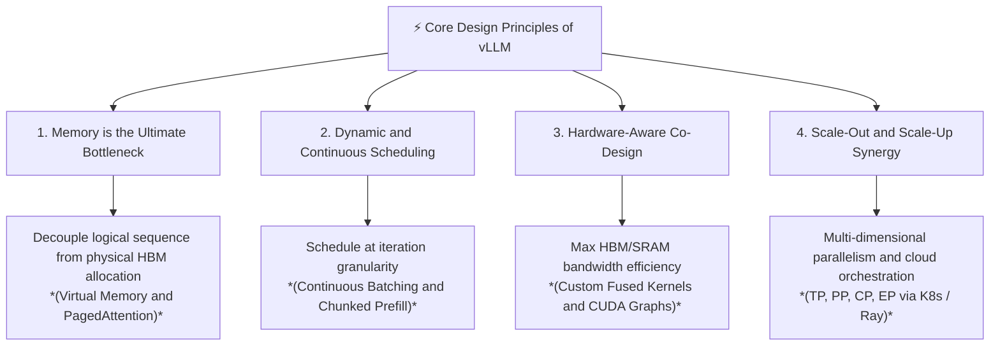

# vLLM Deep Dive: Leading Principles and Comprehensive Curriculum

Welcome to the **vLLM Deep Dive Textbook**. This series of learning modules is structured to take you from the fundamental physics and bottlenecks of Large Language Model (LLM) inference all the way to distributed multi-cluster orchestration, kernel optimizations, and hardware co-design.

---

## Part 1: Leading Principles of LLM Inference and vLLM Design

To truly master vLLM, we must anchor our understanding in four foundational design principles that drove its creation and evolution:

### Principle 1: Memory is the Ultimate Bottleneck in LLM Decoding
In traditional serving systems, the Key-Value (KV) cache is allocated contiguously in high-bandwidth memory (HBM) based on the *maximum potential length* of a request. Because request lengths are unpredictable, this causes:

- **Internal Fragmentation**: Reserved space that is never used (often 60–80% of allocated KV cache).
- **External Fragmentation**: Memory gaps between contiguous blocks that cannot be fulfilled for new requests.
- **Consequence**: GPU compute units sit idle waiting for memory or are starved because concurrency is artificially capped by wasted KV cache allocations.

**vLLM's Solution**: Borrow the operating system's concept of **Virtual Memory and Paging**. By breaking the KV cache into fixed-size **physical blocks** (e.g., 16 tokens) mapped via **block tables** to logical sequence positions, vLLM achieves near-zero memory waste (<4%), allowing significantly higher batch sizes and concurrency on the exact same hardware.

---

### Principle 2: Continuous and Iteration-Level Execution
Traditional deep learning frameworks operate on static batches where all sequences must finish together, or where new sequences wait until the slowest sequence in the batch concludes.
**vLLM's Solution**: **Continuous Batching (Iteration-level Scheduling)**. 

- At every single forward pass (iteration) of the model, the engine checks for completed sequences, evicts or frees their KV blocks immediately, and inserts newly arrived requests or scheduled chunks.
- Through techniques like **Chunked Prefill**, long incoming prompt evaluations are broken into manageable chunks and interleaved with the latency-sensitive decoding steps of active requests, preventing Time-to-First-Token (TTFT) spikes from degrading Inter-Token Latency (ITL).

---

### Principle 3: Hardware-Kernel-Algorithm Co-Design
Modern GPUs (NVIDIA Hopper/Blackwell, AMD CDNA3) possess immense compute capacity (TFLOPs/PFLOPs) but are fundamentally bounded by memory bandwidth (TB/s) during autoregressive decoding.
**vLLM's Solution**:

- **PagedAttention Kernels**: Custom fused CUDA/ROCm/XLA kernels that fetch non-contiguous KV blocks directly into fast on-chip SRAM (Shared Memory) during attention computation, eliminating extra HBM round-trips.
- **Graph Optimization**: Integration with **CUDA Graphs** and `torch.compile` to eliminate CPU overhead and Python interpreter latency during the fast, repetitive token generation loop.

---

### Principle 4: Composable Parallelism and Production-Grade Orchestration
As models grow beyond the HBM capacity of a single GPU (or require multi-node execution for ultra-low latency), the inference engine must natively orchestrate complex parallel topologies without adding overhead.
**vLLM's Solution**:

- Multi-dimensional parallelism: **Tensor Parallelism (TP)** for intra-node low latency, **Pipeline Parallelism (PP)** for inter-node scaling, **Context/Sequence Parallelism (CP)** for million-token contexts, and **Expert Parallelism (EP)** for Mixture-of-Experts (MoE).
- Clean separation between compute engines (managed via **Ray** or native multiprocessing) and serving gateways (OpenAI-compatible APIs, **Kubernetes** operators, and **Triton Inference Server** integration).

---

## Part 2: Curriculum Structure and Textbook Roadmap

This learning folder (`vLLM/`) is organized into 6 comprehensive, self-contained modules. Each module will be authored as a deep-dive Markdown document containing theoretical concepts, mathematical formulas, architecture diagrams, code patterns, and production trade-offs.

| Module | Filename | Key Topics Covered |
| :--- | :--- | :--- |
| **Module 1: Fundamentals** | `01_llm_inference_fundamentals.md` | Autoregressive decoding mechanics, Prefill vs. Decode phase, KV Cache math (`2 * b * s * l * h * d`), Arithmetic Intensity, and memory fragmentation economics. |
| **Module 2: Core Architecture** | `02_vllm_core_architecture.md` | OS Virtual Memory mapping, Block Manager anatomy, PagedAttention kernel workflow, Copy-on-Write (CoW) for beam search/shared prompts, and Automatic Prefix Caching (APC). |
| **Module 3: Performance and Quality** | `03_performance_and_quality.md` | Metrics (TTFT, ITL/TBT, Throughput), Chunked Prefill, CUDA Graphs, Speculative Decoding (Medusa/EAGLE/Draft models), and Quantization trade-offs (AWQ, GPTQ, FP8, W8A8). |
| **Module 4: Hardware Interaction** | `04_hardware_and_kernel_optimization.md` | GPU memory hierarchy (HBM/L2/SRAM), PagedAttention and FlashAttention SRAM tiling, V1 vs V2 engine async execution, and cross-hardware backends (CUDA, ROCm, TPU, Neuron). |
| **Module 5: Distributed Parallelism** | `05_distributed_parallelism.md` | Tensor Parallelism (Megatron-LM syncs over NVLink), Pipeline Parallelism (micro-batching and bubbles), Context Parallelism (Ring-Attention), and Expert Parallelism (MoE routing). |
| **Module 6: K8s and Orchestration** | `06_deployment_and_orchestration.md` | OpenAI API Server structure, Ray multi-host actors, Kubernetes deployment (GPU Operator, `/dev/shm` sizing, NUMA pinning), KEDA autoscaling on KV utilization, and Triton integration. |
| **Appendix: Master Glossary** | `appendix_glossary_and_terminology.md` | Comprehensive reference of all architectural, mathematical (`RoPE`, `SwiGLU`), physical hardware (`HBM`, `L2`, `SM`), and distributed systems (`EP`, `TP`, `PP`) terminology. |

---

## Part 3: Deep-Dive Module Breakdown

### [Module 1] LLM Inference Fundamentals and The Bottlenecks (`01_llm_inference_fundamentals.md`)
1. **The Anatomy of Transformer Generation**
    - **Prefill (Prompt Phase)**: Compute-bound, parallel processing of all input tokens simultaneously. Generates the initial KV cache and the first generated token.
    - **Decode (Generation Phase)**: Memory-bandwidth bound, sequential processing generating one token at a time while reading the entire historical KV cache from HBM for every step.
2. **The Key-Value (KV) Cache Mathematical Formalism**
    - Why caching `K` and `V` projections is mandatory to avoid $\mathcal{O}(N^2)$ recomputation.
    - Calculating the exact memory footprint:

$$
\text{KV_Bytes} = 2 \cdot \text{batch_size} \cdot \text{seq_len} \cdot \text{num_layers} \cdot \text{num_kv_heads} \cdot \text{head_dim} \cdot \text{sizeof(dtype)}
$$

    - Real-world example: Why a 70B model with 4K context instantly consumes tens of gigabytes just for KV memory before model weights are even considered.
3. **The Memory vs. Compute Bound Paradigm**
    - Roofline Model and **Operational Intensity (Arithmetic Intensity)**: `FLOPs / Byte`.
    - Why doubling GPU TFLOPs does not speed up single-batch decoding without increasing HBM bandwidth (`GB/s`).
4. **Traditional Serving Failures**
    - Static batching and the padding tax.
    - The contiguous memory requirement: Why pre-allocating `max_seq_len` causes **Internal Fragmentation** (wasted capacity) and **External Fragmentation** (checkerboard memory preventing new request admission).

---

### [Module 2] vLLM Core Architecture and PagedAttention (`02_vllm_core_architecture.md`)
1. **The Operating System Analogy: Paging in LLMs**
    - Logical Token Blocks vs. Physical KV Blocks.
    - The **Block Table**: Translating logical sequence offsets to physical block indices in HBM in $\mathcal{O}(1)$ time.
2. **PagedAttention Deep Dive**
    - Architectural difference between standard FlashAttention and PagedAttention.
    - How the attention kernel performs on-the-fly block table lookups inside registers/SRAM to compute attention scores across fragmented physical HBM locations without copying data.
3. **The Block Manager and Memory Allocator**
    - Block Size selection (e.g., 16 tokens): balancing internal fragmentation (at most `block_size - 1` tokens wasted per sequence) vs. lookup overhead.
    - **Copy-on-Write (CoW)** mechanism: How shared system prompts, parallel sampling (`best_of_n`), and beam search share physical blocks with reference counting (`ref_count > 1`) until a sequence diverges.
    - **Automatic Prefix Caching (APC)**: Hash-based identification and retention of reusable prefix blocks across independent API requests.
4. **Continuous Batching and The Iteration Scheduler**
    - The step-by-step lifecycle of a request in vLLM: `Waiting` -> `Running` -> `Swapped` / `Finished`.
    - Preemption mechanics: When HBM KV space runs out, how vLLM chooses whether to **Swap** blocks to CPU host RAM over PCIe or **Recompute** them later.

---

### [Module 3] Performance, Quality and Engine Enhancements (`03_performance_and_quality.md`)
1. **Inference Metrics and Trade-Offs**
    - **Time To First Token (TTFT)**: The responsiveness metric (governed by prefill speed and queue wait time).
    - **Inter-Token Latency (ITL / TBT)**: The smoothness metric (governed by decode step duration).
    - **Throughput vs. Latency Trade-off**: How larger batch sizes increase total tokens/second while modestly increasing single-request ITL.
2. **Advanced Scheduling: Chunked Prefill**
    - The Head-of-Line (HoL) blocking problem when a massive 32K prompt arrives while 50 users are actively generating tokens.
    - How Chunked Prefill divides the prompt into budget-bounded segments (`max_num_batched_tokens`) and co-schedules them with decode steps to maintain strict ITL SLAs.
3. **Execution Overhead Minimization: CUDA Graphs and `torch.compile`**
    - Why Python interpreter and CUDA kernel launch overhead dominate latency at small batch sizes.
    - How vLLM captures static computation graphs for fixed batch sizes and replays them with microsecond-level CPU overhead.
4. **Speculative Decoding inside vLLM**
    - Draft model + Target verification pipeline.
    - Multi-token prediction architectures: Medusa, EAGLE, and n-gram speculative lookup.
    - Tree-based attention verification kernels: Verifying `K` candidate tokens across multiple branches in a single target model pass.
5. **Quantization and Precision Impact**
    - Weight-Only Quantization (AWQ, GPTQ, Marlin kernels) vs. Weight-and-Activation Quantization (FP8 `e4m3fn`, W8A8 INT8 smoothquant).
    - Impact on quality (Perplexity / downstream accuracy) and performance (memory bandwidth reduction vs. dequantization compute overhead). KV Cache quantization (FP8/INT8 KV blocks).

---

### [Module 4] Hardware Interaction and Kernel Co-Design (`04_hardware_and_kernel_optimization.md`)
1. **GPU Memory Hierarchy and Bandwidth Realities**
    - Anatomy of modern AI hardware: HBM3/HBM3e (up to 3-8 TB/s), L2 Cache (50-100 MB), and SRAM / Shared Memory per SM (192-256 KB).
    - Inter-GPU interconnects: NVLink 4/5 (900-1800 GB/s bidirectional) vs. PCIe Gen5 (64 GB/s).
2. **Inside the PagedAttention Kernel**
    - Tiling strategy: Loading `Q`, `K`, and `V` block tiles from HBM into SRAM (`__shared__` memory).
    - Software pipelining (`cp.async` on Ampere/Hopper and Tensor Memory Accelerator - TMA on Hopper/Blackwell) to overlap HBM memory loads with Tensor Core math.
3. **The Async Engine Architecture (V1 vs. V2 Engine)**
    - Asynchronous background loops, multi-stream execution, and zero-copy IPC tensors.
    - Overlapped CPU scheduling while the GPU is executing the previous CUDA Graph iteration.
4. **Cross-Hardware Ecosystem Abstraction**
    - **AMD ROCm**: Tuning custom kernels (`vllm._C` / HIP) for CDNA wavefront sizes (64 vs 32) and Matrix Core engines.
    - **Google TPUs**: Integrating PagedAttention into XLA compiler graphs via `torch-xla` and `vllm-tpu` backends.
    - **AWS Neuron**: Adaptations for Inferentia2 and Trainium architectures.

---

### [Module 5] Distributed Inference and Parallelism Strategies (`05_distributed_parallelism.md`)
1. **Tensor Parallelism (TP)**
    - Column-Parallel and Row-Parallel Linear layer splitting (Megatron-LM pattern).
    - All-Reduce collective communication over NVLink after every transformer MLP and Attention block.
    - Overlapping communication with computation using custom fused kernels.
2. **Pipeline Parallelism (PP)**
    - Partitioning transformer layers sequentially across multiple GPUs or physical nodes.
    - Micro-batching strategies and minimizing the "Pipeline Bubble" during long generation sessions.
3. **Context / Sequence Parallelism (CP / SP)**
    - Scaling single sequences beyond the memory of a single GPU (e.g., 1M+ token contexts).
    - **Ring-Attention** and FlashAttention-based sequence partitioning across NVLink rings without quadratic communication overhead.
4. **Expert Parallelism (EP) for Mixture-of-Experts (MoE)**
    - The MoE routing challenge: Why models like Mixtral 8x22B or DeepSeek-V3/R1 require specialized token distribution.
    - All-To-All communication patterns, expert load balancing, and hybrid TP + EP + DP topologies.
5. **Data Parallelism (DP) and Multi-Replica Scaling**
    - When to use TP within a node vs. DP across nodes.
    - Prefix-aware request routing across DP replicas to maximize automatic prefix cache hit rates.

---

### [Module 6] Production Deployment and Cloud Orchestration (`06_deployment_and_orchestration.md`)
1. **vLLM Engine and API Gateway Architecture**
    - `AsyncLLMEngine` vs `LLMEngine`: Event loop architecture, FastAPI integration, and OpenAI-compatible endpoint compatibility (`/v1/completions`, `/v1/chat/completions`).
    - Token streaming mechanisms via Server-Sent Events (SSE) and gRPC for inter-service communication.
2. **Multi-Host Distributed Orchestration with Ray**
    - How `vllm` uses **Ray Core** (`ray.remote`, Ray Actor handles, and Placement Groups) to spin up worker processes across multiple physical bare-metal servers or cloud instances.
    - IPC and NCCL initialization lifecycle within Ray clusters.
3. **Kubernetes (K8s) Production Deployment Patterns**
    - **Containerization Requirements**: NVIDIA GPU Operator, CUDA compatibility matrices, and crucial shared memory configuration (`--shm-size=10g` or `/dev/shm` volume mounts to prevent NCCL IPC crashes).
    - **Resource Allocation and Topology**: Setting `resources.limits.nvidia.com/gpu`, NUMA node pinning, and Topology Manager policies (`single-numa-node`) for maximum NVLink/PCIe throughput.
    - **Autoscaling with KEDA**: Why CPU/Memory utilization are terrible metrics for LLM autoscaling. Configuring custom Prometheus metrics (`vllm:num_requests_waiting`, `vllm:gpu_cache_usage_perc`) to trigger **KEDA (Kubernetes Event-driven Autoscaling)** horizontal pod scaling.
4. **Serving Framework and Gateway Integrations**
    - **Triton Inference Server**: Using the `vllm_backend` for multi-model serving, dynamic model loading/unloading, and unified enterprise monitoring.
    - **KServe / Knative**: Serverless inference patterns and scale-to-zero configurations for bursty workloads.
    - **Intelligent LLM Gateways/Routers**: Implementing semantic routing, prompt caching layer gateways, and fallback policies in front of vLLM replica pools.

---

## Part 4: How We Will Build and Learn

In our upcoming sessions, we will sequentially write, study, and expand each of these 6 deep-dive `.md` modules inside this directory. Each module will follow a strict, high-value pedagogical format:

1. **Conceptual and Theoretical Foundation**: The "Why" and the math behind the mechanism.
2. **System Architecture and Data Flow**: Detailed ASCII and Mermaid diagrams mapping out what happens in memory and across threads.
3. **Code and Configuration Anatomy**: Real-world Python/CUDA/YAML configurations showing how vLLM implements the concept.
4. **Production Pitfalls and Tuning Guide**: Practical advice on configuration flags, monitoring metrics, and performance debugging.
