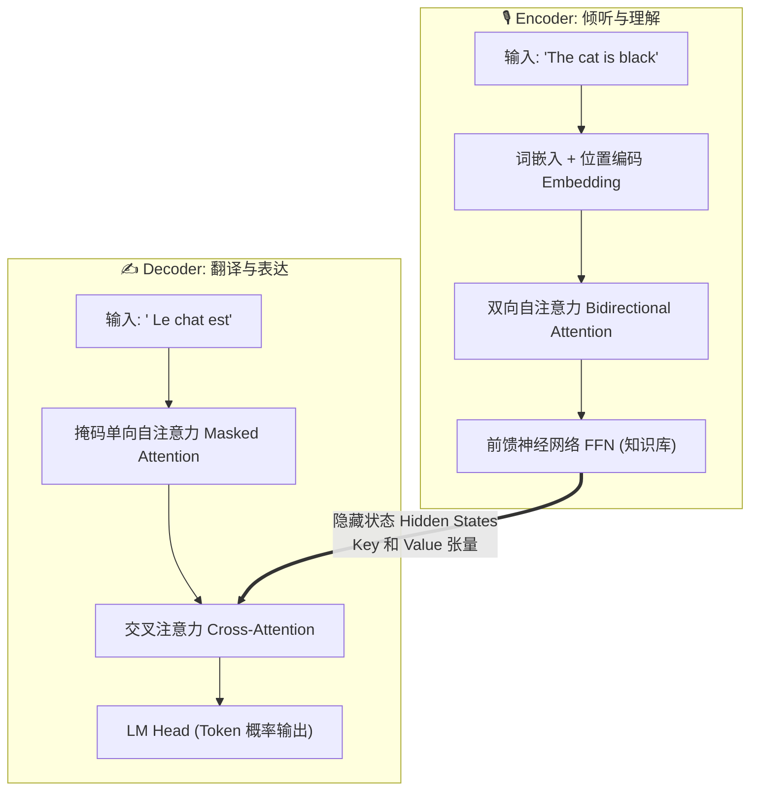
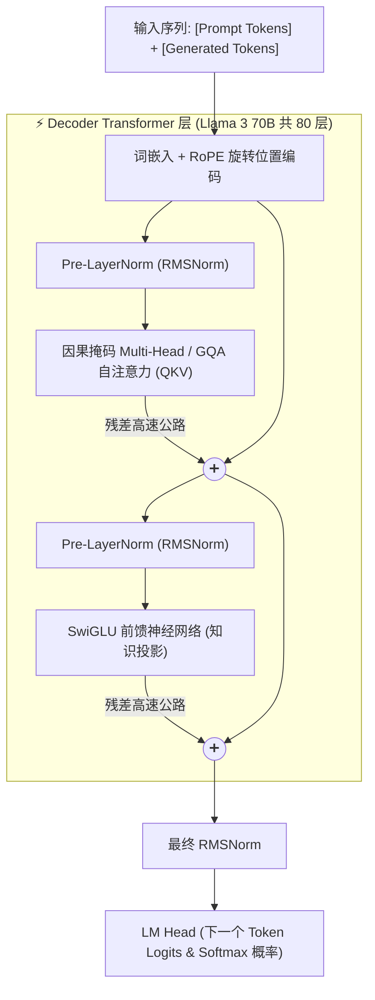
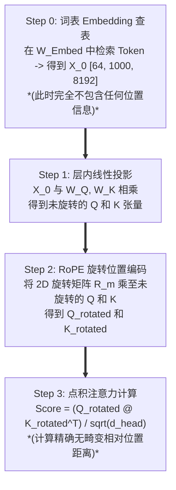
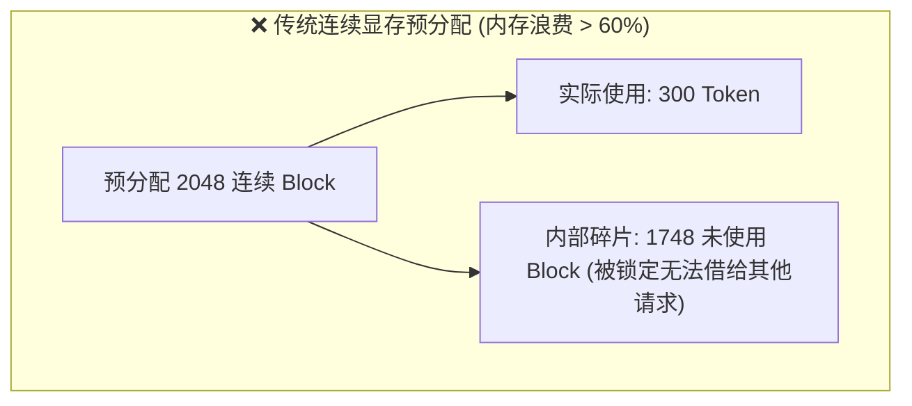

# 模块 1: LLM 推理基础与性能瓶颈

为了理解为什么 **vLLM** 能够彻底变革大语言模型 (LLM) 的服务推理解算，我们必须从第一性原理 (First Principles) 出发建立认知框架。本模块将系统性地连通 Transformer 的底层架构、Self-Attention 的精确数学数据流、生产级推理的性能评估指标，以及困扰传统推理引擎的物理显存与算力瓶颈。

---

## 第 1 部分: Transformer 架构分析与 Self-Attention 机制

在现代大语言模型中，最核心的算力引擎是 **Transformer**，而其最核心的心跳则是 **自注意力机制 (Self-Attention)**。为了理解推理优化，我们必须首先分析数据如何在各层之间流动演变，以及 **Query (`Q`)**、**Key (`K`)** 与 **Value (`V`)** 向量为何呈现出独特的数学行为。

### 1.1 宏观视角: 经典 Encoder-Decoder 与现代 Decoder-Only 架构

原始的 Transformer 论文 (`Vaswani et al., 2017`) 被设计为双塔 **Encoder-Decoder (编码器-解码器)** 架构，专为机器翻译任务 (`例如英译法`) 定制。



我们可以将这种双塔设计类比为 **同声传译**:

1. **左塔: Encoder (编码器，"倾听与理解")**
    - **输入**: 完整的源文本 (`例如 "The cat is black"`)。
    - **核心机制**: **双向无掩码自注意力 (Bidirectional Unmasked Self-Attention)**。每个词可以同时关注其他所有词 (`包括过去和未来的词`)。这种双向全局视角提取了深刻的语义关系与全局上下文。
    - **输出**: 包含高维上下文语义理解的隐藏状态向量 (Hidden State Vectors)。
2. **右塔: Decoder (解码器，"翻译与表达")**
    - **输入**: 此前已生成的译文 (`"<bos> Le chat est"`) 与 Encoder 提供的全局上下文。
    - **核心机制**:
     - **掩码自注意力 (Masked Self-Attention)**: 限制模型*只能关注当前及之前的 Token*，防止其“窥探未来”。这维持了因果律: 在推理生成时，未来的 Token 尚未产生。
     - **交叉注意力 (Cross-Attention)**: 使用 Decoder 当前的 Query 去检索并提取 Encoder 双向隐藏状态中的匹配事实。

#### 为什么现代大模型演化为了 Decoder-Only (单塔) 架构
如果 Encoder 擅长双向全局理解，为什么现代大模型 (`GPT-4, Llama 3, DeepSeek-V3, Mistral`) 完全抛弃了 Encoder，全面转向 **Decoder-Only** 架构？



这反映了人工智能发展史上一次深刻的范式转换:

1. **翻译与续写的统一**: Transformer 诞生之初是为了翻译 (`区分源文本与目标文本`)。而现代 AI 将所有自然语言任务 (`推理、编程、问答、对话`) 统一归纳为了一个简单的“下一个 Token 续写 (Next-Token Completion)”游戏。
2. **结构极简化**: 通过将用户的 Prompt 与模型的 Response 拼接到同一个统一序列中，独立的 Encoder 和 Cross-Attention 模块变得完全多余。
3. **Decoder-Only 架构中 Prefill 与 Decode 的完美协同**:
    - 在 **Prefill (预填充阶段)** (`处理用户 Prompt 时`)，所有 Prompt Token 是一次性同时输入的。尽管注意力掩码在形式上依然是因果下三角矩阵 (`Causal Lower-Triangular`)，但并行处理使得每个 Prompt Token 都能关注到此前所有的历史上下文，达到了与 Encoder 完全媲美的全局理解能力。
    - 在 **Decode (生成阶段)** (`逐个吐出 Token 时`)，因果掩码保证了新生成的 Token 能够无缝关注已缓存的 Prompt 历史，不存在任何结构断层。

---

### 1.2 图书馆类比: Query (`Q`)、Key (`K`) 与 Value (`V`) 的直观物理意义

为了在不卷入繁复线性代数的前提下理解 Self-Attention 的运算本质，我们可以建立一个图书档案检索的类比：

1. **`Q` (Query - 查询向量)**: 检索意图与关键词 (`例如 "降噪蓝牙耳机"`). 它代表*当前 Token 想要从上下文中寻找什么信息*.
2. **`K` (Key - 键向量)**: 档案库中图书的标签、索引或书名 (`例如 档案 A 标签: "有线游戏耳机测评"`, `档案 B 标签: "索尼降噪蓝牙耳机拆解报告"`).
3. **`V` (Value - 值向量)**: 档案袋内部装载的真正有效信息 payload (`例如 档案 B 内部的电路图、声学参数与评估文本`).

在 Self-Attention 的计算过程中：

- 每个 **Query (`Q`)** 与所有 **Key (`K`)** 计算内积，得出 **相似度得分 (Attention Score)** (`即相关性权重`).
- 根据这些相似度权重，对所有 **Value (`V`)** 进行加权线性组合，提取出融合了上下文的全新语义表示向量。

#### 具体词汇示例: "苹果 (Apple)" 的语义漂移
考虑词汇 Token `"苹果"` 在不同上下文语境下的语义偏移：

- **句子 A**: `"在今天的新品发布会上，苹果推出了..."`
- **句子 B**: `"在超市里，我买的那箱苹果非常..."`

当模型处理 Token `"苹果"` 时：

1. **动态 Query 生成 (`Q`)**: `"苹果"` 生成其查询向量，向周围 Token 发出查询，试图搞清自己指的是科技公司还是水果。
2. **点积匹配 (`Q @ K^T`)**:
    - 在 **句子 A** 中，`"苹果"` 的 Query (`Q`) 与 `"发布会"`、`"推出"` 的 Key (`K`) 产生极高的点积相似度得分。
    - 在 **句子 B** 中，该 Query 与 `"超市"`、`"买"` 的 Key 产生极高相似度。
3. **Value 加权提取 (`Weights @ V`)**:
    - 在 **句子 A** 中，高权重倾向于提取 `"发布会"` 的 Value 向量，使 `"苹果"` 的最终表示大幅偏向科技公司。
    - 在 **句子 B** 中，高权重拉取 `"超市"` 的 Value，使 `"苹果"` 偏向水果。

---

### 1.3 数学符号与通用变量命名规范

为了确保本书所有模块在数学推导与架构分析中的绝对严谨性，我们统一采用如下线性代数运算符与通用变量缩写：

#### 1. 运算符规范
- **`@` (矩阵乘法 / 批处理点积)**: 表示标准线性代数矩阵乘法 (`A @ B` 或 `torch.matmul(A, B)`). 例如: `Q = X @ W_Q`, `Score = Q @ K^T`.
- **`(*)` (逐元素 / Hadamard 乘法)**: 表示形状相同的张量在对应坐标上的逐元素点乘 (`A[i,j] * B[i,j]`). 例如: $\text{Activated_Tensor} = \text{SiLU}(\text{Gate_Tensor}) \odot \text{Up_Tensor}$.
- **`*` 与 `/` (标量及算术缩放)**: 表示普通数值或整数缩放 (`Score / sqrt(head_dim)`, `2 * b * s * L * h_kv * d_head`).

#### 2. 通用变量规范对照表
| 通用变量名 | 标准缩写 | 含义说明 | 真实模型参考值 (`Llama 3 70B`) |
| :--- | :--- | :--- | :--- |
| **`batch_size`** | **`b`** | 同时并行处理的并发用户序列数量 (Batch 大小). | `64` |
| **`seq_len`** | **`s`** | 序列总长度 (`Prompt + 已生成 Token 数量`). | `1,000` (或 `4,096`) |
| **`hidden_dim`** | **`d`** | 模型基础隐藏层特征维度 (`hidden_size`). | `8,192` |
| **`num_layers`** | **`L`** | Transformer Block / 层的总数量 (`num_hidden_layers`). | `80` |
| **`num_q_heads`** | **`h_q`** | 每层 Query 注意力 Head 的数量 (`num_attention_heads`). | `64` |
| **`num_kv_heads`** | **`h_kv`** | 每层 Key-Value 注意力 Head 的数量 (`num_key_value_heads`). | `8` (`GQA 8:1`) |
| **`head_dim`** | **`d_head`** | 每个注意力 Head 的子空间维度 (`d_head = hidden_dim / num_q_heads`). | `128` |
| **`intermediate_dim`** | **`d_ffn`** | FFN 前馈神经网络的内部展开维度 (`SwiGLU intermediate_size`). | `28,672` |

---

### 1.4 完整执行生命周期: Token 词嵌入 vs. 位置编码

为了追踪原始文本如何进入 Transformer 并转化为动态 Activation 向量，我们必须严格区分初始词表中检索 (`Step 0`) 与位置信息注入 (`Step 2`):



#### 1. 一个 4,096 维的 Token 向量 (`X`) 究竟长什么样？
当 `X_0` 从 `W_Embed` 中被查表检索出来时，它绝不是一个简单的数字，而是一个包含 4,096 (在 Llama 3 70B 中为 8,192) 个连续浮点数的 1D 张量：

```python
# 形状: [4096], 数据类型: float16 (半精度浮点数)
token_embedding_X = torch.tensor([
     0.1426,  -1.2031,   0.0842,  -0.4453,   2.1133,   0.0031,  -0.9121,
     0.5518,   1.8848,  -0.1104,   0.7324,  -2.0195,   0.3120,   0.0098,
    ..., 
    -0.0192,   0.8877,  -0.3340,   1.4121,  -0.6611,   0.0412,   0.1992
])
# |---------------- 包含恰好 4,096 个浮点数值 ----------------|
```

这个数组在物理上代表 **4,096 维语义向量空间中的一个几何坐标**。每个索引对应一个抽象的语义特征维度。由于 `"苹果"` (`科技公司`) 与 `"微软"` 在科技公司维度上拥有相似的坐标值，它们的几何向量在空间中指向几乎相同的方向 (`高余弦相似度`)。

#### 2. 初始 Activation 张量的显存占用
在 `FP16` (`半精度`) 模式下，每个浮点数占用 **2 字节** 的物理显存 (`sizeof(dtype) = 2`):

$$
\text{每个 Token Embedding 显存} = 4,096 \text{ 参数} \times 2 \text{ 字节} = \mathbf{8,192 \text{ 字节} \ (8 \text{ KB})}
$$

当一个由 `1,000` 个 Token 组成的 Prompt 在 70B 模型 (`hidden_dim = 8192`) 中以 `batch_size = 64` 运行时，初始 Embedding 查表会产生一个 3D Activation 张量 `[batch_size, seq_len, hidden_dim]`：

$$
X \text{ 形状} = [64, 1000, 8192] \implies 524,288,000 \text{ 个浮点数} \approx \mathbf{1.048 \text{ GB (FP16 模式下)}}
$$

#### 3. 为什么 `RoPE` 是作用在 `Q` 和 `K` 上，而不是 `X_0` 上？
请注意，在 Step 0 刚查表得出 `X_0` 时，`X_0` **完全不含位置信息**。如果像传统的 BERT 那样直接将位置编码加在 `X_0` 上，位置信号在经过后续 80 层连续的 `W_Q` 和 `W_K` 线性投影时会遭受严重的线性扭曲。

而将 `RoPE` 直接作用在点积计算前夕的 `Q` 和 `K` 上 (`Score = Q @ K^T`)，正交旋转代数特征保证了最终的内积能够精准反映无扭曲的相对序列距离 ($m - n$)。

#### 4. $R_m$ 矩阵的精确维度与 `RoPE` 如何在 `head_dim = 128` 内部旋转
当在计算 Key Head 的 $k_{m, \text{after}} = R_m @ k_{m, \text{before}}$ 时，$R_m$ 的精确维度是什么？

- 在 `GQA` 中，每个 Token 包含 `num_kv_heads = 8` 个 Key Head (`[8, 128]`)。`RoPE` **绝不会**跨越不同的 Head 进行旋转 (`Axis h = 0..7`)，因为每个 Head 编码独立的语义领域 (`例如 Head 0 跟踪语法，Head 1 跟踪实体关系`)，跨 Head 混合会破坏领域独立性。
-相反，`RoPE` **严格在每个 Head 内部的 `128` 个特征坐标 (`Axis m = 0..127`) 上进行**。对于单个 Head 向量 $k$ (`形状 [128]`)，`RoPE` 将这 `128` 个坐标两两配对，划分为 **`64` 个独立的 2D 旋转平面**: $(k_0, k_1), (k_2, k_3), \dots, (k_{126}, k_{127})$。
- 对于处于序列位置 $m$ 的 Token，每个 2D 坐标对 $i$ (`从 0 到 63`) 乘以一个角频率为 $\theta_i$ 的 **`2x2` 旋转块**:

$$
\begin{bmatrix} k_{2i, \text{after}} \\ k_{2i+1, \text{after}} \end{bmatrix} = \begin{bmatrix} \cos(m \cdot \theta_i) & -\sin(m \cdot \theta_i) \\ \sin(m \cdot \theta_i) & \cos(m \cdot \theta_i) \end{bmatrix} \begin{bmatrix} k_{2i, \text{before}} \\ k_{2i+1, \text{before}} \end{bmatrix}
$$

- 因此，当写成作用在整个 `128` 维 Head 向量上的统一矩阵时，$R_m$ 是一个 **包含 64 个 `2x2` 旋转块的 `[128, 128]` 块对角矩阵**:

$$
R_m = \begin{bmatrix}
R(m, \theta_0) & 0 & \dots & 0 \\
0 & R(m, \theta_1) & \dots & 0 \\
\vdots & \vdots & \ddots & \vdots \\
0 & 0 & \dots & R(m, \theta_{63})
\end{bmatrix}, \quad \text{其中 } R(m, \theta_i) = \begin{bmatrix} \cos(m\theta_i) & -\sin(m\theta_i) \\ \sin(m\theta_i) & \cos(m\theta_i) \end{bmatrix}
$$

- 由于所有 `64` 个 Query Head 和 `8` 个 Key Head 都独立经历这个 `[128, 128]` 旋转，Head 维度 (`64` 或 `8`) 在 `RoPE` CUDA Kernel 中充当并行 Batch 索引。此外，在自回归解码期间，历史 Key $k_0, k_1, \dots, k_{n-1}$ 在 Step $n$ **不需要**重新旋转；它们旋转后的向量 ($R_m @ k_m$) 在最初生成时就已经永久写入了 `KV` Cache，使得引擎能够直接计算 $\text{Score} = (R_n @ q_n) @ k_{m, \text{cached}}^T$。

---

### 1.5 注意力投影的张量维度与物理意义

为了理解显存体积如何在每一层内部扩展，让我们跟踪静态模型权重与动态 Activation 向量的精确维度 (`使用 Llama 3 70B 规格: hidden_dim = 8192, num_q_heads = 64, num_kv_heads = 8, head_dim = 128`):

| 张量 / 投影 | 基础维度公式 | Llama 3 70B 形状 (GQA 8:1) | 物理显存影响 |
| :--- | :--- | :--- | :--- |
| **输入 Activation ($X$)** | $[\text{batch}, \text{seq}, d_{\text{hidden}}]$ | $[64, 1000, 8192]$ | $1.048 \text{ GB (FP16)}$ |
| **Query 权重 ($W_Q$)** | $[d_{\text{hidden}}, N_q \cdot d_{\text{head}}]$ | $[8192, 8192]$ | 每层 $134.2 \text{ MB}$ |
| **Key 权重 ($W_K$)** | $[d_{\text{hidden}}, N_{kv} \cdot d_{\text{head}}]$ | $[8192, 1024]$ | **每层 $16.8 \text{ MB}$ (小了 8 倍!)** |
| **Value 权重 ($W_V$)** | $[d_{\text{hidden}}, N_{kv} \cdot d_{\text{head}}]$ | $[8192, 1024]$ | **每层 $16.8 \text{ MB}$ (小了 8 倍!)** |
| **Output 权重 ($W_O$)** | $[d_{\text{hidden}}, d_{\text{hidden}}]$ | $[8192, 8192]$ | 每层 $134.2 \text{ MB}$ |

#### 1. 静态权重 vs. 动态向量 (`关键概念界限`)
- `W_Q`, `W_K`, `W_V`, `W_O` (`[8192, 8192]` 和 `[8192, 1024]`) 是 **静态模型参数**。它们在训练完成后固定驻留在 GPU 显存 (`HBM`) 中，充当通用的线性投影算子。
- `Q`, `K`, `V` (`[64, 64, 1000, 128]` 和 `[64, 8, 1000, 128]`) 是 **动态生成的 Activation 向量**。它们在运行时针对所有活跃序列的每个具体 Token 实时计算得出。

#### 2. 为什么在 Reshape 之后 `num_heads` 会被调整到 `seq_len` 之前？
当最初计算出 `Q = X @ W_Q` 时，其形状为 `[batch_size, seq_len, hidden_dim]` (`[64, 1000, 8192]`)。现代架构不会将其保持为 `[batch_size, seq_len, num_q_heads, head_dim]`，而是统一转置为 `[batch_size, num_q_heads, seq_len, head_dim]`。

这种转置源于 GPU **批处理矩阵乘法 (`BMM`)** 操作 (`torch.matmul` 或 `A @ B`) 的底层执行机制：

1. **`BMM` 规则**: 在高性能线性代数库 (`cuBLAS, PyTorch`) 中，多维张量上的矩阵乘法 `A @ B` **仅在最后两个维度 (`[-2, -1]`) 上执行**。前面所有的前导维度 (`[:-2]`) 均被视为独立的并行 Batch 索引。
2. **必需的点积配对**: 对于每个单独的注意力 Head `h`，Head `h` 的 Query 矩阵 (`[seq_len, head_dim]`) 必须乘以 Head `h` 转置后的 Key 矩阵 (`[head_dim, seq_len]`)。
3. **为什么转置是强制性的**:
    - 通过转置 `seq_len` 与 `num_heads` 产生 `[batch_size, num_heads, seq_len, head_dim]`，最后两个维度变成了 `[seq_len, head_dim]`。因此，`torch.matmul(Q, K^T)` 将 `[batch_size, num_heads]` (`[64, 64]`) 视为独立的并行 Batch 索引，使 GPU 能够跨 Tensor Core 并行并发执行 `64 * 64 = 4,096` 个独立的 `[1000, 128] @ [128, 1000]` 矩阵乘法。

---

## 第 2 部分: KV Cache 数学推导与显存消耗

自回归解码的逐 Token 生成特性使得 **KV Cache** 成为影响并发吞吐的核心显存消耗源。

### 2.1 为什么必须缓存 Key 和 Value 张量？

在自回归解码中，为了生成第 $n$ 个 Token，模型需要计算 Query $q_n$ 与历史所有 Key $k_1, \dots, k_n$ 的注意力分数，并对 Value $v_1, \dots, v_n$ 进行加权求和。

若不缓存过去的 Key 与 Value 向量：
- 生成第 1 个 Token: 计算 $k_1, v_1$
- 生成第 2 个 Token: 重新计算 $k_1, v_1$，新计算 $k_2, v_2$
- 生成第 $N$ 个 Token: 重新计算 $k_1 \dots k_{N-1}$，新计算 $k_N, v_N$

无缓存时的总计算复杂度为 $\mathcal{O}(N^2)$。通过将已计算的 $k_i, v_i$ 向量永久保存在显存中，解码阶段每一步仅需为新 Token 计算单组 $q_n, k_n, v_n$，计算复杂度降为 $\mathcal{O}(N)$。

---

### 2.2 KV Cache 显存体积精确计算公式

对于运行在 FP16/BF16 精度 (每参数 2 字节) 下的模型，KV Cache 的物理显存字节数公式为：

$$
\text{KV_Bytes} = 2 \cdot b \cdot s \cdot L \cdot h_{\text{kv}} \cdot d_{\text{head}} \cdot 2 \text{ 字节}
$$

其中：
- $b$: Batch 大小 (`batch_size`)
- $s$: 序列长度 (`seq_len`)
- $L$: 模型层数 (`num_layers`)
- $h_{\text{kv}}$: KV Head 数量 (`num_kv_heads`)
- $d_{\text{head}}$: Head 维度 (`head_dim`)

#### 实例计算: Llama 3 70B (GQA 8:1, FP16)
参数规格: $L = 80, h_{\text{kv}} = 8, d_{\text{head}} = 128$

对单条序列 ($b = 1$) 在不同上下文长度 $s$ 下的 KV Cache 显存开销：

$$
\text{KV_Bytes_per_token} = 2 \times 1 \times 1 \times 80 \times 8 \times 128 \times 2 = \mathbf{327,680 \text{ 字节/Token}} \ (\approx 320 \text{ KB/Token})
$$

- **$s = 4,096$**: $4096 \times 320 \text{ KB} = \mathbf{1.31 \text{ GB}}$
- **$s = 32,768$**: $32768 \times 320 \text{ KB} = \mathbf{10.48 \text{ GB}}$
- **$s = 128,000$**: $128000 \times 320 \text{ KB} = \mathbf{40.96 \text{ GB}}$

当并发 Batch $b = 64$、上下文长度 $s = 4,096$ 时，仅 KV Cache 就需要消耗 **$83.8 \text{ GB}$ 显存**！这解释了为什么 KV Cache 显存管理是推理引擎性能瓶颈的核心所在。

---

## 第 3 部分: 内存受限 (Memory-Bound) 与计算受限 (Compute-Bound) 范式

LLM 推理包含两个物理特性截然不同的阶段：**Prefill (预填充阶段)** 与 **Decode (解码阶段)**。

### 3.1 Roofline 模型与算术强度 (Arithmetic Intensity)

**算术强度 (Arithmetic Intensity, $I$)** 定义为算法在硬件上执行的浮点运算次数与传输的内存字节数之比：

$$
I = \frac{\text{FLOPs}}{\text{Memory Bytes Transferred}} \quad \left[\text{FLOPs / Byte}\right]
$$

硬件存在一个 **转折点 (Ridge Point)** $I_{\text{ridge}}$：

$$
I_{\text{ridge}} = \frac{\text{ Peak Compute Speed (TFLOPs/s)}}{\text{Peak Memory Bandwidth (TB/s)}}
$$

- 若 $I > I_{\text{ridge}}$: 算法运行在 **计算受限 (Compute-Bound)** 区域，GPU Tensor Core 满载运行。
- 若 $I < I_{\text{ridge}}$: 算法运行在 **内存/带宽受限 (Memory-Bandwidth Bound)** 区域，GPU 核心大量时间处于空闲停顿，等待数据从 HBM 传输。

#### H100 SXM5 硬件转折点
- 峰值 FP16 算力: $989 \text{ TFLOPs/s}$
- 峰值 HBM3 带宽: $3.35 \text{ TB/s}$

$$
I_{\text{ridge, H100}} = \frac{989 \times 10^{12}}{3.35 \times 10^{12}} \approx \mathbf{295 \text{ FLOPs / Byte}}
$$

---

### 3.2 Prefill vs. Decode 阶段对比

| 阶段维度 | Prefill 阶段 (Prompt 处理) | Decode 阶段 (Token 生成) |
| :--- | :--- | :--- |
| **输入 Token 数量** | 一次性输入全部 Prompt ($s_{\text{prompt}}$ 个 Token) | 每次仅输入 1 个 Token ($b$ 个序列共 $b$ 个 Token) |
| **矩阵运算形状** | 大 GEMM 矩阵乘法 ($y = X @ W$, $X \in \mathbb{R}^{s \times d}$) | 向量-矩阵乘法 GEMV ($y = x @ W$, $x \in \mathbb{R}^{1 \times d}$) |
| **算术强度 ($I$)** | **极高** ($I \gg 295 \text{ FLOPs/Byte}$) | **极低** ($I \approx 1 \dots 64 \text{ FLOPs/Byte}$) |
| **硬件运行状态** | **Compute-Bound (计算受限)** | **Memory-Bandwidth Bound (带宽受限)** |
| **GPU 利用率** | **100% Tensor Core 满载** | **$< 10\%$ 核心利用率** (核心闲置等待 HBM 权重) |
| **瓶颈决定因素** | GPU TFLOPs 算力 | HBM 显存读写带宽 (TB/s) |

---

## 第 4 部分: 传统推理服务的失败案例与显存碎片

在 vLLM 问世之前，传统的 LLM 推理框架 (如 HuggingFace Pipelines、早期的 FasterTransformer) 沿用了 DL 训练的连续内存分配范式，导致严重的显存浪费。

### 4.1 连续显存预分配的缺陷

传统框架必须在请求到达时，根据模型支持的最高上下文长度 (`max_seq_len`, 如 2048 或 4096)，在 HBM 中预分配一整块**物理连续**的 KV Cache 空间。



### 4.2 内存碎片的两种形式

1. **内部碎片 (Internal Fragmentation)**:
   为请求预分配了 2048 长度的连续显存，但请求在生成 300 个 Token 后就触发 EOS 终止。剩余 1748 个 Token 的显存空间在整个请求生命周期内被完全锁定，无法分配给其他请求。
2. **外部碎片 (External Fragmentation)**:
   随着请求不断创建与销毁，显存中散落着许多小的闲置空隙。当新请求到达需要 2048 长度的连续空间时，即使显存中闲置的总容量足够，也因**无法找到足够长的连续物理地址**而拒绝请求 (无法提高并发 Batch)。

这种传统的连续内存分配方式使得 GPU 的实际并发能力被严重低估，显存利用率通常低于 20%–40%。这促成了 vLLM 及 **PagedAttention** 技术的诞生。
