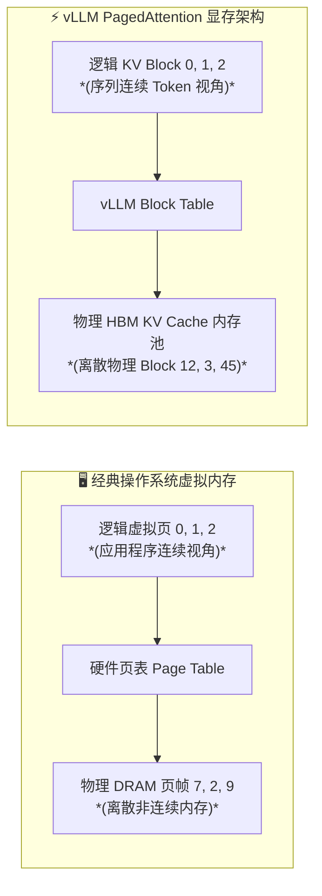
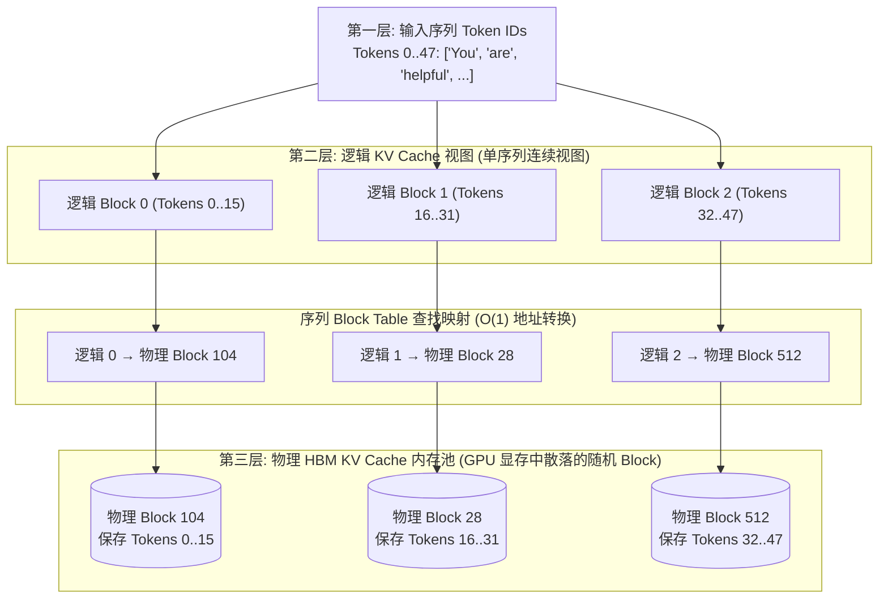
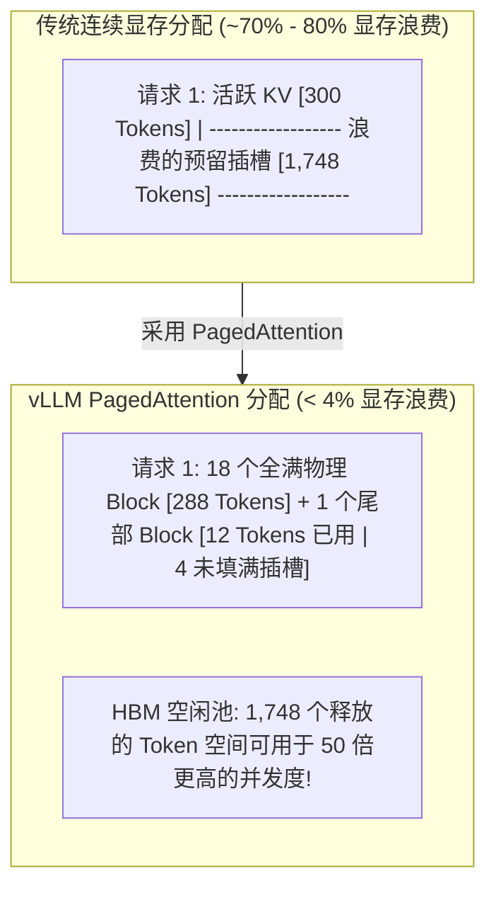
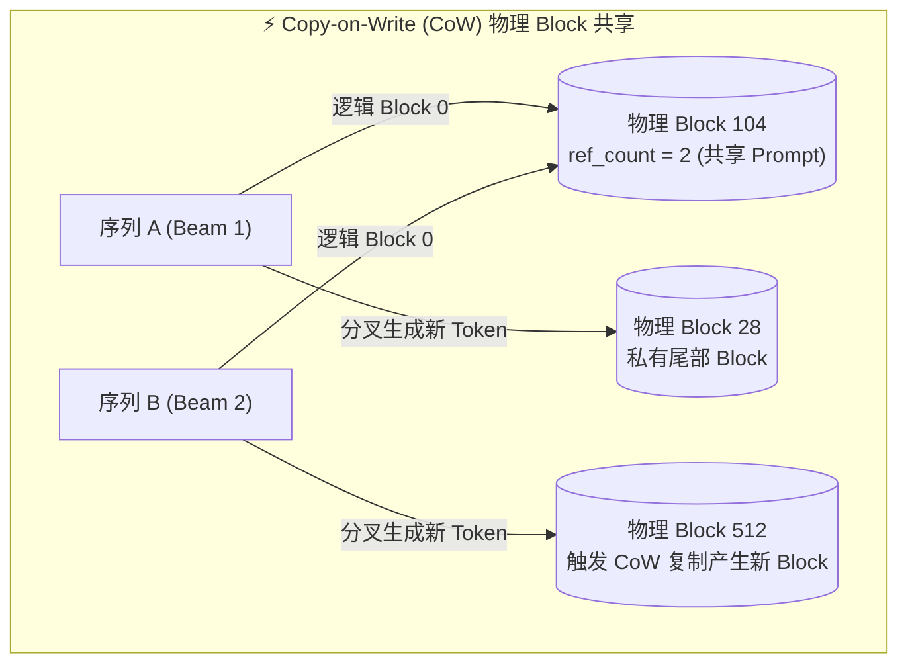
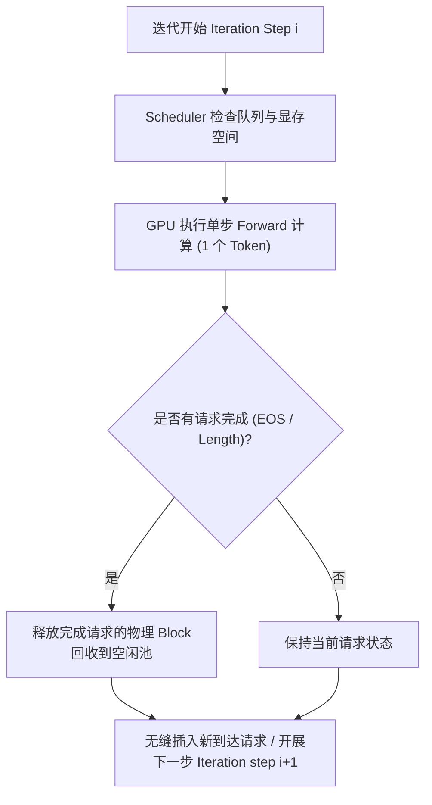

# 模块 2: vLLM 核心架构与 PagedAttention 机制

虽然在 **模块 1** 中我们已经推导得出：大语言模型 (`LLM`) 的自回归解码在物理上受限于显存带宽，并且在传统的连续显存分配下饱受 `> 70%` 的 Key-Value (`KV`) Cache 显存碎片困扰，但本模块将深入探索彻底解决这一历史难题的突破性架构：**vLLM**。

通过将经典操作系统的虚拟内存分页 (Paging) 范式引入神经网络注意力机制的执行中，vLLM 彻底解耦了逻辑序列顺序与物理高带宽显存 (`HBM`) 的布局。本模块将系统性拆解 **PagedAttention** 的架构机制、**Block Manager** 的显存分配策略，以及 **Continuous Batching** 的动态调度编排。

---

## 第 1 部分: 操作系统类比: LLM 中的虚拟内存分页

为了理解 vLLM 如何消除显存碎片，我们首先需要审视为什么连续内存分配会在变长 Token 生成过程中失效，以及经典操作系统设计原则如何给出了优雅的解法。

### 1.1 经典内存墙回顾: 为什么连续分配会失败

在传统推理引擎 (`例如原生 PyTorch 或早期的 FasterTransformer`) 中，张量在 `HBM` 显存中必须占用连续的物理地址范围。当服务生成长度无法提前预知的动态用户请求时，显存分配器必须根据模型的最高上下文长度 (`max_seq_len`, 如 `2,048` 或 `8,192` 个 Token) 预留一整块连续显存。

正如 **模块 1** 中所推导的，这种静态预分配会导致两种致命的显存浪费形式：

1. **内部碎片 (`> 60% 至 80%` 浪费)**: 发生在**已分配物理显存区域内部**的浪费。如果一个请求在到达时预分配了 `2,048` 个 Token 位置的连续空间，但最终在生成 `50` 个 Token 后就终止 (`总长度 = 350 Token`)，那么在其分配边界内部剩余的 `1,698` 个预留位置将在该请求的整个生命周期内空置并被锁定。
2. **外部碎片 (`> 5% 至 10%` 浪费)**: 发生在**所有已分配显存区域之外**的浪费。随着动态请求异步完成并释放其连续内存块，`HBM` 显存变得散落着不连续的空闲碎片。一个需要 `4,096` 个 Token 连续空间的新请求，即使显存中散落的所有空闲碎片相加超过 `10,000` 个 Token 空间，也会直接因触发显存不足 (`OOM`) 而失败！

由于 `> 70%` 的 `KV` Cache 显存因碎片化而损失，传统引擎会过早耗尽显存预算，将并发 Batch 大小 (`batch_size = b`) 限制在极低水平 (`如 b = 16`)。在低 Batch 大小下，GPU 的算术强度远低于转折点 ($I \ll I_{\text{ridge}}$)，导致 Tensor Core 硬件核心大量闲置停顿。

---

### 1.2 操作系统的虚拟内存范式

在 20 世纪 60 年代，当多个程序在中央处理器 (`CPU`) 上并发运行时，计算机科学家们也面临着完全相同的内存死锁。如果每个应用程序都要求物理动态随机存取内存 (`DRAM`) 中有一整块连续的空间，内存空间就会迅速碎片化，限制多任务并发能力。

操作系统通过引入 **虚拟内存分页 (Virtual Memory Paging)** 解决了这一难题：

1. **分页 (Paging)**: 物理 `DRAM` 被切分为固定大小的块，称为 **物理页帧 (Physical Frames)** (`例如 4 KB 的页`)。同时，每个程序的内存空间被切分为相同大小的连续 **逻辑页 (Logical Pages)**。
2. **页表转换 (Page Table Translation)**: 硬件/软件映射表 (`Page Table`) 能够在 $\mathcal{O}(1)$ 时间内将逻辑页地址转换为物理页帧地址。
3. **解耦 (Decoupling)**: 由于任何逻辑页都可以映射到任何任意的物理页帧，程序的逻辑地址空间在应用程序看来是连续的，而其真正的物理数据则散落分布在物理 DRAM 中不连续的任意位置。

**vLLM** 将这一操作系统概念直接适配到了 Transformer 的注意力机制执行中，为 GPU `HBM` 中的高维 Key/Value 张量打造了一个专属的虚拟内存管理器。

---

### 1.3 逻辑 Block 与物理 KV Block (`三层架构剖析`)

为了掌握 vLLM 如何解耦序列顺序与硬件显存布局，我们必须深入分析 **逻辑 Token 序列**、**逻辑 KV Cache 视图** 与 **物理 KV Cache 内存池** 之间的精确映射关系。

在传统的连续显存引擎中，输入文本 Token 序列与其对应的 Key/Value Cache 向量被强制共享完全相同的物理内存布局：如果 Token 坐标 `0 到 47` 在序列顺序上是连续的，它们的 `KV` Cache 向量就必须保存在连续的 `HBM` 显存地址上。

**vLLM 通过将序列对 `KV` Cache 的逻辑视图与 GPU 对该 `KV` Cache 的物理存储划分为三个独立的架构层，彻底打破了这一绑定关系：**

#### 1. 详细架构层定义与职责
- **第一层: 逻辑 Token 序列 (`100% 连续`)**:
  代表真正的整数 Token ID 序列 (`例如 Token 0 = "You"`, `Token 1 = "are"`)。在定义上，文本是按顺序读取和生成的；因此，Token 序列在逻辑上是严格连续的 (`Token 索引 0, 1, 2, ..., N`)。

- **第二层: 逻辑 KV Cache 视图 (`100% 连续的虚拟地址空间`)**:
  这是 **序列及注意力公式 (`Q @ K^T`) 看待其 Key 和 Value 向量的方式**。

    - 在序列的虚拟视图内部，其 `KV` Cache 被切分为包含 `block_size` 个 Token 的连续小块 (`通常 block_size = 16`)，称为 **逻辑 Token/KV Block**。
    - `逻辑 Block 0` 保存 Token `0..15` 的逻辑 `KV` 向量。
    - `逻辑 Block 1` 保存 Token `16..31` 的逻辑 `KV` 向量。
    - `逻辑 Block 2` 保存 Token `32..47` 的逻辑 `KV` 向量。
    - 从注意力算法和应用程序的角度来看，`逻辑 Block 0` 与 `逻辑 Block 1` 是紧密相邻的，构成了跨越输入 Prompt Token (`逻辑 Block 0 和 1`) 与生成 Decode Token (`逻辑 Block 2`) 的无缝连续逻辑 `KV` 序列。

- **第三层: 物理 KV Cache 内存池 (`GPU HBM 中离散分布的物理 Block`)**:
  代表 GPU `HBM` 显存内部的物理现实。一个 **物理 KV Block** 是从 vLLM 预留的显存池中分配的固定大小物理 GPU 显存块 (`例如在 Llama 3 70B 上每个物理 Block 为 5.24 MB`)。

    - 当 GPU 计算 `逻辑 Block 0` (`Tokens 0..15`) 的 `KV` 向量时，这些数字在物理显存中保存在哪里？它们被直接写入从空闲池中分配的一个物理位置 (`例如 物理 Block 104`)。
    - 当处理 `逻辑 Block 1` (`Tokens 16..31`) 时，其 `KV` 向量被写入另一个任意的物理位置 (`例如 物理 Block 28`)。
    - 物理 Block `104` 和 `28` 可以分布在物理 `HBM` 显存中完全不同、互不连续的地址上！

#### 2. 关键概念澄清: Prompt Token 与生成 Token 的统一映射
一个常见的认知误区是认为“逻辑 Block 用于 Prompt Token，而物理 Block 用于生成的 KV Cache”，或者认为 Prompt Token 与生成 Token 在逻辑与物理结构上的映射方式不同。**两者在结构上没有任何区别；Prompt Token 与生成 Token 完全相同地使用逻辑 Block 和物理 KV Block！**

1. **两个阶段使用相同的抽象原语**:
   整个序列中的每个 Token (`无论是 Prompt Token 还是新生成的 Token`) 都保存在其连续虚拟地址空间中的一个 **逻辑 Block** 内部 (`例如 逻辑 Block 0 中的 Tokens 0..15，逻辑 Block 3 中的 Tokens 48..63`)。对于每一个逻辑 Block (`Prompt 或 生成的`)，vLLM 都会在 `HBM` 中精准分配一个 **物理 KV Block** 来永久保存其计算出的 Key 和 Value 向量。

2. **唯一的区别在于分配的时间节点 (`Prefill 与 Decode 的生命周期`)**:
    - **对于 Prompt Tokens (`Prefill 预填充阶段`)**: 由于所有 Prompt Token (`例如 48 个 Token`) 在请求准入时是一次性同时到达的，Block Manager 会将其划分为 `3` 个逻辑 Block (`逻辑 Block 0, 1, 2`)，同时从空闲池中分配 `3` 个物理 Block (`例如 物理 Block 104, 28, 45`)，并在单次 Prefill 前向计算中填满这 48 个 Token 的 `KV` 向量。
    - **对于生成的 Tokens (`Decode 解码阶段`)**: 随着新 Token 被逐个吐出 (`Token 48, Token 49...`)，它们进入新的逻辑 Block (`例如 逻辑 Block 3`)。当生成 `Token 48` (`逻辑 Block 3 的第一个 Token`) 时，Block Manager 会在运行时动态分配 `1` 个新的物理 Block (`例如 物理 Block 512`)，并在接下来的 16 个生成步骤中逐个插槽填满它 (`已填充 Token 数 = 1, 2, ..., 16`)。一旦在 Token `63` 填满，生成 Token `64` (`逻辑 Block 4 的第一个 Token`) 将触发下一个物理 Block 的分配。

---

### 1.4 Block Table: O(1) 逻辑到物理地址转换

为了追踪逻辑 Block 如何映射到离散的物理 Block，vLLM 为每个活跃序列维护了一个轻量级的元数据结构：**Block Table (块表)**。

对于每个活跃的用户请求 (`序列 i`)，Block Table 保存：

1. **`physical_block_id` 数组**: 一个有序数组，其中索引 `j` 包含分配给逻辑 Block `j` 的物理 Block 索引。
2. **`num_filled_tokens`**: 一个整数，指示当前在最新分配的 Block (`活跃生成 Block`) 内部已填充了多少个 Token 插槽 (`0 到 block_size`)。
3. **`ref_count`**: 引用计数器，记录当前有多少个独立的逻辑序列指向该具体的物理 Block (`对于 Copy-on-Write 共享至关重要，将在第 3 部分探索`)。

| 逻辑 Block 索引 | 包含的 Token IDs | 分配的物理 Block ID | 已填充 Token 数 (`num_filled_tokens`) | 引用计数 (`ref_count`) | Block 状态 |
| :--- | :--- | :--- | :--- | :--- | :--- |
| **逻辑 Block 0** | `Tokens [0 .. 15]` | **物理 Block 104** | `16 / 16` | `1` (私有) | **已满 / 只读** |
| **逻辑 Block 1** | `Tokens [16 .. 31]` | **物理 Block 28** | `16 / 16` | `1` (私有) | **已满 / 只读** |
| **逻辑 Block 2** | `Tokens [32 .. 36]` | **物理 Block 512** | **`5 / 16`** | `1` (私有) | **活跃生成尾部** |

当注意力 Kernel 需要获取 Token 位置 `p` (`例如 Token 索引 p = 25`) 的历史 Key/Value 向量时，它通过简单的取整与取模运算计算逻辑索引 ($\mathcal{O}(1)$ 复杂度)：

- $\text{logical_block_index} = \lfloor p / \text{block_size} \rfloor = \lfloor 25 / 16 \rfloor = \mathbf{1}$
- $\text{token_offset_in_block} = p \bmod \text{block_size} = 25 \bmod 16 = \mathbf{9}$
- $\text{physical_block_index} = \text{Block_Table}[\text{logical_block_index}] = \text{Block_Table}[1] = \mathbf{\text{物理 Block } 28}$
- $\text{exact_hbm_address} = \text{HBM_Base_Address} + (28 \times \text{Block_Byte_Size}) + (9 \times \text{Token_Byte_Size})$

---

### 1.5 显存浪费消除的定量推导

通过从连续预分配 (`max_seq_len`) 转向按需物理 Block 分配 (`block_size = 16`)，vLLM 根本性地改变了显存浪费的数学机制：

1. **零外部碎片 (`0% 浪费`)**:
   由于 PagedAttention 通过 Block Table 跨离散物理 Block 计算注意力，因此在 `HBM` 显存中对 Block 之间的物理连续性**没有任何要求**。此外，内存池中的每一个物理 Block 都有完全相同、固定的字节大小 (`block_size * bytes_per_token`，如 `5.24 MB`)。`HBM` 中任何位置的任何空闲物理 Block 都可以满足任何需要显存的请求。因此，外部碎片被降低到了 **恰好 0%**。

2. **严格受控的内部碎片 (`< 4% 浪费`)**:
   由于仅在序列溢出到新的逻辑 Block 时才动态分配物理 Block，因此所有已满的物理 Block 都不存在内部碎片，内部碎片被**严格隔离在每个序列的最后一个物理 Block (活跃尾部 Block)** 内部。

    - 对于任何活跃序列，在活跃尾部 Block 内部最多只有 `block_size - 1` 个 Token 插槽 (`16 - 1 = 15 个插槽`) 未被填满。
    - 对于平均长度 $s = 512$ 个 Token 的序列，平均浪费 $7.5$ 个 Token 插槽 ($15 / 2$) 带来的内部碎片率为：

$$
\text{平均内部碎片率} = \frac{7.5 \text{ 浪费插槽}}{512 \text{ 总插槽}} \approx \mathbf{1.46\%} \text{ 显存浪费!}
$$

通过释放原本被冻结的 `> 70%` 的 `HBM` 显存容量，vLLM 使得推理服务器能够在完全相同的硬件上将并发 Batch 大小 (`batch_size = b`) 从 `b = 16` 提升至 `b = 128+`，打满硬件芯片算力 (`TFLOPs`) 并大幅降低单 Token 生成成本。

---

## 第 2 部分: PagedAttention Kernel 架构与硬件执行

虽然 OS 分页在 CPU 上已经非常成熟 (`由硬件内存管理单元 MMU 与快表 TLB 自动处理`)，但 GPU 缺乏用于高维张量执行的物理硬件页表。因此，为 LLM 实现虚拟分页需要设计自定义的、融合的 CUDA/ROCm Kernel，能够在注意力计算期间动态完成虚拟到物理地址的转换：即 **PagedAttention**。

### 2.1 传统 FlashAttention vs. PagedAttention 执行机制

为了理解 PagedAttention 的独特之处，我们必须将其执行约定与标准高性能 Kernel (如 **FlashAttention (`Dao et al., 2022`)**) 进行对比：

1. **FlashAttention 的物理连续性约定**:
   标准 FlashAttention 通过在片上 GPU 静态随机存取内存 (`SRAM / Shared Memory`) 内部分块 (Tiling) 计算注意力，实现了极高的计算速度 (`TFLOPs`)。然而，FlashAttention 的指针明确要求跨序列长度 $s$ 的 Key (`K`) 和 Value (`V`) 张量在 **物理 `HBM` 显存中必须严格连续**。CUDA Kernel 沿着连续的地址增量向前推进指针 (`K_ptr + tile_offset`)，如果 `KV` Block 散落保存在显存中，该 Kernel 将完全无法运行。

2. **PagedAttention 的间接寻址约定**:
   PagedAttention 修改了 FlashAttention 的 SRAM Tiling 算法，**引入了通过 Block Table 的间接指针转换**。PagedAttention CUDA 线程块不再沿着 $s$ 推进单个连续指针，而是将序列的 Block Table 读取到寄存器/SRAM 中，动态将逻辑 Block 索引转换为物理 Block 指针，并将离散的 `HBM` 内存块实时加载到片上 `SRAM` Tile 中。

---

## 第 3 部分: Block Manager 内存分配器与进阶工作流

vLLM 中的 **Block Manager** 担当着显存管理器的角色。它负责维护物理显存池、更新 Block Table、处理分支采样，并在显存不足时执行抢占。

### 3.1 Copy-on-Write (CoW) 机制

在 **并行采样 (Parallel Sampling)**、**Beam Search** 或 **多轮对话共享 System Prompt** 场景下，多个请求或分支序列包含完全相同的 Prompt Token。

1. **零内存开销共享**: 当两个 Beam 分支共享前 512 个 Token 时，Block Manager 简单地将两个序列的 Block Table 指向**相同的物理 Block**，并将这些物理 Block 的 `ref_count` 增加到 2。
2. **触发写时复制 (CoW)**: 当序列 A 和序列 B 开始生成不同的新 Token 时，对于共享的已满 Block，无需复制代码 (`只读`)；对于分叉处的尾部 Block，Block Manager 触发 **Copy-on-Write**，将物理 Block 复制一份给序列 B，将 `ref_count` 降回 1，从而实现零显存浪费的分支生成！

---

### 3.2 自动前缀缓存 (Automatic Prefix Caching - APC)

在生产环境中，大量不同的 API 请求通常共享相同的系统提示词 (System Prompt)。

vLLM 的 **自动前缀缓存 (APC)** 机制会自动为已填充的物理 Block 内容计算哈希值 (Hash)。当新请求到达时：
- Block Manager 计算新请求 Prompt Block 的哈希值。
- 如果哈希命中先前请求留下的物理 Block，新请求直接复用这些物理 Block，**完全跳过该部分 Prompt 的 Prefill 计算**！
- 这一机制将热门 System Prompt 的首 Token 延迟 (TTFT) 降低了 **$80\% \dots 90\%$**！

---

## 第 4 部分: 连续批处理 (Continuous Batching) 与迭代调度器

传统的 Deep Learning 引擎采用 **静态批处理 (Static Batching)**，即在一个 Batch 内的所有请求全部完成之前，不能加入新请求。

vLLM 实现了 **连续批处理 (Continuous Batching / 迭代级调度)**：

1. **Iteration 粒度调度**: 调度器在**每一次 GPU 前向计算 (Iteration Step)** 步都会被激活。
2. **即时释放 (Immediate Eviction)**: 一旦某个请求生成了 EOS (结束符) 或达到了最大长度，其占用的物理 Block 会在该 Iteration 结束时**被立即释放回空闲池**。
3. **无缝插入**: 新到达的请求可以在下一个 Iteration 被直接插入运行中的 Batch，无需等待其他请求生成完毕。
