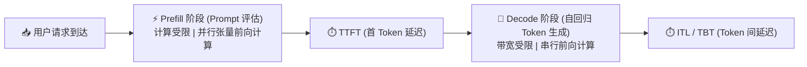
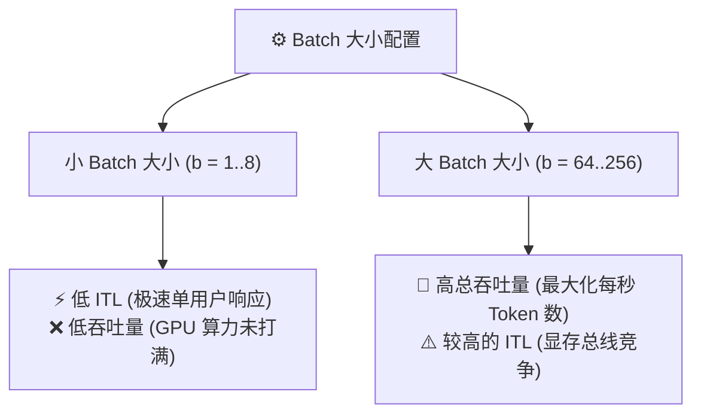
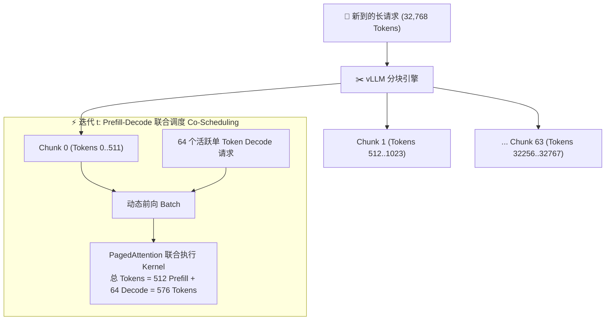
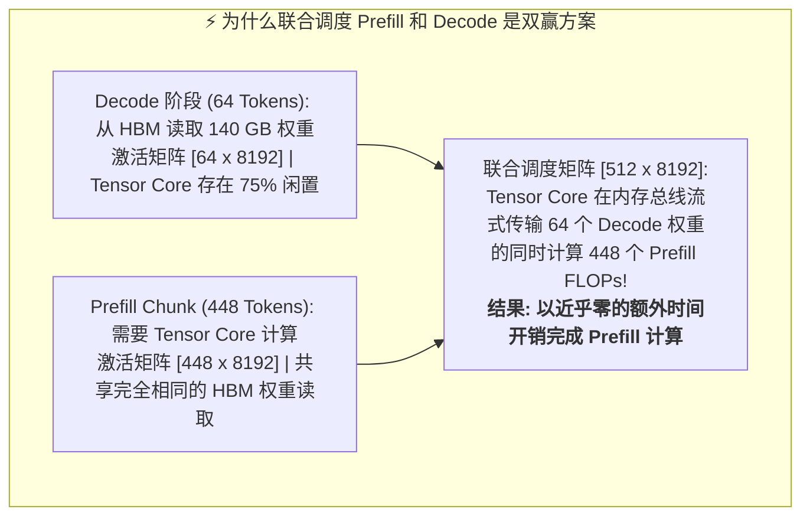
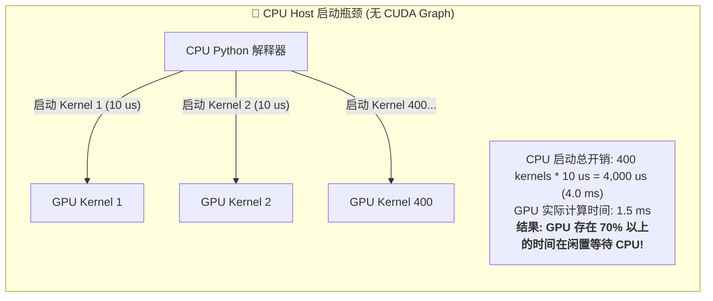
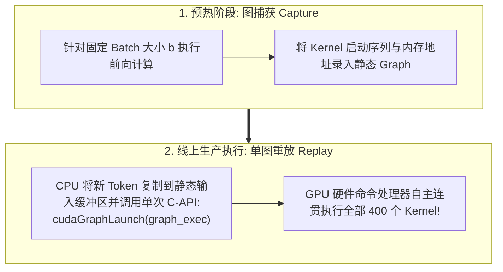
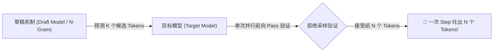

# 模块 3: 性能、质量与引擎增强

为了在生产环境中实现大语言模型 (LLM) 的高吞吐、低延迟推理，现代推理引擎必须超出基本的虚拟内存管理范畴进行深度优化。虽然 PagedAttention 解决了 Key-Value (KV) Cache 显存碎片化问题，但推理服务系统仍面临三个根本性的性能瓶颈：**长 Prompt 预填充导致的 Token 间延迟飙升**、**重复 Kernel 启动时的 CPU 主机执行开销**，以及**自回归解码过程中的显存带宽饱和**。

本模块将探索 vLLM 为克服这些瓶颈而设计的核心性能机制与引擎增强功能，涵盖 **推理性能评估指标**、**Chunked Prefill (分块预填充)**、**Prefill 与 Decode 的系统经济学**、**CUDA Graph 图执行**、**投机解码 (Speculative Decoding)** 以及 **模型与 KV Cache 量化**。

---

## 第 1 部分: 推理性能指标与系统权衡

为了评估和优化推理服务性能，AI 系统工程师严格区分**响应速度 (延迟 Latency)** 与 **服务容量 (吞吐量 Throughput)**。在 LLM 推理中，单次请求的延迟被清晰划分为两个不同的执行阶段。

### 1.1 生产级指标体系

#### 1. 首 Token 延迟 (Time To First Token - TTFT)
**首 Token 延迟 (TTFT)** 测量从用户提交 Prompt 到引擎吐出第一个生成 Token 所经过的时间。

$$
\text{TTFT} = t_{\text{queue}} + t_{\text{prefill}}
$$

其中：
- $t_{\text{queue}}$: 在引擎 `Waiting` 队列中等待空闲 HBM KV Block 和执行预算的时间。
- $t_{\text{prefill}}$: 跨所有 $s_{\text{prompt}}$ 个输入 Token 执行计算受限的 Prompt 预填充计算所需的时间。

TTFT 是用户感知引擎响应速度的核心指标。长 Prompt 评估 (例如 32,768 个 Token) 或严重的队列排队都会拉高 TTFT。

#### 2. Token 间延迟 (Inter-Token Latency - ITL / TBT)
**Token 间延迟 (ITL)**，也称为 **Time Between Tokens (TBT)**，测量在自回归解码阶段生成连续输出 Token 之间的时间间隔。

$$
\text{ITL} = t_{\text{decode_step}} = \frac{\text{传输的总内存字节数}}{\text{显存带宽}} + \frac{\text{FLOPs 运算量}}{\text{峰值算力}}
$$

由于单 Token 解码处于显存带宽受限状态 ($I \approx 1.0 \text{ FLOPs/Byte}$)，ITL 完全取决于 GPU 从片外 HBM 向片上 SRAM 读取模型权重和 KV Cache Block 的速度。平稳的 ITL 是保证流式输出体验的关键 (通常目标为 $20 \text{ 至 } 50 \text{ ms/token}$)。

#### 3. 系统吞吐量 (System Throughput - Tokens per Second)
**系统吞吐量** 测量单位时间内所有活跃请求累计生成的输出 Token 总数。

$$
\text{吞吐量} = \frac{\sum_{i=1}^{b} N_{\text{gen_tokens}, i}}{\Delta t} = \frac{b}{\text{平均 ITL}}
$$

其中：
- $b$: 并发 Batch 大小 (`batch_size`)。
- $N_{\text{gen_tokens}, i}$: 序列 $i$ 产生的输出 Token 数量。

---

### 1.2 延迟-吞吐量 帕累托前沿 (Pareto Frontier)

在高并发生产推理中，延迟与吞吐量存在直接的物理冲突。

当 Batch 大小 $b$ 增大时：
- **HBM 权重复用**: 引擎从 HBM 读取一次模型权重，即可在 $b$ 条序列之间复用，将算术强度 $I$ 推向 GPU 转折点 (Ridge Point)。
- **总吞吐量提升**: 总 Token 生成能力随 $b$ 呈近乎线性扩展。
- **单用户 ITL 增加**: 从 HBM 读取的总 KV Cache 字节数增加 ($2 \cdot b \cdot s \cdot L \cdot h_{\text{kv}} \cdot d_{\text{head}} \cdot \text{sizeof(dtype)}$)，导致每个解码迭代步骤耗时略微变长。

系统工程师根据业务需求在 **延迟-吞吐量帕累托前沿** 上选择运行点：实时对话 Agent 优先考虑低 ITL ($b = 4 \dots 16$)，而离线批量处理则优先考虑最大吞吐量 ($b = 64 \dots 256$)。

---

## 第 2 部分: 高级调度: Chunked Prefill 与 Co-Scheduling

在传统的 LLM 引擎中，Prompt 预填充 Pass 与 Token 解码 Step 是分开执行的。这种设计会引发严重的 **Head-of-Line (HoL) 队头阻塞** 问题。

### 2.1 队头阻塞 (HoL Blocking) 难题

假设引擎当前正在为 64 个并发用户请求生成 Token，ITL 维持在平滑的 $25 \text{ ms/token}$。突然，一个新的请求到达，包含一个长达 $32,768$ Token 的超长文档 Prompt。

如果引擎在单个未分块的前向计算中调度这 $32,768$ 个 Token 的预填充：

1. 该 Prefill Pass 需要对所有 32.7K 个 Token 同时进行大规模前向计算。
2. 在 NVIDIA H100 上，运行 70B 模型的 32.7K Prefill 前向计算需要连续消耗 $\sim 500 \text{ ms}$ 的 GPU 算力。
3. **后果**: 所有 64 个正在生成的 Decode 请求都被迫停顿，等待 Prefill 完成，导致 ITL 从 $25 \text{ ms}$ 骤增至 $> 500 \text{ ms}$——在前端流式输出上表现为明显的卡顿。

---

### 2.2 Chunked Prefill 架构与 Co-Scheduling

为了消除队头阻塞，vLLM 实现了 **Chunked Prefill (分块预填充)** (`v0.4+`)。

调度器不再在单次前向计算中执行长 Prompt 预填充，而是将新到达的 Prompt 切分为更小的、有预算约束的逻辑片段，称为 **Prefill Chunks** (由 `max_num_batched_tokens` 控制，通常设置为 $512$ 或 $2,048$ Token)。

在每次迭代步骤 $t$，调度器联合调度 (Co-Schedule)：
1. **活跃 Decode Tokens**: 来自运行中请求的 $b_{\text{decode}}$ 个单 Token。
2. **部分 Prefill Chunk**: 来自新到 Prompt 的 $N_{\text{chunk}}$ 个 Token。

通过限制每次迭代步骤的总 Token 数量 ($\text{Tokens}_{\text{total}} = N_{\text{chunk}} + b_{\text{decode}} \le \text{max_num_batched_tokens}$)，迭代步骤的延迟保持严格可控，在后台持续推进长 Prompt 评估的同时，保障了严格的 ITL SLA。

---

### 2.3 算术强度系统分析: Prefill vs Decode

一个核心问题是：**Prefill 阶段与 Decode 阶段的每 Token FLOPs 算力和执行成本完全相同吗？**

#### 1. 为什么 Prefill Token 必须跨所有层执行完整 Attention 和 FFN 计算
为什么中间 Prompt Token 在不直接预测输出 Token 的情况下，也必须执行 Attention 和 FFN 计算？

有三个根本性的架构原因：
1. **逐层上下文特征构建**: 在多层 Transformer 中 (如 Llama 3 70B 的 80 层)，Layer 0 的原始词嵌入 ($X_0$) 仅包含静态字典含义。随着 Token 穿过 Layer 1, 2, ..., 80，Attention 允许 Token $i$ 整合前序 Token 的信息，不断更新其隐藏状态表示 $h_i^{(l)}$。
2. **深层的 KV Cache 向量依赖于隐藏状态 ($h_i^{(l)}$)**:
   Layer $l+1$ 的 Key 和 Value 向量由 Layer $l$ 的隐藏状态输出直接计算得出：
   $$K_i^{(l+1)} = h_i^{(l)} W_K^{(l+1)}, \quad V_i^{(l+1)} = h_i^{(l)} W_V^{(l+1)}$$
   要计算 Layer 40 的 KV Cache，Token $i$ **必须**在 Layer 39 执行完整的 Attention 和 FFN计算！
3. **首个 Decode Token 的 Logit 生成**:
   Prompt 的最后一个 Token 需要聚合前面所有 Token 的上下文特征，以计算第一个生成 Token 的 Logit 分布。

#### 2. 定量 FLOPs 拆解: 为什么 $2\times$ vs $4\times$ 注意力 FLOPs 在 $S < 8,000$ 时微不足道
在 70B 参数模型 ($N = 70 \times 10^9$) 且上下文长度 $S = 1,024$ 下：

1. **线性权重投影 FLOPs (两者完全相同)**:
   $$\text{FLOPs}_{\text{weights}} = 2 \cdot N = 2 \times 70 \times 10^9 = \mathbf{140 \text{ GFLOPs / Token}}$$
2. **Self-Attention FLOPs / Token ($S = 1,024$)**:
   - **Prefill 注意力 FLOPs / Token**: $\approx 2 \cdot L \cdot h_q \cdot d_{\text{head}} \cdot S = \mathbf{1.34 \text{ GFLOPs / Token}}$ ($0.95\%$ 占比)。
   - **Decode 注意力 FLOPs / Token**: $\approx 4 \cdot L \cdot h_q \cdot d_{\text{head}} \cdot S = \mathbf{2.68 \text{ GFLOPs / Token}}$ ($1.88\%$ 占比)。
3. **总 FLOPs 对比**:
   - **Prefill 总 FLOPs / Token**: $140.0 + 1.34 = \mathbf{141.34 \text{ GFLOPs}}$
   - **Decode 总 FLOPs / Token**: $140.0 + 2.68 = \mathbf{142.68 \text{ GFLOPs}}$
   $$\text{差异} = \frac{142.68 - 141.34}{141.34} = \mathbf{0.948\% \text{ 极小差异!}}$$

尽管 Decode 注意力 FLOPs ($2.68 \text{ GFLOPs}$) 是 Prefill 注意力 FLOPs ($1.34 \text{ GFLOPs}$) 的 $2\times$，**但注意力 FLOPs 整体被线性权重矩阵投影的巨量 $140 \text{ GFLOPs}$ 所淹没**。在常见上下文长度 ($S < 8,000$) 下，两者的单 Token 总 FLOPs 差异小于 $3.6\%$。

---

### 2.4 根本瓶颈差异: 算术强度 ($I = \text{FLOPs/Byte}$)

虽然单 Token 的原始 FLOPs 几乎相同，但由于**算术强度 ($I = \text{FLOPs} / \text{内存传输字节数}$)** 的巨大差异，两者的执行时间和硬件行为截然不同：

- **Decode 序列 ($64$ 个解码，Batch $b=64$)**:
  每次迭代，GPU 必须从 HBM 显存中读取整个 $140 \text{ GB}$ 的模型权重矩阵来仅处理这 64 个 Token。
  $$I_{\text{decode}} = \frac{64 \text{ tokens} \times 140 \text{ GFLOPs/token}}{140 \text{ GB 权重}} = \mathbf{64 \text{ FLOPs / Byte}}$$
  因为 $64 \text{ FLOPs/Byte} \ll I_{\text{ridge}} (295 \text{ FLOPs/Byte on H100})$，**Decode 阶段严重受限于显存带宽**，Tensor Core 存在 **$> 75\%$ 的时间处于闲置**！

- **Prefill Chunk ($448$ 个 Prompt Token 打包处理)**:
  所有 448 个 Prompt Token 打包入单次 GEMM 矩阵乘法 ($[448 \times 8192] \times [8192 \times 28672]$)，$140 \text{ GB}$ 的模型权重从 HBM 中读取**一次**并同时乘以这 448 个 Token。
  $$I_{\text{prefill}} = \frac{448 \text{ tokens} \times 140 \text{ GFLOPs/token}}{140 \text{ GB 权重}} = \mathbf{448 \text{ FLOPs / Byte}}$$
  因为 $448 \text{ FLOPs/Byte} > I_{\text{ridge}} (295)$，**Prefill 阶段处于计算受限状态**，驱动 Tensor Core 达到 **100% 满载利用率**！

---

## 第 3 部分: 执行开销最小化: CUDA Graphs

在小 Batch 大小下，除了显存带宽瓶颈外，**CPU 端的 Host 执行开销**也构成了显著的性能瓶颈。

> [!NOTE]
> **什么是 "GPU Kernel"?**
> 在 GPU 编程 (CUDA / HIP / C++) 中，**Kernel 并不是操作系统内核**。GPU Kernel 是专门设计用于在数千个 GPU 核心上执行大规模并行计算的 C++/CUDA 函数 (例如 `rmsnorm_kernel`、`gemm_projection_kernel` 或 `paged_attention_kernel`)。
> 
> "400 个 GPU Kernel" **并不**意味着 400 块独立的物理 GPU 协同工作！它意味着在一个 80 层的模型中，**单块 GPU** 必须按顺序连续执行 400 个独立的 CUDA Kernel 函数才能完成单次前向计算。

### 3.1 CUDA Graph 捕获与重放机制

为了消除 CPU 主机启动开销，vLLM 集成了 **CUDA Graphs** (`torch.cuda.graph`)。

在引擎初始化 (预热阶段)，vLLM 针对固定的 Batch 桶 ($b \in \{1, 2, 4, 8, 16, 32, 64, 128\}$) 执行预热前向计算并进行图捕获。

NVIDIA CUDA 驱动直接在 GPU 上预录并烘焙：
1. 所有 400 个 CUDA Kernel 的**函数入口地址序列**。
2. 输入、中间层激活、Block Table 和输出 Token 的**静态 GPU 内存缓冲区指针**。
3. **执行依赖图**。

在线上推理期间，CPU 无需评估 Python 代码。CPU 仅需将新 Token ID 写入静态 GPU 输入缓冲区 (`in-place copy_`)，然后发起**单次 `cudaGraphLaunch` C-API 调用 ($\approx 3 \ \mu\text{s}$)**。GPU 硬件命令处理器自主以硬件极速完成全部 400 个 Kernel 的连贯执行！

---

## 第 4 部分: vLLM 投机解码 (Speculative Decoding)

自回归解码的逐 Token 串行特性限制了单请求的生成速度。**投机解码 (Speculative Decoding)** 通过“草稿预测 + 目标验证”的范式打破了这一限制。

### 4.1 投机解码工作流

1. **草稿生成 (Draft Generation)**: 使用轻量级草稿机制 (如小模型、Medusa 头、EAGLE 头或 N-Gram 检索) 在极低开销下连续预测 $K$ 个候选 Token (如 $K=5$)。
2. **并行验证 (Parallel Verification)**: 将这 $K$ 个候选 Token 打包为单次前向 Pass 输入给主目标模型 (Target Model)。
3. **拒绝采样验证 (Rejection Sampling)**: 目标模型并行计算这 $K$ 个 Token 的真实概率分布，并通过修改版拒绝采样算法验证候选 Token：

$$
P(\text{接受 } x_i) = \min\left(1, \frac{p(x_i)}{q(x_i)}\right)
$$

只要草稿接受率 $\alpha > 70\%$，每次前向 Pass 就能稳定产出 $2 \dots 4$ 个 Token，实现 **$2.0\times \dots 3.5\times$ 的端到端加速**！

---

## 第 5 部分: 量化与精度优化

显存带宽是 Decode 阶段的核心瓶颈，通过 **量化 (Quantization)** 降低权重与 KV Cache 的位宽能够直接翻倍带宽效率。

### 5.1 主要量化方案对比

| 量化方案 | 作用对象 | 显存体积缩减 | 算力提升 | 精度损耗 | 适用场景 |
| :--- | :--- | :--- | :--- | :--- | :--- |
| **AWQ / GPTQ (INT4 / W4A16)** | 仅权重 Weight-Only | **$75\%$** (16bit $\to$ 4bit) | 适中 (解码阶段带宽瓶颈缓解) | 极低 | 显存受限的单卡部署 |
| **FP8 (W8A8 / `e4m3fn`)** | 权重与激活值 | **$50\%$** (16bit $\to$ 8bit) | **高** (Ada/Hopper 架构 Tensor Core 算力翻倍) | 近乎无损 | 生产级高并发吞吐服务 |
| **FP8 / INT8 KV Cache** | 仅物理 KV Block | **$50\%$ 至 $75\%$** | 适中 (提升最大并发 Batch 数) | 极低 | 长上下文与超高并发场景 |

vLLM 原生集成了 AWQ、GPTQ、Marlin 内核以及 FP8 (`e4m3fn`) 矩阵乘法，帮助企业级服务在保持高精度的同时榨干硬件带宽与 Tensor Core 算力。
