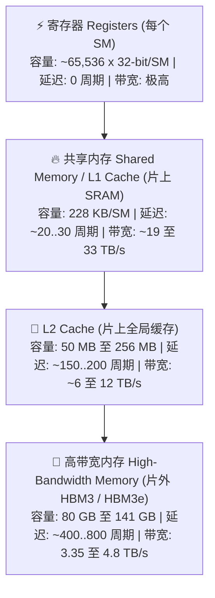
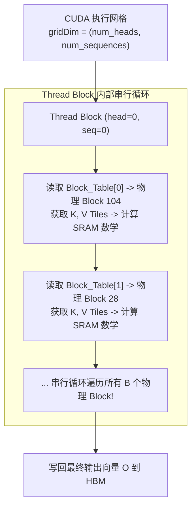
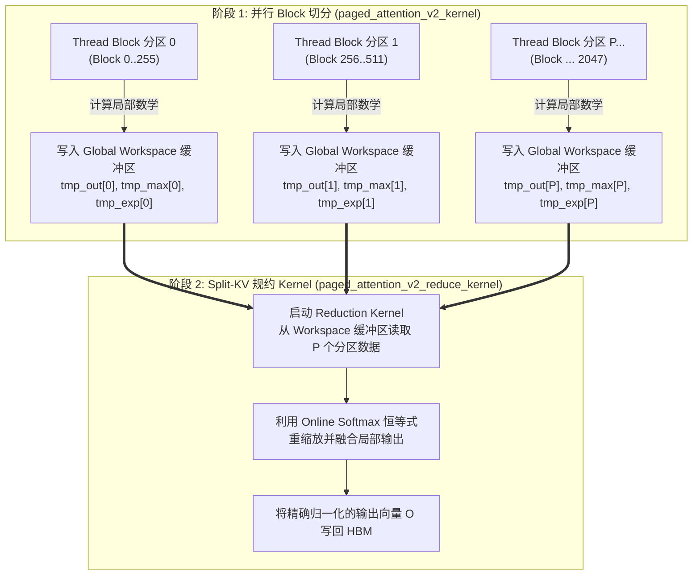
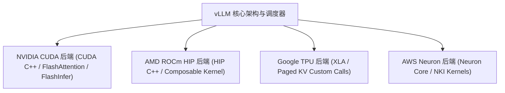

# 模块 4: 硬件交互与 Kernel 联合设计

在高性能 LLM 推理引擎中，巅峰性能依赖于软件算法与硬件微架构之间的紧密联合设计。虽然高层调度算法决定了请求的生命周期，但底层执行速度最终取决于 CUDA/HIP Kernel 如何高效利用 **GPU 内存层级结构**、**SRAM 分块 (Tiling)**、**PagedAttention Kernel 机制 (V1 与 V2)** 以及 **跨硬件加速器后端**。

本模块将系统探索 vLLM 在 NVIDIA GPU、AMD ROCm 加速卡、Google TPU 以及 AWS Neuron 硬件上的自定义 Kernel 优化机制。

---

## 第 1 部分: GPU 内存层级结构与带宽现实

在 GPU 硬件体系中，内存由多级金字塔结构组成。不同层级的物理位置在**容量**、**传输带宽**和**访问延迟**上存在极大差异。



### 1.1 硬件内存金字塔

以 NVIDIA H100 SXM5 加速卡为例：

| 内存层级 | 物理位置 | 容量 (H100 SXM5) | 理论峰值带宽 | 访问延迟 | 主要服务用途 |
| :--- | :--- | :--- | :--- | :--- | :--- |
| **寄存器 Registers** | 片上 (SM) | $256 \text{ KB}$ / SM | $> 100 \text{ TB/s}$ | $0 \text{ 周期}$ | 活跃线程标量计算与累加器 |
| **共享内存 SRAM** | 片上 (SM) | $228 \text{ KB}$ / SM | $\sim 33 \text{ TB/s}$ | $\sim 20 \dots 30 \text{ 周期}$ | $Q, K, V$ 注意力分块 SRAM Tiling 暂存 |
| **L2 Cache** | 片上 (Global) | $50 \text{ MB}$ | $\sim 12 \text{ TB/s}$ | $\sim 150 \dots 200 \text{ 周期}$ | 缓存高频 Block Table 元数据 |
| **HBM3 显存** | 片外 (DRAM) | $80 \text{ GB}$ | $3.35 \text{ TB/s}$ | $\sim 400 \dots 800 \text{ 周期}$ | 存放模型权重与物理 KV Cache Block |

---

### 1.2 内存访问延迟惩罚

当 CUDA 线程发起的内存请求未命中 SRAM 或 L2 时：

1. **Global HBM 请求**: SM 发出全局内存读取指令，数据需从片外 HBM 传输。
2. **停顿周期**: Warp 必须等待 $\sim 400 \dots 800 \text{ 硬件周期}$。
3. **Warp 调度器切换**: 硬件 Warp 调度器会上下文切换到其他活跃 Warp。但若所有 Warp 都在等待 HBM 数据传输，**SM 将完全处于停顿 (Stall) 状态**。

Kernel 优化的核心目标就是通过将矩阵块暂存到**片上共享内存 (SRAM)** 中，大幅减少片外 HBM 的读取次数。

---

## 第 2 部分: SRAM 分块 (Tiling) 与注意力 Kernel 机制

在标准 Self-Attention 计算 ($A = \text{Softmax}(Q @ K^T / \sqrt{d}) @ V$) 中，原生 PyTorch 会在全局 HBM 显存中实例化完整的 $S \times S$ 注意力分数矩阵。

对于序列长度 $S = 32,768$：

$$
\text{Memory}_{\text{naive_attn}} = S \times S \times \text{sizeof(float32)} = 32,768 \times 32,768 \times 4 \text{ bytes} \approx \mathbf{4.29 \text{ GB / 每个 Head!}}
$$

跨 64 个 Head 和 80 层模型，原生注意力机制需要 TB 级显存，导致 $O(S^2)$ 显存爆炸。

### 2.1 FlashAttention 分块策略

**FlashAttention** 与 **PagedAttention** 通过将 Query ($Q$)、Key ($K$)、Value ($V$) 张量切分为能够完整放入 **片上 SRAM ($228 \text{ KB}$)** 的小块，彻底解决了 $O(S^2)$ 显存问题。

```mermaid
flowchart TD
    HBM_Q["片外 HBM<br>全局 Q 张量"] -->|加载 Q 块 [B_M x d]| SRAM_Q["片上 SRAM<br>Q 分块"]
    HBM_K["片外 HBM<br>全局 K 张量"] -->|加载 K 块 [B_N x d]| SRAM_K["片上 SRAM<br>K 分块"]
    HBM_V["片外 HBM<br>全局 V 张量"] -->|加载 V 块 [B_N x d]| SRAM_V["片上 SRAM<br>V 分块"]

    subgraph ON_CHIP ["🔥 SM 共享内存 (SRAM) 计算循环"]
        SRAM_Q & SRAM_K --> S_TILE["SRAM 注意力分数块<br>S_tile = Q_tile @ K_tile^T / sqrt(d)"]
        S_TILE & SRAM_V --> O_TILE["Online Softmax & 加权求和<br>O_tile = Softmax(S_tile) @ V_tile"]
    end

    O_TILE -->|写回最终输出向量| HBM_O["片外 HBM<br>全局输出张量 O"]
```

#### Tiling 分块参数
- $B_M$: Query 沿序列维度切分块大小 (通常 $B_M = 64$ 或 $128$)。
- $B_N$: Key/Value 沿序列维度切分块大小 (通常 $B_N = 64$ 或 $128$)。
- $d$: Head 维度 ($d_{\text{head}} = 128$)。

由于矩阵乘法 ($S_{\text{tile}} = Q_{\text{tile}} @ K_{\text{tile}}^T$) 和加权求和 ($O_{\text{tile}} = P_{\text{tile}} @ V_{\text{tile}}$) 完全在 SRAM 内部完成，**$S \times S$ 的全量注意力矩阵永远不会在全局 HBM 显存中被实例化**，显存复杂度从 $O(S^2)$ 直降为 $O(S)$。

---

### 2.2 数值稳定性: Online Softmax 递推算法

标准 Softmax 需要对向量进行两次全量扫描：Pass 1 寻找全局最大值 $m = \max(x_i)$，Pass 2 计算归一化分母 $d = \sum e^{x_i - m}$。

为了在 SRAM 内部逐块增量计算 Softmax 而无需多次扫描 HBM，注意力 Kernel 引入了 **Online Softmax** 递推算法。

从 Tile $j-1$ 增量更新至 Tile $j$ 时：

$$
m^{(j)} = \max\left(m^{(j-1)}, \tilde{m}^{(j)}\right)
$$

$$
l^{(j)} = l^{(j-1)} \cdot e^{m^{(j-1)} - m^{(j)}} + \tilde{l}^{(j)} \cdot e^{\tilde{m}^{(j)} - m^{(j)}}
$$

$$
O^{(j)} = O^{(j-1)} \cdot \left(\frac{l^{(j-1)} \cdot e^{m^{(j-1)} - m^{(j)}}}{l^{(j)}}\right) + \tilde{O}^{(j)} \cdot \left(\frac{e^{\tilde{m}^{(j)} - m^{(j)}}}{l^{(j)}}\right)
$$

其中：
- $m^{(j)}$: 截至 Tile $j$ 的运行最大 Logit 分数。
- $l^{(j)}$: 截至 Tile $j$ 的未归一化指数求和。
- $O^{(j)}$: 截至 Tile $j$ 的运行未归一化输出向量。

Online Softmax 使得仅需对 KV 块进行单次扫描即可在 SRAM 内部精确更新输出向量 $O^{(j)}$！

---

## 第 3 部分: PagedAttention CUDA Kernel 工程实现 (V1 与 V2)

FlashAttention 假定 $K$ 和 $V$ 张量在 HBM 中连续存储，而 **PagedAttention** 则需要通过 `Block_Table` 查找映射访问在 HBM 离散物理地址中散落的物理 KV Block。

### 3.1 PagedAttention V1 Kernel 架构

在 **PagedAttention V1** (`paged_attention_v1_kernel`) 中，CUDA Kernel 为**每个 Query Head 每个序列**分配一个 Thread Block。



#### PagedAttention V1 的局限性
在长上下文 Decode 阶段 (例如 $S = 32,768$ token $\equiv 2,048$ 个物理 Block)：

- 单请求 Decode 阶段 Batch Size $b = 1$。
- 单个 Thread Block 必须串行循环遍历所有 $2,048$ 个物理 Block。
- **SM Wave 利用率不足**: GPU Grid 包含的 Thread Block 数量极少 ($\text{gridDim} = h_q \times b = 64 \times 1 = 64$ 个 Thread Block)。在拥有 132 个 SM 的 NVIDIA H100 SXM5 上，**超过一半的 SM 完全闲置**，而少数活跃的 SM 却在串行遍历数千个 Block！

---

### 3.2 PagedAttention V2 架构与 Split-KV 规约规约 (Reduction)

为了解决长上下文 Decode 时的 SM 利用率不足问题，vLLM 研发了 **PagedAttention V2 (`paged_attention_v2_kernel` + Split-KV Reduction)**。

PagedAttention V2 将物理 Block *沿时间/序列长度维度切分*，分发给多个并行 Thread Block 同时处理。



#### 步骤 1: 并行 Block 分区
调度器设置分区大小参数 `partition_size` (通常为 256 或 512 token/分区)。

$$
N_{\text{partitions}} = \left\lceil \frac{\text{seq_len}}{\text{partition_size}} \right\rceil
$$

CUDA Grid 沿分区维度展开 ($\text{gridDim} = h_q \times b \times N_{\text{partitions}}$)。对于 32K 序列，$N_{\text{partitions}} = 32,768 / 256 = 128$ 个并行 Thread Block。

Grid 启动的 Thread Block 数量从 64 个剧增至 $64 \times 128 = 8,192$ 个，**完美打满 GPU 上的所有 132 个 SM**！

#### 步骤 2: Global Workspace 暂存
每个并行分区 Thread Block 计算其分配的物理 Block 子集，并将三个局部数组写入全局 HBM 暂存缓冲区：

1. `tmp_output[partition_idx]`: 未归一化的局部注意力输出向量 $O_{\text{part}}$。
2. `tmp_max_logits[partition_idx]`: 分区内部的最大 Logit 分数 $m_{\text{part}}$。
3. `tmp_exp_sums[partition_idx]`: 分区内部未归一化的指数求和 $l_{\text{part}}$。

#### 步骤 3: Split-KV 规约 Kernel (`paged_attention_v2_reduce_kernel`)
在阶段 1 结束后，轻量级 Reduction CUDA Kernel 立即启动。

对于每个 Sequence Head，Reduction Kernel 读取 $N_{\text{partitions}}$ 个局部向量，寻找全局最大 Logit $m_{\text{global}} = \max(m_{\text{part}, p})$，并根据 Online Softmax 恒等式对局部输出进行缩放：

$$
\text{Scale}_p = e^{m_{\text{part}, p} - m_{\text{global}}}
$$

$$
l_{\text{global}} = \sum_{p=1}^{N_{\text{partitions}}} l_{\text{part}, p} \cdot \text{Scale}_p
$$

$$
O_{\text{final}} = \frac{\sum_{p=1}^{N_{\text{partitions}}} O_{\text{part}, p} \cdot l_{\text{part}, p} \cdot \text{Scale}_p}{l_{\text{global}}}
$$

最终将归一化后的注意力向量 $O_{\text{final}}$ 写回全局显存。

#### 性能提升
PagedAttention V2 将长上下文 Decode 速度提升了 **$2.0\times \dots 5.0\times$**，成功将串行 Block 循环转化为了大规模并行 SM 执行！

---

## 第 4 部分: 高级加速器后端与跨硬件引擎

除了 NVIDIA CUDA，vLLM 还采用了模块化后端架构，支持 **AMD ROCm (HIP)**、**Google TPU** 和 **AWS Neuron**。



---

### 4.1 AMD ROCm (HIP) 执行引擎

AMD Instinct 硬件 (MI250, MI300X) 通过 **AMD ROCm** 开放软件栈与 **HIP** 编程语言运行。

#### 微架构差异: Wavefronts vs. Warps
- **NVIDIA CUDA**: 线程按 32 个为一组执行，称为 **Warp**。
- **AMD ROCm (CDNA 架构)**: 线程按 64 个为一组执行，称为 **Wavefront** (`wave64`)。

#### vLLM ROCm Kernel 适配 (`vllm._C` / HIP)
1. **Wavefront 对齐**: PagedAttention 内部的共享内存 Shuffle 指令 (`__shfl_xor_sync`) 被重写为适配 64 线程 Wavefront 的 HIP 内建函数 (`__shfl_xor`)。
2. **AMD Composable Kernel (CK)**: vLLM 集成了 AMD Composable Kernel 库，在 MI300X **Matrix Core 单元**上实现了极高的 GEMM 矩阵乘法吞吐。
3. **MI300X 显存带宽优势**: 凭借 $192 \text{ GB}$ HBM3 显存提供的 **$5.3 \text{ TB/s}$ 超高带宽**，MI300X 可以在全局显存中直接承载更大的物理 KV Block 池。

---

### 4.2 Google TPU 加速后端 (XLA)

Google TPU (v4, v5e, v5p, Trillium) 采用了由 **XLA (Accelerated Linear Algebra) 编译器** 主导的执行模型。

#### 架构差异: 脉动阵列 (Systolic Array) vs. SIMT Cores
- **GPU (SIMT)**: 通过数千个独立的线程核心计算矩阵乘法。
- **TPU (Systolic Array / MXU)**: 通过专用的 **Matrix Execution Unit (MXU)** 脉动阵列计算矩阵乘法。

#### XLA PagedAttention 适配
由于 XLA 编译器要求在编译期确定静态张量形状：

1. **Paged KV Custom Call**: vLLM 与 Google 的 XLA PagedAttention custom call 进行了深度集成 (`vllm-tpu` 后端)。
2. **静态 Block Table Padding**: Block Table 和物理 KV Block 被填充为固定的 TPU 内存步长 (通常 Block Size 为 16 或 32)。
3. **XLA 图编译**: Transformer 层被编译为统一的 XLA HLO 图，彻底消除了 Host 端开销。

---

### 4.3 AWS Neuron 引擎 (Inferentia2 与 Trainium)

AWS Inferentia2 (`inf2`) 和 Trainium (`trn1`) 实例使用由 `aws-neuron-sdk` 管理的自定义 **Neuron Core**。

#### Neuron Kernel Interface (NKI) 集成
1. **Neuron Core 架构**: 每个 Neuron Core 包含 Tensor Engine (矩阵计算)、Vector Engine 和 Scalar Engine，连接至 $32 \text{ GB}$ 高带宽内存。
2. **Neuron Kernel Interface (NKI)**: vLLM 利用 AWS NKI 编写自定义 PagedAttention 寻址 Kernel，直接运行在 Neuron Core 上。
3. **集合通信**: 张量并行 (Tensor Parallelism) 的 Core 间通信通过专用的 **NeuronLink** 环形互连总线完成。

---

## 总结: 硬件后端能力对比矩阵

| 硬件平台 | 主微架构 | SIMD 执行单元 | 理论峰值显存带宽 | PagedAttention 主要实现 |
| :--- | :--- | :--- | :--- | :--- |
| **NVIDIA Hopper (H100/H200)** | GPU (Hopper / Ada) | Warp (32 线程) | $3.35 \dots 4.8 \text{ TB/s}$ | PagedAttention V2 (CUDA C++) / FlashInfer |
| **AMD Instinct (MI300X)** | GPU (CDNA 3) | Wavefront (64 线程) | **$5.3 \text{ TB/s}$** | PagedAttention (HIP C++) / Composable Kernel |
| **Google TPU (v5p / Trillium)** | 脉动阵列 (MXU) | Vector / MXU Tile | 高 HBM 带宽 | XLA Paged KV Custom Calls |
| **AWS Trainium / Inferentia2** | Neuron Core | Tensor / Vector Engine | $820 \text{ GB/s}$ | AWS NKI 自定义 PagedAttention Kernels |
