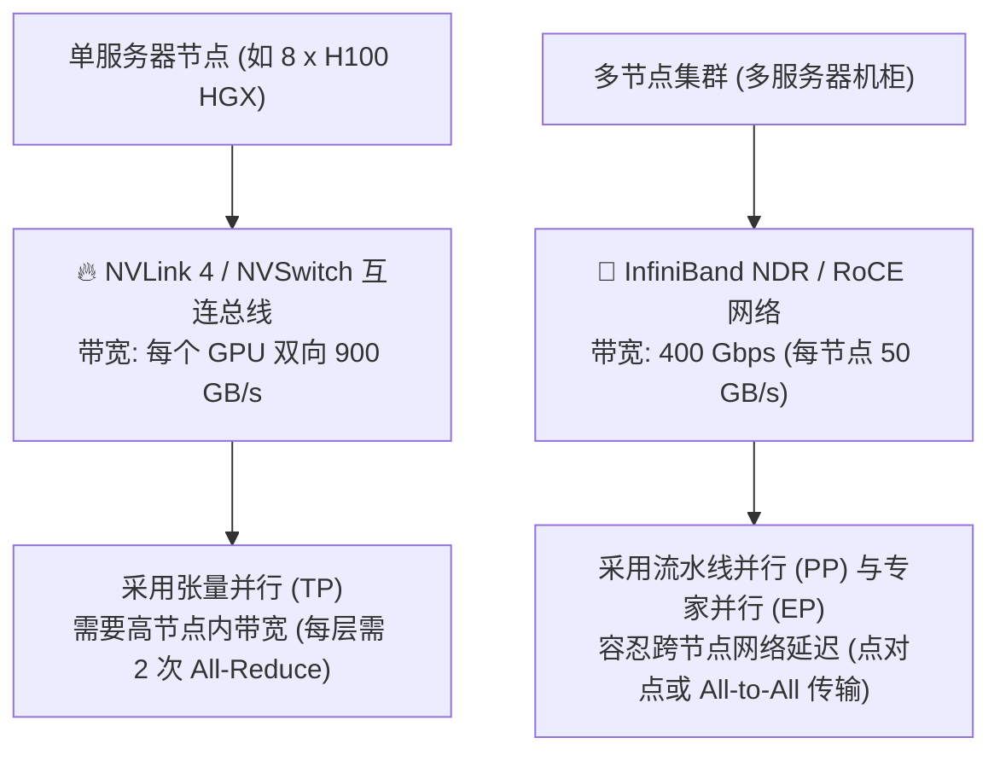
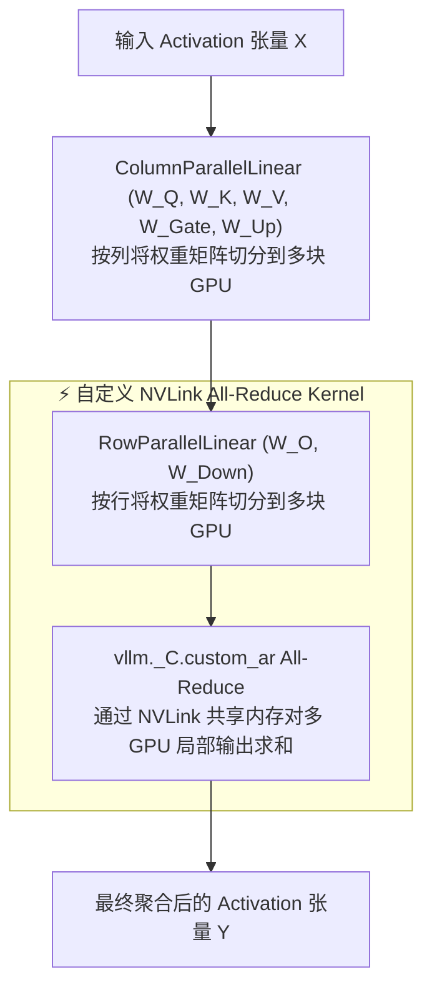
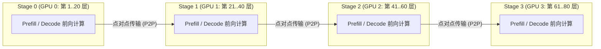
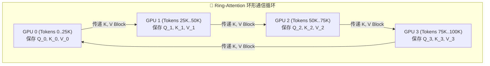
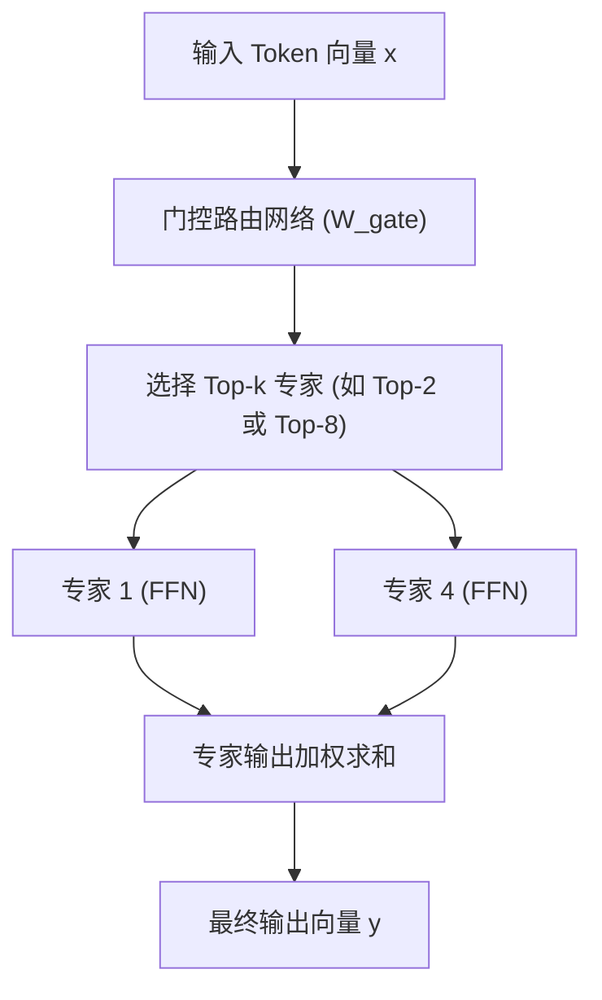
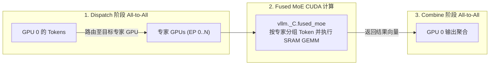

# 模块 5: 分布式并行与多 GPU 编排

随着前沿大语言模型参数量扩展至数千亿 (如 Llama 3 405B、DeepSeek-V3 671B)，单卡 GPU 的显存与算力极限被轻松打破。高吞吐推理引擎 vLLM 通过 **分布式并行 (Distributed Parallelism)** 技术，将模型拆分并部署在多 GPU 及多节点集群上。

本模块将系统探索分布式 LLM 推理的四个核心维度：**张量并行 (Tensor Parallelism, TP)**、**流水线并行 (Pipeline Parallelism, PP)**、**上下文并行 (Context Parallelism, CP)** 以及面向混合专家模型 (MoE) 的 **专家并行 (Expert Parallelism, EP)**。

---

## 第 1 部分: 分布式服务分类与互连拓扑约束

为了高效拆分模型，系统工程师必须将分布式并行策略与集群的物理**硬件互连带宽**进行精确匹配。

### 1.1 硬件互连带宽差距

| 互连层级 | 物理技术 | 双向理论带宽 | 访问延迟 | 最佳并行策略 |
| :--- | :--- | :--- | :--- | :--- |
| **节点内 (SXM 版)** | NVIDIA NVLink 4 / NVSwitch | **每个 GPU $900 \text{ GB/s}$** | $< 1 \ \mu\text{s}$ | **张量并行 (Tensor Parallelism, TP)** |
| **节点内 (PCIe 版)** | PCIe Gen5 x16 总线 | $64 \text{ GB/s}$ | $\sim 2 \dots 3 \ \mu\text{s}$ | 小规模张量并行 ($\text{TP} \le 4$) |
| **跨节点 (RDMA 网络)** | InfiniBand NDR / RoCE v2 | $50 \text{ GB/s}$ ($400 \text{ Gbps}$) | $\sim 5 \dots 10 \ \mu\text{s}$ | **流水线并行 (PP) 与专家并行 (EP)** |

---

### 1.2 分布式并行维度速览

1. **张量并行 (TP)**: 将单个权重矩阵 ($W_Q, W_K, W_V, W_O, W_{\text{Gate}}, W_{\text{Up}}, W_{\text{Down}}$) 沿列或行切分到单节点内的多块 GPU 上。每层 Transformer 需要执行两次 **All-Reduce** 通信。
2. **流水线并行 (PP)**: 将 sequential Transformer 层按 Stage 切分到不同的 GPU 或服务器节点上 (例如 GPU 0 负责第 1-20 层，GPU 1 负责第 21-40 层)。通过点对点 (P2P) 通信传输 Activation 张量。
3. **上下文并行 (CP)**: 沿序列长度维度 (Context Length) 切分，用于支持 $100K+$ 的超长上下文，采用 Ring-Attention 或 All-to-All 算法。
4. **专家并行 (EP)**: 将稀疏混合专家模型 (MoE) 的专家层分散到不同 GPU 上，通过 **All-to-All** 集合通信动态路由 Token。

---

## 第 2 部分: vLLM 中的张量并行 (TP) 机制

vLLM 中的张量并行遵循 **Shoeybi 等人 (Megatron-LM)** 的矩阵列切分与行切分范式，使得线性张量运算可以在多 GPU 上并行执行，直到输出聚合时才需要跨卡通信。

### 2.1 ColumnParallelLinear 与 RowParallelLinear

#### 1. 按列并行 ColumnParallelLinear ($W_Q, W_K, W_V$ 及 $W_{\text{Gate}}, W_{\text{Up}}$)
权重矩阵 $W \in \mathbb{R}^{d \times d_{\text{out}}}$ 沿**列**切分到 $N_{\text{TP}}$ 块 GPU 上：

$$
W = \begin{bmatrix} W_1 & W_2 & \dots & W_{N_{\text{TP}}} \end{bmatrix}
$$

每块 GPU $i$ 独立保存分片 $W_i$，并与输入 Activation 矩阵 $X$ 相乘：

$$
Y_i = X @ W_i
$$

由于 $Y_i$ 本身就是完整输出 $Y = \begin{bmatrix} Y_1 & Y_2 & \dots & Y_{N_{\text{TP}}} \end{bmatrix}$ 的一个列分片，**ColumnParallelLinear 层执行完毕后无需任何跨卡通信**！

#### 2. 按行并行 RowParallelLinear ($W_O$ 及 $W_{\text{Down}}$)
权重矩阵 $W \in \mathbb{R}^{d_{\text{in}} \times d}$ 沿**行**切分到 $N_{\text{TP}}$ 块 GPU 上：

$$
W = \begin{bmatrix} W_1 \\ W_2 \\ \vdots \\ W_{N_{\text{TP}}} \end{bmatrix}
$$

输入 Activation $X$ (此时已按列切分为 $\begin{bmatrix} X_1 & X_2 & \dots & X_{N_{\text{TP}}} \end{bmatrix}$) 分别与 $W_i$ 相乘：

$$
Y_i = X_i @ W_i
$$

为了还原真正的数学输出 $Y = X @ W$，必须对所有 GPU 的局部输出求和：

$$
Y = \sum_{i=1}^{N_{\text{TP}}} Y_i = \text{All-Reduce-Sum}(Y_i)
$$

#### 深度架构剖析: 为什么必须先按列并行再按行并行？
Megatron-LM 与 vLLM 中的一个核心设计问题是：*为什么 $W_Q, W_K, W_V, W_{\text{Gate}}, W_{\text{Up}}$ 采用按列并行，而 $W_O, W_{\text{Down}}$ 必须采用按行并行？*

1. **维度契合消除层间通信**:
   - 第一层按列并行 (如 $W_{\text{Gate}}, W_{\text{Up}}$) 在 GPU $i$ 上的输出维度为 $\left[S, \frac{d_{\text{ffn}}}{N_{\text{TP}}}\right]$。
   - 第二层按行并行 (如 $W_{\text{Down}}$) 的输入恰好需要一个沿行切分为 $\frac{d_{\text{ffn}}}{N_{\text{TP}}}$ 维度的矩阵。
   - 由于第一层的输出列维度**完全精准契合**第二层的输入行维度，GPU $i$ 可以将其局部输出 $X_i$ **零通信**直接喂入 $W_{\text{Down}, i}$！
   - 如果两层都采用按列并行，GPU $i$ 将被迫在第二层之前执行一次 **All-Gather**，并在第二层之后执行一次 **All-Reduce**。通过“按列并行 $\to$ 按行并行”的组合，通信被成功压制为**每个子层仅需一次 All-Reduce** (在 $W_O$ 和 $W_{\text{Down}}$ 结尾处)。

#### 跨层 GPU 权重切分映射
假设张量并行度 $N_{\text{TP}} = 4$：
- **GPU 0** 保存整个模型中**每一层** $l \in [1 \dots L]$ 的切片 $W_0^{(l)}$。
- **GPU 1** 保存整个模型中**每一层** $l \in [1 \dots L]$ 的切片 $W_1^{(l)}$。
- **GPU 2** 保存整个模型中**每一层** $l \in [1 \dots L]$ 的切片 $W_2^{(l)}$。
- **GPU 3** 保存整个模型中**每一层** $l \in [1 \dots L]$ 的切片 $W_3^{(l)}$。

以 Llama 3 70B 为例 (80 层，64 个 Q Head，8 个 KV Head，$d_{\text{ffn}} = 28,672$)：
- 对于第 $l$ 层的 $W_Q$: GPU 1 保存 16 个 Query Head (Head $16 \dots 31$)。
- 对于第 $l$ 层的 $W_O$: GPU 1 保存 8,192 行中的 $2048 \dots 4095$ 行。
- 对于第 $l$ 层的 $W_{\text{Gate}}$: GPU 1 保存 28,672 列中的 $7168 \dots 14335$ 列。
- 对于第 $l$ 层的 $W_{\text{Down}}$: GPU 1 保存 28,672 行中的 $7168 \dots 14335$ 行。
- 这种固定的切片映射在网络的**全部 80 层**中系统性重复。

---

### 2.2 自定义 NVLink All-Reduce Kernel (`vllm._C.custom_ar`)

在原生 PyTorch 中，标准 `torch.distributed.all_reduce` 会调用 NCCL 库，带来额外的 Kernel 启动开销与 IPC 同步延迟 ($\sim 10 \dots 15 \ \mu\text{s}$)。

为了消除节点内 NVLink 传输的 NCCL 开销，vLLM 研发了自定义 CUDA All-Reduce Kernel (`vllm._C.custom_ar`)：

1. **共享 NVLink IPC 缓冲区**: 引擎初始化时，vLLM 在节点内所有 GPU 之间注册 POSIX 共享内存指针。
2. **单 Kernel All-Reduce**: 当 `RowParallelLinear` 完成时，一个自定义 CUDA Kernel 在所有 GPU 上同时启动，直接通过 NVLink 读取对端 GPU 显存中的局部张量并在片上完成原位相加。
3. **延迟降低**: 将 All-Reduce 通信延迟从 $15 \ \mu\text{s}$ 降低至 **$< 2.5 \ \mu\text{s}$**，大幅提升了 Tensor Core 计算效率！

---

## 第 3 部分: 流水线并行 (PP) 与上下文并行 (CP)

当模型显存体积超出单个节点的 NVLink 承载极限时 (例如 Llama 3 405B 在 FP16 下需要 $810 \text{ GB}$ 显存)，**流水线并行 (Pipeline Parallelism, PP)** 可以跨越服务器节点切分模型。

### 3.1 流水线并行机制

流水线并行将 $L$ 层 Transformer 划分给 $N_{\text{PP}}$ 块 GPU/节点 (例如 80 层模型在 $N_{\text{PP}} = 4$ 时，每 Stage 负责 20 层)。

#### 通信效率优势
不同于张量并行 (每层需要 2 次 All-Reduce)，流水线并行在 Stage 边界之间**仅需 1 次点对点 (P2P) Activation 张量传输**。较小的网络通信量使得 PP 能够完美运行在跨节点的 InfiniBand / RoCE 网络上 ($50 \text{ GB/s}$)。

---

### 3.2 上下文并行 (CP) 与 Ring-Attention

对于超长上下文场景 ($S > 100,000$ token)，即使用 PagedAttention，单块 GPU 也无法在显存中容纳整条序列的物理 KV Block。

**上下文并行 (Context Parallelism, CP)** 利用 **Ring-Attention** (Liu 等人) 将序列长度维度 $S$ 切分到 $N_{\text{CP}}$ 块 GPU 上：

1. 每块 GPU $i$ 保存一部分 Query token 分片 $Q_i$ 和一部分 Key/Value token 分片 $K_i, V_i$。
2. 当 GPU $i$ 计算 $Q_i$ 与本地 $K_i, V_i$ 的局部 SRAM 注意力时，它同时异步将 $K_i, V_i$ 块传输给环形拓扑中的下一个 GPU。
3. 经过 $N_{\text{CP}}$ 次环形传递后，所有 GPU 都在未持有完整 KV Cache 的情况下完成了全量序列的注意力计算！

---

## 第 4 部分: 混合专家模型 (MoE) 的专家并行 (EP)

前沿大模型 (如 **DeepSeek-V3 / DeepSeek-R1** 拥有 6710 亿总参数，每 Token 激活 370 亿参数) 及 **Mixtral 8x22B** 采用了 **混合专家 (MoE)** 架构。

在 MoE Transformer 层中，稠密的 FFN 网络被替换为了一个 **路由/门控网络 (Router/Gating Network)** 和 $N_{\text{experts}}$ 个并行的 Expert 网络。

### 4.1 MoE Top-k 路由机制

对于每个 Token $x$，门控网络计算所有专家的 Softmax 概率，并挑选出得分最高的 **Top-$k$** 个专家 (例如 Mixtral 挑选 Top-2，DeepSeek-V3 挑选 Top-8)：

$$
g(x) = \text{TopK}\left(\text{Softmax}(x @ W_{\text{gate}})\right)
$$

$$
y = \sum_{i \in \text{TopK}} g(x)_i \cdot \text{Expert}_i(x)
$$

---

### 4.2 专家并行 (EP) 与 Fused MoE Kernel

在拥有 64 或 256 个专家的大型 MoE 模型中 (例如 DeepSeek-V3 跨 8 节点拥有 256 个路由专家)：

1. **专家分布 (EP)**: 专家被均匀划分给各个 GPU ($N_{\text{experts}} / N_{\text{GPUs}}$ 个专家/GPU)。
2. **All-to-All 集合通信 (`all_to_all_single`)**:
   - **Dispatch 阶段**: 通过 `All-to-All` 网络传输，将 Token 路由发往目标专家所在的 GPU。
   - **Combine 阶段**: 目标专家 GPU 计算完 FFN 后，通过第二次 `All-to-All` 网络传输将结果向量发回源 GPU。

#### Fused MoE CUDA Kernel (`vllm._C.fused_moe`)
为分散的 Token 子集单独启动 GEMM 会导致巨大的 CPU 启动开销与 GPU 碎片化。vLLM 实现了自定义 **Fused MoE CUDA Kernel (`fused_moe`)**：

- **Token 排序**: Kernel 在 SRAM 内部按目标专家 ID 对所有 Token 进行排序分组。
- **Batched GEMM 执行**: 发起一次分组 GEMM CUDA 启动，同时处理所有专家的计算任务，极大提升了 Tensor Core 的利用率！

---

## 总结: 并行策略决策矩阵

| 模型架构 / 参数量 | 推荐并行配置 | 核心通信原语 | 目标硬件拓扑 |
| :--- | :--- | :--- | :--- |
| **中型模型 (7B - 70B)** | $\text{TP} = 2 \dots 8$, $\text{PP} = 1$ | All-Reduce (`vllm._C.custom_ar`) | 单 HGX 节点 (NVLink 互连) |
| **超大稠密模型 (405B)** | $\text{TP} = 8$, $\text{PP} = 8 \dots 16$ | All-Reduce (节点内) + P2P (跨节点) | 多节点 NVLink + InfiniBand |
| **超长上下文 (100K+)** | $\text{TP} = 8$, $\text{CP} = 4 \dots 8$ | Ring-Attention (异步 P2P / All-to-All) | 多节点高带宽网络 |
| **海量 MoE (DeepSeek / Mixtral)** | $\text{TP} = 8$, $\text{EP} = 8 \dots 64$ | All-to-All (`all_to_all_single`) + Fused MoE | 多节点集群 (InfiniBand RDMA) |
