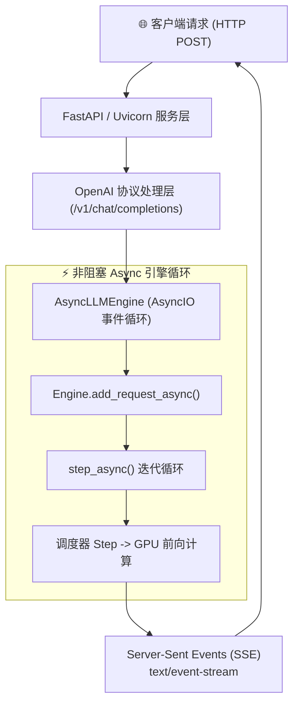
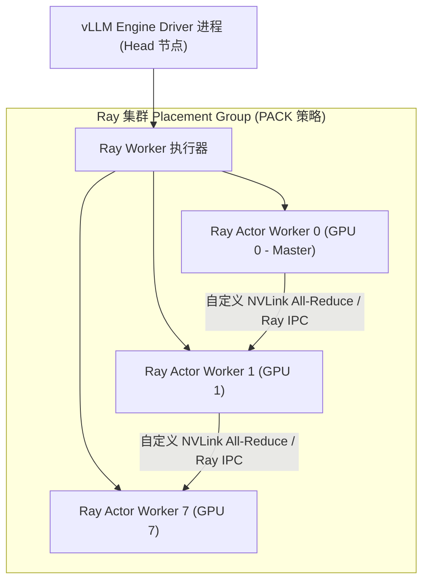
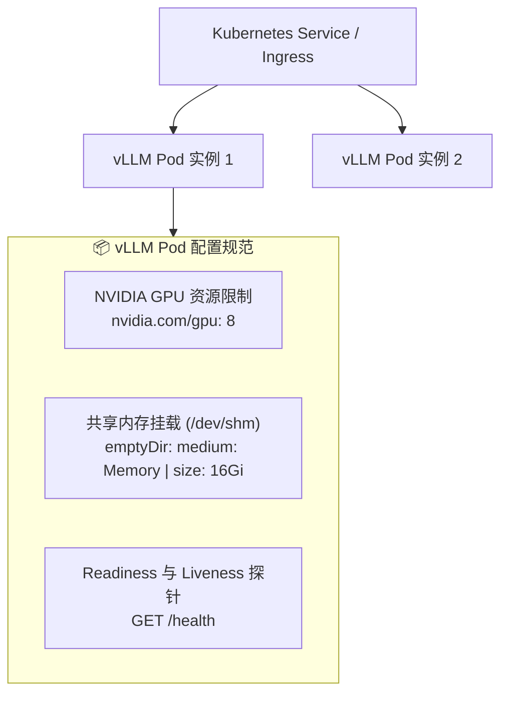
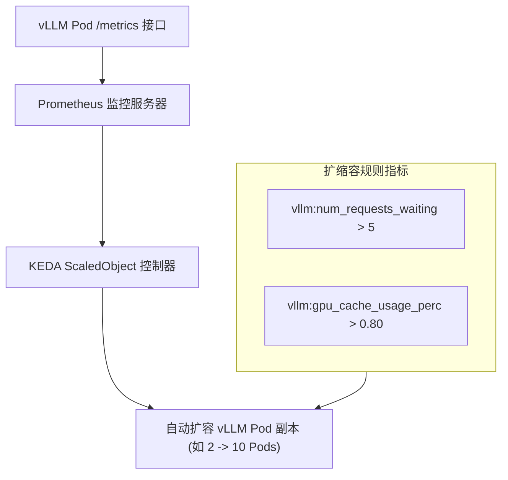
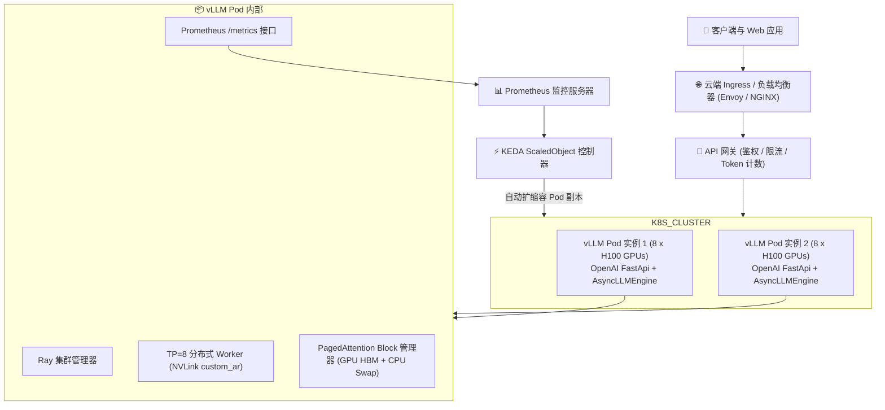

# 模块 6: 生产级部署、云原生编排与可观测性

将高性能 LLM 推理引擎从单机单卡环境推向企业级生产环境，需要具备健壮的部署架构、云原生编排以及实时可观测性。生产级 LLM 服务节点必须能够提供低延迟的 API 响应流、在突发流量下弹性扩缩容、优雅隔离硬件故障，并暴露详尽的运行指标用于自动扩缩容。

本模块将探索 vLLM 的生产级工程架构，涵盖 **OpenAI API Server 架构**、**Ray 分布式集群**、**Kubernetes Pod 部署最佳实践**、**Prometheus 指标与 KEDA 自动扩缩容**，以及 **完整生产级参考架构**。

---

## 第 1 部分: OpenAI API Server 与 AsyncEngine 架构

vLLM 提供了企业级 HTTP 服务器，完全兼容 **OpenAI API 规范** (`vllm.entrypoints.openai.api_server`)，支持文本补全 (`/v1/completions`) 和 Chat 补全 (`/v1/chat/completions`) 的流式响应。



### 1.1 非阻塞 `AsyncLLMEngine` 架构

为了在不阻塞 CPU 的前提下同时服务数千个并发 HTTP 客户端，vLLM 利用 **`AsyncLLMEngine`** 将 HTTP 请求处理与 GPU 推理彻底解耦：

1. **AsyncIO 事件循环**: HTTP 服务器运行在 Python 的 `asyncio` 事件循环上。当客户端发送 JSON 请求时，FastAPI 解析输入并将其转发给 `AsyncLLMEngine.add_request_async()`。
2. **请求队列化**: 请求被推入异步队列 (`AsyncStream`)，并映射唯一的 Request ID。
3. **后台 Worker 循环 (`step_async()`)**: 后台任务运行连续的 `while` 循环调用 `engine.step_async()`。在每次迭代中，调度器挑选活跃请求、发起 Batch GPU 前向计算，并将生成的 Token ID 流式写回各个客户端的响应生成器。
4. **Server-Sent Events (SSE) 流式传输**: 每当 GPU Step 生成新 Token，API 服务器会将其格式化为 `text/event-stream` 块 (`data: {"choices": [{"delta": {"content": "..."}}]}`) 并通过 HTTP 立即推送到客户端。

---

## 第 2 部分: 基于 Ray Core 的多节点分布式集群编排

当运行多 GPU 或多节点分布式推理时 (例如跨 4 个节点的张量并行 $\text{TP} = 8$)，vLLM 利用 **Ray Core** (`vllm.engine.ray_utils`) 来编排 Worker 进程。



### 2.1 Ray Actor 与 Placement Group

为了确保多 GPU Worker 进程具备物理亲和性与高 NVLink 带宽：

1. **Ray Actor**: vLLM 将每个 GPU Worker 封装在一个 **Ray Actor** (`Worker` 类) 中，每个 Actor 运行在独立的 GPU 上。
2. **Placement Group (`PACK` 策略)**: vLLM 使用 `PACK` 束策略申请 Ray Placement Group，强制 Ray 在跨节点扩展前，优先将 GPU Worker Actor 打包部署在同一个物理服务器节点上。
3. **PyTorch Distributed 初始化**: Ray Actor 实例化后，Ray 会跨 Actor 初始化 `torch.distributed` 进程组，从而启用低延迟的 NVLink 和 InfiniBand 直接传输 (`vllm._C.custom_ar`)。

---

## 第 3 部分: Kubernetes 生产级部署最佳实践

在企业云环境 (GKE、EKS、AKS) 中，vLLM 实例作为由 Deployment 或 StatefulSet 控制器管理的 **Kubernetes Pod** 进行部署。



### 3.1 关键 Pod 配置要求

#### 1. 共享内存 (`/dev/shm`) 卷挂载
默认情况下，Docker 和 Kubernetes 将容器的 `/dev/shm` 共享内存限制为微小的 $64 \text{ MB}$。

由于 vLLM 的自定义 NVLink All-Reduce CUDA Kernel (`vllm._C.custom_ar`) 和 PyTorch Distributed IPC 需要使用 POSIX 共享内存缓冲区，**$64 \text{ MB}$ 的 `/dev/shm` 会直接导致 Kernel 崩溃 (`SIGBUS` 或 CUDA Out of Memory)**。

**Kubernetes 修复方案**: 将内存型的 `emptyDir` 挂载到 `/dev/shm`，容量至少设为 $16 \text{ GB}$：

```yaml
volumes:
  - name: dshm
    emptyDir:
      medium: Memory
      sizeLimit: 16Gi
volumeMounts:
  - mountPath: /dev/shm
    name: dshm
```

#### 2. GPU 资源分配与驱动
使用 **NVIDIA GPU Operator** 指定明确的 GPU 资源 Request 与 Limit：

```yaml
resources:
  limits:
    nvidia.com/gpu: "8"
  requests:
    nvidia.com/gpu: "8"
```

#### 3. 健康检查与优雅终止
- **Readiness Probe**: 查询 `GET /health`，确保模型完成加载和 CUDA Graph 预热捕获后，Kubernetes Service 才开始分发线上流量。
- **优雅终止 (`terminationGracePeriodSeconds: 120`)**: 允许活跃的流式请求在 Pod 接收到 `SIGKILL` 之前完成传输。

---

## 第 4 部分: 生产级可观测性、指标与 KEDA 自动扩缩容

vLLM 暴露了内置的 Prometheus 指标接口 (`/metrics`)，用于实时监控与事件驱动的自动扩缩容。

### 4.1 核心 vLLM Prometheus 指标

| 指标名称 | 类型 | 描述 | 运维指导意义 |
| :--- | :--- | :--- | :--- |
| `vllm:num_requests_running` | Gauge | 当前正在执行 GPU 前向计算的活跃请求数 | 高数值表明 GPU 处于高负载状态 |
| `vllm:num_requests_waiting` | Gauge | 在调度器等待队列中排队的请求数 | **水平自动扩缩容 (HPA) 的核心触发指标** |
| `vllm:gpu_cache_usage_perc` | Gauge | 当前已分配的物理 GPU KV Cache Block 百分比 | **$> 85\%$ 表明即将触发抢占/换页** |
| `vllm:cpu_cache_usage_perc` | Gauge | 当前已分配的物理 CPU Swap KV Cache Block 百分比 | $> 0\%$ 表明 GPU 显存已饱和 |
| `vllm:time_to_first_token_seconds` | Histogram | 首 Token 延迟 (TTFT) 分布 | 评估 Prompt 处理性能的核心 SLA 指标 |
| `vllm:time_per_output_token_seconds` | Histogram | Token 间延迟 (ITL) 分布 | 评估文本生成速度的核心 SLA 指标 |

---

### 4.2 KEDA 事件驱动的 Pod 水平自动扩缩容

标准的 Kubernetes Horizontal Pod Autoscaler (HPA) 基于 CPU 或内存利用率进行扩缩容，这对于 GPU 密集型推理任务完全无效。

生产部署使用 **KEDA (Kubernetes Event-driven Autoscaling)**，根据 **KV Cache 利用率** 和 **等待队列深度** 动态扩缩容 vLLM Pod 副本数。



#### KEDA `ScaledObject` 配置示例
```yaml
apiVersion: keda.sh/v1alpha1
kind: ScaledObject
metadata:
  name: vllm-autoscaler
spec:
  scaleTargetRef:
    name: vllm-deployment
  minReplicaCount: 2
  maxReplicaCount: 20
  triggers:
    - type: prometheus
      metadata:
        serverAddress: http://prometheus-k8s.monitoring:9090
        metricName: vllm_num_requests_waiting
        query: sum(vllm:num_requests_waiting)
        threshold: '5'
```

---

## 第 5 部分: 完整生产级参考架构

完整的企业级 LLM 服务架构将 API 网关、KEDA 自动扩缩容、Ray 分布式集群与多级内存管理融合为了统一的部署拓扑。



---

## 总结: 生产就绪检查清单 (Checklist)

| 检查维度 | 最佳实践要求 | 验证指标 / 命令 |
| :--- | :--- | :--- |
| **共享内存** | 将 `emptyDir` 内存卷挂载至 `/dev/shm` ($\ge 16 \text{ GB}$) | 防止 NVLink All-Reduce 期间因 IPC 导致的 `SIGBUS` 崩溃 |
| **CUDA Graphs** | 预热固定 Batch 桶的 CUDA Graph | 验证 $b \in \{1 \dots 128\}$ 时 `vllm:num_requests_running` 的延迟骤降 |
| **健康探针** | 将 Readiness Probe 指向 `GET /health` | 确保仅在模型加载与 Graph 捕获完成后才分发流量 |
| **自动扩缩容** | 通过 KEDA 基于 `vllm:num_requests_waiting` 扩容 | 防止突发 Prompt 流量导致 TTFT 飙升 |
| **可观测性** | 每 5 秒抓取一次 Prometheus `/metrics` | 监控 TTFT (`vllm:time_to_first_token_seconds`) 与 GPU Cache 利用率 |

恭喜你完成《**vLLM 核心架构与性能机制**》系统的全部学习！你现在已经掌握了从 LLM 推理基础、内存管理、Kernel 优化、分布式并行到企业云原生部署的全栈硬核技术。
