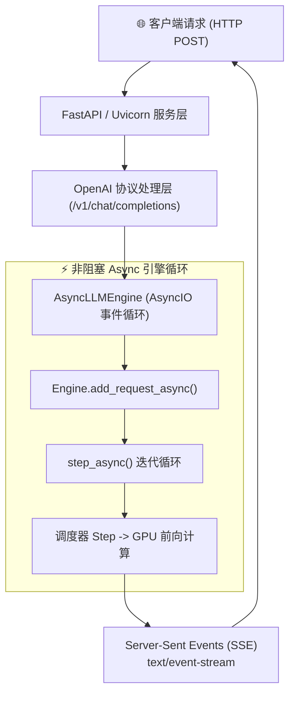
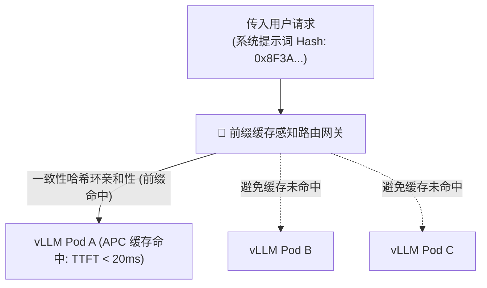
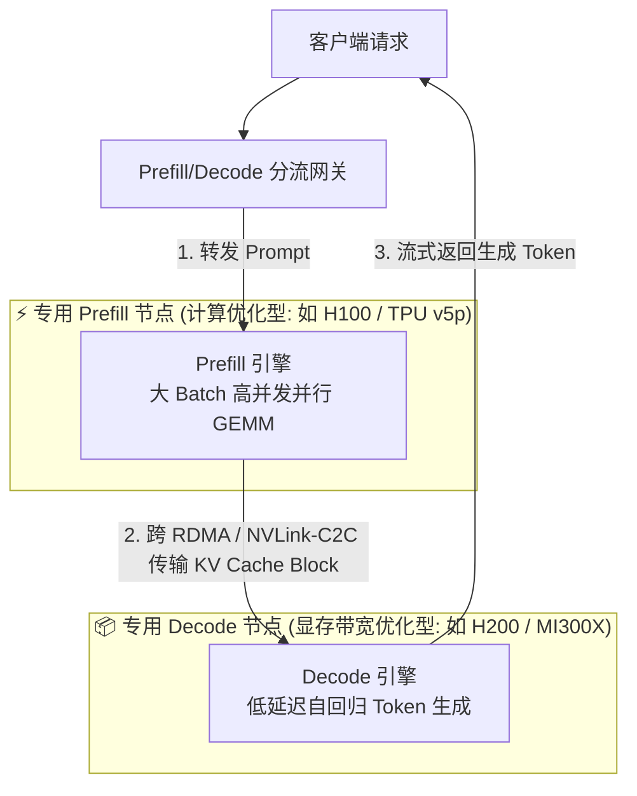
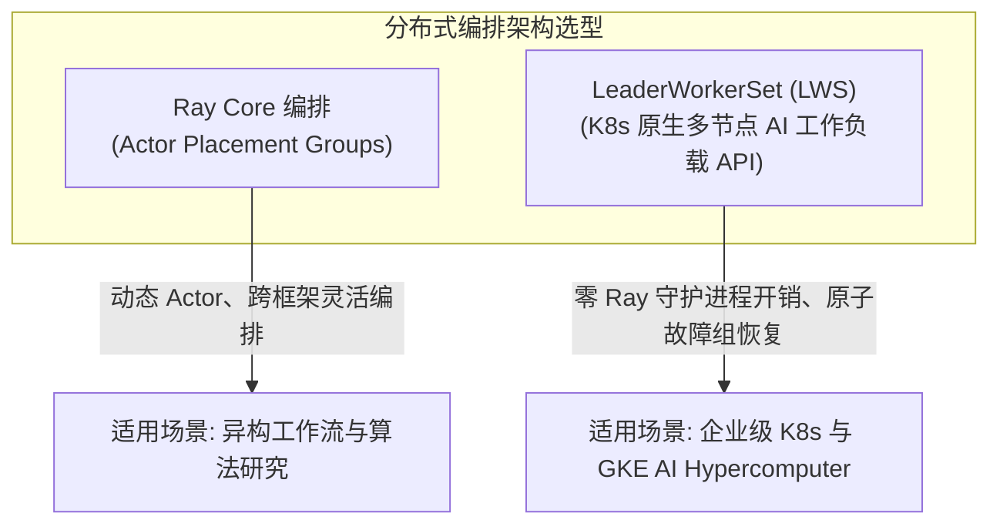
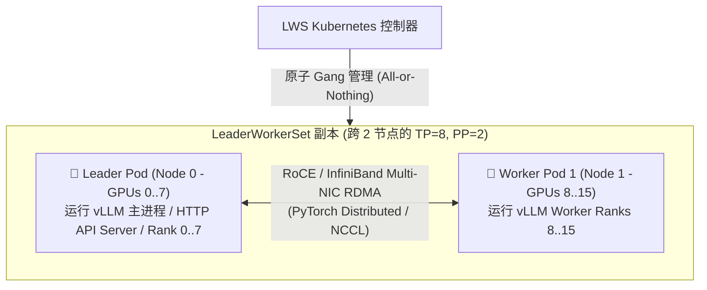
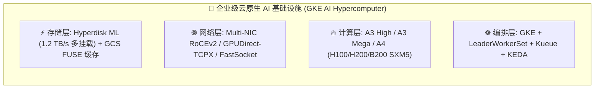
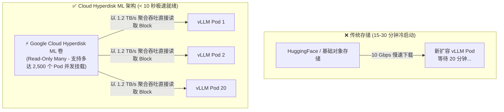
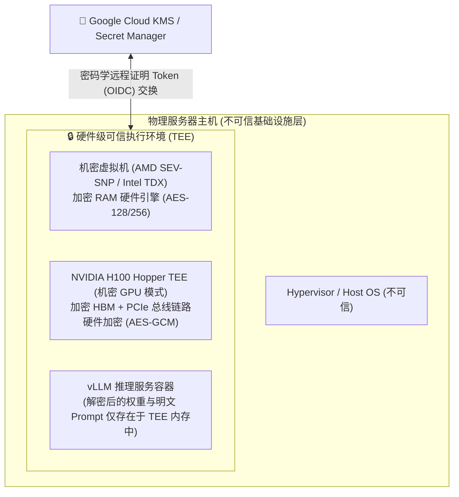
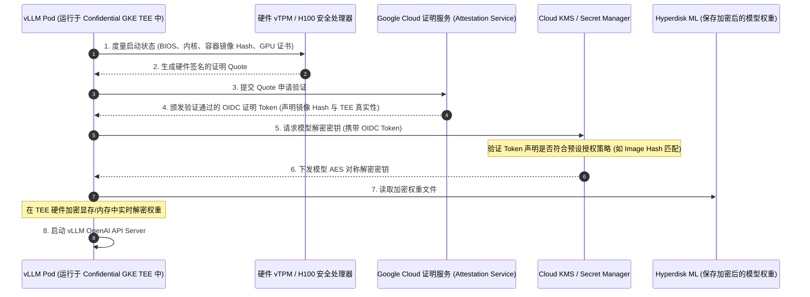
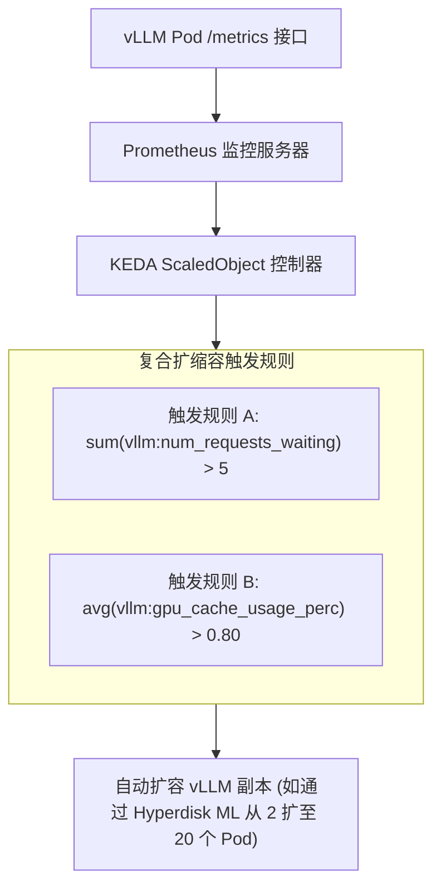

# 模块 6: 生产级部署、云原生编排与可观测性

将高性能 LLM 推理引擎从单机单卡测试环境推向企业级生产环境，需要具备健壮的部署架构、云原生编排能力、超高速冷启动存储管线、硬件级机密计算保障以及实时的可观测性。生产级 LLM 服务节点不仅必须能够提供低延迟的流式 API 响应、在突发流量下弹性扩缩容（消除长达数十分钟的模型权重加载等待），还要能优雅地隔离硬件故障，利用硬件级可信执行环境 (TEE) 保护敏感的模型权重与用户数据，并暴露详尽的运行指标用于事件驱动的自动扩缩容。

本模块将全面剖析 vLLM 的生产级工程架构，涵盖：
1. **OpenAI API Server、前缀感知智能路由与 Prefill/Decode 解耦服务**
2. **多节点分布式集群编排: Ray 与 LeaderWorkerSet (LWS)**
3. **企业级云基础设施与冷启动加速 (GKE AI Hypercomputer 与 Hyperdisk ML)**
4. **机密 AI 与零信任 LLM 推理 (Confidential Space 与搭载 H100 TEE 的 Confidential GKE)**
5. **生产级可观测性、Prometheus 指标与 KEDA 事件驱动自动扩缩容**
6. **完整生产级参考架构与就绪检查清单 (Checklist)**

---

## 第 1 部分: OpenAI API Server、前缀路由与 Prefill/Decode 解耦服务

vLLM 提供了企业级 HTTP 服务器，完全兼容 **OpenAI API 规范** (`vllm.entrypoints.openai.api_server`)，支持文本补全 (`/v1/completions`) 和 Chat 补全 (`/v1/chat/completions`) 的流式响应。



### 1.1 非阻塞 `AsyncLLMEngine` 架构

为了在不阻塞 CPU 的前提下同时服务数千个并发 HTTP 客户端，vLLM 利用 **`AsyncLLMEngine`** 将 HTTP 请求处理与 GPU 推理彻底解耦：

1. **AsyncIO 事件循环**: HTTP 服务器运行在 Python 的 `asyncio` 事件循环上。当客户端发送 JSON 请求时，FastAPI 解析输入并将其转发给 `AsyncLLMEngine.add_request_async()`。
2. **请求队列化**: 请求被推入异步队列 (`AsyncStream`)，并映射唯一的 Request ID。
3. **后台 Worker 循环 (`step_async()`)**: 后台任务运行连续的 `while` 循环调用 `engine.step_async()`。在每次迭代中，调度器挑选活跃请求、发起 Batch GPU 前向计算，并将生成的 Token ID 流式写回各个客户端的响应生成器。
4. **Server-Sent Events (SSE) 流式传输**: 每当 GPU Step 生成新 Token，API 服务器会将其格式化为 `text/event-stream` 块 (`data: {"choices": [{"delta": {"content": "..."}}]}`) 并通过 HTTP 立即推送到客户端。

---

### 1.2 前缀缓存感知 (Prefix-Cache-Aware) 智能网关路由

当部署由多个 vLLM Pod 副本组成的推理集群时，传统的轮询 (Round-Robin) 或随机负载均衡器会严重破坏**自动前缀缓存 (Automatic Prefix Caching, APC)** 的局部性。如果用户发送包含 4,000 Token 系统提示词（或 32K RAG 文档上下文）的重复请求，若请求 1 被路由至 Pod A，而请求 2 被路由至 Pod B，Pod B 将被迫从头重新计算整个 Prompt 的 KV Cache（首 Token 延迟 $\text{TTFT} \approx 800\text{ ms}$，而缓存命中时 $< 20\text{ ms}$）。



**生产级路由方案**:
- **一致性哈希代理 (Consistent Hashing Proxy)**: 部署智能网关（例如基于 Envoy 的自定义 Lua 过滤器，或专用的 vLLM Router），对请求的初始 Token 前缀（或 System Prompt / 文档 ID）计算哈希值并映射至一致性哈希环。
- **缓存亲和性转发**: 拥有相同前缀哈希的请求会被精准路由至同一个 vLLM Pod 副本，将集群整体的 APC 命中率从 $\sim 15\%$ 大幅提升至 $> 90\%$，节约大量算力并将整体 TTFT 降低高达 $10\times$。

---

### 1.3 Prefill 与 Decode 解耦服务 (Disaggregated Serving / Split Serving)

如 [模块 1](01_llm_inference_fundamentals.md) 与 [模块 3](03_performance_and_quality.md) 所述，LLM 推理的两个阶段对硬件有着截然相反的诉求：
- **Prefill (Prompt 处理阶段)**: 计算受限 (Compute-bound)，并行 GEMM 操作打满 Tensor Core，极大受益于高 TFLOPs 算力。
- **Decode (Token 生成阶段)**: 显存带宽受限 (Memory-bandwidth bound)，逐 Token 串行 GEMV 执行，极度依赖海量显存容量与超高 HBM 带宽 (TB/s)。

当 Prefill 和 Decode 混部在同一个引擎实例中时，长 Prompt 的突发到达会直接打断正在活跃生成的解码流，造成严重的 Token 间延迟 (ITL / TBT) 抖动与长尾延迟尖峰。



1. **专用 Prefill 节点**: 在计算密集型节点上批量并发处理 Prompt。当生成初始 KV Cache 后，通过极低延迟的 InfiniBand / RoCE RDMA 将物理 KV Block 转移至 Decode 节点。
2. **专用 Decode 节点**: 专心执行平滑、无阻塞的自回归解码，提供严格的 ITL SLA 保障 (例如 $< 15\text{ ms/token}$)。

---

## 第 2 部分: 多节点分布式集群编排: Ray 与 LeaderWorkerSet (LWS)

当模型规模超出单机显存容纳极限时 (例如跨多机部署 Llama 3 70B，或部署 Llama 3 405B 需要在 8 台 8xH100 节点上运行 $\text{TP} = 8, \text{PP} = 8$)，编排系统必须统一管理跨节点进程生命周期与物理 GPU 亲和性。



---

### 2.1 基于 Ray Core 的分布式集群编排

在常规设置中，vLLM 利用 **Ray Core** (`vllm.engine.ray_utils`) 编排跨物理节点的 Worker 进程：

1. **Ray Actor**: vLLM 将每个 GPU Worker 封装在绑定特定物理 GPU 的 Actor (`Worker` 类) 中。
2. **Placement Group (`PACK` 策略)**: vLLM 使用 `PACK` 策略申请 Ray Placement Group，强制 Ray 在跨节点扩展前优先将 GPU Worker Actor 打包部署在同一物理机内，以最大化 NVLink 带宽。
3. **PyTorch Distributed 进程组**: Ray 跨 Actor 初始化 `torch.distributed` 进程组，从而启用低延迟的 NVLink 和 InfiniBand 直接传输 (`vllm._C.custom_ar`)。

---

### 2.2 现代 Kubernetes 原生多节点编排: `LeaderWorkerSet` (LWS)

尽管 Ray 应用广泛，但在企业级 Kubernetes 生产环境中运维 Ray 集群会引入额外的组件（Ray Head Pod、Ray Autoscaler 守护进程、Redis/GCS 状态存储），增加了运维复杂性。

Kubernetes 社区与 Google Cloud 推出了 **`LeaderWorkerSet` (LWS)** —— 专门为多节点 AI/LLM 分布式推理与训练设计的 Kubernetes 原生 API：



#### LeaderWorkerSet (LWS) 相比 Ray 的核心生产优势:
1. **零额外控制面开销**: 无需 Ray Head 节点与守护进程，完全基于标准 Kubernetes Pod 原语运行。
2. **原子故障恢复 (Gang Lifecycle)**: 在张量/流水线并行中，若单个 GPU 节点故障，整个推理组必须同步重启。LWS 自动支持 `RecreateGroupOnPodRestart`（原子级整组重建），防止集群出现“僵尸”残缺组死锁。
3. **确定性网络拓扑**: 自动生成稳定的 Pod DNS 子域名（如 `leader-0.lws-service`、`worker-0-1.lws-service`），使得 PyTorch Distributed Rendezvous 能够瞬间解析并组网，无需外部协调组件。

#### 生产级 `LeaderWorkerSet` YAML 配置规范 (2 节点 x 8 张 H100 GPU):
```yaml
apiVersion: leaderworkerset.x-k8s.io/v1
kind: LeaderWorkerSet
metadata:
  name: vllm-llama3-405b
  namespace: llm-serving
spec:
  replicas: 2 # 部署 2 个服务副本，每个副本横跨 2 个物理节点 (共 4 个节点)
  leaderWorkerTemplate:
    size: 2 # 每个副本由 1 个 Leader Pod + 1 个 Worker Pod 组成
    restartPolicy: RecreateGroupOnPodRestart # 原子故障组恢复
    leaderTemplate:
      metadata:
        labels:
          role: leader
      spec:
        containers:
          - name: vllm-leader
            image: vllm/vllm-openai:latest
            command:
              - python3
              - -m
              - vllm.entrypoints.openai.api_server
            args:
              - --model=/models/llama-3-405b-instruct
              - --tensor-parallel-size=8
              - --pipeline-parallel-size=2
              - --gpu-memory-utilization=0.92
              - --enable-prefix-caching
            resources:
              limits:
                nvidia.com/gpu: "8"
              requests:
                nvidia.com/gpu: "8"
            volumeMounts:
              - mountPath: /dev/shm
                name: dshm
              - mountPath: /models
                name: model-storage
        volumes:
          - name: dshm
            emptyDir:
              medium: Memory
              sizeLimit: 64Gi
          - name: model-storage
            persistentVolumeClaim:
              claimName: hyperdisk-ml-pvc
    workerTemplate:
      spec:
        containers:
          - name: vllm-worker
            image: vllm/vllm-openai:latest
            resources:
              limits:
                nvidia.com/gpu: "8"
              requests:
                nvidia.com/gpu: "8"
            volumeMounts:
              - mountPath: /dev/shm
                name: dshm
              - mountPath: /models
                name: model-storage
        volumes:
          - name: dshm
            emptyDir:
              medium: Memory
              sizeLimit: 64Gi
          - name: model-storage
            persistentVolumeClaim:
              claimName: hyperdisk-ml-pvc
```

---

## 第 3 部分: 企业级云基础设施与冷启动加速

在 **Google Cloud AI Hypercomputer on GKE** 等现代云原生 AI 基础设施中，系统设计必须贯穿计算加速卡、超高速模型存储与高带宽网络互联。



### 3.1 高性能推理关键 Pod 参数配置

#### 1. 共享内存 (`/dev/shm`) 容量调优
默认情况下，Docker 和 Kubernetes 将容器的 `/dev/shm` 共享内存限制为极小的 $64 \text{ MB}$。

由于 vLLM 的自定义 NVLink All-Reduce CUDA Kernel (`vllm._C.custom_ar`) 与 PyTorch Distributed IPC 需要使用 POSIX 共享内存缓冲区跨 8 张 GPU 交换中间张量指针，**$64 \text{ MB}$ 的 `/dev/shm` 会直接导致系统崩溃 (`SIGBUS` 或 CUDA Out of Memory)**。

**生产级容量规范**: 挂载内存型 `emptyDir`，容量至少设为 $\ge 16 \text{ GB}$（多节点或大 Batch 场景建议 $\ge 32 \dots 64 \text{ GB}$）：

```yaml
volumes:
  - name: dshm
    emptyDir:
      medium: Memory
      sizeLimit: 32Gi
volumeMounts:
  - mountPath: /dev/shm
    name: dshm
```

#### 2. NUMA 亲和性与 CPU 核心绑定
在双路服务器（如 2 颗 Intel Xeon / AMD EPYC CPU 搭载 8 张 H100 GPU）中，GPU 0-3 连接至 NUMA Node 0，GPU 4-7 连接至 NUMA Node 1。

若 Kubernetes 将 vLLM CPU 线程调度在 NUMA Node 1 上，却在操控 GPU 0-3，内存拷贝将跨越跨 Socket 的 UPI/QPI 总线，导致高达 $40\%$ 的吞吐量衰减。在 GKE 中，配置 **Kubernetes CPU Manager Policy (`static`)** 与 **Topology Manager Policy (`single-numa-node`)**，将容器 CPU 线程锁定在本地 NUMA 域。

---

### 3.2 解决冷启动扩容瓶颈: Hyperdisk ML 与高速缓存

当业务流量激增触发 KEDA 自动扩容（例如从 2 个 Pod 扩至 20 个 Pod）时，传统云存储会陷入严重的“冷启动瘫痪”：
- 70B 参数的 FP16/BF16 模型权重体积为 **$140 \text{ GB}$**。
- 405B 参数的模型权重体积高达 **$810 \text{ GB}$**。
- 通过 10 Gbps 常规网络从 HuggingFace 或标准对象存储逐个下载，每个 Pod 需要耗时 **$15 \dots 30 \text{ 分钟}$**。
- **突发流量早已过去，扩容 Pod 却仍未就绪，导致自动扩缩容完全失效。**



#### 高速存储加速方案:
1. **Google Cloud Hyperdisk ML**:
   - 专为 AI 推理扩缩容设计。单个存储卷以 **Read-Only Many (`ROX`)** 模式可同时挂载给多达 **2,500 个 GKE Pod**。
   - 提供高达 **$1.2 \text{ TB/s}$ 的集群聚合读取吞吐量**，20 个新启动的 vLLM Pod 同时加载 $140 \text{ GB}$ 权重仅需 **不到 10 秒**。
2. **GCS FUSE CSI 驱动与本地 NVMe SSD 缓存**:
   - 将 Cloud Storage Bucket 挂载为本地文件系统，配合本地 NVMe SSD 缓存与并行预读 (`file-cache: max-size-mb`)。
3. **容器镜像流式加载 (Container Image Streaming / Stargz)**:
   - 允许 GKE 节点在无需完整下载 20GB CUDA 基础镜像的情况下瞬间启动容器，按需流式拉取镜像层。

---

### 3.3 高性能跨节点云网络

多节点 TP/PP 分布式推理需要规避传统 TCP/IP 网络协议栈瓶颈：
- **Multi-NIC 多网卡拓扑**: 云 AI 实例 (如 Google Cloud A3 Mega / A3 Ultra) 为每个节点配备 **8 张专用的 $200\text{ Gbps}$ 或 $400\text{ Gbps}$ 网络接口卡 (NIC)**，与 8 张 GPU 实现 1:1 独立带宽映射。
- **GPUDirect-TCPX 与 RoCEv2 RDMA**: 绕过主机 CPU 与系统内存，实现从本地 GPU HBM 到远端 GPU HBM 的直传。
- **NCCL 关键调优环境变量**:
  ```bash
  export NCCL_DEBUG=INFO
  export NCCL_NET_GDR_LEVEL=5          # 跨 PCIe/NVLink 启用完整 GPUDirect RDMA
  export NCCL_CROSS_NIC=1              # 均衡利用全部 8 张网卡发送 All-Reduce 流量
  export NCCL_BUFFSIZE=8388608         # 8MB 环形缓冲区以支撑超高吞吐通信
  ```

---

## 第 4 部分: 机密 AI 与零信任 LLM 推理

在对安全性要求极高的企业领域（医疗健康/HIPAA、金融风控、政府国防、核心资产模型），部署前沿 LLM 会面临严峻的安全威胁：
1. **内存明文嗅探风险**: 传统 GPU 显存 (HBM) 与系统物理内存 (RAM) 在前向计算时均保存明文数据（用户 Prompt、病历、商业模型权重）。
2. **不可信基础设施管理员 / 平台特权风险**: 拥有物理机 Host OS 权限的恶意管理员、被攻破的 Hypervisor 或多租户恶意邻居可能通过 Dump 内存页面盗取专有模型权重或用户隐私会话。

为此，Google Cloud 与 NVIDIA 推出了基于 **Confidential Space** 以及 **搭载 NVIDIA H100 TEE 的 Confidential GKE** 的 **机密 AI (Confidential AI)** 架构。



---

### 4.1 硬件级可信执行环境 (TEE)

机密 LLM 推理通过 CPU 与 GPU 双重硬件密码学边界提供保护：
1. **CPU TEE (AMD SEV-SNP / Intel TDX)**: 内存加密密钥由 CPU 硅片内部的硬件安全处理器独立生成与管理，Hypervisor 无法读取或篡改 Guest VM 的内存页面。
2. **GPU TEE (NVIDIA Hopper H100 机密计算模式)**:
   - 当配置在 **APM 模式 (Attested Pass-Through Mode)** 时，H100 内部的安全引擎使用硬件 **AES-GCM-256** 对穿过 PCIe 总线的所有数据以及片上 HBM3 显存进行线速硬件级透明加密。
   - 即使攻击者在物理 PCIe 插槽或显存总线上挂载逻辑分析仪，也只能读取到不可破解的密文。

---

### 4.2 密码学远程证明 (Remote Attestation) 与安全权重加载管线

企业如何在绝不向云平台磁盘泄露明文权重的前提下，将核心模型安全加载至云端 vLLM 实例？

解决方案是依托 **Confidential Space / Confidential GKE** 实现的**密码学远程证明与条件解密流水线**：



1. **硬件度量**: 当 vLLM Pod 在 Confidential GKE 中启动时，硬件 vTPM 与 NVIDIA H100 安全处理器计算 BIOS、容器镜像、操作系统内核及 GPU 微码的哈希值。
2. **证明 Token 签发**: Pod 将硬件度量值发送至证明服务，后者将其与企业预先审批的“黄金基线哈希”比对，确认无篡改后签发带防伪签名的 OIDC Token。
3. **条件密钥释放**: Cloud KMS 验证 Token 声明（如 *Image Hash == `vllm-prod-v2.4`*, *Confidential GPU == `H100-TEE`*），验证通过后才下发解密密钥。
4. **安全运行**: 模型权重在 TEE 硬件加密显存/内存中就地解密。整个生命周期中，明文权重从未落地持久化磁盘，也未出现在可被 Host OS 访问的物理内存中。

---

### 4.3 架构对比总结: AI Hypercomputer vs. Confidential Space

清晰理解 Google Cloud AI Hypercomputer 与 Confidential Space 的定位差异：

| 架构维度 | **Google Cloud AI Hypercomputer** (GKE AI) | **Confidential Space / Confidential GKE** |
| :--- | :--- | :--- |
| **主要工程定位** | **算力扩展、极致吞吐与低延迟工程优化** | **零信任安全隔离、数据隐私与核心资产保护** |
| **核心硬件支撑** | NVIDIA H100/H200/B200、TPU v5p/v6e、Multi-NIC RoCE、Hyperdisk ML | AMD SEV-SNP、Intel TDX、NVIDIA H100 TEE (机密 GPU 模式) |
| **核心软件抽象** | LeaderWorkerSet (LWS)、KubeRay、Kueue、NCCL FastSocket、KEDA | 硬件证明服务 (Attestation)、Cloud KMS、Workload Identity OIDC |
| **解决的关键痛点** | 超大模型跨机并行 (TP/PP)、冷启动秒级扩容、高并发吞吐打满 | 抵御恶意特权管理员、Hypervisor 漏洞、多租户显存嗅探 |
| **典型应用场景** | 超大规模通用 LLM 服务 (如 Llama 3 405B、DeepSeek-V3) | 医疗大模型、金融风控 LLM、企业核心专有权重托管 |
| **融合部署架构** | 在 **配备机密 H100 GPU 的 GKE A3 节点** 上通过 **LeaderWorkerSet + Hyperdisk ML** 部署 vLLM，同时获得极致的分布式吞吐性能与硬件证明的零信任安全。 |

---

## 第 5 部分: 生产级可观测性、Prometheus 指标与 KEDA 自动扩缩容

vLLM 暴露了内置的 Prometheus 指标接口 (`/metrics`)，用于实时监控与事件驱动的自动扩缩容。

### 5.1 核心 vLLM Prometheus 指标

| 指标名称 | 类型 | 描述 | 运维指导意义与 SRE 阈值 |
| :--- | :--- | :--- | :--- |
| `vllm:num_requests_running` | Gauge | 当前正在执行 GPU 前向计算的活跃请求数 | 高数值表明 GPU 处于高负载状态 |
| `vllm:num_requests_waiting` | Gauge | 在调度器等待队列中排队的请求数 | **水平自动扩缩容 (HPA) 的核心触发指标 ($> 5 \dots 10$)** |
| `vllm:gpu_cache_usage_perc` | Gauge | 当前已分配的物理 GPU KV Cache Block 百分比 | **$> 85\%$ 表明即将触发抢占、换页或 TTFT 严重劣化** |
| `vllm:cpu_cache_usage_perc` | Gauge | 当前已分配的物理 CPU Swap KV Cache Block 百分比 | $> 0\%$ 表明 GPU 显存已严重饱和 |
| `vllm:avg_prompt_throughput_tok_per_s` | Gauge | 整个引擎的 Prompt Token Prefill 聚合吞吐量 | 监控 Prefill 算力利用率与 TTFT 处理容量 |
| `vllm:avg_generation_throughput_tok_per_s` | Gauge | 整个引擎的 Output Token 解码生成聚合吞吐量 | 衡量自回归解码显存带宽的打满程度 |
| `vllm:time_to_first_token_seconds` | Histogram | 首 Token 延迟 (TTFT) 分布 | 评估 Prompt 响应的核心 SLA 指标 ($P_{99} < 1.0\text{ s}$) |
| `vllm:time_per_output_token_seconds` | Histogram | Token 间延迟 (ITL / TBT) 分布 | 评估文本生成速度的核心 SLA 指标 ($P_{99} < 25\text{ ms}$) |

---

### 5.2 KEDA 事件驱动的 Pod 水平自动扩缩容

标准的 Kubernetes Horizontal Pod Autoscaler (HPA) 基于 CPU 或内存利用率进行扩缩容，这对于 GPU 密集型推理任务完全无效。

生产部署使用 **KEDA (Kubernetes Event-driven Autoscaling)**，根据 **KV Cache 利用率** 和 **等待队列深度** 动态扩缩容 vLLM Pod 副本数。



#### 生产级 KEDA `ScaledObject` 配置示例
```yaml
apiVersion: keda.sh/v1alpha1
kind: ScaledObject
metadata:
  name: vllm-keda-autoscaler
  namespace: llm-serving
spec:
  scaleTargetRef:
    apiVersion: leaderworkerset.x-k8s.io/v1
    kind: LeaderWorkerSet
    name: vllm-llama3-405b
  minReplicaCount: 2
  maxReplicaCount: 20
  cooldownPeriod: 300 # 冷却时间，防止突发流量下的抖动缩容
  pollingInterval: 5
  triggers:
    - type: prometheus
      metadata:
        serverAddress: http://prometheus-k8s.monitoring:9090
        metricName: vllm_num_requests_waiting
        query: sum(vllm:num_requests_waiting{namespace="llm-serving"})
        threshold: '5'
    - type: prometheus
      metadata:
        serverAddress: http://prometheus-k8s.monitoring:9090
        metricName: vllm_gpu_cache_usage_perc
        query: avg(vllm:gpu_cache_usage_perc{namespace="llm-serving"})
        threshold: '0.80'
```

---

## 第 6 部分: 完整生产级参考架构

完整的企业级 LLM 服务架构将前缀感知网关路由、LeaderWorkerSet 多节点扩容、Hyperdisk ML 极速存储、硬件证明机密计算与 KEDA 自动扩缩容融合为了统一的生产拓扑。

```mermaid
flowchart TD
    USERS["📱 客户端与 Web 应用"] --> WAF["🛡️ Cloud Armor / WAF / SSL 终结"]
    WAF --> GATEWAY["🚪 智能 API 网关 (鉴权 / 限流 / 前缀感知哈希路由)"]
    
    GATEWAY --> K8S_CLUSTER["☸️ GKE AI Hypercomputer 集群"]

    subgraph K8S_CLUSTER ["☸️ GKE AI Hypercomputer 集群 (Confidential A3 节点)"]
        subgraph LWS_REPLICA_1 ["LeaderWorkerSet 副本 1 (TP=8, PP=2)"]
            LEADER_1["👑 Leader Pod (Node 0: 8x H100 TEE)<br>OpenAI FastAPI + 主引擎"]
            WORKER_1["👷 Worker Pod (Node 1: 8x H100 TEE)<br>分布式 Worker Ranks 8..15"]
            LEADER_1 <-->|"Multi-NIC RoCEv2 (400 Gbps RDMA)"| WORKER_1
        end

        subgraph LWS_REPLICA_2 ["LeaderWorkerSet 副本 2 (TP=8, PP=2)"]
            LEADER_2["👑 Leader Pod (Node 2: 8x H100 TEE)"]
            WORKER_2["👷 Worker Pod (Node 3: 8x H100 TEE)"]
            LEADER_2 <-->|"Multi-NIC RoCEv2 (400 Gbps RDMA)"| WORKER_2
        end
    end

    STORAGE["⚡ Google Cloud Hyperdisk ML 卷<br>(Read-Only Many, 1.2 TB/s 聚合吞吐量)"]
    STORAGE -->|"10 秒内极速加载模型"| LWS_REPLICA_1
    STORAGE -->|"10 秒内极速加载模型"| LWS_REPLICA_2

    ATTEST["🔐 Google Cloud KMS 与证明服务"] <-->|"硬件证明与密钥下发"| K8S_CLUSTER

    METRICS["📊 Prometheus 监控系统"] <-- "抓取 /metrics" -- K8S_CLUSTER
    METRICS --> KEDA["⚡ KEDA ScaledObject 控制器"]
    KEDA -->|"自动扩缩容 LWS 副本 (2 -> 20)"| K8S_CLUSTER
```

---

## 总结: 生产就绪检查清单 (Checklist)

| 检查维度 | 最佳实践生产要求 | 验证指标 / 命令 | 消除的故障风险 |
| :--- | :--- | :--- | :--- |
| **共享内存** | 将 `emptyDir` 内存卷挂载至 `/dev/shm` ($\ge 32 \text{ GB}$) | 在容器内验证 `df -h /dev/shm` | 防止 NVLink All-Reduce 期间因 IPC 导致的 `SIGBUS` 崩溃 |
| **多节点编排** | 使用 `LeaderWorkerSet` (LWS) 编排多机模型 | 验证 `kubectl get lws` 且配置 `RecreateGroupOnPodRestart` | 防止单机 GPU 故障时集群出现残缺 Pod 死锁 |
| **冷启动存储** | 采用 **Hyperdisk ML** (`ROX` 模式) 或 GCS FUSE 缓存挂载权重 | 测量容器启动到 Ready 耗时 ($< 15\text{ s}$) | 消除突发流量扩容时由于 20 分钟下载导致的扩容失效 |
| **智能路由** | 在 vLLM 前置部署前缀缓存感知路由网关 | 追踪 `vllm:gpu_prefix_cache_hit_rate` ($> 80\%$) | 消除重复长 Prompt 的冗余 Prefill 计算 |
| **机密计算安全** | 启用 Confidential GKE (AMD SEV-SNP + NVIDIA H100 TEE) | 验证基于 KMS 的远程证明 Token 密钥交换 | 防止主机特权管理员与云平台窥探模型权重与用户隐私 |
| **自动扩缩容** | 基于 `vllm:num_requests_waiting` ($> 5$) 与 GPU Cache ($> 0.80$) 进行 KEDA 扩容 | 检查 Prometheus 中 KEDA `ScaledObject` 状态 | 防止 TTFT 延迟雪崩与 GPU 显存 OOM 抢占 |
| **健康探针** | 将 Kubernetes Readiness Probe 指向 `GET /health` | 验证 HTTP 200 仅在 CUDA Graph 捕获完成后返回 | 确保不会向未预热完成的模型副本分发用户流量 |

恭喜你完成 **vLLM 核心架构与性能机制** 全书的学习！你现已全面掌握大模型推理基础、显存虚拟化管理、底层 Kernel 优化、多维分布式并行、云原生软硬件协同设计以及企业级零信任机密生产部署的全栈体系。
