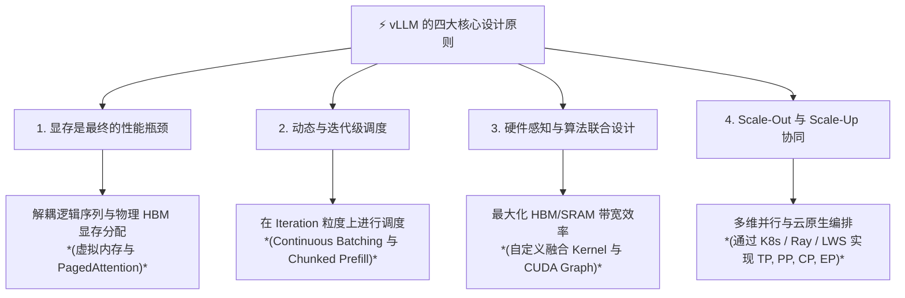

# vLLM 核心架构与性能机制: 核心原则与课程大纲

欢迎来到 **vLLM 深度探索教科书**。本系列学习模块旨在带你从大语言模型 (LLM) 推理的底层物理瓶颈出发，一路深入至分布式多集群编排、自定义 CUDA Kernel 优化以及硬件联合设计。

---

## 第 1 部分: LLM 推理与 vLLM 设计的核心原则

为了真正精通 vLLM，我们必须将理解锚定在推动其诞生与演进的四大核心设计原则上：

### 原则 1: 显存是 LLM 解码阶段的最终瓶颈
在传统推理系统中，Key-Value (KV) Cache 是根据请求的*最大潜在长度*在显存 (HBM) 中连续分配的。由于请求长度不可预测，这会导致：

- **内部碎片**: 预留但从未被使用的显存空间 (通常占已分配 KV Cache 的 60%–80%)。
- **外部碎片**: 连续内存块之间的空隙，无法用于满足新请求。
- **后果**: GPU 计算单元闲置等待内存，或因 KV Cache 浪费导致并发度被人为限制。

**vLLM 的解决方案**: 借鉴操作系统中**虚拟内存与分页 (Paging)** 的概念。通过将 KV Cache 切分为固定大小的**物理块** (如 16 个 token)，并通过 **Block Table** 映射到逻辑序列位置，vLLM 实现了近乎零显存浪费 (<4%)，使得在完全相同的硬件上并发度提升数倍。

---

### 原则 2: 连续与迭代级执行
传统深度学习框架运行在静态 Batch 上，所有序列必须一起完成，或者新序列必须等待 Batch 中最慢的序列结束。
**vLLM 的解决方案**: **连续批处理 (Continuous Batching / 迭代级调度)**。

- 在模型的每一次前向计算 (Iteration) 步，引擎都会检查已完成的序列，立即释放其 KV Block，并插入新到达的请求或调度分块。
- 通过 **Chunked Prefill** 技术，长 Prompt 评估被拆分为可控的分块，并与活跃请求的解码步骤交错执行，防止首 Token 延迟 (TTFT) 飙升破坏 Token 间延迟 (ITL)。

---

### 原则 3: 硬件-Kernel-算法联合设计
现代 GPU (NVIDIA Hopper/Blackwell、AMD CDNA3) 拥有巨大的算力 (TFLOPs)，但在自回归解码期间受限于显存带宽 (TB/s)。
**vLLM 的解决方案**:

- **PagedAttention Kernels**: 自定义融合 CUDA/ROCm/XLA Kernel，在注意力计算期间将离散物理 KV Block 直接加载到片上 SRAM (共享内存) 中，消除了额外的 HBM 读写。
- **图优化**: 集成 **CUDA Graphs** 与 `torch.compile`，彻底消除了快速重复的 Token 生成循环中的 CPU 开销与 Python 解释器延迟。

---

### 原则 4: 可组合并行与生产级编排
随着模型规模超出单卡 HBM 容纳极限，推理引擎必须原生编排复杂的并行拓扑，且不引入额外开销。
**vLLM 的解决方案**:

- 多维并行: 用于节点内低延迟的 **张量并行 (TP)**、用于跨节点扩展的 **流水线并行 (PP)**、用于百万 Token 上下文的 **上下文并行 (CP)**，以及用于混合专家模型的 **专家并行 (EP)**。
- 干净解耦计算引擎 (通过 **Ray** 或 Kubernetes 原生 **LeaderWorkerSet (LWS)** 扩展) 与服务网关 (兼容 OpenAI 的 API、前缀感知路由代理、**Triton Inference Server** 集成)。

---

## 第 2 部分: 课程结构与教科书路线图

本教程包含 6 个Self-Contained的深度学习模块以及 1 个附录词汇表。

| 模块 | 文件名 | 核心主题 |
| :--- | :--- | :--- |
| **[模块 1: 推理基础](01_llm_inference_fundamentals.md)** | [`01_llm_inference_fundamentals.md`](01_llm_inference_fundamentals.md) | 自回归解码机制、Prefill 与 Decode 阶段、KV Cache 数学推导 (`2 * b * s * l * h * d`)、算术强度 Roofline 模型与显存碎片。 |
| **[模块 2: 核心架构](02_vllm_core_architecture.md)** | [`02_vllm_core_architecture.md`](02_vllm_core_architecture.md) | 操作系统虚拟内存映射、Block Manager 剖析、PagedAttention Kernel 工作流、Beam Search 的 Copy-on-Write (CoW) 与自动前缀缓存 (APC)。 |
| **[模块 3: 性能与质量](03_performance_and_quality.md)** | [`03_performance_and_quality.md`](03_performance_and_quality.md) | 指标 (TTFT, ITL)、Prefill vs Decode FLOPs 严密推导、Chunked Prefill、CUDA Graph、投机解码 (Medusa/EAGLE/Draft) 与量化 (AWQ, FP8)。 |
| **[模块 4: 硬件交互](04_hardware_and_kernel_optimization.md)** | [`04_hardware_and_kernel_optimization.md`](04_hardware_and_kernel_optimization.md) | 加速器存储金字塔 (SRAM/HBM/DDR5/NVMe)、SRAM Tiling 与 FlashAttention、PagedAttention V1 vs V2 Split-KV、AMD/TPU/Neuron 后端。 |
| **[模块 5: 分布式并行](05_distributed_parallelism.md)** | [`05_distributed_parallelism.md`](05_distributed_parallelism.md) | 硬件互连拓扑 (NVLink/InfiniBand)、张量并行 (TP Megatron-LM `custom_ar`)、流水线并行 (PP)、上下文并行 (CP Ring-Attention) 与专家并行 (EP MoE `fused_moe`)。 |
| **[模块 6: 部署与编排](06_deployment_and_orchestration.md)** | [`06_deployment_and_orchestration.md`](06_deployment_and_orchestration.md) | OpenAI API Server、前缀感知路由、Prefill/Decode 解耦服务、Ray vs. LeaderWorkerSet (LWS)、GKE AI Hypercomputer、Hyperdisk ML、机密 AI (Confidential Space / H100 TEE)。 |
| **[附录: 主词汇表](appendix_glossary_and_terminology.md)** | [`appendix_glossary_and_terminology.md`](appendix_glossary_and_terminology.md) | 所有架构、数学 (`RoPE`, `SwiGLU`)、物理硬件 (`HBM`, `SRAM`, `SM`) 以及分布式系统 (`EP`, `TP`, `PP`, `LWS`, `TEE`) 术语的权威参考。 |

---

## 第 3 部分: 深度模块拆分

### [模块 1: LLM 推理基础与瓶颈](01_llm_inference_fundamentals.md)
1. **Transformer 生成机制剖析**: Prefill (Prompt) 阶段 (计算受限) vs. Decode 阶段 (带宽受限)。
2. **KV Cache 数学公式推导**: $2 \cdot b \cdot s \cdot L \cdot h_{\text{kv}} \cdot d_{\text{head}} \cdot \text{sizeof(dtype)}$，为什么 70B 模型在 4K 上下文下仅 KV 显存就高达数十 GB。
3. **内存受限与计算受限范式**: Roofline 模型与算术强度 ($\text{FLOPs / Byte}$)。
4. **传统推理服务的失败案例**: 静态批处理与 Padding 惩罚、连续内存分配导致的内部碎片与外部碎片。

---

### [模块 2: vLLM 核心架构与 PagedAttention](02_vllm_core_architecture.md)
1. **操作系统类比: LLM 中的分页**: 逻辑 Token Block 与物理 KV Block、$\mathcal{O}(1)$ 查表的 Block Table。
2. **PagedAttention 深度剖析**: 注意力 Kernel 如何在 SRAM 内部按 Block Table 查表计算注意力。
3. **Block Manager 与内存分配器**: Block Size 选择 (16 token)、Copy-on-Write (CoW) 写时复制机制与自动前缀缓存 (APC)。
4. **Continuous Batching 与迭代调度器**: 请求生命周期 (`Waiting` -> `Running` -> `Swapped`) 与抢占 Swap/Recompute 机制。

---

### [模块 3: 性能、质量与引擎增强](03_performance_and_quality.md)
1. **推理性能指标与权衡**: 首 Token 延迟 (TTFT)、Token 间延迟 (ITL / TBT) 与吞吐量权衡。
2. **系统工程分析: Prefill vs. Decode FLOPs、算术强度与单 Token 成本**: 为什么 Attention FLOPs 占比较小 ($< 3.6\%$)，Linear 层矩阵乘法形状对比 ($[64 \times 8192]$ vs $[448 \times 8192]$)。
3. **分块预填充 (Chunked Prefill) 与协同调度**: 解决队头阻塞 (HoL Blocking)，在解码显存读取期间利用闲置 Tensor Core。
4. **执行开销消除: CUDA Graphs**: 解决小 Batch 下 Python 与 Kernel Launch 开销 ($4.0\text{ ms} \to 3 \ \mu\text{s}$)。
5. **投机解码 (Speculative Decoding)**: 保持目标分布的拒绝采样机制，Draft Model、Medusa、EAGLE 与 N-Gram。
6. **量化与精度权衡**: Weight-Only (AWQ, GPTQ) vs. Weight-Activation (FP8, INT8)。

---

### [模块 4: 硬件交互与 Kernel 联合设计](04_hardware_and_kernel_optimization.md)
1. **完整的加速器存储金字塔**: 寄存器 ($>100\text{ TB/s}$)、片上 SRAM ($33\text{ TB/s}$)、L2 Cache ($12\text{ TB/s}$)、HBM3 ($3.35\text{ TB/s}$)、Host RAM (DDR5) 与 NVMe SSD。
2. **SRAM Tiling 与 FlashAttention 内部机制**: 在 SRAM 中执行分块计算，消除 $O(S^2)$ 中间矩阵落盘。
3. **PagedAttention CUDA Kernel 工程 (V1 vs. V2)**: PagedAttention V1 的 SM 波次闲置问题，PagedAttention V2 的时间轴 Split-KV 与 Reduce Kernel。
4. **跨硬件生态抽象**: AMD ROCm (MI300X $192\text{ GB}$ HBM3)、Google Cloud TPU (XLA Paged KV) 与 AWS Neuron。

---

### [模块 5: 分布式并行与多 GPU 编排](05_distributed_parallelism.md)
1. **分布式推理分类与互连拓扑**: NVLink 4 ($900\text{ GB/s}$) vs. PCIe Gen5 ($64\text{ GB/s}$) vs. InfiniBand NDR ($400\text{ Gbps}$)。
2. **张量并行 (TP Megatron-LM 机制)**: 列并行与行并行线性层切分，自定义 NVLink All-Reduce CUDA Kernel (`custom_ar`) 绕过 NCCL 主机开销 ($15\ \mu\text{s} \to < 2.5\ \mu\text{s}$)。
3. **流水线并行 (PP) 与上下文并行 (CP)**: 层切分与 1F1B 微批流水线，Ring-Attention 环形通信支撑 $100K+$ 上下文。
4. **混合专家模型 (MoE) 的专家并行 (EP)**: Top-$k$ Router 门控路由、`all_to_all_single` 跨卡通信与 SRAM 融合 MoE Kernel (`fused_moe`)。

---

### [模块 6: 生产级部署、云原生编排与可观测性](06_deployment_and_orchestration.md)
1. **OpenAI API Server、前缀感知路由与 Prefill/Decode 解耦服务**: `FastAPI` / `AsyncLLMEngine` 流式架构，前缀哈希智能网关提升 APC 命中率至 >90%，Prefill/Decode 跨 RDMA 物理分流。
2. **多节点分布式编排: Ray 与 LeaderWorkerSet (LWS)**: Ray Placement Group (`PACK` 策略)，Kubernetes 原生 `LeaderWorkerSet` (零控制面开销、原子 Gang 故障恢复、确定性 DNS 拓扑)。
3. **企业级云基础设施与冷启动加速**: `/dev/shm` 共享内存容量调优 ($\ge 32\text{ GB}$) 与 NUMA 亲和性，**Google Cloud Hyperdisk ML** (1.2 TB/s 聚合吞吐、10 秒内极速加载 140GB/800GB 权重) 与 GCS FUSE 缓存。
4. **机密 AI 与零信任 LLM 推理**: 威胁模型分析，CPU TEE (AMD SEV-SNP) 与 GPU TEE (NVIDIA H100 Hopper 机密计算模式、HBM/PCIe AES-GCM 硬件加密)，**Confidential Space / Confidential GKE** 密码学远程证明与密钥下发流水线。
5. **生产级可观测性、Prometheus 指标与 KEDA 自动扩缩容**: 核心运维指标表与 SRE 阈值，基于排队请求数与 GPU Cache 使用率的复合事件驱动扩缩容。
6. **完整生产级参考架构与就绪检查清单**: 端到端全链路拓扑图与生产 Checklist。

---

## 第 4 部分: 学习与实践指南

本教科书的每一个模块均遵循严格的高价值教学标准：

1. **核心原理与数学推导**: 阐明设计背后的根本原因与数学公式。
2. **系统架构与数据流图**: 采用详尽的 Mermaid 图表展现内存与线程的交互。
3. **代码与生产级配置剖析**: 包含真实的 Python、CUDA 与 Kubernetes YAML 规范。
4. **避坑指南与调优建议**: 提炼实战配置参数与性能调优策略。
